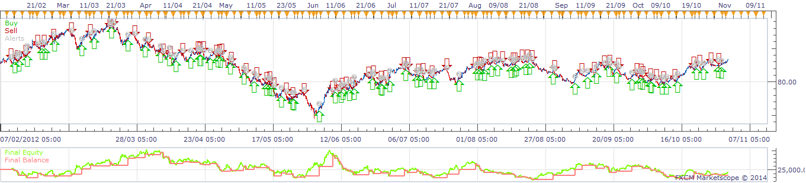

# Ehlers MESA Adaptive Moving Average (MAMA) Strategy

> Source: https://fxcodebase.com/code/viewtopic.php?f=31&t=60262  
> Forum: 31 · Topic 60262 · 2 post(s)

---

## Ehlers MESA Adaptive Moving Average (MAMA) Strategy

**moomoofx** · Thu Jan 30, 2014 9:00 am

A simple MA cross strategy using MAMA as kind-of requested on [viewtopic.php?f=17&t=23283](https://fxcodebase.com/code/viewtopic.php?f=17&t=23283)

 

Enjoy.

The Strategy was revised and updated on December 10, 2018.

---

## Re: Ehlers MESA Adaptive Moving Average (MAMA) Strategy

**Apprentice** · Sun Dec 11, 2016 5:28 am

Strategy was revised and updated.
