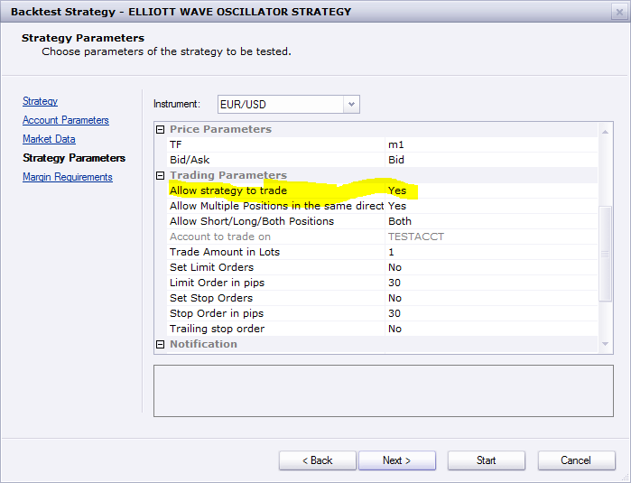

# Elliott Wave Oscillator Strategy

> Source: https://fxcodebase.com/code/viewtopic.php?f=31&t=4645  
> Forum: 31 · Topic 4645 · 20 post(s)

---

## Elliott Wave Oscillator Strategy

**Apprentice** · Tue Jun 07, 2011 1:55 pm

This simple strategy is based on the Elliott Wave Oscillator.
Provides Two Types of signals.
1.Tops and Bottoms in EWO
2. Zero Line Cross Over / Under

Strategy is using Top/Bottom filter
Top Signal is given only in the positive territory,
Bottom Signal is given only in the negative territory.

 [Elliott Wave Oscillator Strategy.lua](files/11466/Elliott%20Wave%20Oscillator%20Strategy.lua)

For this one, Strategy functionality is only a secondary.
Signal functionality is a primary function.

Version without top / bottom filter for signal use.

 [Elliott Wave Oscillator Strategy.lua](files/11466/Elliott%20Wave%20Oscillator%20Strategy%20%282%29.lua)

The Strategy was revised and updated on December 18, 2018.

---

## Re: Elliott Wave Oscillator Strategy

**bluepip** · Mon Jun 13, 2011 8:43 am

Hello,

wrong direction Signals when are Settings Top / Bottom. Can you fix it?

Thanks

---

## Re: Elliott Wave Oscillator Strategy

**Apprentice** · Mon Jun 13, 2011 12:31 pm

Fixed.

---

## Re: Elliott Wave Oscillator Strategy

**bluepip** · Mon Jun 13, 2011 2:21 pm

**THANKS !**

bluepip

---

## Re: Elliott Wave Oscillator Strategy

**bluepip** · Wed Jun 15, 2011 6:13 am

One more question:
Is the Code (Top / Bottom) really correct?
I thought the arrows have to exactly the opposite direction.

---

## Re: Elliott Wave Oscillator Strategy

**arindam89** · Fri Dec 16, 2011 10:16 am

hi
you are doing a great job keep it up
i have an issue with your ewo your
Strategy is using Top/Bottom filter
Top Signal is given only in the positive territory,
Bottom Signal is given only in the negative territory.
 signals are incorrect
please correct it
thnaks buy
arindam roy

---

## hi

**arindam89** · Sat Dec 17, 2011 3:00 am

hi
you can make two seperate Elliott Wave Oscillator Strategy
1.1.Tops and Bottoms in EWO and
2.2. Zero Line Cross Over / Under
can you make it
it would be really great if you can make it
thanks
by
arindam

---

## Re: Elliott Wave Oscillator Strategy

**Apprentice** · Mon Dec 19, 2011 4:57 am

Your request is added to the developmental cue.

---

## Re: Elliott Wave Oscillator Strategy

**Apprentice** · Tue Dec 20, 2011 3:16 am

One question.
Can you explain to me what you want to change on an existing strategy.
The existing strategy has all the features that you asking for.
If you want to use separate.
Then load multiple Istance of this strategy with different parameters.

---

## Re: Elliott Wave Oscillator Strategy

**arindam89** · Tue Dec 20, 2011 9:38 pm

> **Apprentice wrote:**
> One question.
> Can you explain to me what you want to change on an existing strategy.
> The existing strategy has all the features that you asking for.
> If you want to use separate.
> Then load multiple Istance of this strategy with different parameters.

 works fine thanks

---

## hi

**arindam89** · Wed Dec 21, 2011 12:15 am

hi
 your Strategy is using Top/Bottom filter
Top Signal is given only in the positive territory,
Bottom Signal is given only in the negative territory.
entry signal are wrong
no test feelings
test it your self
giving wrong signals
other wise everything is fine
please fix it
by
arindam

---

## Re: Elliott Wave Oscillator Strategy

**arindam89** · Thu Dec 22, 2011 4:36 am

> **Apprentice wrote:**
>
>
> Elliott Wave Oscillator Strategy.png
>
>
>
> This simple strategy is based on the Elliott Wave Oscillator.
> Provides Two Types of signals.
> 1.Tops and Bottoms in EWO
> 2. Zero Line Cross Over / Under
>
> Strategy is using Top/Bottom filter
> Top Signal is given only in the positive territory,
> Bottom Signal is given only in the negative territory.
>
>
> Elliott Wave Oscillator Strategy.lua
>
>
>
> For this one, Strategy functionality is only a secondary.
> Signal functionality is a primary function.
>
> Version without top / bottom filter for signal use.
>
>
> Elliott Wave Oscillator Strategy.lua

hi
one of the best strategies around
i am requesting you once again apprentice you have done a great job
but 1.Tops and Bottoms in EWO signals are incorrect
please can you solve the problem
would really appreciate it if you could help me
thanks buy and
oh merry Christmas
by
arindam

---

## Re: Elliott Wave Oscillator Strategy

**RujixTrade** · Fri Feb 15, 2013 1:14 pm

can u please make a version of this which is fully automated trading system as opposed to just signals?

---

## Re: Elliott Wave Oscillator Strategy

**Apprentice** · Sat Feb 16, 2013 6:56 pm

Both Strategys have trading functionality.

 

Make sure to have trading enabled.
Make sure to redownload strategy, i make minor update.

---

## Re: Elliott Wave Oscillator Strategy

**davidnwatson** · Thu Oct 02, 2014 1:12 pm

Can you add a MA Confirmation with selectable time frame

Example

If ewo is red and below the 1 hr MA, then only open sell trades

also can i have a selection to open a trade on each new candle? I guess it would check the above and open a new trade based on the ewo and MA

Thank you

---

## Re: Elliott Wave Oscillator Strategy

**Apprentice** · Sat Oct 04, 2014 2:20 am

Added to development list.

---

## Re: Elliott Wave Oscillator Strategy

**davidnwatson** · Sat Jun 13, 2015 5:20 pm

Any update on this?

---

## Re: Elliott Wave Oscillator Strategy

**jaricarr** · Tue Aug 23, 2016 12:19 pm

**HI Apprentice,

Can you please add these options to both EWO strategies.

"Live" and "End of Turn"

Many Thanks,
JariCarr**

---

## Re: Elliott Wave Oscillator Strategy

**Apprentice** · Tue Aug 23, 2016 2:49 pm

Major update.

---

## Re: Elliott Wave Oscillator Strategy

**Apprentice** · Sat Dec 17, 2016 10:06 am

Strategy was revised and updated.
