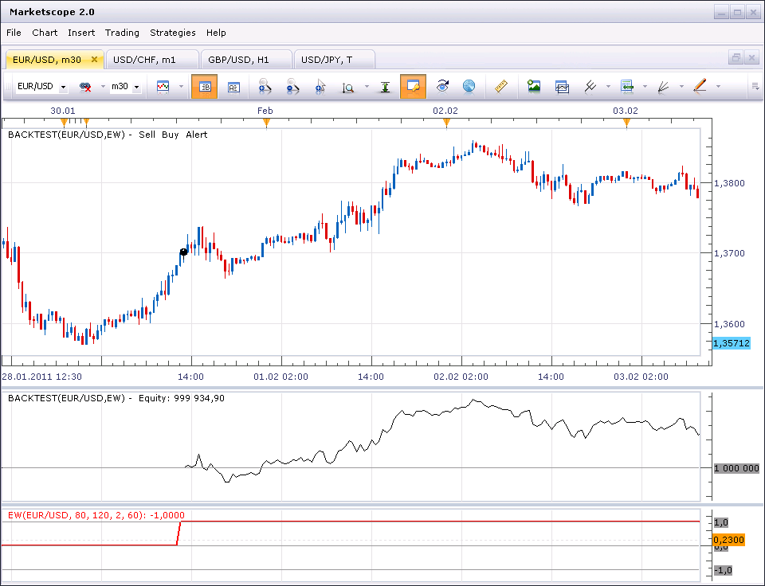

# Elliott Wave Strategy

> Source: https://fxcodebase.com/code/viewtopic.php?f=31&t=3326  
> Forum: 31 · Topic 3326 · 6 post(s)

---

## Elliott Wave Strategy

**sunshine** · Fri Feb 04, 2011 12:20 pm

The strategy is based on the Elliott Wave indicator.
Elliott Wave Indicator gives either a +1 or -1 signal. +1 indicates a long position and -1 indicates a short position.

---

## Re: Elliott Wave Strategy

**Apprentice** · Mon Jan 29, 2018 7:45 am

The strategy was revised and updated.

---

## Re: Elliott Wave Strategy

**james.tse** · Mon Oct 05, 2020 4:15 am

Is it possible to add new common features, say, close on opposite; custom identifier; max position in one/any direction; end of turn / live

Moreover, I kindly request a variable "Reverse Strategy" as True/False, which can switch the original strategy direction, i.e. buy become sell, and sell become buy.

Thank you very much.

---

## Re: Elliott Wave Strategy

**Apprentice** · Mon Oct 05, 2020 9:02 am

Your request is added to the development list.
Development reference 2142.

---

## Re: Elliott Wave Strategy

**Apprentice** · Tue Oct 06, 2020 3:13 am

[EW strategy.lua](files/138103/EW%20strategy.lua)

Try this version.

---

## Re: Elliott Wave Strategy

**james.tse** · Thu Oct 08, 2020 2:36 am

> **Apprentice wrote:**
>
>
> EW strategy.lua
>
>
> Try this version.

This updated version works as expected.

Thanks for your hardworking.
