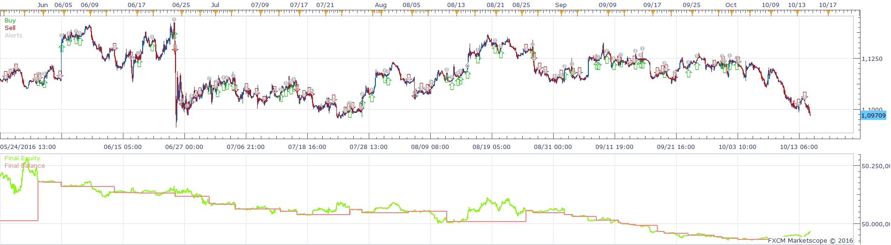
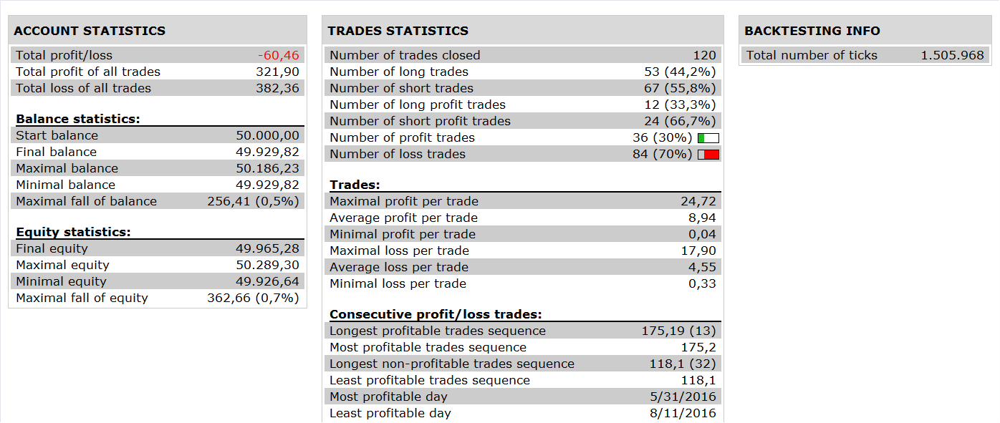

# EMA SVE RSI INV FISHER AVERAGES STRATEGY

> Source: https://fxcodebase.com/code/viewtopic.php?f=31&t=64021  
> Forum: 31 · Topic 64021 · 3 post(s)

---

## EMA SVE RSI INV FISHER AVERAGES STRATEGY

**Apprentice** · Sun Oct 23, 2016 5:18 pm

 

BUY:
1. PRICE > EMA
2. SVE RSI INV FISHER AVERAGES INDICATOR CROSS OVER BUY LEVEL

SELL:
1. PRICE < EMA
2. SVE RSI INV FISHER AVERAGES INDICATOR CROSS UNDER SELL LEVEL

 [EMA SVE RSI INV FISHER AVERAGES STRATEGY.lua](files/108767/EMA%20SVE%20RSI%20INV%20FISHER%20AVERAGES%20STRATEGY.lua)

SVE_RSI_INVFISHER AVERAGES / SVE_RAINBOWAVERAGE AVERAGES is available here.
[viewtopic.php?f=17&t=2297&p=106010&hilit=SVE_RSI_INVFISHER+AVERAGES#p106010](https://fxcodebase.com/code/viewtopic.php?f=17&t=2297&p=106010&hilit=SVE_RSI_INVFISHER+AVERAGES#p106010)

Avereges indicator is available here.
[viewtopic.php?f=17&t=2430&hilit=averages](https://fxcodebase.com/code/viewtopic.php?f=17&t=2430&hilit=averages)

The Strategy was revised and updated on January 18, 2019.

---

## Re: EMA SVE RSI INV FISHER AVERAGES STRATEGY

**Fafountrader** · Mon Oct 24, 2016 1:30 pm

Hi,

Great,

Good idea EMA to filter the trend.
Thank you for your work Apprentice.

Good strategy...

Fafountrader

---

## Re: EMA SVE RSI INV FISHER AVERAGES STRATEGY

**Apprentice** · Sun Dec 18, 2016 9:17 am

Strategy was revised and updated.
