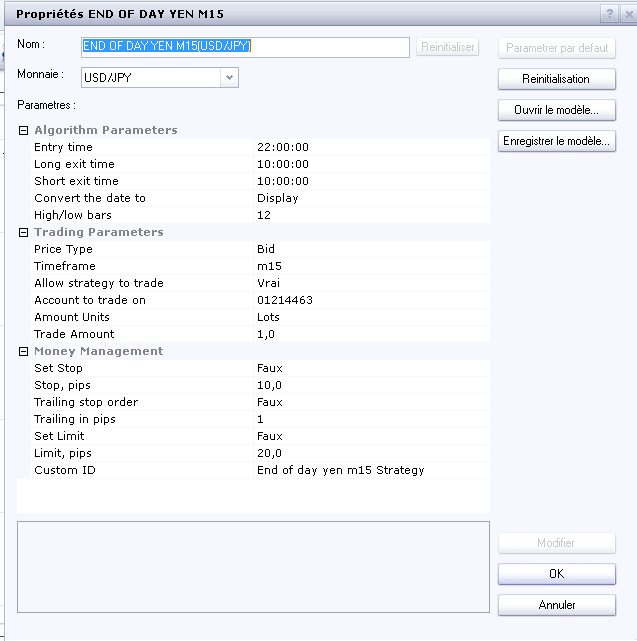
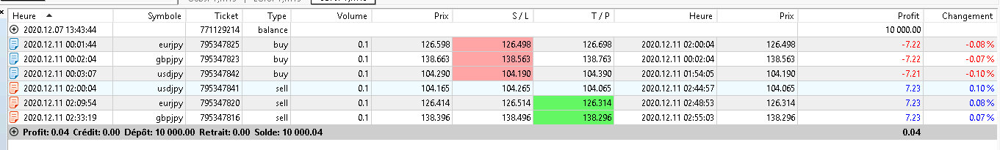
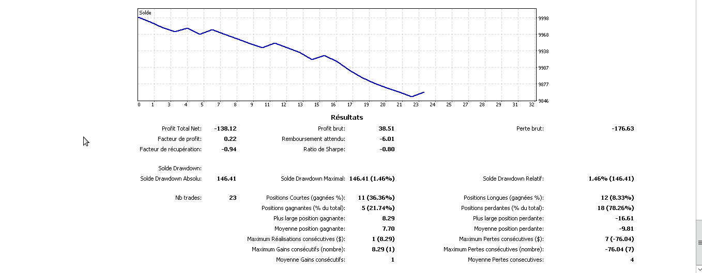

# end of day yen m15

> Source: https://fxcodebase.com/code/viewtopic.php?f=31&t=70648  
> Forum: 31 · Topic 70648 · 13 post(s)

---

## end of day yen m15

**Apprentice** · Sun Nov 22, 2020 5:27 am

Based on request.
[viewtopic.php?f=27&t=70640](https://fxcodebase.com/code/viewtopic.php?f=27&t=70640)

 [end of day yen m15.lua](files/139052/end%20of%20day%20yen%20m15.lua)

---

## Re: end of day yen m15

**yolerap** · Sun Nov 22, 2020 5:43 am

Please translate to MT5,
Thank you !

---

## Re: end of day yen m15

**Apprentice** · Tue Nov 24, 2020 6:01 am

Your request is added to the development list.
Development reference 2358.

---

## Re: end of day yen m15

**Avignon** · Tue Nov 24, 2020 6:04 am

> **Apprentice wrote:**
> Based on request.
> [http://fxcodebase.com/code/viewtopic.php?f=27&t=70640](https://fxcodebase.com/code/viewtopic.php?f=27&t=70640)
>
>
> end of day yen m15.lua

It's strategy or signal?

---

## Re: end of day yen m15

**PAULUC02** · Tue Nov 24, 2020 9:15 am

Hello Apprentice
There are things to change such as taking a position between 9 p.m. and 11:30 p.m. in backtesting of positions opens at 2:00 am French time.
You have to include a momentum (macd 0 delay) for example, as well as a moving average that you can choose and set as a filter and open the trade in the same direction as the momentum and the mva.
Position statement described in the 1st message with a purchase when prices are above mva and macd and above 0.
sale when the prices are below the mva and the macd below 0.I wish I could also change the amplitude multiplier ratio.
Finally it would be possible to add a breakeven.
thank you for your great work.

---

## Re: end of day yen m15

**Apprentice** · Fri Nov 27, 2020 7:13 am

Your request is added to the development list.
Development reference 2367.

---

## Re: end of day yen m15

**Avignon** · Wed Dec 02, 2020 6:46 pm

No orders since the beginning of the week.

Am I missing something?

 

I am in France.

---

## Re: end of day yen m15

**Avignon** · Mon Dec 07, 2020 9:22 am

Have you tested it? It doesn't appear in the browser and when I compile it I get errors and warnings.

I put it on an MT5 and left the default settings.

Thanks.

---

## Re: end of day yen m15

**Apprentice** · Tue Dec 08, 2020 3:11 pm

Your request is added to the development list.
Development reference 2428.

---

## Re: end of day yen m15

**Apprentice** · Thu Dec 10, 2020 8:13 am

[end of day yen m15.mq5](files/139444/end%20of%20day%20yen%20m15.mq5)

Try it now.

---

## Re: end of day yen m15

**Avignon** · Fri Dec 11, 2020 5:55 am

Now it's good. After that, it's a first test quickly.

 

---

## Re: end of day yen m15

**Avignon** · Mon Dec 14, 2020 6:52 am

You wouldn't have forgotten the line "startTime = 210000" ?

---

## Re: end of day yen m15

**Avignon** · Sun Dec 20, 2020 5:37 pm

One week of testing: it's not great. I'm not surprised, [the explanation is there](https://www.patreon.com/posts/simulated-at-its-38779566).

There is one thing to correct: it takes positions on Friday when it shouldn't.

I'm going to leave it another week for fun.
