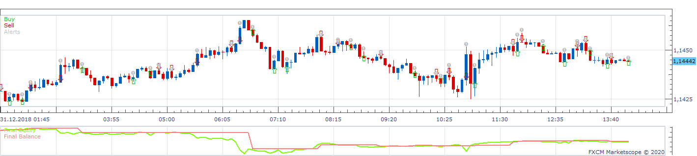
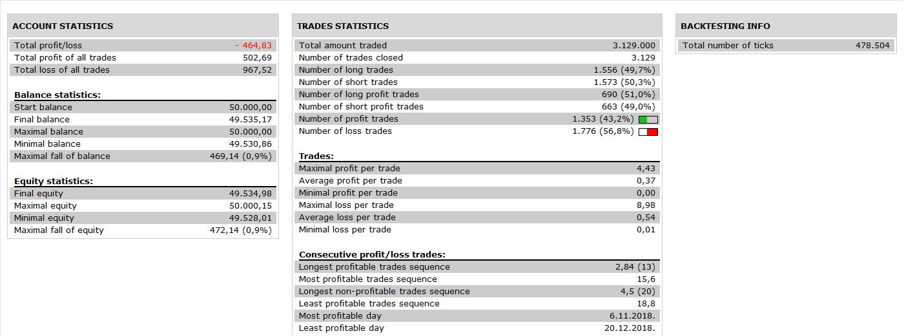

# Engulfing Strategy

> Source: https://fxcodebase.com/code/viewtopic.php?f=31&t=69984  
> Forum: 31 · Topic 69984 · 32 post(s)

---

## Engulfing Strategy

**Apprentice** · Tue Jun 09, 2020 7:30 am

 

Based on request.
[viewtopic.php?f=17&t=69809](https://fxcodebase.com/code/viewtopic.php?f=17&t=69809)

 [Engulfing Strategy.lua](files/134729/Engulfing%20Strategy.lua)

Engulfing.lua
[viewtopic.php?f=17&t=69809](https://fxcodebase.com/code/viewtopic.php?f=17&t=69809)

---

## Re: Engulfing Strategy

**MC. Trend Trader** · Wed Jun 10, 2020 2:55 pm

Hello,
thank you for Strategy, but please insert PositionCount in this strategy so that we can open several options with different limits and stops.

Best Regards

---

## Re: Engulfing Strategy

**Apprentice** · Thu Jun 11, 2020 5:28 am

Your request is added to the development list.
Development reference 1461.

---

## Re: Engulfing Strategy

**Apprentice** · Fri Jun 12, 2020 3:56 am

[Engulfing Strategy v2.lua](files/134883/Engulfing%20Strategy%20v2.lua)

Try this version.

---

## Re: Engulfing Strategy

**fallingangel** · Tue Jul 14, 2020 3:03 pm

Dear Apprentice

Tested this strategy, had set position cap to yes, max no. of open positions to 2, max no. of long positions to 1, max no. of short positions to 1. It never opened any long positions (neither net long, nor hedging), kept receiving following message:

Open order failed: The Quantity must be a positive integer number.

---

## Re: Engulfing Strategy

**Apprentice** · Wed Jul 15, 2020 10:02 am

Your request is added to the development list.
Development reference 1697.

---

## Re: Engulfing Strategy

**Apprentice** · Thu Jul 16, 2020 4:48 am

I don't have any issues. It's likely you just set an incorrect lot size

---

## Re: Engulfing Strategy

**fallingangel** · Fri Jul 17, 2020 6:09 am

Currently testing the 2 MA Strategy, I receive the same message when using the risk % of equity feature (value set at 2). I shall revert with full set of test results for this strategy

---

## Re: Engulfing Strategy

**terminator2410** · Thu Jul 23, 2020 8:01 am

Dear Sir

Is it possible to add a second filter to this strategy to open long position only if the engulfed bar has touched the lower Bollinger band, and open short position only if the engulfed bar has touched the upper Bollinger band?

---

## Re: Engulfing Strategy

**Apprentice** · Mon Jul 27, 2020 4:09 pm

Your request is added to the development list.
Development reference 1785.

---

## Re: Engulfing Strategy

**Apprentice** · Tue Jul 28, 2020 3:56 pm

[Engulfing with BB.lua](files/136382/Engulfing%20with%20BB.lua)

 [Engulfing with BB Strategy.lua](files/136382/Engulfing%20with%20BB%20Strategy.lua)

Try this version.

---

## Re: Engulfing Strategy

**terminator2410** · Fri Jul 31, 2020 7:21 am

Dear Sir

BB filter does not work

---

## Re: Engulfing Strategy

**Apprentice** · Sun Aug 02, 2020 9:05 am

Your request is added to the development list.
Development reference 1819.

---

## Re: Engulfing Strategy

**Apprentice** · Mon Aug 03, 2020 11:19 am

Try it now.

---

## Re: Engulfing Strategy

**terminator2410** · Mon Aug 03, 2020 2:58 pm

Thank you Sir

---

## how to add one parameter to Engulfing Strategy

**neel111** · Thu Aug 20, 2020 3:31 pm

hi,
i expect if modify this strategies with scalping purpose,
if anyone did earlier or tried this would great help and appreciated
** attached pic. for easy understanding (it show standard buy and sell indication on Engulfing Stg.)

Modification expected ,
1 -manually adjusted time delay (0-20 second) before execute order
** for example , time delay set for 5 second, now new candle started and Engulfing BUY signal created it wait for 5 second before execute buy order, within 5 second if signal disappears than order doesn't execute. and time delay reset, (same or new candle) again Engulfing BUY signal generated than 5 second delay starts before execute BUY order. same on SELL signal

** Means when candle starts and Engulfing arrow(signal) generated, it auto execute Order(Buy/sell as per Eng Signal ) but delay as per adjusted time, if Engulfing arrow(Signal) disappear within that delay time than order doesn't execute and wait till second time Engulfing Signal (buy / sell) either new candle or same candle, every time Engulfing signal generated ,before execute order, it should respect manually adjusted time delay (0-20 seconds)

2 ) default profit 8 pips & stop loss 3 pips ( adjustable )- what ever reach first trade must close
3) # of open Trade
 ** one at a time either buy or sell, no execution of second trade till first closed,
4) trade direction selection - options (dialog box selector)
 (op-1)
 Both side (filter with )- if candle ABOVE 9 EMA/MVA only generate BUY order
 if candle BELLOW 9 EMA/MVA only generate SELL order
 (op-2 ) Buy ONlY - auto execute only engulfing BUY signal if candle ABOVE 9 EMA/MVA only
 (OP-3 ) SELL only - auto execute only engulfing SELL signal if candle BELLOW 9 EMA/MVA only

5) ** OPTIONAL ** only if its logical to add it will be more conservative in auto execute order

 its about Extra filter Stochastic with (ON/OFF - selector)
 with ON (condition ) - if Stochastic > 80 + EMA/TMA/MVA bellow 9 + Engulfing sell signal
 if Stochastic <20+ EMA/TMA/MVA above 9 + Engulfing buy signal
 with OFF - Stochastic will not consider

---

## Re: Engulfing Strategy

**Apprentice** · Fri Aug 21, 2020 5:54 am

Your request is added to the development list.
Development reference 1919.

---

## Re: Engulfing Strategy

**neel111** · Fri Aug 21, 2020 6:14 am

> **Apprentice wrote:**
> Your request is added to the development list.
> Development reference 1919.

thank you ,
Appreciated

---

## Re: Engulfing Strategy

**Apprentice** · Sat Oct 03, 2020 6:59 am

[Engulfing with BB Strategy.lua](files/138044/Engulfing%20with%20BB%20Strategy.lua)

Try this version.

---

## Re: Engulfing Strategy

**foreveryoung** · Sun Mar 21, 2021 12:57 pm

Dear All

Is it possible to add the following option to this strategy?

If long, place stop loss at the low of the engulfing candlestick
If short, place stop loss at the high of the engulfing candlestick

Thank you

---

## Re: Engulfing Strategy

**Apprentice** · Mon Mar 22, 2021 4:14 am

Your request is added to the development list.
Development reference 303.

---

## Re: Engulfing Strategy

**Apprentice** · Tue Mar 23, 2021 1:30 pm

It already has a high/low option.

---

## Re: Engulfing Strategy

**foreveryoung** · Wed Mar 24, 2021 10:01 am

Tried it, i do not understand the logic behind it (i.e. what low/high strategy considers), and it definitely does not place a stop loss at the high/low of the engulfing candle

---

## Re: Engulfing Strategy

**foreveryoung** · Wed Mar 24, 2021 11:55 am

I understand that the idea with high/low is to check backwards the number of candlesticks set in the stop loss label, and pick the lowest value for long and highest value for short, however, it does not work like this. I set value in stop loss label at 3 (i.e. check previous 3 candlesticks?) and strategy placed the stop loss for a short position at the high of the 11th candlestick (including the signaling candlestick in the count), which was not the highest value either (the highest value was the second one counting backwards).

---

## Re: Engulfing Strategy

**foreveryoung** · Sat Sep 18, 2021 9:58 am

Dear Apprentice

Please add a second moving average as filter, where engulfing must be taking place above both moving averages for opening long, vice versa for short.

Thank you

---

## Re: Engulfing Strategy

**Apprentice** · Sun Sep 19, 2021 5:02 am

Your request is added to the development list.
Development reference 847.

---

## Re: Engulfing Strategy

**Apprentice** · Wed Sep 22, 2021 3:49 am

[Engulfing_with_BB_Strategy.lua](files/143703/Engulfing_with_BB_Strategy.lua)

 [ENGULFING WITH BB.lua](files/143703/ENGULFING%20WITH%20BB.lua)

Try this version.

---

## Re: Engulfing Strategy

**foreveryoung** · Thu Sep 23, 2021 3:53 am

I get an error message no. 129 saying that I should download and install ENGULFING WITH BB.LUA indicator, which, apparently, I have done so.

---

## Re: Engulfing Strategy

**Apprentice** · Fri Sep 24, 2021 6:40 am

Please re-download the ENGULFING WITH BB.lua

---

## Re: Engulfing Strategy

**foreveryoung** · Thu Sep 30, 2021 12:19 pm

it opens no positions no matter what combination i make with the MA filters

---

## Re: Engulfing Strategy

**foreveryoung** · Mon Oct 25, 2021 6:11 am

Hi Apprentice

Any chance of having interest in making this to work??

Thank you for everything

---

## Re: Engulfing Strategy

**Apprentice** · Sun Oct 31, 2021 3:05 am

[Engulfing_with_BB_Strategy.lua](files/144092/Engulfing_with_BB_Strategy.lua)

Try it now.
