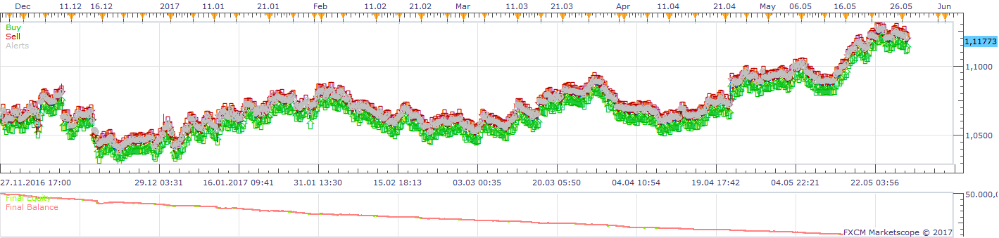
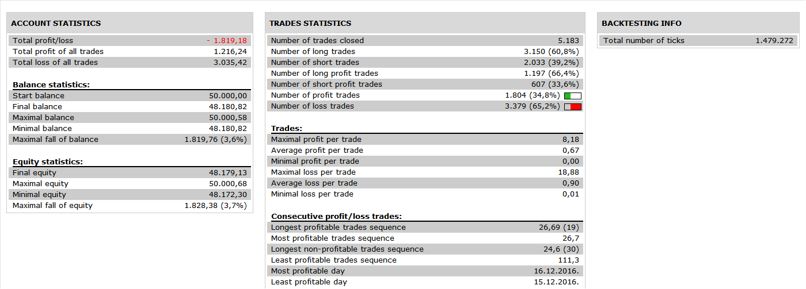
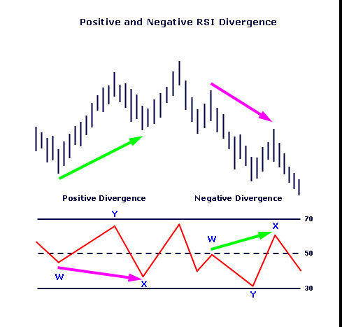
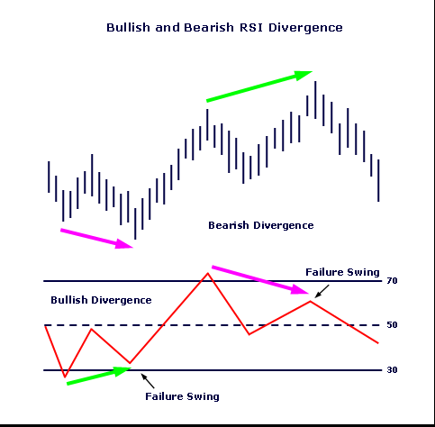

# Entropy Strategy

> Source: https://fxcodebase.com/code/viewtopic.php?f=31&t=64931  
> Forum: 31 · Topic 64931 · 1 post(s)

---

## Entropy Strategy

**Apprentice** · Tue Jul 18, 2017 3:58 pm

 

Open Long on Bullish or Positive divergence
Open Short on Bearish or Negative divergence

 [Entropy Strategy.lua](files/113624/Entropy%20Strategy.lua)

Entropy Indicator is available here.
[viewtopic.php?f=17&t=32298&p=113625#p113625](https://fxcodebase.com/code/viewtopic.php?f=17&t=32298&p=113625#p113625)

 

 

The Strategy was revised and updated on January 21, 2019.
