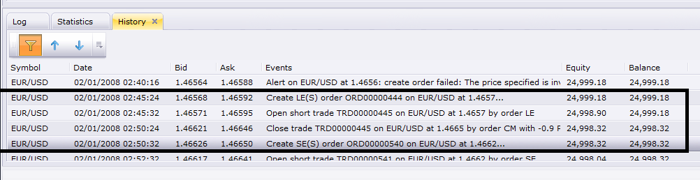

# Entry Order Strategy

> Source: https://fxcodebase.com/code/viewtopic.php?f=31&t=59515  
> Forum: 31 · Topic 59515 · 45 post(s)

---

## Entry Order Strategy

**Apprentice** · Tue Sep 17, 2013 5:21 am


Will generate an Entry order, X pips above or below market.
At future set point in time.

 [Entry Order Strategy.lua](files/89519/Entry%20Order%20Strategy.lua)

The Strategy was revised and updated on January 21, 2019.

---

## Re: Entry Order Strategy

**lucypip** · Mon Nov 25, 2013 10:49 pm

Hi Apprentice! can you make this available on OCO (one cancels other), Market Order, and Market Range please. Thanks!!!

---

## Re: Entry Order Strategy

**Apprentice** · Tue Nov 26, 2013 5:11 am

will consider it.
Can I, and how to achieve this.

---

## Re: Entry Order Strategy

**axeas69** · Mon Jan 06, 2014 5:30 am

Hi Apprentice,
Can you add these points?
at the European open (9.00 a.m as parameter) eur/usd to buy (parameter) 11 pips (parameter) under the opening price, and to sell at 25 pips (parameter) over. Both orders have an attached stop loss 12 pips (parameter) away, and a take profit order 39 pips (parameter) away.
(other sample: at 9.15 a.m GER30 to buy 17 points above the opening price, and to sell at 10 pips under. Both orders have an attached stop loss 11 pips away, and a take profit order 35 pips away.)
In this way, we can do a lot of backtest.
Thank's in advance. WKR Axeas69

---

## Re: Entry Order Strategy

**axeas69** · Mon Jan 06, 2014 7:09 am

Sorry, I forgot 2 conditions about validity of the 2 OCO.
1- Validity up to 8.00a.m N+1
2- option to cancel the second OCO if the first is started.

Many Thanks. Axeas69

---

## Re: Entry Order Strategy

**lucypip** · Mon Jan 06, 2014 12:16 pm

> **Apprentice wrote:**
> will consider it.
> Can I, and how to achieve this.

Thanks apprentice. I've got this strategy working but I think OCO would be better. I dont know exactly how to encode this. I think it has something to do with valuemap. Change the "OM" to "OCO" or something like that. I dont really what else should be change.

 valuemap.Command = "CreateOrder";
 valuemap.OrderType = "OM";
 valuemap.GTC = "FOK";

ContingencyID
	--OCO, OTO, ELS

ContingencyType
	0 not included in contingency group
	1 part of OCO
	2 OTO --use OrderIdPrimary
	3 ELS --use OrderIdPrimary

---

## Re: Entry Order Strategy

**axeas69** · Tue Jan 21, 2014 2:25 am

Hello,
There is a bug in backtestinf. The strategy stop to work after to create the first order.
Please can you check? Thanks in advance WKR Axeas

---

## Re: Entry Order Strategy

**Apprentice** · Tue Jan 21, 2014 3:36 am

Termination of strategy after the execution is intentional.
This functionality will remain.

OCO version, on the other hand should be run indefinitely.

---

## Re: Entry Order Strategy

**axeas69** · Sat Jan 25, 2014 4:38 pm

Hi,
I'm sorry to disturb you again.I check everywhere and everything but I don't understand
where I can put OCO to get the other version and see the backtest run up to the end of the period.
Thanks in advance. WKR Axeas

---

## Re: Entry Order Strategy

**Apprentice** · Mon Jan 27, 2014 3:44 am

Unfortunately this is not so simple, existing strategy, should be modified.

---

## Re: Entry Order Strategy

**easytrading** · Tue Sep 16, 2014 11:08 pm

hello Apprentice how r u? if you please i need your help to set the parameters of your strategy ( Entry Order Strategy) that will achieve opening and closing of orders automaticly and continuously for a giving time frame candle (such as one hour time frame ) because now it gives me only one order then stoped and need to be activated again to get the second order (as i learnd from trying using it) . is it possible to program that ? with my appreciation in advance.

Joined: Thu Sep 11, 2014 5:23 pm

---

## Re: Entry Order Strategy

**Apprentice** · Wed Sep 17, 2014 10:57 am

We have a problem here.
Once the set time has passed, we can not be executed once again.

We need to write a completely new strategy.

Can you define the entry conditions.

---

## Re: Entry Order Strategy

**easytrading** · Wed Sep 17, 2014 7:08 pm

By using the existing strategy parameters,the only modification need to do is adding a timer to fill the next entry order conditions that are based on the time frame u r using (which will be changeable according to trader's choice) for any currency (such as EUR/USD) and let us say it is 1 hour, and your direction is Buy. So when first working 1hr order comes to end,immediatly take the following 1hr order after the closing and exiting the previous order (to keep only one order working) in the same direcion Buy (as it was set before) and so on keep the strategy working (with the ability to set limit & stop orders in pips as it is in the existing strategy) until you stop it if you want manually. I know it is a challenging, but in the same time I am sure of your programming capabilities from the fantasting job u r doing with my appreciation in advance.

---

## Re: Entry Order Strategy

**Apprentice** · Fri Sep 19, 2014 3:45 am

Your request is added to the development list.

---

## Re: Entry Order Strategy

**easytrading** · Fri Sep 19, 2014 2:57 pm

Thank u Apprentice for taking my request into consideration.I really appreciate that.

---

## Re: Entry Order Strategy

**moomoofx** · Mon Nov 17, 2014 5:18 am

I have uploaded a new version of the strategy.

To meet davidxiao's requirements posted here
 [viewtopic.php?f=27&t=60938#p95266](https://fxcodebase.com/code/viewtopic.php?f=27&t=60938#p95266)
This strategy has the following changes:
- Can decide if the entry price should be based from the current price (old behavior) or the previous close
- Previous close means it needs a bar means it needs a timeframe ... so now there is a timeframe parameter.
- Use Mandatory Closing has been renamed to Scheduled Termination as to avoid confusion with closing trades/orders.
- The strategy is intelligent such that it decides bid/ask pricing based off the direction you are trading.

To meet easytrading's requirements posted here
 [posting.php?mode=reply&f=31&t=59515#pr95977](https://fxcodebase.com/code/posting.php?mode=reply&f=31&t=59515#pr95977)
This strategy has the following changes:
- A Repeat parameter has been introduced which allows the strategy to effectively repeat itself placing more orders and not terminating after the first order.
- A Repeat Delay controls how long it should wait before "repeating", as defined in minutes.
- Close On Repeat means when the repeat delay is up and it will "repeat", any pending orders will be deleted.
- If it repeats, of course it will only place new trades if it is between the start and stop times. However, any pending orders will be closed once the repeat delay expires, regardless of the start/stop time window.
- CustomID is used to identify the previously placed orders with this strategy instance. If you have more than one instance,I recommend changing this value.

Alright enjoy.

Cheers,
MooMooForex

---

## Re: Entry Order Strategy

**easytrading** · Tue Nov 18, 2014 2:06 am

hello moomoofx,
you made a big progress in the strategy except one thing ,it is not closing the previous opend order so it keeps opening new ordres in the choosing direction after Delay Repeat time is met .i just need to close the opend oreder before opening the new one please.my parameters are:

Entry type :previous close
bar time frame :m5
scheduled terminate :no
repeat :yes
repeat Delay(min) :5
close on repeat :yes
Distance to market :10
Buy or sell :Buy

 kindest regards.

---

## Re: Entry Order Strategy

**moomoofx** · Tue Nov 18, 2014 8:06 am

Hi easytrading,

If Close On Repeat is set to true, it closes the previously placed and still pending orders.

Are you sure you mean close order and not close position?

Cheers,
MooMooForex

---

## Re: Entry Order Strategy

**easytrading** · Tue Nov 18, 2014 2:19 pm

hello moomoofx,

I am very very sorry for my mistake ,i should say it is not closing the previous opend positions .could you please update it so it can close the opend posion before opend a new one so we make sure we have only one open posion regardless it will close in profit or loss.

kidest regards.

---

## Re: Entry Order Strategy

**moomoofx** · Fri Nov 21, 2014 2:45 am

Updated so now we have two parameters to control if pending orders or opened positions should be closed on repeat.

Please redownload from the first post. Enjoy.

Cheers,
MooMooForex

---

## Re: Entry Order Strategy

**easytrading** · Mon Nov 24, 2014 12:08 am

hello moomoofx ,

yes it is closing now the previous opened position ,but the closing is based on the position opening time till the repeat delay time is met ,that is causing a very big losses when the market reverse in the other direction of the opend position.and becuase of that (to limited those losses to the minimum) i was requesting the close of the opened position based on : when the bar timeframe used in the strategy comes to expire regarardless when it was opened.so if you please could update it to met that .i'll be so greatful to you.thanks for the great job in advance.

below are the parameters i am using:

Entry type :previous close
Bar TF :m5
scheduled terminate :no
repeat :yes
repeat delay(min) :5
close orders on repeat :yes
close positions on repeat :yes
amount in lots to trade :10
distance to market :0
buy or sell :sell
T/P & S/L :no

---

## Re: Entry Order Strategy

**moomoofx** · Mon Nov 24, 2014 1:46 am

easytrading,

If I understand you correctly, you want it to close any open positions when the bar closes.

If you set your repeat timeframe to the same as your bar timeframe, like you have in your example, then it will repeat everytime a new bar is closed/created at pretty much the same time.

Therefore, you should be seeing that behavior already. I tested it, and the screenshot below confirms it.

 



02:45 Order placed.
02:45 Order Executed, Position Opened.
02:50 5 minutes later Open position closed and new order placed.

Where's the problem?

---

## Re: Entry Order Strategy

**easytrading** · Wed Nov 26, 2014 12:03 am

hello moomoofx,

I re-instal it and now it is closing at the bar closing .thank you

---

## Re: Entry Order Strategy

**easytrading** · Thu Nov 27, 2014 4:31 pm

hello moomoofx,

if you please i need to include another function to the stratrgy as below:
let us assume the trend is Bullish and we set the diraction : buy with TF=5min and amount in lots to trade=10 ,now every time the bar closes in profit (with the trend) it will use the lot=10 . But when the bar closes in loss, the next opened position will use 2 extra lots more than the previous one and keeps on until the trend retuns and the bar closes in profit it will comeback and use the original lot size set before which is 10. the formula used to calculate the new lot size is:
X=10 (original lot size for bars in profit)
Y1=X+2 (lot size for 1st loss bar)
Y2=Y1+2 (lot size for 2nd loss bar)
Y3=Y2+2 (lot size for 3rd loss bar)
 .......and so on
your halp is much appreciated and thank you for the excellent job you are doing.
kindest regards.cheers

---

## Re: Entry Order Strategy

**explorerr** · Mon Dec 01, 2014 2:23 am

please help me, where is the post
posting.php?mode=reply&f=31&t=59515#pr95977

this page is error

---

## Re: Entry Order Strategy

**easytrading** · Mon Dec 01, 2014 7:39 pm

hello explorerr,
the post you are looking for and moomoofx is referreing to is my reply in this post dated in:
Re: Entry Order Strategy
by easytrading » Wed Sep 17, 2014 7:08 pm you will find it in page 2 of this post.

hopping this will help...

easytrading

---

## Re: Entry Order Strategy

**zoltanh** · Fri Apr 03, 2015 2:37 am

Hi MooMoo

Do you think this strategy can be changed from:
"Will generate an Entry order, X pips above or below market.
At future set point in time."

to:
"Will generate an Entry order, X pips above and below market.
If a certain price level is reached."

thanks in advance

---

## Re: Entry Order Strategy

**Stance** · Wed Aug 12, 2015 9:17 pm

How does the time parameters work?

I want it to only trade at a particular time and tested it by putting in the start time of 11:30, but it looks like it puts an order in straight away regardless (see blow link), even though current time was 11:26?

[https://dl.dropboxusercontent.com/u/68353796/entry.png](https://dl.dropboxusercontent.com/u/68353796/entry.png)

How to I set it to put in a trade at the open of the week 10 pips above the closing price of the previous week?

Is this correct?

Start Time for Trading: ???
Srop Time for Trading: 24:00:00
Entry Type: Previous Close
Bar Time Frame: W1
Distance to market (in pips): 10

---

## Re: Entry Order Strategy

**Stance** · Fri Aug 28, 2015 2:10 am

Hi would it be possible to have an option to place 2 or orders simultaneously? Ie when triggered 2 buy orders for the same market is put in.

---

## Re: Entry Order Strategy

**Stance** · Thu Oct 01, 2015 4:07 am

> **lucypip wrote:**
> Hi Apprentice! can you make this available on OCO (one cancels other), Market Order, and Market Range please. Thanks!!!

I've managed to modify the code to support OCO.

```lua
--+------------------------------------------------------------------+
--|                                         Entry Order Strategy.lua |
--|                               Copyright © 2014, Gehtsoft USA LLC |
--|                                            http://fxcodebase.com |
--|                                       Developed by : Mario Jemic |
--|                                            [[email protected]](https://fxcodebase.com/cdn-cgi/l/email-protection) |
--|                                        Enhanced by : MooMooForex |
--|                                           http://moomooforex.com |
--+------------------------------------------------------------------+
function Init() --The strategy profile initialization
   strategy:name("Entry OCO Strategy");
    strategy:description("v1");
    -- NG: optimizer/backtester hint
    strategy:setTag("NonOptimizableParameters", "ShowAlert,PlaySound,SoundFile,RecurrentSound,SendMail,Email");
   strategy:type(core.Both);
    strategy.parameters:addGroup("Time Parameters");
    strategy.parameters:addString("StartTime", "Start Time for Trading", "", "00:00:00");
    strategy.parameters:addString("StopTime", "Stop Time for Trading", "", "24:00:00");

   strategy.parameters:addGroup("Strategy Parameters");
      strategy.parameters:addString("PriceType", "Price Type", "", "Bid");
    strategy.parameters:addStringAlternative("PriceType", "Bid", "", "Bid");
    strategy.parameters:addStringAlternative("PriceType", "Ask", "", "Ask");
    strategy.parameters:addString("EntryType", "Entry Type", "When the time to place the order comes, should the order price be determined from the current price or previous close?", "PreviousClose");
    strategy.parameters:addStringAlternative("EntryType", "Current Price", "", "CurrentPrice");
    strategy.parameters:addStringAlternative("EntryType", "Previous Close", "", "PreviousClose");
   strategy.parameters:addString("TF", "Bar Time frame", "Bar time frame used if Entry Type base is Previous Close.", "m5");
    strategy.parameters:setFlag("TF", core.FLAG_PERIODS);
    strategy.parameters:addBoolean("UseMandatoryClosing", "Scheduled Terminate", "Terminates the strategy at this time.", false);
    strategy.parameters:addString("ExitTime", "Scheduled Termination Time", "", "23:59:00");
    strategy.parameters:addInteger("ValidInterval", "Valid interval for operation in second", "", 60);

   strategy.parameters:addGroup("Repeat Parameters");
    strategy.parameters:addBoolean("Repeat", "Repeat", "Should we repeat this operation periodically. If false, strategy terminates after placing trade.", true);
    strategy.parameters:addInteger("RepeatDelay", "Repeat Delay (mins)", "How many minutes should we wait between repeats", 5);
    strategy.parameters:addBoolean("CloseOrdersOnRepeatCloseOrdersOnRepeat", "Close Orders On Repeat", "Should we close any pending orders when we repeat?", true);
    strategy.parameters:addBoolean("ClosePositionsOnRepeat", "Close Positions On Repeat", "Should we close any open positions when we repeat?", false);
    strategy.parameters:addString("CustomID", "Identifier", "This identifier is required to identify previously placed orders by this strategy", "EntryOrderStrat");

    CreateTradingParameters();
end

function CreateTradingParameters()
    strategy.parameters:addGroup("Trading Parameters");

    strategy.parameters:addString("Account", "Account to trade", "", "");
    strategy.parameters:setFlag("Account", core.FLAG_ACCOUNT);
    strategy.parameters:addInteger("Amount", "Amount in lots to trade", "", 10, 1, 1000);
    strategy.parameters:addInteger("Distance", "Distance to market (in pips)", "", 5, -1000, 1000);
    strategy.parameters:addString("BuySell", "Buy or Sell?", "", "B");
    strategy.parameters:addStringAlternative("BuySell", "Buy", "", "B");
    strategy.parameters:addStringAlternative("BuySell", "Sell", "", "S");

    strategy.parameters:addBoolean("SetLimit", "Set Limit Orders", "", false);
    strategy.parameters:addInteger("Limit", "Limit Order in pips", "", 5, 1, 10000);
    strategy.parameters:addBoolean("SetStop", "Set Stop Orders", "", true);
    strategy.parameters:addInteger("Stop", "Stop Order in pips", "", 5, 1, 10000);
   strategy.parameters:addInteger("TrailingStop", "Trailing stop order", "Use 0 for none or 1 for dynamic and great than 1 for fixed trailing", 1, 0, 10000);

    strategy.parameters:addGroup("Alerts");
    strategy.parameters:addBoolean("ShowAlert", "ShowAlert", "", false);
    strategy.parameters:addBoolean("PlaySound", "Play Sound", "", false);
    strategy.parameters:addFile("SoundFile", "Sound File", "", "");
    strategy.parameters:setFlag("SoundFile", core.FLAG_SOUND);
    strategy.parameters:addBoolean("RecurrentSound", "Recurrent Sound", "", false);
    strategy.parameters:addBoolean("SendEmail", "Send Email", "", false);
    strategy.parameters:addString("Email", "Email", "", "");
    strategy.parameters:setFlag("Email", core.FLAG_EMAIL);
end

local offer;
local account;
local amount;
local pipsize;
local BuySell;
local distance;
local SoundFile = nil;
local RecurrentSound = false;
local SetLimit;
local Limit;
local SetStop;
local Stop;
local TrailingStop;
local ShowAlert;
local Email;
local SendEmail;
local BaseSize;
local ValidInterval;
local UseMandatoryClosing;
local canClose;
-- Don't need to store hour + minute + second for each time
local OpenTime, CloseTime, ExitTime;

local source = nil;
local EntryType;
local Repeat;
local RepeatDelay;
local CloseOrdersOnRepeat;
local ClosePositionsOnRepeat;
local instanceName;

--
function Prepare(nameOnly)
    UseMandatoryClosing = instance.parameters.UseMandatoryClosing;     
    ValidInterval = instance.parameters.ValidInterval;
    EntryType = instance.parameters.EntryType;
    Repeat = instance.parameters.Repeat;
    RepeatDelay = instance.parameters.RepeatDelay;
    CloseOrdersOnRepeat = instance.parameters.CloseOrdersOnRepeat;
    ClosePositionsOnRepeat = instance.parameters.ClosePositionsOnRepeat;

    instanceName = profile:id() .. "( " .. instance.bid:name() ..  " )";
    instance:name(instanceName);
    instanceName = instanceName .. " " .. instance.parameters.CustomID;

    -- NG: parsing of the time is moved to separate function
    local valid;
    OpenTime, valid = ParseTime(instance.parameters.StartTime);
    assert(valid, "Time " .. instance.parameters.StartTime .. " is invalid");
    CloseTime, valid = ParseTime(instance.parameters.StopTime);
    assert(valid, "Time " .. instance.parameters.StopTime .. " is invalid");
    ExitTime, valid = ParseTime(instance.parameters.ExitTime);
    assert(valid, "Time " .. instance.parameters.ExitTime .. " is invalid");

    assert(instance.parameters.TF ~= "t1", "The time frame must not be tick");

    PrepareTrading();

    if nameOnly then
        return ;
    end

    -- this timer will be used to check our conditions every 5 seconds
    core.host:execute("setTimer", 1111, 5);

    if (EntryType == "PreviousClose") then
        -- price bid/ask depends on if we are selling or buying.
        source = ExtSubscribe(1, nil, instance.parameters.TF, instance.parameters.PriceType == "Bid", "bar");
    end

    if UseMandatoryClosing then
        core.host:execute("setTimer", 1001, math.max(ValidInterval / 2, 1));
    end
end

function PrepareTrading()
    local PlaySound = instance.parameters.PlaySound;
    if PlaySound then
        SoundFile = instance.parameters.SoundFile;
    else
        SoundFile = nil;
    end
    assert(not(PlaySound) or (PlaySound and SoundFile ~= ""), "Sound file must be chosen");

    ShowAlert = instance.parameters.ShowAlert;
    RecurrentSound = instance.parameters.RecurrentSound;

    SendEmail = instance.parameters.SendEmail;

    if SendEmail then
        Email = instance.parameters.Email;
    else
        Email = nil;
    end
    assert(not(SendEmail) or (SendEmail and Email ~= ""), "E-mail address must be specified");
    account = instance.parameters.Account;
    BuySell = instance.parameters.BuySell;
    distance = instance.parameters.Distance;

    local lotSize = core.host:execute("getTradingProperty", "baseUnitSize", instance.bid:instrument(), account);
    amount = lotSize * instance.parameters.Amount;
    offer = core.host:findTable("offers"):find("Instrument", instance.bid:instrument()).OfferID;
    pipsize = instance.bid:pipSize();

    BaseSize = core.host:execute("getTradingProperty", "baseUnitSize", instance.bid:instrument(), account); 
    SetLimit = instance.parameters.SetLimit;
    Limit = instance.parameters.Limit;
    SetStop = instance.parameters.SetStop;
    Stop = instance.parameters.Stop;
    TrailingStop = instance.parameters.TrailingStop;
    canClose = core.host:execute("getTradingProperty", "canCreateMarketClose", instance.bid:instrument(), account);

end

-- NG: create a function to parse time
function ParseTime(time)
    local Pos = string.find(time, ":");
    local h = tonumber(string.sub(time, 1, Pos - 1));
    time = string.sub(time, Pos + 1);
    Pos = string.find(time, ":");
    local m = tonumber(string.sub(time, 1, Pos - 1));
    local s = tonumber(string.sub(time, Pos + 1));
    return (h / 24.0 +  m / 1440.0 + s / 86400.0),                          -- time in ole format
           ((h >= 0 and h < 24 and m >= 0 and m < 60 and s >= 0 and s < 60) or (h == 24 and m == 0 and s == 0)); -- validity flag
end

local create = true;
local nextRepeatTime = nil;
local requestId;
local trade = false;
local requestId1;
local requestId2;

function ExtUpdate(id, source, period)  -- The method called every time when a new bid or ask price appears.
    -- we don't need to do anything here.
end

function CheckConditions()
    if not(checkReady("trades")) or not(checkReady("orders")) then
        return ;
    end

    local now = core.host:execute("getServerTime");
    local time = now - math.floor(now);

    if time >= OpenTime and time <= CloseTime then
        if create then

            if (EntryType == "PreviousClose") then
                -- confirm we have data from our source;
                if not source:hasData(source:size() - 2) then
                    return;
                end
            end

            -- we need to create a new trade, do it.
            Entry();
            nextRepeatTime = now + (RepeatDelay / 1440) - (5 / 86400); -- minus one as it takes a second to come back to this method.
        end
    end

    if not create and Repeat and now >= nextRepeatTime then
        -- we need to repeat now

        -- check if we are supposed to close pending orders first
        if CloseOrdersOnRepeat then
            CloseAllOrders();
        end

        -- check if we are supposed to close open positions first.
        if ClosePositionsOnRepeat then
            exitNet("B");
            exitNet("S");
        end

        -- reset the create flag to create a new trade!
        create = true;
    end
end

function CloseAllOrders()
    local enum, row;
    enum = core.host:findTable("orders"):enumerator();
    row = enum:next();
    while (row ~= nil) do
        if row.AccountID == account and row.OfferID == offer and row.QTXT == instanceName and (row.Type == "LE" or row.Type == "SE") then
            -- we want to close the entry orders, not the stop or limit orders etc otherwise we will get errors as they close each other out.
            local valuemap = core.valuemap();
            valuemap.Command = "DeleteOrder";
            valuemap.OrderID = row.OrderID;
            success, msg = terminal:execute(301, valuemap);
            if not(success) then
                terminal:alertMessage(instance.bid:instrument(), instance.bid[NOW], "Failed to delete orders for instance: " .. instanceName .. ": " .. msg, instance.bid:date(NOW));
            end
        end

        row = enum:next();
    end
end

function HaveTrades(BuySell)
    local enum, row;
    local found = false;
    enum = core.host:findTable("trades"):enumerator();
    row = enum:next();
    while (not found) and (row ~= nil) do
        if row.AccountID == account and row.OfferID == offer and row.QTXT == instanceName and (row.BS == BuySell or BuySell == nil) then
           found = true;
        end

        row = enum:next();
    end

    return found;
end

-- exit from the specified trade using the direction as a key
function exitNet(BS)
    if not HaveTrades(BS) then
        return ;
    end

    local valuemap, success, msg, BuySell;
    valuemap = core.valuemap();

    -- switch the direction since the order must be in oppsite direction
    local BuySell = nil;
    if BS == "B" then
        BuySell = "S";
    else
        BuySell = "B";
    end
    valuemap.Command = "CreateOrder";
    valuemap.OrderType = "CM";
    valuemap.OfferID = offer;
    valuemap.AcctID = account;
    valuemap.NetQtyFlag = "Y"; -- this forces all trades to close in the opposite direction.
    valuemap.BuySell = BuySell;
    valuemap.CustomID = instanceName;
   
    success, msg = terminal:execute(101, valuemap);

    if not(success) then
        terminal:alertMessage(instance.bid:instrument(), instance.bid[instance.bid:size() - 1],
            "Failed net closing of " .. BS .. " trades for instance " .. instanceName .. ": " .. msg, instance.bid:date(instance.bid:size() - 1));
    end
end

function Entry()
 if create then
           create = false;
 
           -- create order
           local valuemap = core.valuemap();
           valuemap.Command = "CreateOCO";
 
           valuemap:append(CreateOrder("B", distance));
           valuemap:append(CreateOrder("S", -distance));
 
           local success, msg = terminal:execute(100, valuemap);
 
           if not (success) then
               terminal:alertMessage(instance.bid:instrument(), instance.bid[NOW], "create order failed:" .. msg, instance.bid:date(NOW));
           else
               local t = core.parseCsv(msg, ",");
               requestId1 = t[0];
               local second = 1;
               if instance.parameters.SetStop and not(canClose) then
                   second = second + 1;
               end
               if instance.parameters.SetLimit and not(canClose) then
                   second = second + 1;
               end
               requestId2 = t[second];
           end
 
       elseif not(trade) then
           -- check whether trade has been created
           local row;
           row = core.host:findTable("trades"):find("OpenOrderReqID", requestId1);
           if row ~= nil then
               terminal:alertMessage(instance.bid:instrument(), instance.bid[NOW], "trade created by first order:" .. row.TradeID, instance.bid:date(NOW));
               trade = true;
           end
           local row;
           row = core.host:findTable("trades"):find("OpenOrderReqID", requestId2);
           if row ~= nil then
               terminal:alertMessage(instance.bid:instrument(), instance.bid[NOW], "trade created by second order:" .. row.TradeID, instance.bid:date(NOW));
               trade = true;
           end
       end
end

function TerminateAfterTrade()
    if Repeat then
        -- don't abort.
        return;
    end

    core.host:execute ("stop");
end

function CreateOrder(aBuySell, adistance)
       local valuemap = core.valuemap();
 
       -- get the order type
       if aBuySell == "B" and adistance < 0 then
           valuemap.OrderType = "LE";
       elseif aBuySell == "B" and adistance > 0 then
           valuemap.OrderType = "SE";
       elseif aBuySell == "S" and adistance < 0 then
           valuemap.OrderType = "SE";
       elseif aBuySell == "S" and adistance > 0 then
           valuemap.OrderType = "LE";
       end
 
       if adistance > 0 then
           valuemap.Rate = instance.ask[NOW] + adistance * pipsize;
       else
           valuemap.Rate = instance.bid[NOW] + adistance * pipsize;
       end
 
       valuemap.OfferID = offer;
       valuemap.AcctID = account;
       valuemap.Quantity = amount;
       valuemap.BuySell = aBuySell;
      valuemap.CustomID = instanceName;
     
       if instance.parameters.SetLimit then
           valuemap.PegTypeLimit = "M";
           if aBuySell == "B" then
               valuemap.PegPriceOffsetPipsLimit = instance.parameters.Limit;
           else
               valuemap.PegPriceOffsetPipsLimit = -instance.parameters.Limit;
           end
       end
 
       if instance.parameters.SetStop then
           valuemap.PegTypeStop = "M";
           if aBuySell == "B" then
               valuemap.PegPriceOffsetPipsStop = -instance.parameters.Stop;
           else
               valuemap.PegPriceOffsetPipsStop = instance.parameters.Stop;
           end
 
               valuemap.TrailStepStop = TrailingStop;

       end
 
       if not(canClose) and (instance.parameters.SetStop or instance.parameters.SetLimit) then
           -- if regular s/l orders aren't allowed - create ELS order
           valuemap.EntryLimitStop = "Y";
       end
 
       return valuemap;
   end

-- NG: Introduce async function for timer/monitoring for the order results
function ExtAsyncOperationFinished(cookie, success, message)
    if cookie == 1001 then
        -- timer
        if UseMandatoryClosing  then
            now = core.host:execute("getServerTime");
            -- get only time
            now = now - math.floor(now);

            -- check whether the time is in the exit time period
            if now >= ExitTime and now < ExitTime + ValidInterval then
                core.host:execute ("stop");
            end
        end
    elseif cookie == 1111 then
        CheckConditions();
    elseif cookie== 100 then
        if not(success) then
            Signal("create order failed: " .. message);
        else
            Signal("order sent: " .. message);
            TerminateAfterTrade();
        end
    elseif cookie== 101 then
        if not(success) then
            Signal("close position failed: " .. message);
        end   
    elseif cookie== 301 then
        if not(success) then
            Signal("delete order failed: " .. message);
        end           
    end
end

--===========================================================================--
--                    TRADING UTILITY FUNCTIONS                              --
--============================================================================--
function Signal(Label)
    if ShowAlert then
        terminal:alertMessage(instance.bid:instrument(), instance.bid[NOW],  Label, instance.bid:date(NOW));
    end

    if SoundFile ~= nil then
        terminal:alertSound(SoundFile, RecurrentSound);
    end

    if Email ~= nil then
        terminal:alertEmail(Email, Label, profile:id() .. "(" .. instance.bid:instrument() .. ")" .. instance.bid[NOW]..", " .. Label..", " .. instance.bid:date(NOW));
    end
end

function checkReady(table)
    return core.host:execute("isTableFilled", table);
end

dofile(core.app_path() .. "\\strategies\\standard\\include\\helper.lua");
```

---

## Re: Entry Order Strategy

**acegoodrich** · Wed Dec 09, 2015 8:55 pm

Is it possible to have it automatically place an OCO when the previous OCO is stopped out, instead of creating a new OCO every 5 mins?

---

## Re: Entry Order Strategy

**Apprentice** · Wed Dec 16, 2015 5:43 am

Your request is added to the development list.

---

## Re: Entry Order Strategy

**FX.Steady.Trader** · Thu Jul 07, 2016 10:24 pm

Hello! I love this strategy, it could help me place orders without having to wake up in the middle of the night to check the charts. However, it looks like it's not selecting previous close prices correctly.

I backtested it and set the parameters to place an OCO @ 3am every day. I set the Entry Type to Previous Close, and the Bar Time Frame to "D1". I think it's supposed to use the previous daily bar close price (or whatever time frame I've chosen) to calculate the entry orders right? It places the orders using the previous hourly bar close price, instead of the previous daily bar close price. Maybe I'm just setting it up wrong? It does the same thing no matter what time I pick. Other than that, it works great!

Thank you for your time.

---

## Re: Entry Order Strategy

**FX.Steady.Trader** · Thu Jul 14, 2016 5:42 pm

My trading strategy works best at certain times of the day, based on price action. Of course, one of the best times is when I would normally be sleeping, so this strategy is fantastic for me.

I would like to request two new features please:
1. Can you add the Time In Force field (the GTD option) to the entry order, so it can be configured to expire if it's not triggered?

2. Is it possible to have it place two separate orders (one buy, and one sell) that are **not** an OCO?

Thank you for all the hard work you guys are putting into this site and the services. I've sent several of my friends here to learn and hopefully contribute.

---

## Re: Entry Order Strategy

**Apprentice** · Mon Aug 08, 2016 6:43 am

Your request is added to the development list, Under Id Number 3595
 If someone is interested to do this or any task other from list please contact me.

---

## Re: Entry Order Strategy

**hiepbg** · Sun Aug 28, 2016 1:59 pm

Hello Apprentice,

Can you make an option "Close on Opposite" for open position ?

I think it's a good option for hedge.

---

## Re: Entry Order Strategy

**Apprentice** · Mon Aug 29, 2016 4:33 am

Can you describe this trade using the example.

---

## Re: Entry Order Strategy

**hiepbg** · Mon Aug 29, 2016 10:01 am

> **Apprentice wrote:**
> Can you describe this trade using the example.

I mean option "Close on Opposite" like this strategy:
[viewtopic.php?f=31](https://fxcodebase.com/code/viewtopic.php?f=31)

Example:
Current price of SP500 is 2170.00. Entry Order Strategy set up a entry order to sell at 2150.00 (-200 pips). If SP500 price go down and cross 2150.00, entry order will execute, and become a sell position.
Then, SP500 price go up again, and cross 2150.00, Entry Order Strategy will close sell position. And it will continue set up a new entry order to sell at 2150.00 again.
This is what i mean "Close on opposite" option.

Repeat Parameters is a great thing. But can you make "repreat price" more dynamic ? I mean, as the example above, if SP500 go up above 2170.00, the price of entry order (to sell) will increase to keep the distance to current price by 200 pips. But if SP500 go down, the price of sell entry order will remain at 2150.00. It look like an trailing stoploss, but for opening a new trade.
I have tested the "Repeat Parameters", with "Close order on repeat" is yes, the price of entry order (to sell) will always keeps a distance to current price (-200pips), even the current price of SP500 will go up or go down. It means the entry order will never be excecute, and Repeat Parameters was not truly working.

And if you can make an option like "Maximum number of position in one direction/ Maximum number of open position in any direction" parameters of Manual Entry Order strategy, it will be very great option to stop Entry Order strategy open too much positons when price suddenly go up or go down too quickly.

Thank you very much,

---

## Re: Entry Order Strategy

**fjasonfx** · Mon Aug 29, 2016 12:07 pm

Hi Apprentice,
 I don't see where the option is to make an OCO order in the parameters of this strategy. I see that Stance said he put it in there and others have posted about using the OCO order option but I don't see it. I've downloaded from page one twice. I know I'm probably just missing something but can you let me know what I need to do to get the OCO option in this strategy?

Thank you.

---

## Re: Entry Order Strategy

**hiepbg** · Tue Aug 30, 2016 10:50 am

I did some more testing with "Repeat Parameters". These are settings:
"Repeat Delay": 0 min
"Close orders on repeat": yes
Timeframe: 1 minute

You can see in this picture. This stragety made an entry order at 2178.70 (SP500), with the distance to price was -10 pips. When price went down quickly, the entry orders has been executed. But the price suddenly reverse quickly to 2179.65, the position has been closed on opposite.
A new entry order was created at 2178.65. If the price go down, the price of new entry order will go down too. The price of a new entry order will continue below the new price by a distance by -10 pips, and no new postions will be open even price will go down more and cross 2178.70. It mean we lost all new chances to make a good position when price continue go down, because new entry order will alway stick to price by a distance (-10pips).

All positions make by this strategy was ended with a small loss of spread. The loss may be bigger if we choose bigger Repead Delay number.

I think the menchanism to make a new order of Manual Entry Order strategy is better.

---

## Re: Entry Order Strategy

**Apprentice** · Sat Dec 17, 2016 10:24 am

Strategy was revised and updated.

---

## Re: Entry Order Strategy

**Kilgharrah** · Wed Jan 25, 2017 5:47 pm

Hi Apprentice, could you please review [this](https://fxcodebase.com/code/viewtopic.php?f=31&t=59515&hilit=ENTRY+ORDER+STRATEGY&start=20#p102629) adaptation of your strategy (which allows the use of OCO) and improve if you deem it necessary, since it works well in Backtesting and Demo, but the Marketscope crah when used live.

Thanks a lot.

**Note:** If this is not possible, it would also be great if I could add a **fixed stop** to the original strategy, I have been looking for this option (**fixed stop**) in other strategies and I do not find any that have it, is it very difficult to add it?

If you find some example of a strategy that has that property (**fixed stop**) and you can tell me I would appreciate it very much

Thank you so much

---

## Re: Entry Order Strategy

**Apprentice** · Sat Jan 28, 2017 9:33 am

Your request is added to the development list, Under Id Number 3728
 If someone is interested to do this task, please contact me.

---

## Re: Entry Order Strategy

**Alexander.Gettinger** · Mon Oct 23, 2017 1:18 pm

> **Kilgharrah wrote:**
> Hi Apprentice, could you please review [this](https://fxcodebase.com/code/viewtopic.php?f=31&t=59515&hilit=ENTRY+ORDER+STRATEGY&start=20#p102629) adaptation of your strategy (which allows the use of OCO) and improve if you deem it necessary, since it works well in Backtesting and Demo, but the Marketscope crah when used live.
>
> Thanks a lot.
>
> **Note:** If this is not possible, it would also be great if I could add a **fixed stop** to the original strategy, I have been looking for this option (**fixed stop**) in other strategies and I do not find any that have it, is it very difficult to add it?
>
> If you find some example of a strategy that has that property (**fixed stop**) and you can tell me I would appreciate it very much
>
> Thank you so much

The strategy has been updated.

---

## Re: Entry Order Strategy

**Andrin11** · Mon Oct 23, 2017 2:32 pm

Is it possible to develop a strategy when the close of the last heiken ashi candle,s color , it opens an entry order according to the color of the previous one, e.g. opens long position when last color is green and vice versa?
thanks
