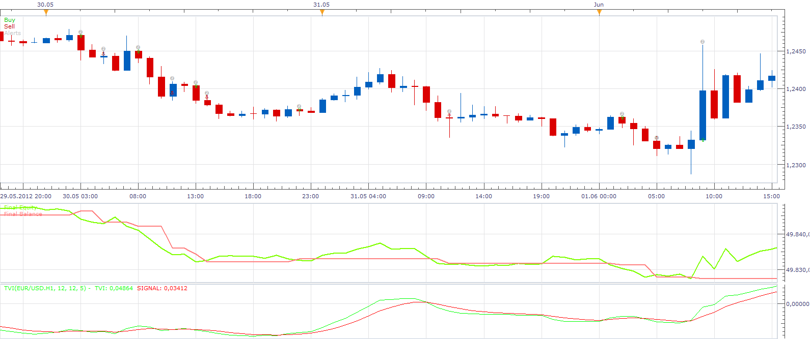

# Ergodic Ticks Volume Strategy

> Source: https://fxcodebase.com/code/viewtopic.php?f=31&t=24026  
> Forum: 31 · Topic 24026 · 3 post(s)

---

## Ergodic Ticks Volume Strategy

**Apprentice** · Tue Oct 02, 2012 4:07 pm

Long
Ergodic Ticks Volume / Ergodic Ticks Volume Signal Line CrossOver
Short
Ergodic Ticks Volume / Ergodic Ticks Volume Signal Line CrossUnder

 [Ergodic Ticks Volume Strategy.lua](files/41325/Ergodic%20Ticks%20Volume%20Strategy.lua)

For this Strategy Install TVI.lua and Ergodic TVI.lua.
[viewtopic.php?f=17&t=23995](https://fxcodebase.com/code/viewtopic.php?f=17&t=23995)

---

## Re: Ergodic Ticks Volume Strategy

**Apprentice** · Wed Oct 03, 2012 12:23 am

Long
Ticks Volume / Ticks Volume Signal Line CrossOver
Short
Ticks Volume / Ticks Volume Signal Line CrossUnder
For this Strategy Install TVI.lua.
[viewtopic.php?f=17&t=23995](https://fxcodebase.com/code/viewtopic.php?f=17&t=23995)

 [Tick Volume Strategy.lua](files/41335/Tick%20Volume%20Strategy.lua)

---

## Re: Ergodic Ticks Volume Strategy

**Apprentice** · Wed Dec 07, 2016 4:49 am

Strategy has been revised and updated.
