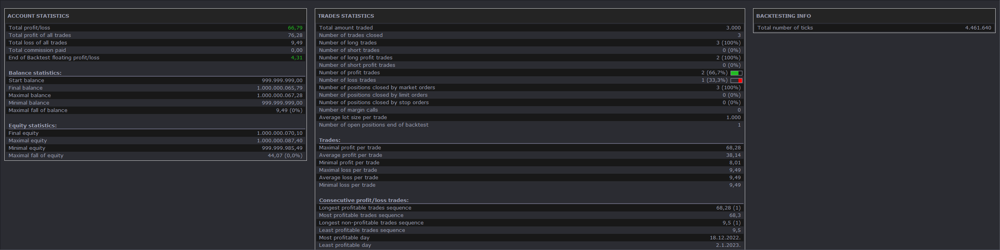

# ETF rotation strategy

> Source: https://fxcodebase.com/code/viewtopic.php?f=31&t=74737  
> Forum: 31 · Topic 74737 · 1 post(s)

---

## ETF rotation strategy

**Apprentice** · Tue Mar 26, 2024 6:40 am

 

Based on the post.
[https://twitter.com/QuantifiedStrat/sta ... 5040901451](https://twitter.com/QuantifiedStrat/status/1720504975040901451)

* It’s based on monthly quotes in the ETFs SPY and TLT.
* Every month rank them based on last month’s performance and go long the best performing ETF.
* Hold for one month and repeat (or continue being long the same instrument).

 [ETF rotation strategy.lua](files/154839/ETF%20rotation%20strategy.lua)
