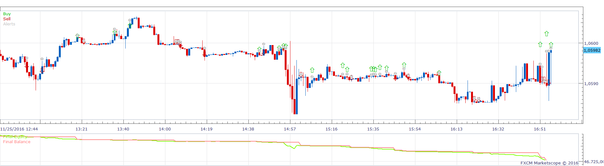
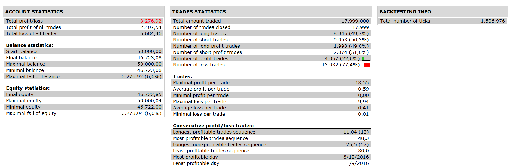

# EWO MACD Strategy

> Source: https://fxcodebase.com/code/viewtopic.php?f=31&t=64156  
> Forum: 31 · Topic 64156 · 1 post(s)

---

## EWO MACD Strategy

**Apprentice** · Thu Dec 01, 2016 3:47 am

 

Based on a request.
[viewtopic.php?f=27&t=64153](https://fxcodebase.com/code/viewtopic.php?f=27&t=64153)
Open long
if MACD histogram is above zero
and EWO's histogram
(current -2) > (current-1)
(current -1) < (current).

Open short
if MACD histogram is below zero
and EWO's histogram
(current -2) < (current-1)
(current-1) >(current).

 [EWO MACD Strategy.lua](files/109348/EWO%20MACD%20Strategy.lua)
