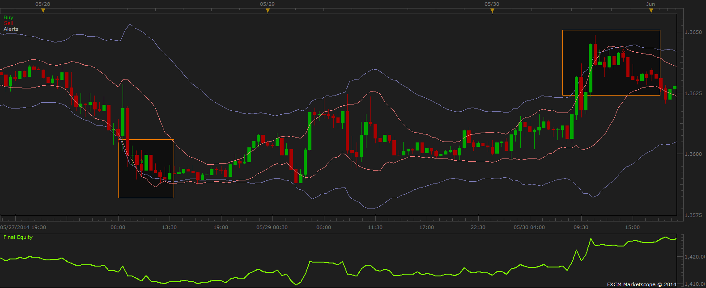

# Extreme_Keltner_Strategy

> Source: https://fxcodebase.com/code/viewtopic.php?f=31&t=61223  
> Forum: 31 · Topic 61223 · 11 post(s)

---

## Extreme_Keltner_Strategy

**scottfree** · Mon Sep 22, 2014 1:01 pm

 

Strategy is inspired by and uses variations of the Extreme_TMA_Line and Keltner indicators.
Enters Long When Extreme Lower Band Line crosses Under Keltner Lower Band Line.
Enters Short when Extreme Upper Band Line crosses Over Keltner Upper Band Line.
Strategy Trades with (close all open buys then Open Sell) & (close all open Sells then Open Buy) therefore it is always in a trade unless a Stop or Limit is activated. Strategy also includes a Multiple Positions Limit Parameter as well as Buy & Sell Trigger Shift Parameters. The default settings were configured on a 30min timeframe using the EUR/USD pair. CAUTIONARY NOTE: This Strategy is intended for Demo testing and has NOT been tested on a live account.

If you do not have them you need the following indicators
[http://fxcodebase.com/code/viewtopic.php?f=17&t=280&hilit=Keltner.lua](https://fxcodebase.com/code/viewtopic.php?f=17&t=280&hilit=Keltner.lua)
[http://fxcodebase.com/code/viewtopic.php?f=17&t=59406&hilit=Extreme_TMA_Line.lua](https://fxcodebase.com/code/viewtopic.php?f=17&t=59406&hilit=Extreme_TMA_Line.lua)

 [Extreme_Keltner_Strategy.lua](files/96096/Extreme_Keltner_Strategy.lua)

The Strategy was revised and updated on December 18, 2018.

---

## Re: Extreme_Keltner_Strategy

**moomoofx** · Mon Nov 17, 2014 2:12 am

Nice work scottfree!

---

## Re: Extreme_Keltner_Strategy

**scottfree** · Wed Dec 03, 2014 6:34 am

Thanks MooMooFx

---

## Re: Extreme_Keltner_Strategy

**Laventus** · Fri Dec 12, 2014 7:59 pm

Hey Scott, awesome strategy and youtube video. I'm wondering when you find time if you could add in the option for a Dynamic trailing stop and a fixed trailing stop. I find these two options eliminate quite a bit of draw down on a lot of trading strategies during optimization. Thanks in advance!

---

## Re: Extreme_Keltner_Strategy

**jaricarr** · Thu Jun 30, 2016 8:05 pm

Hi Scottfree and MooMoofx,

Is it possible that you add the "Redraw" option to the Extreme_TMA_Line parameters on this strategy. This will smooth things out grately.

Thanks,
JariCarr

---

## Re: Extreme_Keltner_Strategy

**Apprentice** · Sun Jul 03, 2016 7:49 am

Redraw option added.

---

## Re: Extreme_Keltner_Strategy

**jaricarr** · Tue Jul 05, 2016 12:38 am

Hi,

Thanks for making the update.

Getting this error when installing the new strategy...

Thanks again,

JariCarr

---

## Re: Extreme_Keltner_Strategy

**Apprentice** · Tue Jul 05, 2016 2:36 pm

Fixed.

---

## Re: Extreme_Keltner_Strategy

**jaricarr** · Tue Jul 05, 2016 10:37 pm

Hi,

Thanks for the update.

Three questions:
1- In the strat. parameters, what is the default Keltner MA type ?
2- Can you add different Keltner MA types to match the indicator ? (see screenshot)
3- Can you make a highly adaptable version of this strategy ?
(choose cross-under or cross-over of the bands for long and short entries)

Many thanks,
JC

---

## Re: Extreme_Keltner_Strategy

**Apprentice** · Wed Jul 06, 2016 2:29 am

Your request is added to the development list,
Under Bugzilla Id Number 3557

Bugzilla is developer internal requests database.
If someone is interested to do any task from this list please contact me.

---

## Re: Extreme_Keltner_Strategy

**Apprentice** · Sat Dec 17, 2016 7:50 am

Strategy was revised and updated.
