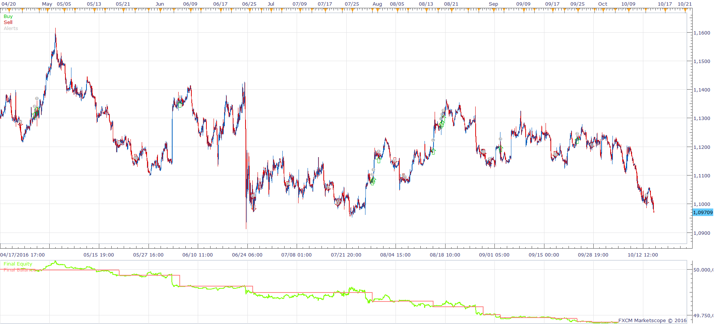
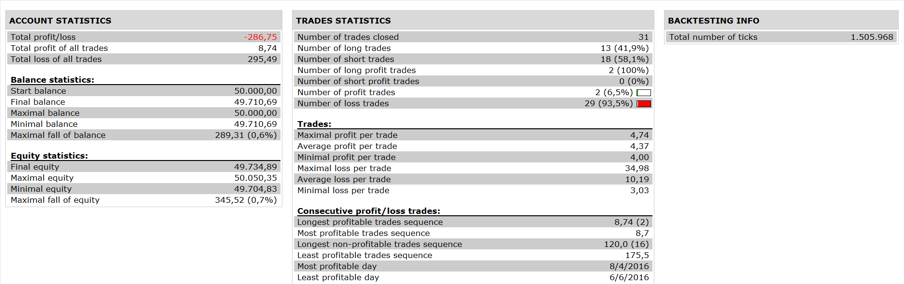

# Extreme TMA Line Pivot Strategy

> Source: https://fxcodebase.com/code/viewtopic.php?f=31&t=64023  
> Forum: 31 · Topic 64023 · 2 post(s)

---

## Extreme TMA Line Pivot Strategy

**Apprentice** · Mon Oct 24, 2016 4:34 am

 

Open Long
1. EXTREME TMA SLOPE > BUY LEVEL and
2. price cross over upper line
3. and price >daily pivot AND PRICE < RESISTANCE1

Open Short
1.EXTREME TMA SLOPE < SELL LEVEL
2.and price cross under lower line
3and price < daily pivot AND PRICE >SUPPORT1

 [Extreme TMA Line Pivot Strategy.lua](files/108776/Extreme%20TMA%20Line%20Pivot%20Strategy.lua)

For this strategy, you need to, to download Extreme_TMA_Line indicator & Extreme_TMA_Slope.
[viewtopic.php?f=17&t=59406&hilit=Extreme_TMA_Slope](https://fxcodebase.com/code/viewtopic.php?f=17&t=59406&hilit=Extreme_TMA_Slope)

The Strategy was revised and updated on January 18, 2019.

---

## Re: Extreme TMA Line Pivot Strategy

**Apprentice** · Sun Dec 18, 2016 7:49 am

Strategy was revised and updated.
