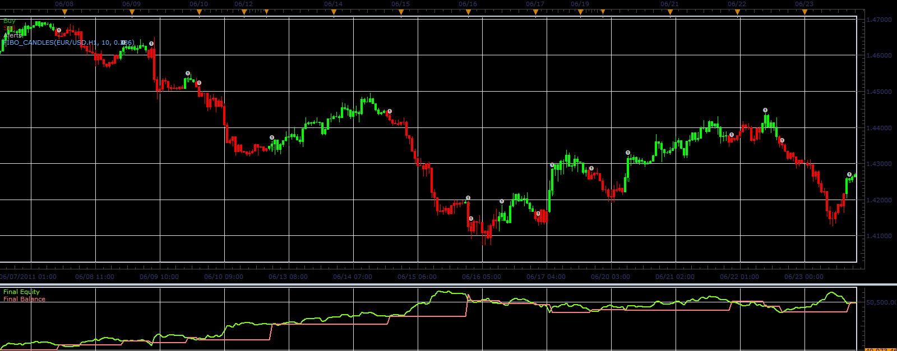

# Fibo candles strategy

> Source: https://fxcodebase.com/code/viewtopic.php?f=31&t=10450  
> Forum: 31 · Topic 10450 · 27 post(s)

---

## Fibo candles strategy

**Alexander.Gettinger** · Mon Dec 26, 2011 7:11 am

This strategy based on Fibo candles indicator: [viewtopic.php?f=17&t=10401](https://fxcodebase.com/code/viewtopic.php?f=17&t=10401)

 

Download strategy:

 [Fibo_Candles_Strategy.lua](files/21683/Fibo_Candles_Strategy.lua)

For this strategy must be installed Fibo Trigger indicator from [viewtopic.php?f=17&t=10401](https://fxcodebase.com/code/viewtopic.php?f=17&t=10401)

The Strategy was revised and updated on January 19, 2019.

---

## Re: Fibo candles strategy

**pudge71381** · Thu Jan 12, 2012 10:38 am

I am loving this indicator/strategy package. Is there anyway you could add trade session specifications?

---

## Re: Fibo candles strategy

**Apprentice** · Fri Jan 13, 2012 4:00 am

Your request is added to the developmental cue.

---

## Re: Fibo candles strategy

**Alexander.Gettinger** · Fri Jan 13, 2012 6:10 am

> **pudge71381 wrote:**
> Is there anyway you could add trade session specifications?

What do you mean?

---

## Re: Fibo candles strategy

**pudge71381** · Fri Jan 13, 2012 7:59 am

I would like to only use the strategy during specific trade sessions. Therefore, it would be able to activate at the beginning of a session or multiple sessions, and all positions would be closed upon close of the selected sessions. Maybe easier would be to add a time window which the strategy would be active.

---

## Re: Fibo candles strategy

**waelsaleem** · Mon Jan 16, 2012 4:11 pm

Hello,

Your Fibo Candles, and triggers look great, and I reviewed the charts of several pairs with those indicators, and it looks very promising. But I tested the strategy on a demo account, and noticed that the sales are initiated far later than the triggers or the change in candle color. This makes a potentially profitable position into a breakeven, or even a losing trade. Any way to fix this problem please?

---

## Re: Fibo candles strategy

**Alexander.Gettinger** · Wed Jan 18, 2012 4:25 am

Fibo candles strategy with begin and end of trade session.

Download:

 [Fibo_Candles_Strategy2.lua](files/23771/Fibo_Candles_Strategy2.lua)

---

## Re: Fibo candles strategy

**waelsaleem** · Thu Jan 19, 2012 5:52 pm

Hello,

I have a request for a strategy please: FIBO-GMMACD strategy

The strategy would be identical to the fibo candle strategy, the only added difference is that the trade is triggered only if confirmed by the GMMACD indicator histogram. The GMMACD histogram has to be in the same direction of the trade, only then the trade is triggered. Exit strategy is similar to the fibo candle strategy. This will help eliminate some losing trades triggered against the overal trend.

Thank you for your great work.

---

## Re: Fibo candles strategy

**Apprentice** · Sun Jan 22, 2012 5:43 pm

Your request is added to the developmental cue.

---

## Re: Fibo candles strategy

**jrevhard** · Wed Jan 25, 2012 1:42 pm

Hi, im having a problem with this strategy. it will not work with all pairs? i have it set with the same parameters on 10 different pairs. the only ones that are trading are eur/usd and usd/chf? ive attached the screen shot of the parameters. you can see the alert from the eur/usd. any advice would be appreciated.

thanks

jr

---

## Re: Fibo candles strategy

**Apprentice** · Wed Jan 25, 2012 6:42 pm

Strange.
I just make test on Eur/Jpy and every thing Working as expected

---

## Re: Fibo candles strategy

**jrevhard** · Wed Jan 25, 2012 7:36 pm

apprentice

does it cause a problem if you are running more then one strategy?

thanks

jr

---

## Re: Fibo candles strategy

**jrevhard** · Thu Jan 26, 2012 8:52 am

hi,

i got the following alert over night. im wondering if the problem was i have too many strategies running at once? string "MarginAlert.lua"
ive attached a pic.

---

## Re: Fibo candles strategy

**waelsaleem** · Sun Feb 05, 2012 2:07 pm

Hello,

I have been trying the Fibo Strategy, with good results. I also noticed that the strategy does not trigger with some pairs, like the EUR/NZD. I am hoping that the Fibo-GMMACD strategy would be an improvement. Here are some images to illustrate my idea. Please let me know what you think.

Thank you for a great job.

---

## Re: Fibo candles strategy

**Alexander.Gettinger** · Mon Feb 06, 2012 1:59 pm

You must check follow parameters: BeginTime, EndTime and CloseAtEnd.

---

## Re: Fibo candles strategy

**waelsaleem** · Mon Feb 06, 2012 10:18 pm

Hello team,

It looks like the strategy is not triggering most of the time. Here is an example in the picture. I thought I did everything correctly, made sure that the triggers, candles, and strategy all at the same perio level, Fibo level, and time frame. Yet it is not triggering. I replicated the same issue in several other pairs, and several other time frames. Please let me know if I need to do something to make it work.

Thanks

---

## Re: Fibo candles strategy

**waelsaleem** · Fri Feb 10, 2012 6:00 pm

Hello team,

Thanks you for the great strategies and indicators. Just wanted to share with the community the backtesting results of the Fibo strategy optimized for the EUR/AUD pair for one year. (10 periods, 0.382 fibo level, 680TP, 180SL, H8 time frame, and 5:1 leverage) The results are great. Almost 200% profit, with about 30% draw down, and minimal drop in balance. I hope that the strategy would be fixed so that it could work and trigger in real time in all the pairs. I hope that the FIBO-GMMACD strategy would be even better. I cannot wait to backtest it.

Thanks again for all your efforts.

---

## Re: Fibo candles strategy

**automan** · Mon Feb 24, 2014 12:49 pm

Having problem with this one to

open no trades?

---

## Re: Fibo candles strategy

**Apprentice** · Wed Feb 26, 2014 4:23 pm

It have made ​​number of trader for me, in backtester.
Can u share your parameters, make a screen shot of them.

---

## Re: Fibo candles strategy

**corob66** · Tue May 06, 2014 2:28 pm

Hi,

I downloaded the indicator and also applied it to my chart but when I try to backtest the strategy there is an error message saying: cannot find indicator with requested ID.

What am I missing here? can you pls help

Thx

---

## Re: Fibo candles strategy

**Apprentice** · Wed May 07, 2014 2:37 am

Do you have/ u have to install Fibo Trigger indicator in order to use this Strategy.
As stated in First / Top Most post of this topic.

---

## Re: Fibo candles strategy

**corob66** · Wed May 07, 2014 5:17 am

thanks, I just see now that there is the candle And the trigger indicator, really nice strategy

---

## Re: Fibo candles strategy

**pinimo** · Wed Sep 10, 2014 8:40 am

Hi apprentice, no news if there are problems running more then one strategy and in all pairs?

Thank you

---

## Re: Fibo candles strategy

**algotime** · Tue May 10, 2016 7:11 pm

I have a usa based account so i dont know if FIFO is the issue but it will not trade for me, i am trying to run this on a 1hr timeframe with NZD/USD, EUR/USD, AUD/USD,USD/JPY. I dont know much about coding but i believe there is a bug in the program or a few bugs. I select allow trade “yes" but it shows a blank in the strategy dashboard where it should show either a “yes" or "No" and no trades are made when parameters say it should have bought or gone short. I am using a 20 setting and .236 with timeframe H1 (1 hour)

It works on the backtester but not for live trading. Also i do not believe the limit, stop, and trailing stop function is working.

I noticed in the coding that only 15m was in there where as it should be able to work on all timeframe such as 1hr as well

Could one of the admins take a look through the code and see if there are any issues? Again this may all be caused by the fact it is being used on a usa based account im not sure but i love the look of the fib candles and really want it automated

Thank you much

---

## Re: Fibo candles strategy

**Apprentice** · Fri Dec 16, 2016 6:51 am

Strategy was revised and updated.

---

## Re: Fibo candles strategy

**algotime** · Fri Dec 16, 2016 1:56 pm

stop and limit orders don't work for me. possibly because of USA account (FIFO) can you look and see if there is an issue somewhere? the dynamic stop works but fixed stop/limit does not

---

## Re: Fibo candles strategy

**jaricarr** · Thu Mar 30, 2017 11:34 pm

Hello Apprentice,

Can you please add "Close on Opposite" to Fibo_ Candles_strategy2.
