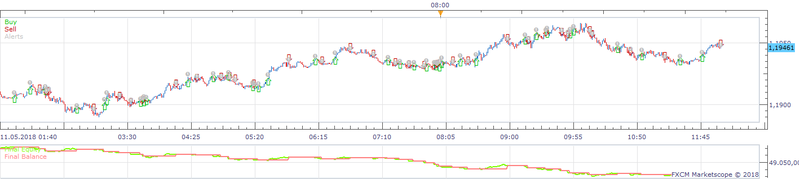
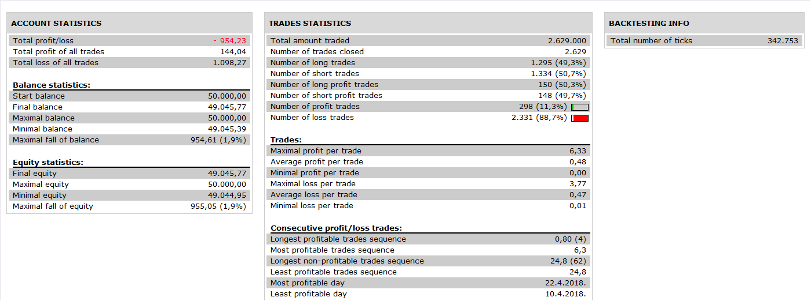

# FlatTrend Strategy

> Source: https://fxcodebase.com/code/viewtopic.php?f=31&t=4591  
> Forum: 31 · Topic 4591 · 3 post(s)

---

## FlatTrend Strategy

**Apprentice** · Thu Jun 02, 2011 6:04 pm

 

Signal is Base on Flat/Trend MACD indicator
[viewtopic.php?f=17&t=1719&p=3433&hilit=Flattrend#p3433](https://fxcodebase.com/code/viewtopic.php?f=17&t=1719&p=3433&hilit=Flattrend#p3433)

The indicator formula is
if SignalMACD<MACD and MACD>0 then indicator show up trend,
if SignalMACD>MACD and MACD<0 then indicator show down trend
else indicator show flat.

Up Trend - Open Long Position
Down Trend - Open Short Position
No Trend - Close All Positions

 [FlatTrend Strategy.lua](files/11306/FlatTrend%20Strategy.lua)

---

## Re: FlatTrend Strategy

**Apprentice** · Wed Nov 30, 2016 8:17 am

Bump up.

---

## Re: FlatTrend Strategy

**Apprentice** · Sun Nov 18, 2018 9:26 am

The Strategy was revised and updated on November 18. 2018.
