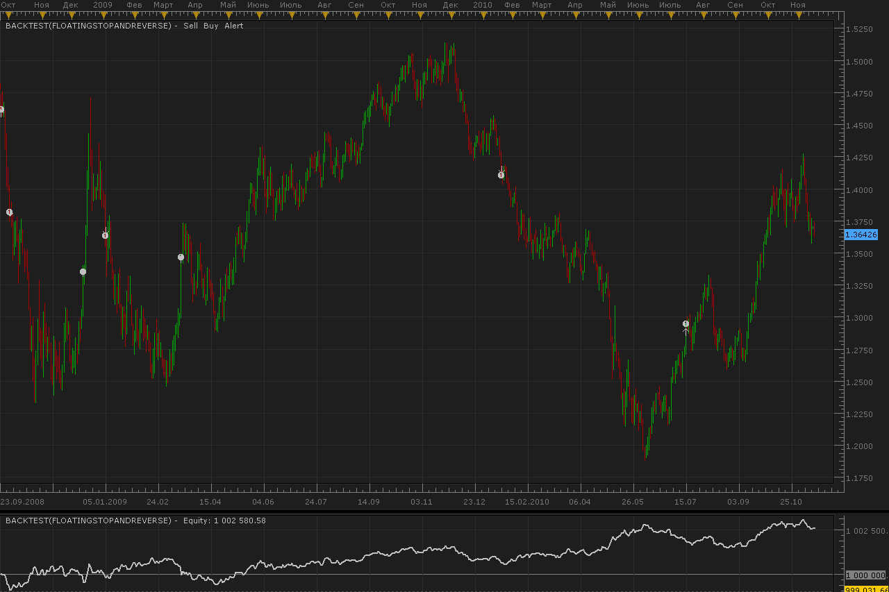

# Floating stop and reverse strategy

> Source: https://fxcodebase.com/code/viewtopic.php?f=31&t=2714  
> Forum: 31 · Topic 2714 · 4 post(s)

---

## Floating stop and reverse strategy

**Alexander.Gettinger** · Mon Nov 15, 2010 11:50 pm

At start strategy order with [FirstOrder] type and [Stop] stop level is opened.
If price moving aside order stop moves.
If order closed at stop, is opened order at other side and etc.

 

The Strategy was revised and updated on December 18, 2018.

---

## Re: Floating stop and reverse strategy

**fwcolbert** · Thu Nov 12, 2015 1:15 pm

Hello! Is It possible to have this work with Stop Entry and Limit Entry order? Can you make this support it?

---

## Re: Floating stop and reverse strategy

**Apprentice** · Fri Nov 13, 2015 6:28 am

Your request is added to the development list.

---

## Re: Floating stop and reverse strategy

**Apprentice** · Wed Dec 14, 2016 3:22 am

Strategy was revised and updated.
