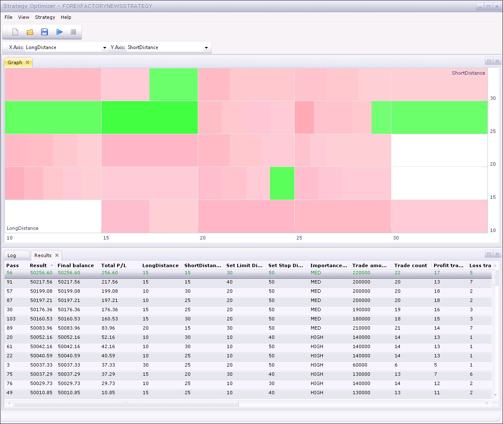
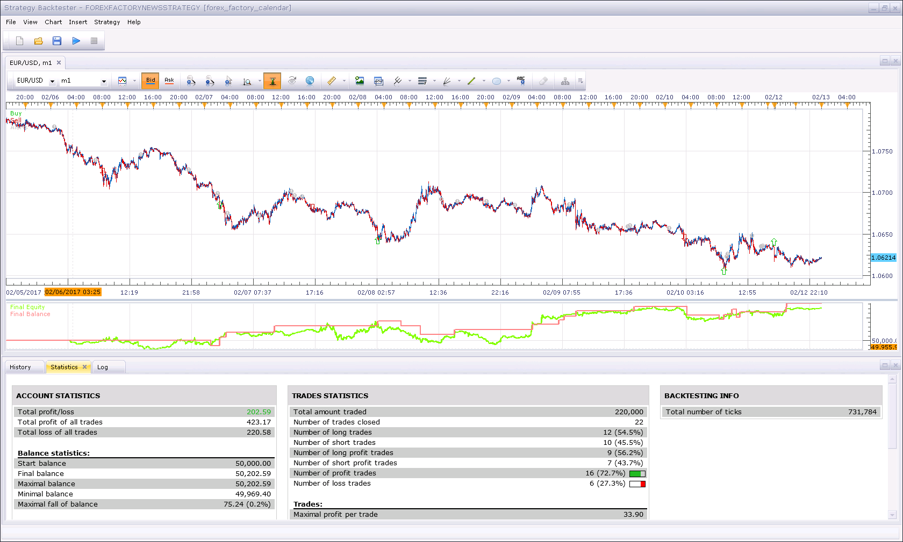

# ForexFactoryNewsStrategy

> Source: https://fxcodebase.com/code/viewtopic.php?f=31&t=64463  
> Forum: 31 · Topic 64463 · 6 post(s)

---

## ForexFactoryNewsStrategy

**Konstantin.Toporov** · Wed Feb 15, 2017 6:24 pm

There is a strategy using calendar news from ForexFactory.com to trade.
The strategy was inspired by the indicators:
[ForexFactory Calendar](https://fxcodebase.com/code/viewtopic.php?f=17&t=61485)
[Forex Factory News Feed](https://fxcodebase.com/code/viewtopic.php?f=27&t=61079)
The idea is to wait for news then place OCO order for the affected instrument to buy or sell and close the position by stop or limit.

The strategy in general downloads the calendar from ForexFactory website but to optimize/backtest can accept a file via parameters (the file containing the calendar needs to be downloaded manually).

There is an optimization picture:

 

And a backtesting picture:

 

---

## Re: ForexFactoryNewsStrategy

**t1982t** · Mon Aug 06, 2018 12:09 am

Hello Konstantin
Thank your for this work
I have downloaded several file formats to test it but none of them don´t work. I wonder if you can tell us how to download and test the files, path to path. Thank you very much. Blessings

---

## Re: ForexFactoryNewsStrategy

**Apprentice** · Mon Aug 06, 2018 5:47 am

> I have downloaded several file formats to test it but none of them don´t work.

Can you please provide a bit more information?

---

## Re: ForexFactoryNewsStrategy

**t1982t** · Mon Aug 06, 2018 10:45 pm

Thanks Apprendice
I follow the following steps:
1. I go to the following address: [https://www.forexfactory.com/ffcal_week_this.xml](https://www.forexfactory.com/ffcal_week_this.xml)
2. I give it to save the page as file: ffcal_week_this.xml
3. I go to test the strategy
4. In the parameters of the strategy, the row "File" entered the address of the hard disk that has the file: C:\Users\Tony\Downloads\ffcal_week_this.xml
5. And nothing happens.

I attach some images of the process
Thanks

---

## Re: ForexFactoryNewsStrategy

**Apprentice** · Wed Aug 08, 2018 3:49 am

The file you downloaded contains data for this week only. Backtests WAS from Jan 2018 to last week, So, no events will ever hit.

---

## Re: ForexFactoryNewsStrategy

**t1982t** · Fri Aug 10, 2018 12:18 am

True , I just have to save the file and test it after a week. thank you very much Apprentice .
