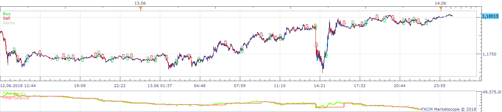
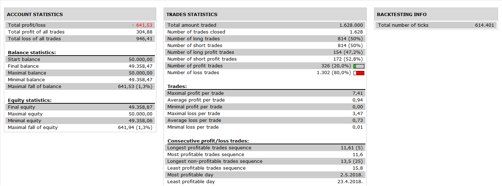

# Fotis Strategy

> Source: https://fxcodebase.com/code/viewtopic.php?f=31&t=4219  
> Forum: 31 · Topic 4219 · 17 post(s)

---

## Fotis Strategy

**Apprentice** · Fri May 13, 2011 2:05 pm

 

This strategy tested four conditions.
If all four are positive, then the strategy is opening new position.
1.
TMACD > 0 - Long
TMACD < 0 - Short
2.
RSI > MA of RSI - Long
RSI < MA of RSI - Short
3.
Price > EMA of High - Long
Price < EMA of Low - Short
4.
Up Candle -Long
Down Candle -Short

 [FotisStrategy.lua](files/10604/FotisStrategy.lua)

---

## Re: Fotis Strategy

**Exolon** · Thu Jul 07, 2011 7:58 pm

This doesn't generate a lot of signals, but when it does, it seems to be very successful - 7 out of 8 profitable trades in backtests for EUR/USD, USD/CHF and GBP/USD. Thanks!

---

## Re: Fotis Strategy

**fskliris** · Fri Jul 08, 2011 10:23 am

Is it possible to add to this strategy stoploss and take profit. ?
Thanks

---

## Re: Fotis Strategy

**fskliris** · Fri Jul 08, 2011 10:28 am

can you make the stoploss to be the pivot

---

## Re: Fotis Strategy

**Apprentice** · Fri Jul 08, 2011 11:51 am

Stop and Limit orders are incorporated into this strategy.
If you have the old version, please update.
One of the older version had a bug.

---

## Re: Fotis Strategy

**fskliris** · Sun Jul 10, 2011 12:14 am

> **Apprentice wrote:**
> Stop and Limit orders are incorporated into this strategy.
> If you have the old version, please update.
> One of the older version had a bug.

The probleme is that when it hits the take profit target and all the parametres say that we are in the same direction (will continiou in the same direction ) it daes not open new possiton again until a new target. Can you anything for this?

---

## Re: Fotis Strategy

**fskliris** · Sun Jul 10, 2011 12:22 am

> **Apprentice wrote:**
> Stop and Limit orders are incorporated into this strategy.
> If you have the old version, please update.
> One of the older version had a bug.

 And if possible to be able to diactivate one of the three indicators - parametres of the system

---

## Re: Fotis Strategy

**Apprentice** · Sun Jul 10, 2011 2:49 am

First. Probably, if I understood you.
You want to open a new position in the same direction as the original trade.
Second, Yes.

---

## Re: Fotis Strategy

**fskliris** · Sun Jul 10, 2011 7:57 am

Yes aprentice. For excample the system opens a position long and i have put on a profit limit 200 pips. Lets say that it hits the target. The possition closes. But the direction is still up. All the parametres of the system says so. Why not the system opens a new possition again? That way you take your [profit and you go on . Thanks again you really make a great job here my friend.

---

## Re: Fotis Strategy

**Apprentice** · Sun Jul 10, 2011 1:52 pm

I have Add Resume Trading After Exit option for this purpose.
Selector Added.

 [FotisStrategy.lua](files/12576/FotisStrategy.lua)

One Note.
I have made only minimal testing.
On a static Data.

---

## Re: Fotis Strategy

**fskliris** · Sun Jul 10, 2011 11:43 pm

It does not work my friend , propably a bag?

---

## Re: Fotis Strategy

**fskliris** · Mon Jul 11, 2011 1:58 pm

When i diactivate one of the indicator it does not give any signal. Can you please fix it. thanks

---

## Re: Fotis Strategy

**Apprentice** · Tue Jul 12, 2011 4:29 am

Hm, I have small bug.

---

## Re: Fotis Strategy

**nakaza** · Wed Jul 13, 2011 5:36 am

i have tested this strategy on 2010 year data and found it to be effective, however on 2009 there seems to be a problem..

i would like to request it to have the possibility to put a stop at b/e +1 once a trade hits a certain number of pips profit. both the number +1 and the number would be selectable.

and also i do not know if its possible but if the script also could move stops below swings, i.e two swings has formed but price is going in our favor then the stop would be -1 pip below the second swing and keep doing that for profitability.

---

## Re: Fotis Strategy

**fskliris** · Tue Jul 19, 2011 11:28 am

Apprentice would it be possible fix the bug for my strategy? Thanks again.

---

## Re: Fotis Strategy

**Apprentice** · Wed Nov 30, 2016 7:40 am

Bump up.

---

## Re: Fotis Strategy

**Apprentice** · Sun Nov 18, 2018 9:13 am

The Strategy was revised and updated on November 18. 2018.
