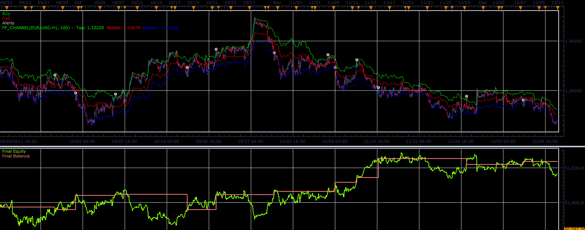
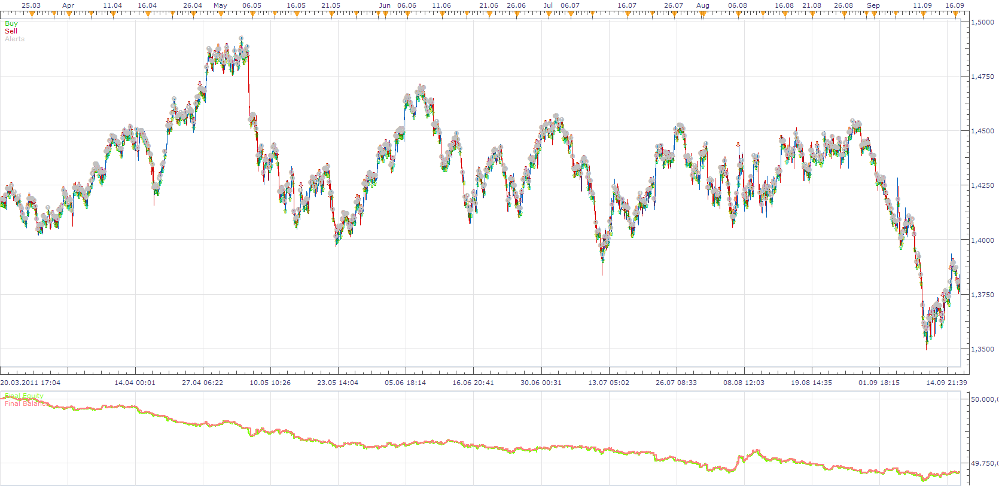

# FP Channel strategy

> Source: https://fxcodebase.com/code/viewtopic.php?f=31&t=10555  
> Forum: 31 · Topic 10555 · 4 post(s)

---

## FP Channel strategy

**Alexander.Gettinger** · Wed Dec 28, 2011 8:33 am

This strategy based on FP channel indicator: [viewtopic.php?f=17&t=10503](https://fxcodebase.com/code/viewtopic.php?f=17&t=10503)

BUY condition: candle closes above the top line,
SELL condition: candle closes below the bottom line.

 

Download strategy:

 [FP_Channel_Strategy.lua](files/21847/FP_Channel_Strategy.lua)

For this strategy must be installed FP channel indicator from [viewtopic.php?f=17&t=10503](https://fxcodebase.com/code/viewtopic.php?f=17&t=10503)

The Strategy was revised and updated on November 21, 2018.

---

## Re: FP Channel strategy

**automan** · Mon Jan 16, 2012 1:56 pm

It opens no trade for two days GBPUSD 1 minute?

and yes i have allow strategy to trade

in backtest it looked good (different timeframe)

---

## Re: FP Channel strategy

**Apprentice** · Wed Jan 18, 2012 3:38 am

I have a test you claim.

 

And everything works as expected.
Try use the other pair, check your settings.

---

## Re: FP Channel strategy

**Apprentice** · Sun Dec 04, 2016 6:06 am

Bump up.
