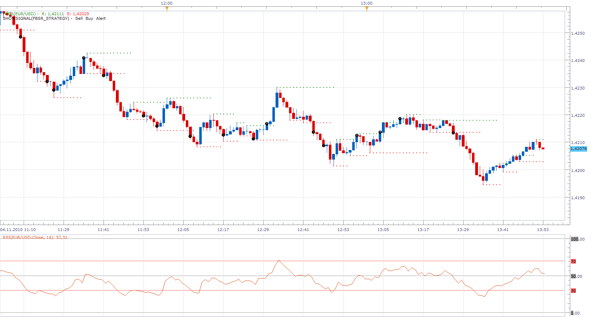

# Fractal-based Support/Resistance RSI Strategy

> Source: https://fxcodebase.com/code/viewtopic.php?f=31&t=2595  
> Forum: 31 · Topic 2595 · 26 post(s)

---

## Fractal-based Support/Resistance RSI Strategy

**Apprentice** · Thu Nov 04, 2010 1:01 pm

1: If Candle closes above FB resistance, open long postition.
2: If Candle closes below FB support, open short position.

I RSI filter is On.

Central line Filter
1: Only enter buy/long if RSI(8) > 50
2: Only enter sell/short if RSI(8) < 50
Overbought/Oversold Filter
1: Only enter buy/long if RSI(8) > 60
2: Only enter sell/short if RSI(8) < 40

 [FBSR_STRATEGY.lua](files/5821/FBSR_STRATEGY.lua)

Fractal-based Support/Resistance Lines Indicator can be found here [http://fxcodebase.com/code/viewtopic.php?f=17&t=367&p=606&hilit=FBSR#p606](https://fxcodebase.com/code/viewtopic.php?f=17&t=367&p=606&hilit=FBSR#p606)
You must have it installed, strategy to work properly.

---

## Re: Fractal-based Support/Resistance RSI Strategy

**baumann** · Thu Nov 04, 2010 1:53 pm

Thank you very much for the very quick response. I will test and give feedback.

So far I see a lot of false signals. Close of candle not past R or S yet.

I will make a list and give example of what I find as soon as I can.

Still thank you very much!!!

---

## Re: Fractal-based Support/Resistance RSI Strategy

**Apprentice** · Thu Nov 04, 2010 3:22 pm

Use Close option, under the Price simulation, this should filter out all false signals.

---

## Re: Fractal-based Support/Resistance RSI Strategy

**baumann** · Thu Nov 04, 2010 4:04 pm

I will test it on live market and give feedback. Thank you.

---

## Re: Fractal-based Support/Resistance RSI Strategy

**baumann** · Fri Nov 05, 2010 9:00 am

The startegy behaves just as I wanted.

RSI does not seem to be a good filter when the market is ranging small.

I will Experiment with other indicators (Maybe ATR and/or CCI)

I will post my findings later next week.

Thanks to Apprentice for a job well done!

---

## Re: Fractal-based Support/Resistance RSI Strategy

**baumann** · Sun Nov 07, 2010 12:52 pm

OK, Ive been doing some backtesting.

I added oversold and overbought settings and it performs much better now.

Here is the code:

Code: [Select all](https://fxcodebase.com/code/)
`-- Version Oct 14, 2010

function Init()
    strategy:name("FBSR Strategy");
    strategy:description("FBSR Strategy");
 
   strategy.parameters:addGroup("RSI Parameters");
   strategy.parameters:addInteger("Frame", "RSI Period", "", 8, 2, 1000);
   strategy.parameters:addInteger("OVRB", "Overbought level", "", 60, 2, 100);
   strategy.parameters:addInteger("OVRS", "Oversold level", "", 40, 2, 100);
 
   
    strategy.parameters:addInteger("PIN" , "RSI Price Type", "", 4);
    strategy.parameters:addIntegerAlternative("PIN" , "Open", "", 1);
    strategy.parameters:addIntegerAlternative("PIN", "High", "", 2);
    strategy.parameters:addIntegerAlternative("PIN" , "Low", "", 3);
   strategy.parameters:addIntegerAlternative("PIN" , "Close", "", 4);
   strategy.parameters:addIntegerAlternative("PIN", "Median", "", 5);
    strategy.parameters:addIntegerAlternative("PIN" , "Typical", "", 6);
   strategy.parameters:addIntegerAlternative("PIN" , "Weighted ", "", 7);      
 
   strategy.parameters:addGroup("Strategy Time Frame");
   strategy.parameters:addString("TF", "Time Frame", "", "m15");
    strategy.parameters:setFlag("TF", core.FLAG_PERIODS);

    strategy.parameters:addGroup("Trading Parameters");
   strategy.parameters:addBoolean("Test", "Use RSI Confirmation", "", true);   
    strategy.parameters:addBoolean("AllowTrade", "Allow strategy to trade", "", false);
    strategy.parameters:addString("Account", "Account to trade on", "", "");
    strategy.parameters:setFlag("Account", core.FLAG_ACCOUNT);
    strategy.parameters:addInteger("Amount", "Trade Amount in Lots", "", 1, 1, 100);
    strategy.parameters:addBoolean("SetLimit", "Set Limit Orders", "", false);
    strategy.parameters:addInteger("Limit", "Limit Order in pips", "", 30, 1, 10000);
    strategy.parameters:addBoolean("SetStop", "Set Stop Orders", "", false);
    strategy.parameters:addInteger("Stop", "Stop Order in pips", "", 30, 1, 10000);
    strategy.parameters:addBoolean("TrailingStop", "Trailing stop order", "", false);

    strategy.parameters:addGroup("Alert Parameters");
    strategy.parameters:addBoolean("ShowAlert", "Show Alert", "", true);
    strategy.parameters:addBoolean("PlaySound", "Play Sound", "", false);
    strategy.parameters:addFile("SoundFile", "Sound File", "", "");
    strategy.parameters:setFlag("SoundFile", core.FLAG_SOUND);
    strategy.parameters:addBoolean("RecurrentSound", "Recurrent Sound", "", false);

    strategy.parameters:addGroup("Email Parameters");
    strategy.parameters:addBoolean("SendEmail", "Send email", "", false);
    strategy.parameters:addString("Email", "Email address", "", "");
    strategy.parameters:setFlag("Email", core.FLAG_EMAIL);
end

local Email;

local ShowAlert;
local SoundFile;
local RecurrentSound;

local AllowTrade;
local Offer;
local CanClose;
local Account;
local Amount;
local SetLimit;
local Limit;
local SetStop;
local Stop;

local barsource = nil;
local name;
local  Allow;
local PRICE;
local PIN;
local Frame;
local RSI;
local OVRB;
local OVRS;
local FBSR;
--local EXIT;
local Test;

function Prepare(onlyName)

    assert(core.indicators:findIndicator("FBSR") ~= nil, "Please download and install  FBSR Indicator!");
   Test = instance.parameters.Test;
    OVRB = instance.parameters.OVRB;
    OVRS = instance.parameters.OVRS;
    Frame = instance.parameters.Frame;
    PIN = instance.parameters.PIN;
    Allow = instance.parameters.Allow;

    --EXIT = instance.parameters.EXIT;   
     
    local SendEmail = instance.parameters.SendEmail;
    if SendEmail then
        Email = instance.parameters.Email;
    else
        Email = nil;
    end
    assert(not(SendEmail) or (SendEmail and Email ~= ""), "Email address must be specified");

    assert(instance.parameters.TF ~= "t1", "The time frame must not be tick");
    assert(not(instance.parameters.PlaySound) or (instance.parameters.PlaySound and instance.parameters.SoundFile ~= ""), "Sound file must be chosen");
       
    name = profile:id() .. "(" .. "FBSR(" .. instance.bid:name() .. "." .. instance.parameters.TF .. ", "..instance.parameters.Frame .. ")";
      
    ShowAlert = instance.parameters.ShowAlert;
    if instance.parameters.PlaySound then
        SoundFile = instance.parameters.SoundFile;
        RecurrentSound = instance.parameters.RecurrentSound;
    else
        SoundFile = nil;
        RecurrentSound = false;
    end

    AllowTrade = instance.parameters.AllowTrade;

    if AllowTrade then
        Account = instance.parameters.Account;
        Amount = instance.parameters.Amount * core.host:execute("getTradingProperty", "baseUnitSize", instance.bid:instrument(), Account);
        Offer = core.host:findTable("offers"):find("Instrument", instance.bid:instrument()).OfferID;
        CanClose = core.host:execute("getTradingProperty", "canCreateMarketClose", instance.bid:instrument(), Account);
        SetLimit = instance.parameters.SetLimit;
        Limit = instance.parameters.Limit * instance.bid:pipSize();
        SetStop = instance.parameters.SetStop;
        Stop = instance.parameters.Stop * instance.bid:pipSize();
        TrailingStop = instance.parameters.TrailingStop;
     
        name = name .. ", trade) ";
    else
        name = name .. ", signal) ";
    end

    instance:name(name);

    if onlyName then
        return ;
    end

    barsource = ExtSubscribe(1, nil, instance.parameters.TF, true, "bar");
   
       if PIN == 1 then
      PRICE = barsource.open;      
      elseif PIN==2 then
      PRICE = barsource.high;   
      elseif PIN==3 then
      PRICE = barsource.low;   
      elseif PIN==4 then
      PRICE = barsource.close;   
      elseif PIN==5 then
      PRICE = barsource.median;   
      elseif PIN==6 then
      PRICE = barsource.typical;   
      elseif PIN==7 then
      PRICE = barsource.weighted;   
      end
      
       RSI=core.indicators:create("RSI", PRICE, Frame);   
        FBSR=core.indicators:create("FBSR", barsource);

end

function ExtUpdate(id, source, period)
   
   if id == 1 and period > 1 then
   
       RSI:update(core.UpdateLast);
      if  not RSI.DATA:hasData(period) or not RSI.DATA:hasData(period-1) then
        return;
        end    
         
      FBSR:update(core.UpdateLast);
      if  not FBSR.R:hasData(period) and  not FBSR.S:hasData(period) then
        return;
        end
      if  not FBSR.R:hasData(period-1) and  not FBSR.S:hasData(period-1) then
        return;
        end       
      
      if   FBSR.R[period] ~= FBSR.R[period-1] then
        return;
        end
      if  FBSR.S[period] ~= FBSR.S[period-1] then
        return;
        end
      
      if Test then
              if  core.crossesOver(barsource.close, FBSR.R,   period) and RSI.DATA[period] > OVRB then
            TRADE ("Long");
            elseif  core.crossesUnder(barsource.close, FBSR.S,   period) and RSI.DATA[period] < OVRS then
            TRADE ("Short");          
            end
            
            if EXIT then
            end
      else
            if  core.crossesOver(barsource.close, FBSR.R,   period) then
            TRADE ("Long");
            elseif  core.crossesUnder(barsource.close, FBSR.S,   period) then
            TRADE ("Short");
            end
      end
          
   end       
end

local NOTE;

function TRADE (SIDE)

            if SIDE == "Long" then
         NOTE ="Enter " ..  SIDE .. " Position";
         elseif SIDE == "Short" then
         NOTE ="Enter " ..  SIDE .. " Position";
         elseif SIDE == "Close" then
         NOTE ="Close All Position";
         end
         
            if ShowAlert then
                terminal:alertMessage(instance.bid:instrument(), instance.bid[NOW], NOTE, instance.bid:date(NOW));
            end

            if SoundFile ~= nil then
                terminal:alertSound(SoundFile, RecurrentSound);
            end

            if Email ~= nil then
                terminal:alertEmail(Email, NOTE , name .." " .. NOTE)
            end
         
            if SIDE == "Long" then
            exit("S");
            enter("B") ;
         elseif   SIDE == "Short" then
         exit("B");
            enter("S");
         elseif SIDE == "Close" and EXIT then         
         exit("B");
         exit("S");
         end
   
end

-- enter into the specified direction
function enter(BuySell)
    if not(AllowTrade) then
        return ;
    end

    local enum, row, valuemap, success, msg;

    -- check whether we have at least one trade on the specified account
    -- in the specified direction for the specified instrument
    local count = 0;
    enum = core.host:findTable("trades"):enumerator();
    row = enum:next();
    while count == 0 and row ~= nil do
        if row.AccountID == Account and
           row.OfferID == Offer and
           row.BS == BuySell then
           count = count + 1;
        end
        row = enum:next();
    end

    -- do not enter if position in the
    -- specified direction already exists
    if count > 0 then
        return ;
    end

    local valuemap, success, msg;
    valuemap = core.valuemap();

    valuemap.OrderType = "OM";
    valuemap.OfferID = Offer;
    valuemap.AcctID = Account;
    valuemap.Quantity = Amount;
    valuemap.BuySell = BuySell;
    valuemap.PegTypeStop = "M";

    if SetLimit then
        -- set limit order
        if BuySell == "B" then
            valuemap.RateLimit = instance.ask[NOW] + Limit;
        else
            valuemap.RateLimit = instance.bid[NOW] - Limit;
        end
    end

    if SetStop then
        -- set limit order
        if BuySell == "B" then
            valuemap.RateStop = instance.ask[NOW] - Stop;
        else
            valuemap.RateStop = instance.bid[NOW] + Stop;
        end
        if TrailingStop then
            valuemap.TrailStepStop = 1;
        end
    end

    success, msg = terminal:execute(100, valuemap);

    if not(success) then
        terminal:alertMessage(instance.bid:instrument(), instance.bid[instance.bid:size() - 1], "Open order failed" .. msg, instance.bid:date(instance.bid:size() - 1));
    end
end

-- exit from the specified direction
function exit(BuySell)
    if not(AllowTrade) then
        return ;
    end

    local enum, row, valuemap, success, msg;

    -- check whether we have at least one trade on the specified account
    -- in the specified direction for the specified instrument
    local count = 0;
    enum = core.host:findTable("trades"):enumerator();
    row = enum:next();
    while count == 0 and row ~= nil do
        if row.AccountID == Account and
           row.OfferID == Offer and
           row.BS == BuySell then
           count = count + 1;
        end
        row = enum:next();
    end

    if count > 0 then
        valuemap = core.valuemap();

        -- switch the direction since the order must be in oppsite direction
        if BuySell == "B" then
            BuySell = "S";
        else
            BuySell = "B";
        end
        valuemap.OrderType = "CM";
        valuemap.OfferID = Offer;
        valuemap.AcctID = Account;
        valuemap.NetQtyFlag = "Y";
        valuemap.BuySell = BuySell;
        success, msg = terminal:execute(101, valuemap);

        if not(success) then
            terminal:alertMessage(instance.bid:instrument(), instance.bid[instance.bid:size() - 1], "Close order failed" .. msg, instance.bid:date(instance.bid:size() - 1));
        end
    end
end

dofile(core.app_path() .. "\\strategies\\standard\\include\\helper.lua");`

Apprentice - can you look at the code and see if it's sufficient and update the uploaded file?

Thank you very much.

I will test it live this week. (Only on EURUSD)

---

## Re: Fractal-based Support/Resistance RSI Strategy

**Apprentice** · Sun Nov 07, 2010 3:50 pm

Looks good.
I'm lazy by nature, So I added one more option,
i can have the best of both worlds now.

---

## Re: Fractal-based Support/Resistance RSI Strategy

**automan** · Thu Mar 17, 2011 9:19 am

Hi

1: If Candle closes above FB resistance, open long postition.
2: If Candle closes below FB support, open short position.

Is it possible to change the code so that it opens the trade one tick above/below instead of waiting for the close?

I have been looking at the code but i cant figure it out

---

## Re: Fractal-based Support/Resistance RSI Strategy

**fabfxcm** · Fri Mar 18, 2011 2:57 am

If i load FBSDR on strategy the strategy run, but when I try to back test of FBSR strategy doesn't work and appear the following message: string FBSR_strategy.lua: 121 unsupported.
What does it mean? What can I do?

---

## Re: Fractal-based Support/Resistance RSI Strategy

**R3boot** · Fri Mar 18, 2011 12:15 pm

just GREAT

i have been testing it. i think so far it needs more dev.

and we can do that be testing it and discuses our results

so far i think we need an option to make a limit and stop for every trade that is going to open

what do u think guys ?

---

## Re: Fractal-based Support/Resistance RSI Strategy

**Leisure** · Fri Apr 22, 2011 7:50 am

I have tested this strategy on different time compressions and with different "Price simulation" selections. I would agree with the previous writer that there are a lot of false signals when "Price simulation" "Mix" is selected. However, when "Close" is selected, as advised by Apprentice, the false signals are eliminated but a new problem becomes apparent. When "Close" is selected, the signal no longer happens at the close of the triggering candle but rather the close of the second candle following the candle which closed above the resistance line or closed below the support line.

Although seemingly minor in comparison when used on smaller time compressions, it can make a huge difference on larger time compressions. Not only will this result in a loss of some profit in most cases, but in some cases could be the difference between a losing trade and a winning trade.

In way of correcting this flaw?

---

## Re: Fractal-based Support/Resistance RSI Strategy

**TMos1124** · Thu Sep 08, 2011 11:43 am

Thank you for this strategy and indicator. I am not sure whether to request a new strategy, so I will post here. I would like to choose to trade above support or below resistance. In addition if it would be possible to also attach an MA, also to choose to trade above or below. Lastly, if a trading hours module could be attached, so I know when it will stop trading. My attempts to piece this all together in the Editor has proven futile. Many thanks again.

---

## Re: Fractal-based Support/Resistance RSI Strategy

**Apprentice** · Thu Sep 08, 2011 12:17 pm

1st I am not sure what this means "the choice to trade above support or below resistance"

2nd You have not defined trading rules to the moving average.
 Add moving average filter?

 What requirements does this filter uses.
 Slope or position of prices relative to the moving average.

3rd You want the opportunity to define trading hours.
Possibility of closing open positions after the expiration of this time.

---

## Re: Fractal-based Support/Resistance RSI Strategy

**TMos1124** · Fri Sep 09, 2011 8:23 am

Thank you for your reply, allow me to clarify:

1. As I think this FSBR strategy works, it will trigger only if price closes beyond the FSBR and I want to be able to choose to trade either if it closes above resistance or below support (pardon my confusion)
2. I want to define direction based on the prices position to the MA (long or short)
3. I want all trades to be closed at the end of the time period.

I hope that gives a better picture, I would be glad to explain further.

---

## Re: Fractal-based Support/Resistance RSI Strategy

**jackfx09** · Tue Sep 13, 2011 1:25 pm

I think that this strategy would be best utilized if you can offer a couple different filters/options:

First, I think the easiest change to be made would be to offer the strategy to sell against the resistance and buy against the support lines. "Reverse Signal" as I have seen on other parameter filters is most likely what I am speaking about.

Second, in conjunction with the above, if the price closes past the support and/or resistance lines by a certain percentage/pip threshold, then the autotrade would follow that trend until the opposing FBSR signal closes the position.

for example, price on a five minute bar closes 10 pips ABOVE the FB resistance, then the autotrader would open a buy and vice versa.

---

## Re: Fractal-based Support/Resistance RSI Strategy

**jackfx09** · Wed Sep 14, 2011 3:11 am

Notes for idea of tuning this particular strategy. Hope this helps.

Thanks!

sjc

---

## Re: Fractal-based Support/Resistance RSI Strategy

**jackfx09** · Wed Sep 14, 2011 3:34 am

Part 2 of FBSR strategy notes for review and brainstorming. FBSR works best in Breakouts (current situation since Sept 2 of this year) while in a Trend, but can be utilized in a Range which you will see from this daily chart was the case from May through to Sept.

---

## Re: Fractal-based Support/Resistance RSI Strategy

**TMos1124** · Wed Sep 14, 2011 8:52 am

I agree with this poster, I asked for the changes for exactly this. My buy logic was for trending markets to initiate a buy if price closes above resistance while above a moving average, and sell logic of if price closes below support while below the moving average. I wanted to keep these somewhat independent so I could adjust for ranging markets (sell at close above resistance OR below support while above the moving average, and buying below support OR above resistance below the moving average).

---

## Re: Fractal-based Support/Resistance RSI Strategy

**RJH501** · Tue Sep 20, 2011 9:19 am

In my testing of the FBSR strategy I have discovered that the RSI overbought/oversold parameters have no affect on how the strategy trades. You can set the OB/OS parameters to any value between 2 & 100 with all other parameters stable and there will be no changes in the trade point.

Just for your follow-up.

Regards,

Richard

---

## Re: Fractal-based Support/Resistance RSI Strategy

**mosesnobleraj** · Wed Oct 05, 2011 10:02 pm

sir,
can u add following option in this strategy

buying condition:**rsi{period 14}>central line** and **rsi {period 14}<ob level[70]** and price crossover fbsr resistance
sell ing condition:r**si{period 14}<central line** and **rsi {period14}> os level[30]** price cross under fbsr resistance

---

## Re: Fractal-based Support/Resistance RSI Strategy

**Apprentice** · Thu Oct 06, 2011 4:43 pm

Your request is added to the developmental cue.

---

## Re: Fractal-based Support/Resistance RSI Strategy

**Avignon** · Mon Sep 21, 2015 5:02 am

Hello,

Is what you can with the VFratales indicator ([http://www.fxcodebase.com/code/viewtopi ... 17&t=27687](http://www.fxcodebase.com/code/viewtopic.php?f=17&t=27687)) ?

Thank you.

---

## Re: Fractal-based Support/Resistance RSI Strategy

**Apprentice** · Tue Dec 13, 2016 4:33 pm

Strategy was revised and updated.

---

## Re: Fractal-based Support/Resistance RSI Strategy

**doanthedung** · Sun Dec 18, 2016 11:09 pm

Hi Apprentice,

Can you create MTF MCP FBSR Indicator with template code as [http://www.fxcodebase.com/code/viewtopi ... adashboard](http://www.fxcodebase.com/code/viewtopic.php?f=17&t=4504&hilit=mvadashboard)

UpArrow only time price cross FBSR.R
DownArrow only time price cross FBSR.S

Thanks in advance!

---

## Re: Fractal-based Support/Resistance RSI Strategy

**Apprentice** · Mon Dec 19, 2016 5:01 pm

Try this version.
[viewtopic.php?f=17&t=64230](https://fxcodebase.com/code/viewtopic.php?f=17&t=64230)

---

## Re: Fractal-based Support/Resistance RSI Strategy

**Avignon** · Wed Aug 15, 2018 10:02 am

Hello,

Obviously the calculation of the fractal is not good.

 

After refresh.

 

I put the fractal indicator that is installed by default on the TS2.

Edit : and that would be good to add the function "End of turn" in option. Thanks.
