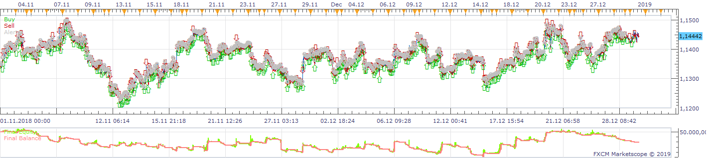
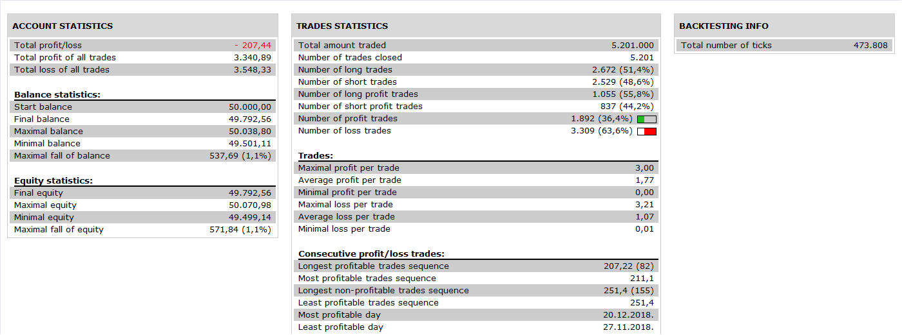

# Fractal_Gains_Strategy

> Source: https://fxcodebase.com/code/viewtopic.php?f=31&t=68918  
> Forum: 31 · Topic 68918 · 27 post(s)

---

## Fractal_Gains_Strategy

**Apprentice** · Mon Sep 16, 2019 3:58 am

 

Based on request.
[viewtopic.php?f=27&t=13413](https://fxcodebase.com/code/viewtopic.php?f=27&t=13413)

 [Fractal_Gains_Strategy.lua](files/128697/Fractal_Gains_Strategy.lua)

D_Oscillator.lua
[viewtopic.php?f=17&t=3608](https://fxcodebase.com/code/viewtopic.php?f=17&t=3608)

---

## Re: Fractal_Gains_Strategy

**yolerap** · Thu Sep 26, 2019 3:24 pm

Thank you for the modifications

But the strategy does not limit the number of open positions... I put " 20 max positions limit " and " 10 max positions in one direction " but look the picture, there's 42 positions open haha

Could you repair this please ?
Thank you,

---

## Re: Fractal_Gains_Strategy

**Apprentice** · Sat Sep 28, 2019 4:03 pm

Have you tried to set "Position Cap" to yes?

---

## Re: Fractal_Gains_Strategy

**yolerap** · Mon Sep 30, 2019 9:58 am

Hello,

Yes sure I did but doesn't working If I put Yes or No for " Position cap " it's the same..

Thank you,

---

## Re: Fractal_Gains_Strategy

**Apprentice** · Wed Oct 02, 2019 6:20 am

Your request is added to the development list.
Development reference 153.

---

## Re: Fractal_Gains_Strategy

**Apprentice** · Wed Oct 09, 2019 1:29 pm

Please re-download the strategy.

The strategy creates pending orders, so the position is not applicable to this strategy.
Removed. You need to specify the order deletion strategy to limit the number of orders (do not open a new one or delete the oldest ones... or some else behavior)

---

## Re: Fractal_Gains_Strategy

**yolerap** · Mon Dec 09, 2019 1:27 pm

Perfect

Could you please add the breakeven option please ?

Thank you,

---

## Re: Fractal_Gains_Strategy

**Apprentice** · Wed Dec 11, 2019 5:47 pm

Your request is added to the development list.
Development reference 426.

---

## Re: Fractal_Gains_Strategy

**Apprentice** · Thu Dec 12, 2019 5:37 pm

[Fractal_Gains_Strategy.lua](files/130236/Fractal_Gains_Strategy.lua)

Try this version.

---

## Re: Fractal_Gains_Strategy

**yolerap** · Tue Mar 03, 2020 2:00 pm

Hello,

Is it possible to add TSI like a filter please ?

When the TSi is > 0, only buy position could be open
When the TSI is <0, only sell position could be open

Don't change the order conditions creation.

Thank you,

---

## Re: Fractal_Gains_Strategy

**Apprentice** · Thu Mar 05, 2020 6:22 am

Your request is added to the development list.
Development reference 828.

---

## Re: Fractal_Gains_Strategy

**Apprentice** · Fri Mar 06, 2020 7:01 am

[Fractal_Gains_TSI_Strategy.lua](files/131776/Fractal_Gains_TSI_Strategy.lua)

Try this version.

---

## Re: Fractal_Gains_Strategy

**caaaaaaalmement** · Sun Mar 08, 2020 8:10 pm

Hi Apprentice,
I am trying the Fractal_Gains_Strategy and I have an alert which keeps coming.
It says :
"Failed change stop The stop value must be a positive real number <= 2.1607."
I asked for "false" in properties/notification but it is still coming
I guess it is a mistake in my settings, do you have an idea ?

---

## Re: Fractal_Gains_Strategy

**Apprentice** · Mon Mar 09, 2020 7:09 am

Your request is added to the development list.
Development reference 844.

---

## Re: Fractal_Gains_Strategy

**Apprentice** · Tue Mar 10, 2020 6:22 am

[Fractal_Gains_Strategy.lua](files/131835/Fractal_Gains_Strategy.lua)

There is nothing we can do except disabling error messages in the code.

---

## Re: Fractal_Gains_Strategy

**caaaaaaalmement** · Wed Mar 11, 2020 2:19 am

Ok thank you.

---

## Re: Fractal_Gains_Strategy

**yolerap** · Fri Mar 13, 2020 9:32 am

Could you please add the "close on opposite" to this strategy :

Post by Apprentice » Tue Mar 10, 2020 12:22 pm
Fractal_Gains_Strategy.lua

Thank you,

---

## Re: Fractal_Gains_Strategy

**Apprentice** · Sat Mar 14, 2020 6:49 am

Your request is added to the development list.
Development reference 867.

---

## Re: Fractal_Gains_Strategy

**caaaaaaalmement** · Sat Mar 14, 2020 7:45 pm

Hi Apprentice,
when I backtest this strategy, if I set the initial balance on 50,000 euros, I don't get the same result as if I set it on 150,000 euros.
I guess there is something I am doing wrong in the settings. Do you have an idea ?

---

## Re: Fractal_Gains_Strategy

**Apprentice** · Mon Mar 16, 2020 5:14 am

Your request is added to the development list.
Development reference 872.

---

## Re: Fractal_Gains_Strategy

**Apprentice** · Mon Mar 16, 2020 6:16 am

[Fractal_Gains_Strategy.lua](files/131968/Fractal_Gains_Strategy.lua)

Try this version.

---

## Re: Fractal_Gains_Strategy

**ASTONIX91** · Mon Mar 16, 2020 10:19 am

Hello,
there seems to be a problem with allow strategy to trade

---

## Re: Fractal_Gains_Strategy

**caaaaaaalmement** · Mon Mar 16, 2020 10:45 am

Thank you

---

## Re: Fractal_Gains_Strategy

**Apprentice** · Tue Mar 17, 2020 12:59 pm

Can't repeat, I'm getting exactly the same performance.

---

## Re: Fractal_Gains_Strategy

**ASTONIX91** · Mon Mar 28, 2022 8:13 am

Hello
would it be possible to translate this Fractal_Gains-2_Strategy file into MQL5 Thank you in advance and have a nice day

---

## Re: Fractal_Gains_Strategy

**Apprentice** · Fri Apr 01, 2022 3:08 am

Your request is added to the development list.
Development reference 199.

---

## Re: Fractal_Gains_Strategy

**FX2000** · Thu Nov 17, 2022 2:55 am

Hello
Could you add a trailing stop thank you very much
