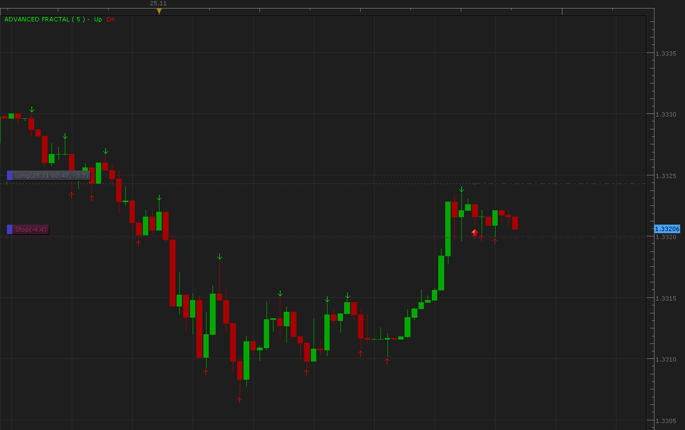
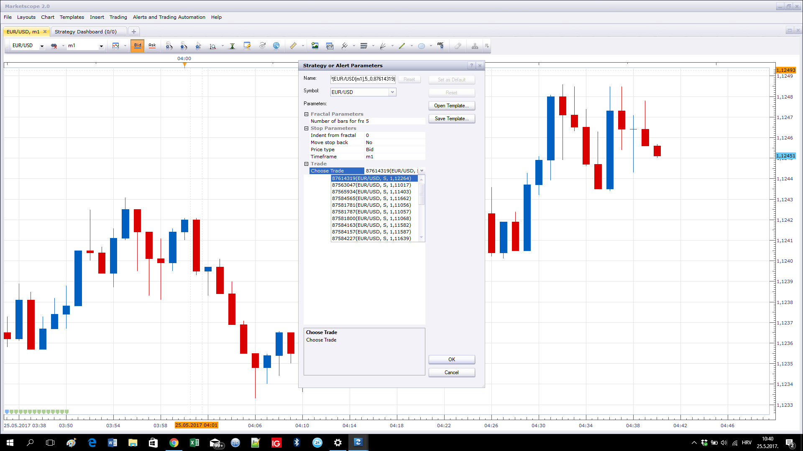
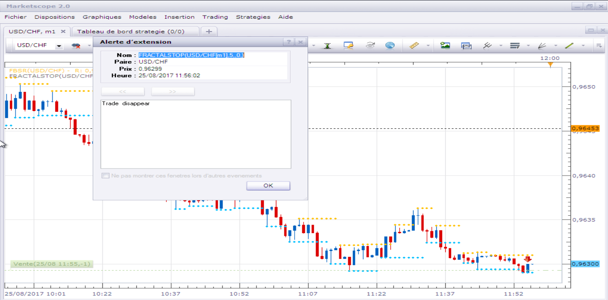
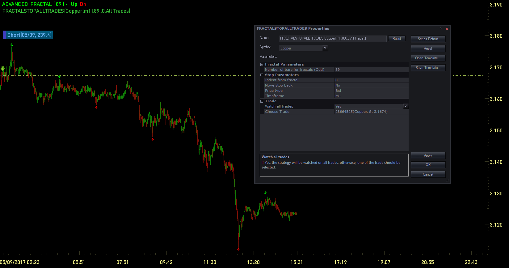
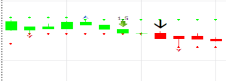
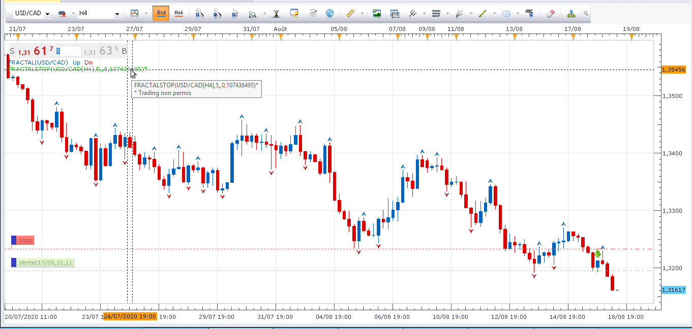
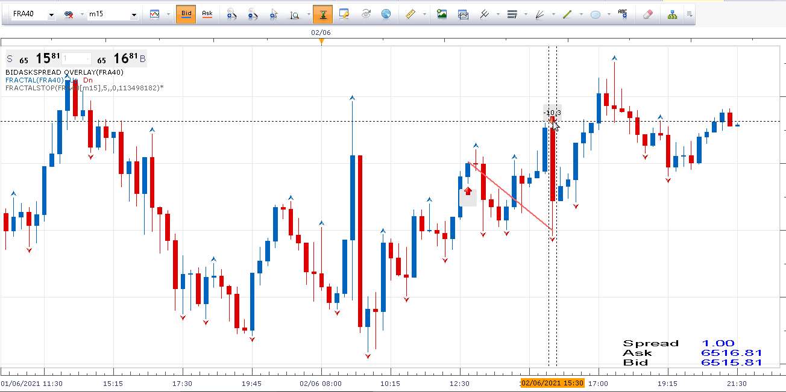

# Fractal trailing stop

> Source: https://fxcodebase.com/code/viewtopic.php?f=31&t=2791  
> Forum: 31 · Topic 2791 · 38 post(s)

---

## Fractal trailing stop

**Alexander.Gettinger** · Thu Nov 25, 2010 1:03 am

The strategy sets stop value for the chosen trade using fractals.
Strategy parameters:
Frame - Number of bars for fractals,
Indent - Indent from fractal, if =0 then stop put directly on fractal,
MoveBack - if false then for BUY stop moves up only and for SELL stop moves down only.

 

Download:

 [FractalStop.lua](files/6361/FractalStop.lua)

 [Asymmetric Fractal Stop.lua](files/6361/Asymmetric%20Fractal%20Stop.lua)

Version for orders.

 [FractalStopOrder.lua](files/6361/FractalStopOrder.lua)

 [FractalStopAllTrades.lua](files/6361/FractalStopAllTrades.lua)

The Strategy was revised and updated on January 21, 2019.

---

## Re: Fractal trailing stop

**wanabetrader** · Fri Mar 04, 2011 7:56 am

I'm having trouble with this strategy/stop-trailer. It worked a few days ago and trailed my stop just fine but in the last two days it has said "Stop creation failed because command is disabled". Is there anything I'm doing because all I am doing is selecting the timeframe and bid/ask putting in the indent and selecting the trade to trail. I really, really need this for my systems to work while I'm away it is a invaluable tool in my arsenal. Could it be that I have a U.S. F.I.F.O account?

---

## Re: Fractal trailing stop

**sho-me-pips** · Mon Feb 06, 2012 10:04 pm

Please make this strategy compatible with FIFO accounts.

---

## Re: Fractal trailing stop

**Alexander.Gettinger** · Wed Feb 08, 2012 12:19 pm

Fractal stop for FIFO accounts:

 [FractalStop2.lua](files/25448/FractalStop2.lua)

---

## Re: Fractal trailing stop

**sho-me-pips** · Sat Feb 11, 2012 11:33 am

> **Alexander.Gettinger wrote:**
> Fractal stop for FIFO accounts:
>
>
> FractalStop2.lua

Thank You VERRRRY much!!

---

## Re: Fractal trailing stop

**Alexander.Gettinger** · Thu Feb 23, 2012 12:55 pm

Fractal stop that works with all the orders for the selected pair:

 [FractalStop4.lua](files/26707/FractalStop4.lua)

---

## Re: Fractal trailing stop

**nakaza** · Tue Mar 06, 2012 10:25 am

does the number specified allow to trail by a fractal of X numbers behind? or only the current fractal?

---

## Re: Fractal trailing stop

**Apprentice** · Thu Mar 08, 2012 5:57 am

This parameter defines the algorithm for the detection of fractals.
For example, 5 is the standard TS fractal.

Fractal Technical Indicator it is a series of at least five successive bars, with the highest HIGH in the middle, and two lower HIGHs on both sides. The reversing set is a series of at least five successive bars, with the lowest LOW in the middle, and two higher LOWs on both sides, which correlates to the sell fractal.

For more information see
[viewtopic.php?f=17&t=724&hilit=Advanced+Fractal](https://fxcodebase.com/code/viewtopic.php?f=17&t=724&hilit=Advanced+Fractal)

---

## Re: Fractal trailing stop

**Alexander.Gettinger** · Thu Mar 08, 2012 8:59 am

> **nakaza wrote:**
> does the number specified allow to trail by a fractal of X numbers behind? or only the current fractal?

Strategy use a last fractal for trailing.

---

## Re: Fractal trailing stop

**subliminal** · Thu Mar 08, 2012 5:29 pm

Is it possible to have an option to choose the fractal number? I know 5 is the standard but would love to have an option to increase it to something like 7 or 9 or even go lower to 3.

---

## Re: Fractal trailing stop

**Apprentice** · Sun Mar 11, 2012 5:10 am

This is already possible to Fractals, greater than 5 (2 +2 +1).

 [FractalStop.lua](files/27847/FractalStop.lua)

In this version you can also use 3.

---

## Re: Fractal trailing stop

**noozak** · Tue Apr 03, 2012 8:11 am

Can this strategy be used in conjunction with another?

So If I used the Advanced Fractal Strategy to make my buy and sell orders, and also had this attached to the chart it would set up a trailing stop for the previous order?

---

## Re: Fractal trailing stop

**Apprentice** · Wed Apr 04, 2012 2:11 am

Yes this is possible.

---

## Re: Fractal trailing stop

**guangho** · Mon Dec 03, 2012 2:18 am

Is there such a strategy?

When the signal appears when only the profitable positions, losing streak without treatment.

Sites on the other stop strategies aimed at specified positions or all positions of execution, if I open up many positions in the strategy of setting time will be very troublesome.

thank you!

---

## Re: Fractal trailing stop

**peterpap** · Sun Jun 02, 2013 12:16 pm

Using FractalStop4.lua, I've made a corresponding trailing limit stradegy that works with all the orders for the selected pair and moving back if you wish to capture more pips.
Thanks a lot!

---

## Re: Fractal trailing stop

**Bouzouki** · Mon Jan 25, 2016 7:27 pm

Wow Really Nice work! Is it possible to have this based on 2nd fractal instead of the most recent. Example would be trail stop just above last 2nd fractal on a 15min chart.

---

## Re: Fractal trailing stop

**Apprentice** · Wed Jan 27, 2016 8:21 am

Your request is added to the development list.

---

## Re: Fractal trailing stop

**Cactus** · Sun Aug 14, 2016 10:04 pm

> **Alexander.Gettinger wrote:**
> Fractal stop that works with all the orders for the selected pair:
>
>
> FractalStop4.lua

Hello, I like this. I think this is the only trailing stop on the forum that works for "all orders". I shall study it and see how the code can be adapted for other trialing stops in a similar fashion.

Meanwhile, I would like to request a change to this version of the strategy. Can the asymmetrical fractal indicator be used as the fractal base on which to place stop losses?
It can be found here:
[viewtopic.php?f=17&t=32544&p=55438](https://fxcodebase.com/code/viewtopic.php?f=17&t=32544&p=55438)

Everything else would stay the same, I just want to specify the before and after number of candles that form a fractal for this trailing stop.

---

## Re: Fractal trailing stop

**Apprentice** · Mon Aug 15, 2016 4:26 am

Asymmetric Fractal Stop.lua added.

---

## Re: Fractal trailing stop

**Cactus** · Mon Aug 15, 2016 10:01 am

> **Apprentice wrote:**
> Asymmetric Fractal Stop.lua added.

Thank you, however, is it the same as "Fractalstop4.lua", just using asymmetric fractals?
Studying the code I notice it is less in size, and generally it is more like the original .lua in the first post, which does not work on all orders?

I see it is

Code: [Select all](https://fxcodebase.com/code/)
`instance.parameters.Trade .. ")";`
Instead of

Code: [Select all](https://fxcodebase.com/code/)
`instance.parameters.Symbol .. ")";`

etc.

I can try fix it copy pasting lines between the two strategies to achieve this and post it here later for your confirmation if it is correct but if there's a quicker way of doing it can you post the "Fractalstop4.lua" version with Asymmetric Fractals, thanks.

---

## Re: Fractal trailing stop

**doanthedung** · Mon Dec 05, 2016 11:00 pm

Can you add Fractal trailingstop into Fractal Strategy? It's very useful.
Thanks!

---

## Re: Fractal trailing stop

**Apprentice** · Tue Dec 06, 2016 7:12 am

Your request is added to the development list, Under Id Number 3687
 If someone is interested to do this task, please contact me.

---

## Re: Fractal trailing stop

**Cactus** · Fri Apr 28, 2017 9:05 pm

> **Cactus wrote:**
>
>
> > **Apprentice wrote:**
> > Asymmetric Fractal Stop.lua added.
>
>
>
> Thank you, however, is it the same as "Fractalstop4.lua", just using asymmetric fractals?
> Studying the code I notice it is less in size, and generally it is more like the original .lua in the first post, which does not work on all orders?
>
> I see it is
>
>
> Code: [Select all](https://fxcodebase.com/code/)
> `instance.parameters.Trade .. ")";`
> Instead of
>
>
> Code: [Select all](https://fxcodebase.com/code/)
> `instance.parameters.Symbol .. ")";`
>
> etc.
>
> I can try fix it copy pasting lines between the two strategies to achieve this and post it here later for your confirmation if it is correct but if there's a quicker way of doing it can you post the "Fractalstop4.lua" version with Asymmetric Fractals, thanks.

> **Cactus wrote:**
>
>
> > **Alexander.Gettinger wrote:**
> > Fractal stop that works with all the orders for the selected pair:
> >
> >
> > FractalStop4.lua
>
>
>
> Hello, I like this. I think this is the only trailing stop on the forum that works for "all orders". I shall study it and see how the code can be adapted for other trialing stops in a similar fashion.
>
> Meanwhile, I would like to request a change to this version of the strategy. Can the asymmetrical fractal indicator be used as the fractal base on which to place stop losses?
> It can be found here:
> [viewtopic.php?f=17&t=32544&p=55438](https://fxcodebase.com/code/viewtopic.php?f=17&t=32544&p=55438)
>
> Everything else would stay the same, I just want to specify the before and after number of candles that form a fractal for this trailing stop.

---

## Re: Fractal trailing stop

**Avignon** · Wed May 24, 2017 5:56 pm

Hello,

Little bug : the line "Choose Trade" is empty.

---

## Re: Fractal trailing stop

**Apprentice** · Thu May 25, 2017 5:33 am

You need to have open positions.

---

## Re: Fractal trailing stop

**Cactus** · Sat May 27, 2017 7:01 am

Can you make it work for ALL positions, automatically?

---

## Re: Fractal trailing stop

**Apprentice** · Sat May 27, 2017 7:26 am

Sure.

Your request is added to the development list, Under Id Number 3802
 If someone is interested to do this task, please contact me.

---

## Re: Fractal trailing stop

**Apprentice** · Mon Jun 05, 2017 9:21 am

FractalStopAllTrades.lua added.

---

## Re: Fractal trailing stop

**Cactus** · Tue Jun 06, 2017 12:18 pm

Thank you

---

## Re: Fractal trailing stop

**Avignon** · Fri Aug 25, 2017 6:50 am

Question :

Why trade disappear ? What are the condition ?

 

Thank you.

---

## Re: Fractal trailing stop

**Apprentice** · Mon Aug 28, 2017 5:11 am

After you select trade via "Choose Order",
The cause can be stop order, manual trade...
 As "Choose Order" is no more, the strategy will be closed and is position specific.

---

## Re: Fractal trailing stop

**Cactus** · Tue Sep 05, 2017 4:26 pm

> **Apprentice wrote:**
> FractalStopAllTrades.lua added.

Sorry but Fractal Stop All Trades is not working for me
I have a position in Copper, tried different timeframes and fractal values too, and stop is never set
Is it not working for Copper or other CFD's? Can you fix it please?
Also, does the timeframe affect how often the stop is updated? I mean if I choose "H1" it looks for fractals on H1 timeframe but does it immediately put the stops as soon as strategy is started? Or must it wait for H1 candle to close, for time to be at full hour

 

---

## Re: Fractal trailing stop

**Avignon** · Sat Feb 23, 2019 7:38 pm

Hello,

The execution type "End of turn" is not good. I try wiht "live" in case it was reversed, this is not the case.

Thank you.

 

---

## Re: Fractal trailing stop

**Avignon** · Tue Aug 18, 2020 6:58 am

Hello,

Small bug: in French "Trading not allowed".

It's not blocking, the strategy is working very well and it's a real account.

 

---

## Re: Fractal trailing stop

**Avignon** · Wed Jun 02, 2021 3:53 pm

I was opposite once, it was executed in live while I had well selected "End of turn".

 

---

## Re: Fractal trailing stop

**Apprentice** · Thu Jun 03, 2021 1:51 pm

Your request is added to the development list.
Development reference 551.

---

## Re: Fractal trailing stop

**Apprentice** · Thu Jun 10, 2021 9:59 am

It moves stops.
Stops will only work on live trades.

---

## Re: Fractal trailing stop

**Avignon** · Thu Jun 10, 2021 1:19 pm

OK.
