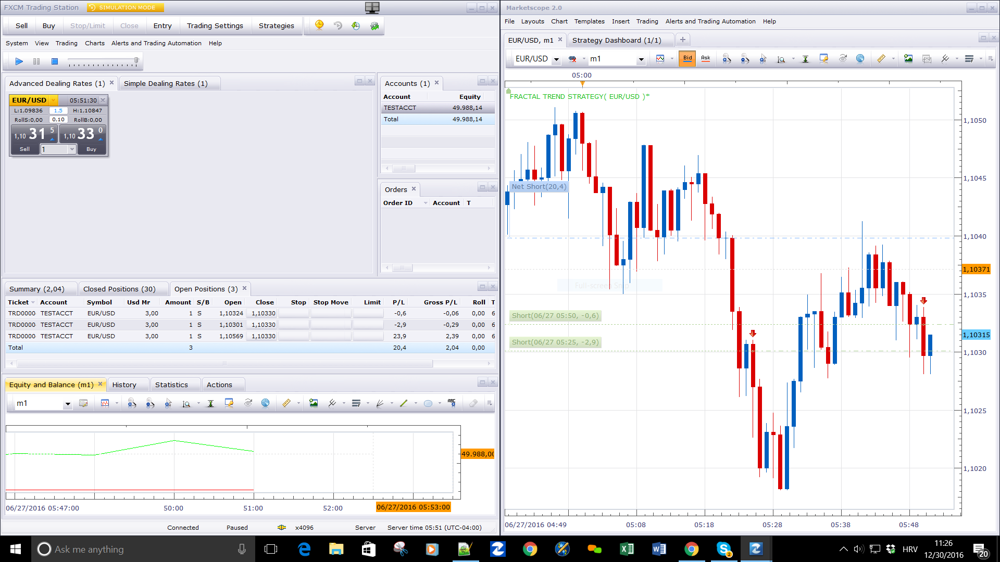

# Fractal Trend Strategy

> Source: https://fxcodebase.com/code/viewtopic.php?f=31&t=8283  
> Forum: 31 · Topic 8283 · 15 post(s)

---

## Fractal Trend Strategy

**Apprentice** · Mon Nov 21, 2011 9:46 am

This Strategy is based on Advanced Fractal Trend Overlay indicator.
[viewtopic.php?f=17&t=724](https://fxcodebase.com/code/viewtopic.php?f=17&t=724)

Changes in trend are registered as follows.

Up Trend.
The closing price is higher than the Up fractal.
Down Trend
The closing price is lower than the Down fractal.

 [Fractal Trend Strategy.lua](files/18329/Fractal%20Trend%20Strategy.lua)

Version with breakeven.

 [Fractal Trend Strategy.lua](files/18329/Fractal%20Trend%20Strategy%20%282%29.lua)

---

## Re: Fractal Trend Strategy

**Apprentice** · Sat Dec 03, 2016 7:19 am

Bump up.

---

## Re: Fractal Trend Strategy

**Nather** · Wed Dec 28, 2016 10:41 pm

Hi Apprentice,

I have spent weeks testing this strategy in the backtesting program. Got happy with its performance and tried on a demo and real live account and it doesn't initiate trades. I have tried in all time frames and allow trading is set to yes

Regards Nather

---

## Re: Fractal Trend Strategy

**Apprentice** · Fri Dec 30, 2016 6:13 am

Tested in simulator.
Can you share your settings.

---

## Re: Fractal Trend Strategy

**Nather** · Fri Dec 30, 2016 8:42 am

I tried number of fractals 29, direct and reverse on multiple 1min and 5min charts and they traded correctly.

I wish to use 29 reverse 1 hour on eurusd and no trades are starting. I am testing multiple fractal settings both direct and reverse on a 1 hour time frame but nothing yet they take a while for crosses. The original 1h eurusd has been running for 3 days no trades.

---

## Re: Fractal Trend Strategy

**Apprentice** · Sat Dec 31, 2016 8:47 am

Try it now.

---

## Re: Fractal Trend Strategy

**Avignon** · Mon Apr 10, 2017 4:55 pm

The strategy would not need an upgrade?

Notifications that do not match anything and no order that triggers.

---

## Re: Fractal Trend Strategy

**MC. Trend Trader** · Tue Mar 05, 2019 12:46 pm

Hallo,

Can you add "Execution" option (Live/End of Turn)?
 "Exit Execution" option (Live/End of Turn)
Like the AFBSR Breakout Alert.lua indicator

Best regards

---

## Re: Fractal Trend Strategy

**Apprentice** · Mon Apr 01, 2019 10:23 am

Your request is added to the development list under Id Number 4580

---

## Re: Fractal Trend Strategy

**Apprentice** · Thu Apr 11, 2019 2:27 pm

Try it now.

---

## Re: Fractal Trend Strategy

**chai88888** · Tue Aug 04, 2020 9:03 pm

hi there can you add a breakeven parameter for this

after using it ive notice that does this indicator repaint?

beacuse sometimes theres a delay in the execution of the trade

there already a color change of the candle and it does not exit properly

even on live and end of turn

thanks

---

## Re: Fractal Trend Strategy

**Apprentice** · Fri Aug 07, 2020 4:51 am

Your request is added to the development list.
Development reference 1855.

---

## Re: Fractal Trend Strategy

**Apprentice** · Mon Aug 10, 2020 8:15 am

Version with breakeven added.

---

## Re: Fractal Trend Strategy

**chai88888** · Tue Aug 11, 2020 3:26 am

position limit dosent work

it taking multiple trades

---

## Re: Fractal Trend Strategy

**Apprentice** · Thu Aug 13, 2020 6:21 am

Which version?
Was the "Use Position limit" set to yes?
