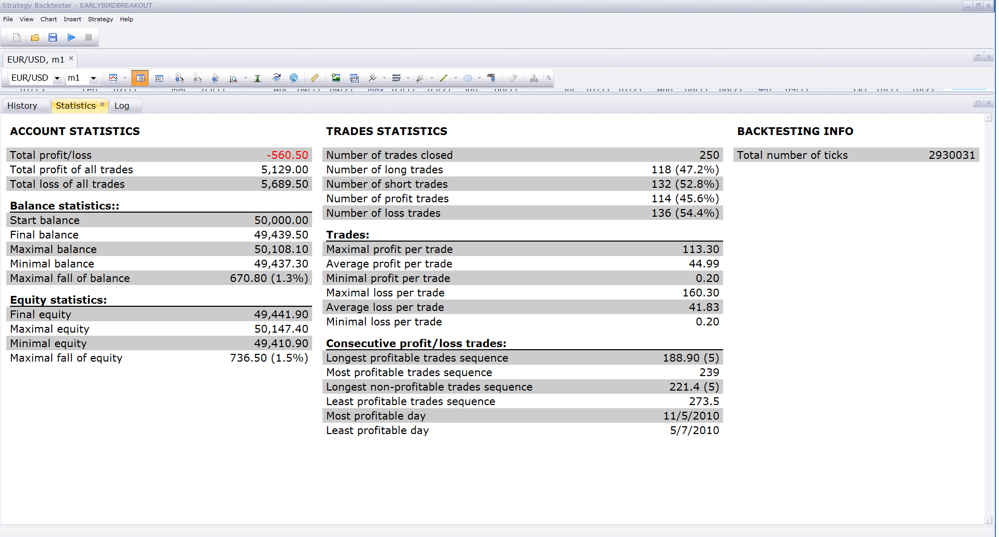

# Fred Tam F1 Indicator Strategy

> Source: https://fxcodebase.com/code/viewtopic.php?f=31&t=3972  
> Forum: 31 · Topic 3972 · 29 post(s)

---

## Fred Tam F1 Indicator Strategy

**Apprentice** · Wed Apr 20, 2011 5:06 am

The strategy was written according to the indicator with the same name.
[viewtopic.php?f=17&t=3971](https://fxcodebase.com/code/viewtopic.php?f=17&t=3971)

1) Buy Signal
If recent closing price is higher than the recent days close max
( eg. close(0) > Max(close(i) )
2) Sell ​​Signal
If recent closing price is lower than the recent days close min
 ( eg. close(0) < Min(close(i) )

I have added a choice between two types of signals.
Close and High / Low Data stream as a source for the signal.

I have noticed that High / Low option offered less noise.

 [Fred Tam F1 Indicator Strategy.lua](files/9854/Fred%20Tam%20F1%20Indicator%20Strategy.lua)

The Strategy was revised and updated on January 21, 2019.

---

## Re: Fred Tam F1 Indicator Strategy

**Apprentice** · Wed Apr 20, 2011 8:36 am

Separate parameters for the Buy and Sell period added.

---

## Re: Fred Tam F1 Indicator Strategy

**nowires** · Wed Apr 20, 2011 11:03 am

I am not able to load this strategy into marketscope 2.0

I go to add strategy, strategy properties, changed allow strategy to trade to : YES
I get the following message : ( String "Fred Tam F1 Indicator Strategy.lua ")
145: attemp to index global 'source' ( a nil value )

thanks,
Nowires

---

## Re: Fred Tam F1 Indicator Strategy

**Apprentice** · Wed Apr 20, 2011 11:24 am

Sorry for that, During the last Update,
By mistakenly i have uploaded in development version.

---

## Re: Fred Tam F1 Indicator Strategy

**Blackcat2** · Wed Apr 20, 2011 10:51 pm

Looks interesting, testing it at the moment..

---

## Re: Fred Tam F1 Indicator Strategy

**nowires** · Thu Apr 21, 2011 7:16 pm

Thanks, the Strategy loaded this time. I have changed the " Allow strategy to trade to : YES
and when a signal came it didnt do anything. Is this supposed to auto trade by changing this to YES ? Maybe I misunderstand what " allow strategy to trade means.

Thanks,
Nowires

---

## Re: Fred Tam F1 Indicator Strategy

**Apprentice** · Fri Apr 22, 2011 12:20 am

You are well understood by this option.
Today I re-tested this strategy,
everything works as expected.

Can you tell me more.
What Time Frame or currency pair you are using.

---

## Re: Fred Tam F1 Indicator Strategy

**Apprentice** · Sun Apr 24, 2011 12:45 pm

Update

---

## Re: Fred Tam F1 Indicator Strategy

**RJH501** · Tue Jul 19, 2011 9:37 am

Hi,

Would you please compare the F1 Strategy AGAINST Showsignal with F1 Stategy applied.

It appears that the Strategy identifies a signal long before the Showsignal F1 appears on the chart.

Is this normal?

Regards

Richard

---

## Re: Fred Tam F1 Indicator Strategy

**RJH501** · Thu Aug 25, 2011 5:00 am

Hello Apprentice,

The strategy is not setting the LIMIT and STOPS when a trade is made.

When you get time please review.

Thanks much!

Richard

---

## Re: Fred Tam F1 Indicator Strategy

**soloman** · Fri Sep 02, 2011 4:34 pm

Could you translate this lua file to fxd file, so that it can be imported and used in strategy trader?

---

## Re: Fred Tam F1 Indicator Strategy

**pierren** · Tue Sep 27, 2011 12:41 am

it would be very useful if we have it in fxd version, as the ST (Strategy Trader) platform is more flexible for testing & finetuning than Marketscope.

---

## Re: Fred Tam F1 Indicator Strategy

**sunshine** · Tue Sep 27, 2011 5:46 am

We develop most indicators and strategies for Marketscope for free.
As for development for Strategy Trader, please contact our [premium development service](https://fxcodebase.com/code/viewtopic.php?f=32&t=2372).
Besides I'd recommend you to check the beta version of FX Trading Station/Marketscope which now provides powerful tools for backtesting and optimizing.

 

 

 

You can download the beta version here:
[viewtopic.php?f=30&t=6490](https://fxcodebase.com/code/viewtopic.php?f=30&t=6490)
Please note that the beta version is installed in addition to the production version of the FX Trading Station. It does not replace the production version, so both version can be used simultaneously, in the same time.

---

## Re: Fred Tam F1 Indicator Strategy

**Apprentice** · Fri Dec 02, 2016 7:56 am

Bump up.

---

## Re: Fred Tam F1 Indicator Strategy

**jaricarr** · Thu Nov 16, 2017 4:28 pm

Hi Apprentice, can you please add options for end of turn and live execution.

---

## Re: Fred Tam F1 Indicator Strategy

**Apprentice** · Tue Nov 21, 2017 7:01 am

Your request is added to the development list under Id Number 3955

---

## Re: Fred Tam F1 Indicator Strategy

**Apprentice** · Wed Nov 22, 2017 5:13 am

Try this version.

 [Fred Tam F1 Indicator Strategy.lua](files/116163/Fred%20Tam%20F1%20Indicator%20Strategy.lua)

---

## Re: Fred Tam F1 Indicator Strategy

**roms54** · Mon Mar 30, 2020 6:36 am

Hello,
I can't start orders automatically and backtest the strategy

---

## Re: Fred Tam F1 Indicator Strategy

**Apprentice** · Tue Mar 31, 2020 5:31 am

Your request is added to the development list.
Development reference 978.

---

## Re: Fred Tam F1 Indicator Strategy

**Apprentice** · Tue Mar 31, 2020 6:34 am

[Fred Tam F1 Indicator Strategy.lua](files/132414/Fred%20Tam%20F1%20Indicator%20Strategy.lua)

Try this version.

---

## Re: Fred Tam F1 Indicator Strategy

**roms54** · Tue Mar 31, 2020 11:18 am

Hello,

Thanks the backtester works , it may be possible to base it on the indicator Fred Tam F1 Indicator, and not on Fred Tam F1 Indicator with alert the signals are not good.

---

## Re: Fred Tam F1 Indicator Strategy

**Apprentice** · Wed Apr 01, 2020 6:25 am

Your request is added to the development list.
Development reference 987.

---

## Re: Fred Tam F1 Indicator Strategy

**Apprentice** · Wed Apr 01, 2020 8:21 am

Fred Tam F1 Indicator doesn't have required data for signal.
Can you provide rules used?

---

## Re: Fred Tam F1 Indicator Strategy

**roms54** · Wed Apr 01, 2020 10:01 am

the ideal would be a trigger identical to the Fred tam indicator, see attached photos.

---

## Re: Fred Tam F1 Indicator Strategy

**roms54** · Sat Apr 04, 2020 6:12 am

Hello,

are you missing some info?

---

## Re: Fred Tam F1 Indicator Strategy

**Apprentice** · Wed Apr 08, 2020 4:58 am

It does exactly that. Only there is no trades. You can filter them using the position cap feature

---

## Re: Fred Tam F1 Indicator Strategy

**khanatd** · Mon Sep 29, 2025 10:16 pm

plz mt4 version too with arrows,thanks

---

## Re: Fred Tam F1 Indicator Strategy

**Apprentice** · Wed Oct 01, 2025 6:08 am

We have added your request to the development list.
Development reference 614

---

## Re: Fred Tam F1 Indicator Strategy

**Apprentice** · Mon Oct 20, 2025 6:41 pm

[Fred_Tam_F1_Indicator_with_Alert_V2.mq4](files/160937/Fred_Tam_F1_Indicator_with_Alert_V2.mq4)

Try this version.
