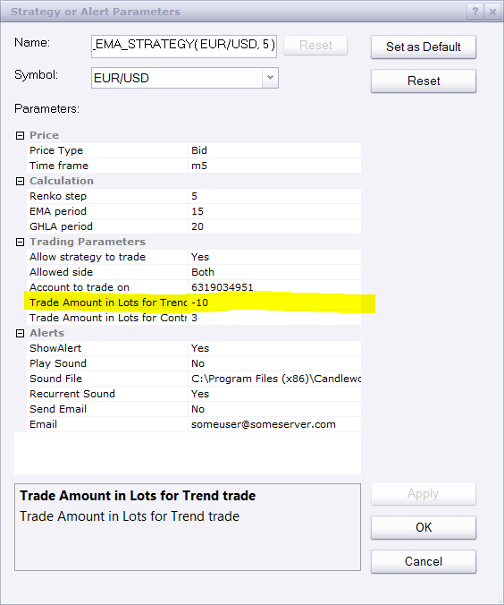

# GHLA EMA Strategy

> Source: https://fxcodebase.com/code/viewtopic.php?f=31&t=62341  
> Forum: 31 · Topic 62341 · 24 post(s)

---

## GHLA EMA Strategy

**Alexander.Gettinger** · Mon Jun 22, 2015 3:43 pm

The strategy based on Renko charts ([http://www.fxcodebase.com/code/viewtopi ... 48&p=94660](http://www.fxcodebase.com/code/viewtopic.php?f=17&t=60748&p=94660)).

The Strategy uses 2 indicators,
a) A moving Average as a trend filter.
b) Gann HiLow Activator ([http://www.fxcodebase.com/code/viewtopic.php?f=17&t=227](http://www.fxcodebase.com/code/viewtopic.php?f=17&t=227)) in a stair based format, as a trigger for the trades.

This Strategy will always be in the market and perform 2 types of trades,
a) With Trent (Number of lots is set by the user)
b) Contra Trend (Number of lots is set by the user)

With Trend
- price is above the MA and crosses upward the GHLA, then close all short positions and go long [Amount1] lots.

-price is below the MA and crosses downward the GHLA, then close all long positions and go short [Amount1] lots.

Contra Trend
-If price is above the MA and crosses downwards the GHLA then close all long positions and go short X lots, if the price continues downwards and crosses the MA go long [Amount2] lots.

-If price is below the MA and crosses upwards the GHLA then close all sort positions and go long X lots, if the price continues upwards and crosses the MA go long [Amount2] lots.

Download:

 [GHLA_EMA_Strategy.lua](files/101065/GHLA_EMA_Strategy.lua)

For this strategy must be installed New Renko Chart ([http://www.fxcodebase.com/code/viewtopi ... 48&p=94660](http://www.fxcodebase.com/code/viewtopic.php?f=17&t=60748&p=94660)).

The Strategy was revised and updated on December 18, 2018.

---

## Re: GHLA EMA Strategy

**mulligan** · Tue Jun 23, 2015 5:09 am

First, thanks for creating a strategy for Renko. I loaded the strategy and received the following message when it was apparently going to signal. GHLA_EMA_Strategy.lua:205:attempt to perform arithmetic on up value "Amount 1" [a nil value].

---

## Re: GHLA EMA Strategy

**fxcyberman** · Fri Jun 26, 2015 10:43 pm

The first trade (GER30) is entered normally with default parameters, but the second trade is not entered with the following error, " Open order failed The Quantity must be a positive integer number.". Why ? and Would you please help me to fix it ?

---

## Re: GHLA EMA Strategy

**fxcyberman** · Fri Jun 26, 2015 10:50 pm

In addition to the above problem, I also can't find the parameter for X lot in the interface of strategy. Where can I setup the value for X lots ?

---

## Re: GHLA EMA Strategy

**Apprentice** · Tue Jun 30, 2015 3:29 am

Negative lot position simply is not supported.

---

## Re: GHLA EMA Strategy

**fxcyberman** · Tue Jun 30, 2015 3:54 am

hi, I have double checked with my setting for strategy. which is a positive number (10).
I used the default setting only.

---

## Re: GHLA EMA Strategy

**fxcyberman** · Thu Jul 02, 2015 5:55 am

Is it possible to add mandatory close and trading time control please ?
Thanks

---

## Re: GHLA EMA Strategy

**jaricarr** · Thu May 19, 2016 9:05 pm

Hi Apprentice,

Is it possible to please add the option to choose different types of moving averages ?

That way the strategy parameters can be match with the indicator settings ?

Many thanks,
Jari

---

## Re: GHLA EMA Strategy

**Apprentice** · Fri May 20, 2016 3:04 am

Try it now.

---

## Re: GHLA EMA Strategy

**jaricarr** · Tue Jun 07, 2016 10:02 pm

Hi Apprentice,

The strategy does not have the option of selecting different MA method for the GHLA line, like the indicator does.

Thanks,
JariCarr

---

## Re: GHLA EMA Strategy

**Apprentice** · Tue Jun 14, 2016 2:59 am

Strategy uses an internal logic.
Mention indicator is not used in calculation of.

---

## Re: GHLA EMA Strategy

**jaricarr** · Thu Jun 16, 2016 7:37 pm

HI Apprentive,

Thank you for replying.

Can you add Limit and stop loss parameters to this strategy please.

Many thanks,
JariCarr

---

## Re: GHLA EMA Strategy

**Apprentice** · Sun Jun 19, 2016 4:14 am

Your request is added to the development list,
Under Bugzilla Id Number 3550

Bugzilla is internal forum.
If someone is interested to do this task please contact me.

---

## Re: GHLA EMA Strategy

**jaricarr** · Thu Jun 30, 2016 6:09 pm

Any one please add Limit and stop loss parameters

Thanks
JariCarr

---

## Re: GHLA EMA Strategy

**Apprentice** · Sun Jul 03, 2016 8:45 am

Try it now.

---

## Re: GHLA EMA Strategy

**jaricarr** · Tue Jul 05, 2016 12:07 am

Hi,

Thanks for adding the parameters.

Its producing this error msg...

C:/Program Files (x86)/Candleworks/FXTS2/Strategies/Custom/RENKO GHLA EMA Strategy2.lua:276: attempt to index upvalue 'Source' (a nil value)

Thanks
JariCarr

---

## Re: GHLA EMA Strategy

**Apprentice** · Tue Jul 05, 2016 2:45 pm

Fixed.
Will not work within strategy backtester.

---

## Re: GHLA EMA Strategy

**jaricarr** · Tue Jul 05, 2016 9:00 pm

Hi Apprentice,

This is happening when attempting to use the strategy in live trading.

Please see screenshot attached.

Thanks,
JC

---

## Re: GHLA EMA Strategy

**Apprentice** · Wed Jul 06, 2016 2:32 am

Refresh your browser/ Redownload.
This bug has been fixed.

---

## Re: GHLA EMA Strategy

**jaricarr** · Thu Jul 07, 2016 9:23 pm

Hi,
Looks like what is causing this error is when the strategy is set to "Live".
thanks

---

## Re: GHLA EMA Strategy

**jaricarr** · Tue Jul 12, 2016 7:50 pm

Hi Apprentice,

After you added the limit and stop parameters, the strategy hasn't made any trades.

Allow strategy to trade is set to "yes" of course.

Thanks,
JC

---

## Re: GHLA EMA Strategy

**Apprentice** · Wed Jul 13, 2016 6:03 am

Can you test it now.
I do not have demo account.
If this does not work will install one.

---

## Re: GHLA EMA Strategy

**jaricarr** · Wed Jul 20, 2016 3:53 pm

Hi,

The strategy hasnt made any trades yet.

Thanks
JC

---

## Re: GHLA EMA Strategy

**Apprentice** · Sat Dec 17, 2016 7:46 am

Strategy was revised and updated.
