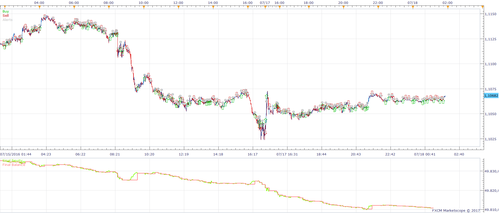
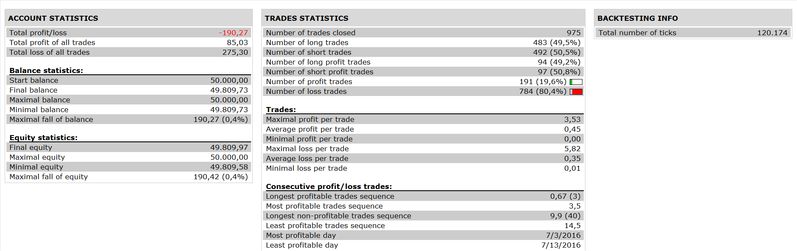

# GMACD Strategy

> Source: https://fxcodebase.com/code/viewtopic.php?f=31&t=64271  
> Forum: 31 · Topic 64271 · 1 post(s)

---

## GMACD Strategy

**Apprentice** · Sat Jan 07, 2017 8:24 am

 

Open Long
Histogram > 0
Histogram / Signal Line Cross Over
Open Short
Histogram < 0
Histogram / Signal Line Cross Under

Exit (Optinal)
Exit Long
Histogram / Signal Line Cross Under
Exit Short
Histogram / Signal Line Cross Over

 [GMACD Strategy.lua](files/110381/GMACD%20Strategy.lua)

GMACD.lua is available here.
[viewtopic.php?f=17&t=358&start=30](https://fxcodebase.com/code/viewtopic.php?f=17&t=358&start=30)

The Strategy was revised and updated on January 19, 2019.
