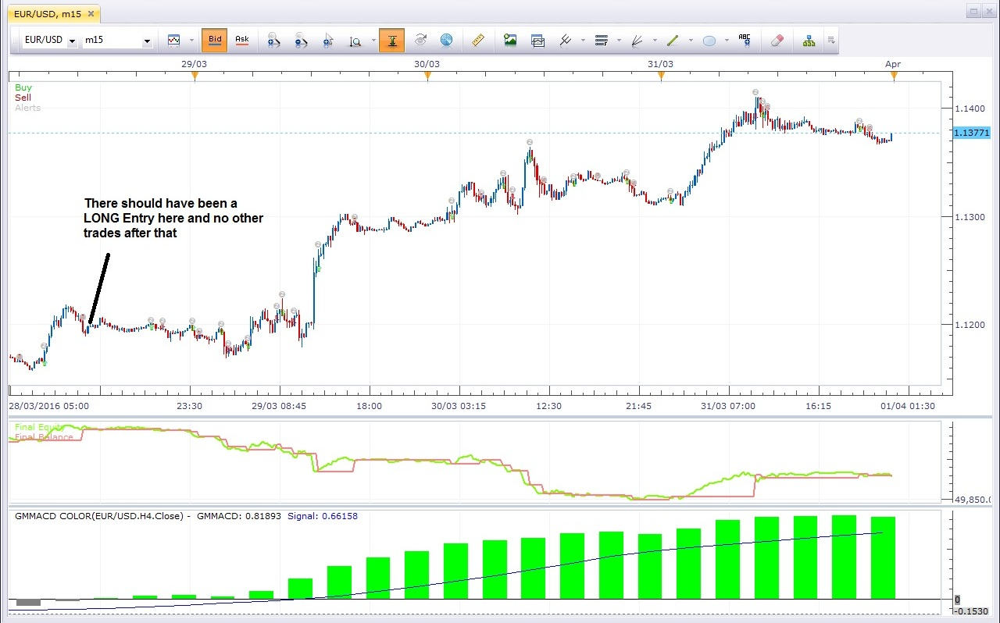

# GMMACD Color Strategy

> Source: https://fxcodebase.com/code/viewtopic.php?f=31&t=63349  
> Forum: 31 · Topic 63349 · 7 post(s)

---

## GMMACD Color Strategy

**Apprentice** · Wed Apr 06, 2016 1:10 pm

Long Entry:
1) GMMACD crossover zero line
2) GMMACD crossover signal line

Short Entry:
1) GMMACD crosunder zero line
2) GMMACD crossesover signal line

Long Exit:
1) GMMACD crossunder zero line
2) GMMACD crossunder signal line

Short Exit:
1) GMMACD crossover zero line
2) GMMACD crossover signal line

Position Size:
For 1) 1 - 2% of Equity
For 2) 2 - 5% of Equity

 [GMMACD Color Strategy.lua](files/105676/GMMACD%20Color%20Strategy.lua)

Based on GMMACD Color & GMMA.
[viewtopic.php?f=17&t=412&start=40](https://fxcodebase.com/code/viewtopic.php?f=17&t=412&start=40)
[viewtopic.php?f=17&t=412](https://fxcodebase.com/code/viewtopic.php?f=17&t=412)

The Strategy was revised and updated on January 19, 2019.

---

## Re: GMMACD Color Strategy

**cpc_cs** · Tue Apr 12, 2016 9:26 pm

Dear Apprentice,

Thank you very much. I was backtesting the strategy - it is generating far too many signals - I am not sure why (see picture below):

 

*Picture*

Also, "Close on Opposite" should not apply here as the entry and exit conditions are pre-defined. However, when I choose "No" for "Close on Opposite" there is only one entry and it does not get closed.

When you have time, can you check please?

Thanks and Regards

S. Joseph

---

## Re: GMMACD Color Strategy

**Apprentice** · Fri Dec 16, 2016 6:00 am

Strategy was revised and updated.

---

## Re: GMMACD Color Strategy

**jaricarr** · Fri Dec 30, 2016 12:26 am

Hi Apprentice,

This strategy is not making any trades. Tried to optimize all parameters.

see screenshot.

---

## Re: GMMACD Color Strategy

**Apprentice** · Fri Dec 30, 2016 5:23 am

Try it now.

---

## Re: GMMACD Color Strategy

**jaricarr** · Tue Jan 17, 2017 9:35 pm

Hi Apprentice,

The results are the same, no trades were made.

---

## Re: GMMACD Color Strategy

**Apprentice** · Mon Jan 23, 2017 7:03 am

It works well for us. Maybe you selected too narrow range.
