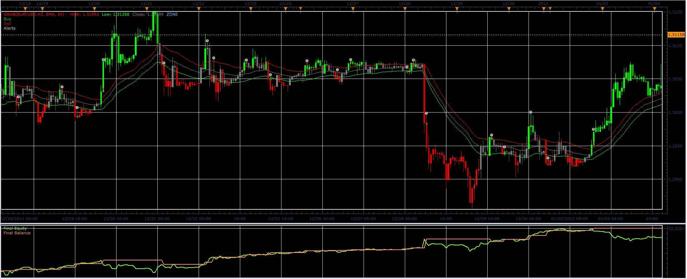
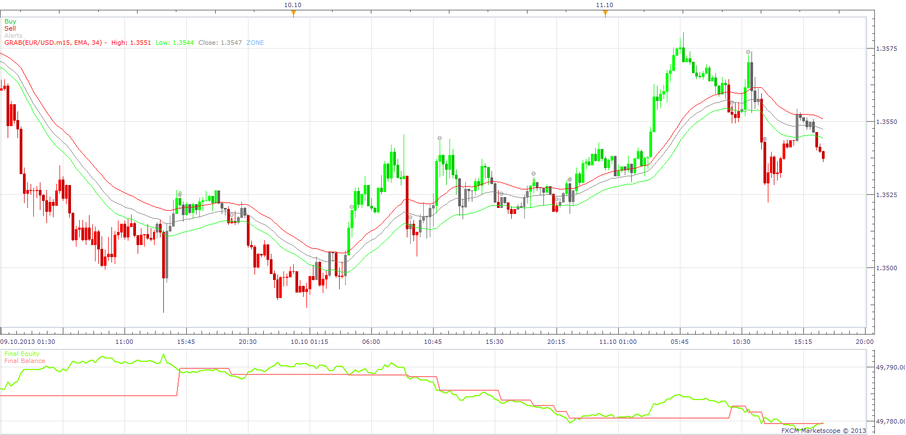
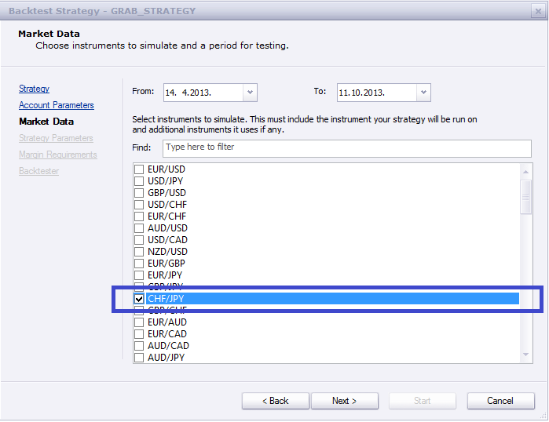
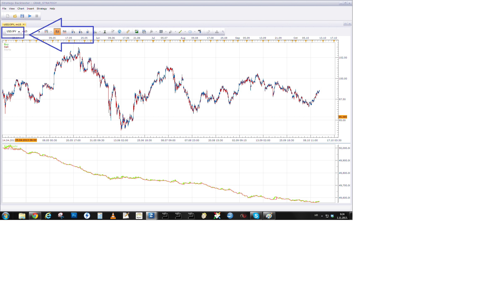
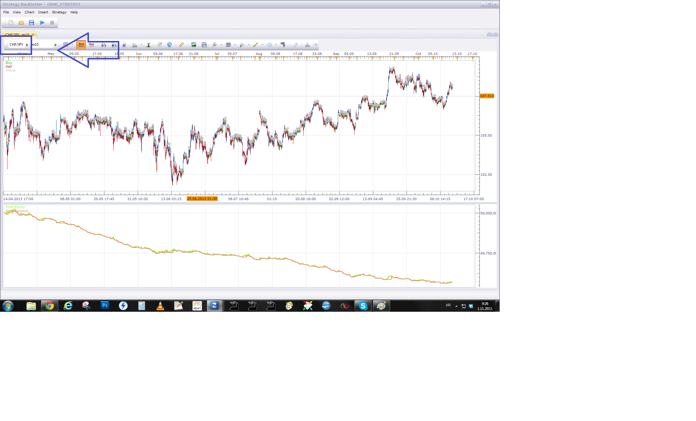
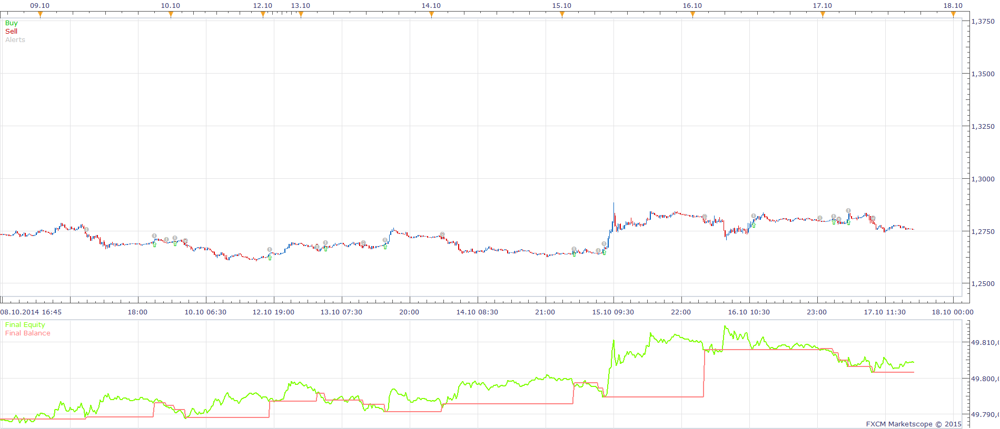

# GRAB strategy

> Source: https://fxcodebase.com/code/viewtopic.php?f=31&t=15509  
> Forum: 31 · Topic 15509 · 50 post(s)

---

## GRAB strategy

**Alexander.Gettinger** · Mon Apr 02, 2012 10:16 am

Strategy based on GRAB indicator [viewtopic.php?f=17&t=4893&p=12152](https://fxcodebase.com/code/viewtopic.php?f=17&t=4893&p=12152)

 

Open Long
Price > MA of High
Open Short
Price < MA of Low

 [GRAB_Strategy.lua](files/29215/GRAB_Strategy.lua)

Open Long
Price > (MA of High+Delta)
Open Short
Price < (MA of Low-Delta)

 [GRAB_Strategy with Delta Filter.lua](files/29215/GRAB_Strategy%20with%20Delta%20Filter.lua)

For this strategy must be installed GRAB indicator([viewtopic.php?f=17&t=4893&p=12152](https://fxcodebase.com/code/viewtopic.php?f=17&t=4893&p=12152)).

---

## Re: GRAB strategy

**rtsayers** · Wed Oct 16, 2013 7:13 pm

Apprentice the strategy is not triggering I have all the required indicators GRAB indicator downloaded and strategy downloaded and still not working? It worked before the updates not sure what happened?

Also when you have time could please put a pop up alert for the grab with alert indicator thanks!

---

## Re: GRAB strategy

**Apprentice** · Thu Oct 17, 2013 3:41 am

My Backtester would not agree.
Did you set Allow strategy to trade to Yes.
If the problem persists, please send both indicator and strategy to my email.

---

## Re: GRAB strategy

**rtsayers** · Mon Oct 21, 2013 12:37 pm

Thanks it's working I had to many insistence's running.

---

## Re: GRAB strategy

**Tahomahome** · Wed Oct 23, 2013 12:50 pm

I was wondering if I could have the MT4 version

Thanks a bunch!!

---

## Re: GRAB strategy

**rtsayers** · Wed Oct 23, 2013 2:15 pm

Hi Apprentice

Something weird is happening the CHF/JPY pair is not triggering?

Is it possible to have mutliple strategy insistence for the same pair?

Thanks

---

## Re: GRAB strategy

**Apprentice** · Thu Oct 24, 2013 2:01 am

I have add Tahomahome, to Alex task list.

As multiple istance, of same strategy on sigle pair.
It is possible but not recommended.
Since strategy, as now, will be competing for all open positions.

---

## Re: GRAB strategy

**rtsayers** · Tue Oct 29, 2013 11:54 am

Hi Apprentice

I am not getting triggered in on the CHF/JPY

I am also not able to run two of the same strategies with different parameters on the same currency pair with my UK account??

Thanks

---

## Re: GRAB strategy

**Apprentice** · Wed Oct 30, 2013 12:13 pm

Will investigate. As presented do not see the reason for this behavior.
Neither grab indicator or strategy are sensitive to currency pair selection.

---

## Re: GRAB strategy

**rtsayers** · Thu Oct 31, 2013 11:32 am

Also I had 2 currency pairs did not trigger last night I don't think this strategy is working?
USD/DKK and AUD/USD??

Please look into it for me thanks!

---

## Re: GRAB strategy

**Apprentice** · Thu Oct 31, 2013 11:40 am

We have found that this TS bug.
Unfortunately it can be fixed in the next version of TS.
U can find circuitous to this problem.
By making sure that your strategy is using appropriate data source.
Switched instrument in both, chart window and strategy parameters.

---

## Re: GRAB strategy

**rtsayers** · Thu Oct 31, 2013 6:08 pm

I am sorry but how to do this please explain I don't understand?
Please explain step by step so I can correct this please thanks you!

---

## Re: GRAB strategy

**Apprentice** · Fri Nov 01, 2013 3:31 am

CFH / JPY was selected during selection of backtesting parameters

 

Unfortunately strategy lands on USD / JPY

 

After correction, you should have expected trades.

---

## Re: GRAB strategy

**rtsayers** · Fri Nov 01, 2013 11:25 am

What does this do??

I don't know what this does your telling me how to do?? When I bring Eur/usd it shows up on the backtester but it doesn't trigger??? Same Aud/usd shows up on the backtester but doesn't trigger now almost all of my pairs don't trigger on this strategy????

I am getting very frustrated!!

Now almost all of the currency pairs are not triggering on this strategy??

---

## Re: GRAB strategy

**rtsayers** · Fri Nov 01, 2013 11:31 am

I am not talking about backtesting I am talking about triggering in the live trades that I have set up!

---

## Re: GRAB strategy

**Apprentice** · Fri Nov 01, 2013 1:49 pm

Try updated version.
As u can see i have lost 4.4 pip on this EUR / USD trade.

---

## Re: GRAB strategy

**rtsayers** · Sun Nov 03, 2013 6:25 pm

Hi Apprentice

The smaller time frames are triggering sometimes not all the time?

The larger time-frames like 4hour is still not triggering the trades Tonight I just had 2 trades failed?

I loaded the update strategy no improvement?

Do reinstall the platform??

Thanks

---

## Re: GRAB strategy

**Tahomahome** · Wed Nov 06, 2013 12:47 pm

Hi

I have tried this strategy but it doesn't work properly? Triggers sometimes then not at all??

It doesn't trigger entries and does not work like stated above on higher time frames??

Please fix thanks!

---

## Re: GRAB strategy

**rtsayers** · Thu Nov 07, 2013 1:09 pm

It maybe because of the coding logic is looking at all the currency pairs not individual trades so not triggering properly but i don't know enough about coding!

Maybe someone could chime in to help?

---

## Re: GRAB strategy

**Tahomahome** · Tue Nov 12, 2013 11:56 am

Please look into strategy not working thanks! All the people above and myself still waiting for correction??

---

## Re: GRAB strategy

**JOKER83** · Mon Dec 29, 2014 9:39 am

HI GRAB STRATEGIE MAKE NOT TRADES OPEN I HAVE TRADE ON BUT STRATEGYE MAKE NUTHING

---

## Re: GRAB strategy

**Apprentice** · Fri Jan 02, 2015 3:14 am

As you can see, with the default settings, the strategy opens trades in Backtester.
Please set Allow strategy to trade to Yes.

---

## Re: GRAB strategy

**fab.111** · Mon Apr 18, 2016 3:42 pm

Hi Apprentice,

great work !!!

Is it possible to add start and stop Time and allow multiple trades in the same time ?

Thanks a lot

Fab

---

## Re: GRAB strategy

**Apprentice** · Wed Apr 20, 2016 4:53 am

Major Update.
Stop Time and allow multiple trades in the same time Added.

---

## Re: GRAB strategy

**fab.111** · Fri Apr 29, 2016 6:37 am

Many thanks Apprentice.

---

## Re: GRAB strategy

**fab.111** · Fri Apr 29, 2016 8:54 am

Hi Apprentice,

Do you think it is possible to improve strategy by 2 updates regarding entries and stops.

Entries :
When the closing price is above the EMA HIGH, I‘d like to go long / short (not at the closing price) but at the EMA HIGH / LOW value (with distance of 2 pips).

Stops :

I am closing trades when EMA HIGH/ LOW is touched (not closing price below or above EMA High / Low)

Thanks a lot

Fab

---

## Re: GRAB strategy

**fab.111** · Sat Apr 30, 2016 5:00 am

Hi Apprentice,

i am sorry, my request wasn't clear.

Entries :
When the closing price is above / below the EMA HIGH / LOW, I‘d like to go long / short (not at the closing price) but at the EMA HIGH / LOW value (with distance of 2 pips).

Thanks a lot

Fab

---

## Re: GRAB strategy

**Apprentice** · Sun May 01, 2016 9:14 am

GRAB_Strategy with Delta Filter.lua added.

---

## Re: GRAB strategy

**fab.111** · Sun May 01, 2016 11:32 am

Hi Apprentice,

I got below eror message

object is broken or symbol is used instead of ':'

Thanks

Fab

---

## Re: GRAB strategy

**Apprentice** · Mon May 02, 2016 3:14 am

Fixed.

---

## Re: GRAB strategy

**fab.111** · Mon May 02, 2016 4:47 am

Many thanks.

Do you think it's possible to upgrade GRAB strategy by my own entries and stops ?
It's a mix between GRAb and MA PRICE touch

Thanks a lot.

Fab

---

## Re: GRAB strategy

**Apprentice** · Mon May 09, 2016 4:43 am

Sure.
Can you write a complete pseudo code.
What is the difference between Entry and Signal?

---

## Re: GRAB strategy

**fab.111** · Mon May 09, 2016 2:04 pm

Here it is

The signal is an opportunity to trade but i think price is to high to open directly a trade. Market made often a pullback to the level of the EMA HIGH. That’s why, i like to buy at this level and not at the closing price like GRAB strategy does.

1.	If source.close[period] > Indicator.high[period] AND source.close[period-1]> Indicator.low[period-1] then
	we have a BUY signal but not a trade yet

o	create market order when price touched indicator.high[period-1] + delta in pips

	price = indicator.high[period-1] + delta in pips
	With Stop = indicator.low [period-1] + delta in pips
	With Limit = round up to the last digit + « x »pips (ie : price 150.12….round up to 150.20 + « x »pips) (I am not sure the rounding up is possible ??)

	Signal is expired and cancelled after « x » candle(s). (if price is still above EMA34 HIGH, we have « x » candles to touch indicator.high[period-1] + delta in pips)

	To have another signal, price should be closed below EMA HIGH AND above EMA LOW…and then wait until price is closing above EMA 34 HIGH.

2.	If source.close[period] < Indicator.low[period] AND source.close[period-1]< Indicator.high[period-1] then
	we have a SELL signal but not a trade yet.

o	create market order when price touched indicator.low[period-1] + delta in pips

	price = indicator.low[period-1] + delta in pips
	With Stop = indicator.high [period-1] + delta in pips
	With Limit = round up to the last digit + « x »pips (ie : price 150.32….round up to 150.30 + « x »pips)

	Signal is expired and cancelled after « x » candle(s). (if price is still below EMA34 LOW, we have « x » candles to touch indicator.low[period-1] + delta in pips)

	To have another signal, price should be closed above EMA LOW AND below EMA HIGH…and then wait until price is closing below EMA 34 LOW.

3.	Can trade multiple trades in the same time

4. If position is opened :
	If buying position :
	Stop : update by following indicator.low + delta in pips
If selling position :
	Stop : update by following indicator.high + delta in pips

---

## Re: GRAB strategy

**Apprentice** · Tue May 17, 2016 4:55 am

Your request is added to the development list.

---

## Re: GRAB strategy

**RebeccaH** · Thu May 19, 2016 9:02 am

Could someone explain this strategy, please? I'm new to the Forum and ran across this and it has peaked my interest. I have a manual strategy that i first thought was very similar, but now I'm not so sure. If I understand what I've read correctly, this buys at the MA high and sells at the MA low, is that correct?
If so, wouldn't it be more profitable if it was just the opposite? Sells at the MA high and buys at the MA low?

On my manual strategy, I have a series of MA's running on the 4hr. If the price is running below these MA's, it is a sell environment and if it's running above, it is a buy. Therefore you don't buy if the price is below and vice versa. I refer to my MA's as a cable.
When the price runs through the cable, it generally continues it's overall trend and therefore I enter to continue the trend.
When it runs through is an entrance and I limit my entrance to 30 pip with a stop at 15.
Is there anyway I could adapt the GRAB strategy to my manual?

---

## Re: GRAB strategy

**Apprentice** · Fri May 20, 2016 3:00 am

Open Long
Price > MA of High
Open Short
Price < MA of Low

---

## Re: GRAB strategy

**fab.111** · Wed Jun 08, 2016 5:19 am

Hi Rebecca,

If so, wouldn't it be more profitable if it was just the opposite? Sells at the MA high and buys at the MA low?

I guess it dépends of the timeframe traders are using.But it could be a great possibility

---

## Re: GRAB strategy

**fab.111** · Wed Sep 28, 2016 5:56 am

Hi Apprentice,

Any news regarding coding request ?

Many thanks

Fab

---

## Re: GRAB strategy

**Apprentice** · Sun Dec 18, 2016 5:23 am

Strategy was revised and updated.

---

## Re: GRAB strategy

**fab.111** · Tue Dec 20, 2016 8:48 am

Hi Apprentice,

Thanks a lot

Therefore, I can't see new strategy. Where can I download this update ?

Fab

---

## Re: GRAB strategy

**Apprentice** · Thu Dec 22, 2016 1:37 pm

All files are updated in the original posts.

---

## Re: GRAB strategy

**fab.111** · Thu Jan 05, 2017 12:28 pm

Hi,

I can't see below request on the new strategy you made. Perhaps, it's not possible to code ?

With Stop = indicator.high [period-1] + delta in pips
With Limit = round up to the last digit + « x »pips (ie : price 150.32….round up to 150.30 + « x »pips)

Thanks a lot

Fab

---

## Re: GRAB strategy

**Apprentice** · Sun Jan 08, 2017 6:18 am

Sure, It is possible to have a Stop / Limit given by a certain price level.

---

## Re: GRAB strategy

**fab.111** · Tue Jan 10, 2017 3:59 am

Great.

Then, when i go long, is it possible

 to add stop = indicator.low (EMA 34 LOW) + delta in pips

---

## Re: GRAB strategy

**Apprentice** · Thu Jan 12, 2017 4:49 am

Your request is added to the development list, Under Id Number 3713
 If someone is interested to do this task, please contact me.

---

## Re: GRAB strategy

**PetroIV** · Tue Sep 19, 2017 1:33 am

Try attached version of strategy.

---

## Re: GRAB strategy

**aladin** · Wed Oct 11, 2017 10:45 am

Hi all !
I'm using GRAB indicator in 15 minutes chart and I love it !
I try also the strategy (delta filter)but is not clear for me, I use it in simulator mode and I don't understand how it's work.
I understand that in strategy when a bar close or positive/negative trade close automatically open a new position.
Can you please explain what these selection mine in the strategy?

Delta (in pips)
End of turn / Live
Close on opposite
Max number of positions in any direction / or in one direction
Allowed side
Type of signal / Trade
and Set Limit orders

I thought that this strategy works with the touch of one of the 3 EMA
Ex. if price touch grey line create an OCO at the price of green/red EMA
or in a up trend when price touch/bounce on green line open a buy position / vice versa in down trend when price touch/bounce on red line open a sell position.

Maybe a new idea for new strategy of GRAB indicator?

Thank in advance for explain me!

---

## Re: GRAB strategy

**Apprentice** · Thu Oct 12, 2017 4:21 am

Delta (in pips)
 price is above/under the moving averages for x pips

End of turn / Live
if the end of turn is used trade will be delayed until end of turn.

Close on opposite
If on
On Open Long Signal close any active Short trade
On Open Short Signal close any active Long trade

Max number of positions in any direction / or in one direction
Will define max number underlying strategy is allowed to open.

Allowed side
If long is selected only New long position will be allowed.
If short is selected only New short position will be allowed.

Type of signal / Trade
On Direct
On Long signal, a Long trade will be used, and vice versa for short signal.
On Reverse
On Long signal, a Short trade will be used, and vice versa for short signal.

Set Limit orders
Will define the if a limit order will be set.
A limit order is a take-profit order, when we have X pips of profit

---

## Re: GRAB strategy

**aryan116** · Fri Jul 13, 2018 11:43 am

> **Apprentice wrote:**
> Your request is added to the development list, Under Id Number 3713
> If someone is interested to do this task, please contact me.

I am interested, it looks fine. Can you please provide the indicator.
Many thanks.

---

## Re: GRAB strategy

**Alexander.Gettinger** · Fri Jan 04, 2019 5:06 pm

MQL4 version of the strategies:

 [GRAB_Strategy.mq4](files/123197/GRAB_Strategy.mq4)

 [GRAB_Strategy_With_Delta_Filter.mq4](files/123197/GRAB_Strategy_With_Delta_Filter.mq4)
