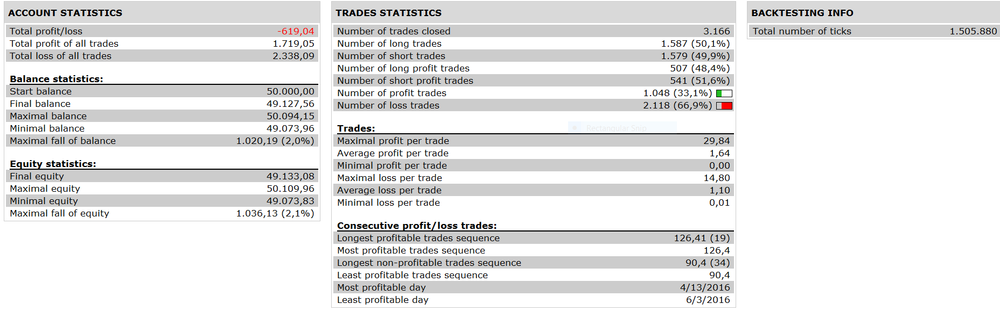

# HA EXTREME STRATEGY

> Source: https://fxcodebase.com/code/viewtopic.php?f=31&t=63961  
> Forum: 31 · Topic 63961 · 2 post(s)

---

## HA EXTREME STRATEGY

**Apprentice** · Thu Oct 13, 2016 5:14 am

 

OPEN POSITION long WHEN "END OF TURN "arrow IS UP.
OPEN POSITION short WHEN "END OF TURN" ARROW IS DOWN .

CLOSE POSITION WHEN A NEW OPPOSITE END OF TURN ARROW APPEAR.

 [HA EXTREME STRATEGY.lua](files/108568/HA%20EXTREME%20STRATEGY.lua)

The Strategy was revised and updated on January 18, 2019.

---

## Re: HA EXTREME STRATEGY

**Apprentice** · Sun Dec 18, 2016 5:25 am

Strategy was revised and updated.
