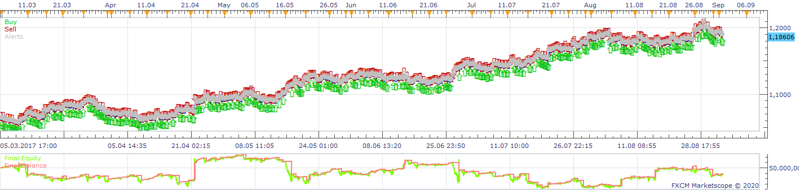
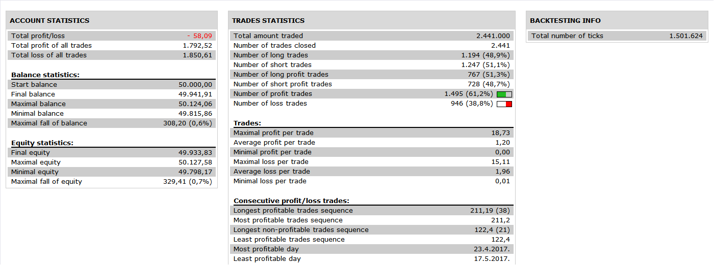
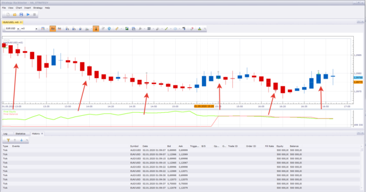

# HA_Strategy

> Source: https://fxcodebase.com/code/viewtopic.php?f=31&t=69290  
> Forum: 31 · Topic 69290 · 30 post(s)

---

## HA_Strategy

**Apprentice** · Fri Jan 03, 2020 8:05 am

 

Based on request.
[viewtopic.php?f=38&t=68676](https://fxcodebase.com/code/viewtopic.php?f=38&t=68676)

 [HA_Strategy.lua](files/130566/HA_Strategy.lua)

 [HA_Strategy_with_martingale.lua](files/130566/HA_Strategy_with_martingale.lua)

MT4/MQ4 version
[viewtopic.php?f=38&t=70401](https://fxcodebase.com/code/viewtopic.php?f=38&t=70401)

---

## Re: HA_Strategy

**Protrader** · Mon Jun 08, 2020 8:19 am

Dear,

Is it possible to modify this code ?

When one position is closed, recalculate if the conditions are always valid and open a new position on the next candle. Picture explains better.

Thank you.

---

## Re: HA_Strategy

**Protrader** · Tue Jun 16, 2020 2:59 pm

Dear,

Is the strategy was modified by your team Apprentice with the Yolerap's modifications ?
This could be very nice !

Thank you,

---

## Re: HA_Strategy

**Apprentice** · Tue Jun 16, 2020 6:53 pm

Modifications are added.

---

## Re: HA_Strategy

**yolerap** · Wed Jun 17, 2020 1:02 pm

Thank you but it doesn't work whilst the parameters for strategy are good ( Re-download the latest version, Based on HA, no MVA filter, Direct/End of turn, ... )

Please, look picture :
Line 1 : Long position is open and close -> It's ok for me
Line 2 : Long position should have been open because there are 3 green candles before ( in relation to my last post )
Line 3 : Long position should have been open also because there are 3 green candles before

Lines 4,5 and 6 show you the same problem until the line 10.

I think the strategy open a new position only after opposite consecutive candles ( circled ).

For a variant and for you, it could be easier for you to code like this :
- When one long position is opened ( because there are 2/3/... consecutive green candles ) so at each green candle, open a new long
- When one short position is opened ( because there are 2/3/... consecutive red candles ) so at each red candle, open a new short

Thank you for further modifications,

---

## Re: HA_Strategy

**Apprentice** · Wed Jun 17, 2020 3:35 pm

Your request is added to the development list.
Development reference 1509.

---

## Re: HA_Strategy

**Apprentice** · Thu Jun 18, 2020 5:25 am

I don't have any issues. It works every time

---

## Re: HA_Strategy

**yolerap** · Thu Jun 18, 2020 7:50 am

Yes it's working ; the strategy open positions one time but after your arrows, many other Red/green candles are closed and strategy doesn't open position. So once a position is open, you have to open a position for each candle of the same color as explained in the previous** post.

**When one long position is opened ( because there are 2/3/... consecutive green candles ) so at each green candle, open a new long
- When one short position is opened ( because there are 2/3/... consecutive red candles ) so at each red candle, open a new short

Thank you for further modifications,

---

## Re: HA_Strategy

**Apprentice** · Fri Jun 19, 2020 4:22 am

Can you share the parameters used?

---

## Re: HA_Strategy

**yolerap** · Fri Jun 19, 2020 7:18 am

Sure,

Here the parameters and what strategy should do.

Thank you,

---

## Re: HA_Strategy

**Apprentice** · Sun Jun 21, 2020 4:13 am

Your request is added to the development list.
Development reference 1526.

---

## Re: HA_Strategy

**Apprentice** · Wed Jun 24, 2020 5:40 am

[HA Strategy v2.lua](files/135219/HA%20Strategy%20v2.lua)

Try this version.

---

## Re: HA_Strategy

**Protrader** · Sat Jul 04, 2020 7:21 am

Hello Apprentice,

Is it possible to add a Martingale at the first version of HA_Strategy ?

Thank you,

---

## Re: HA_Strategy

**Apprentice** · Sun Jul 05, 2020 1:20 pm

Your request is added to the development list.
Development reference 1635.

---

## Re: HA_Strategy

**Apprentice** · Mon Jul 06, 2020 11:40 am

It opens two positions. One position could be closed with a loss and the second with profit.đ
Or both could be closed in a loss.

 It's unclear what logic of martingale should be in all these cases.

---

## Re: HA_Strategy

**Protrader** · Tue Jul 14, 2020 1:14 pm

The logic of the strategy with martingale is :

Just one position could be opened at a time.

When a position loses, the next position is opened with a coefficient of X (let the choice to the owner of the strategy).
Let the choice also up to a maximum coefficient

If the position is winning, do not change the position size.
If the position loses and then wins with a coefficient, the next position falls back to the starting size.

Thank you,

---

## Re: HA_Strategy

**Apprentice** · Thu Jul 16, 2020 5:54 am

HA_Strategy_with_martingale.lua added.

---

## Re: HA_Strategy

**Protrader** · Thu Jul 16, 2020 12:34 pm

Thank you for rapidity,

I have a problem, the strategy doesn't fall back to the starting lot size when the last position with the coefficient had won.

Thank you if you can modify this,

Regards,

---

## Re: HA_Strategy

**Apprentice** · Fri Jul 17, 2020 4:34 am

Your request is added to the development list.
Development reference 1716.

---

## Re: HA_Strategy

**Apprentice** · Fri Jul 17, 2020 5:17 am

I don't have such an issue. But I've found and another bug.

---

## Re: HA_Strategy

**yolerap** · Thu Aug 13, 2020 7:52 am

Hi,

Could you please create an indicator which shows the buy and sell pressure. For that, just calculate the X last buy candle and X sell candle. Let the user choose how many candle need to be calculate. Choose if the pressure is calculate by Heiken Ashi or not.

Thank you

---

## Re: HA_Strategy

**ericcky** · Fri Aug 14, 2020 5:49 am

Hi Apprentice sir,

Can we have a MT4 version of this EA?

Great work btw! and good strategy to the thread owner.

Cheers!

---

## Re: HA_Strategy

**Apprentice** · Mon Aug 17, 2020 3:47 am

Your request is added to the development list.
Development reference 1894.

> Could you please create an indicator which shows the buy and sell pressure. For that, just calculate the X last buy candle and X sell candle. Let the user choose how many candle need to be calculate. Choose if the pressure is calculate by Heiken Ashi or not.

How we will calculate it.
As MA of up candles, and MA od down candles.
As difference of two?

---

## Re: HA_Strategy

**Apprentice** · Mon Aug 17, 2020 4:33 am

Try this version.
[viewtopic.php?f=17&t=70298&p=136885#p136885](https://fxcodebase.com/code/viewtopic.php?f=17&t=70298&p=136885#p136885)

---

## Re: HA_Strategy

**ericcky** · Thu Sep 03, 2020 9:24 pm

Hi Mr. Apprentice and team,

Can this be made to an EA?

Thank you for your help

---

## Re: HA_Strategy

**Apprentice** · Fri Sep 04, 2020 1:58 am

Your request is added to the development list.
Development reference 1973.

---

## Re: HA_Strategy

**Apprentice** · Tue Sep 08, 2020 4:06 am

MT4/MQ4 version
[viewtopic.php?f=38&t=70401](https://fxcodebase.com/code/viewtopic.php?f=38&t=70401)

---

## Re: HA_Strategy

**7200100470** · Mon Nov 09, 2020 5:50 am

Dear Apprentice,
could it be possible for the different versions of this strategy (in particular for the Maringale and the V2) add a "money management" control that does not allow trading when the ratio "Available Margin" is below a given value X [%]?

That means that trades should not be triggered if "Available Margin" is < X (e.g. 70% to be requeste in the parameters list).

Thanks
Stefano

---

## Re: HA_Strategy

**Apprentice** · Mon Nov 09, 2020 3:05 pm

Your request is added to the development list.
Development reference 2274.

---

## Re: HA_Strategy

**Apprentice** · Thu Nov 12, 2020 3:26 am

[HA_Strategy_with_martingale-2.lua](files/138827/HA_Strategy_with_martingale-2.lua)

 [HA Strategy-3.lua](files/138827/HA%20Strategy-3.lua)

Try this versions.
