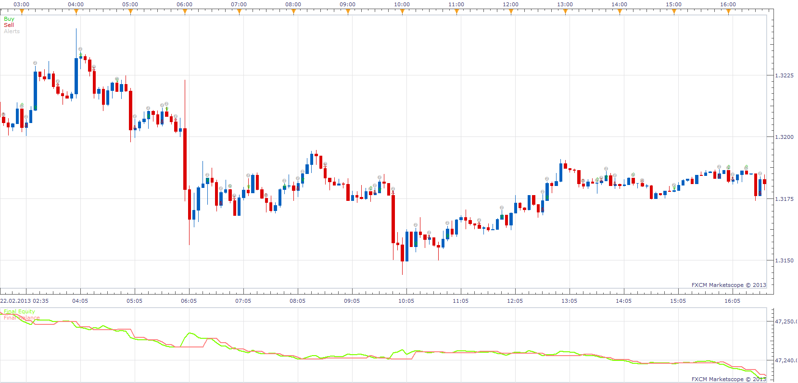

# HA Strategy

> Source: https://fxcodebase.com/code/viewtopic.php?f=31&t=32828  
> Forum: 31 · Topic 32828 · 7 post(s)

---

## HA Strategy

**Apprentice** · Wed Mar 06, 2013 9:15 am

Open Long On Positive HA change.
Open Short On Negativ HA change.

 [HA Strategy.lua](files/55863/HA%20Strategy.lua)

The Strategy was revised and updated on December 11, 2018.

---

## Re: HA Strategy

**JOKER83** · Mon Jul 28, 2014 4:31 pm

Hi there

WHY I have been wearing HA strategy and he should make a trade, and unfortunately my trade I had open closed?

---

## Re: HA Strategy

**Apprentice** · Tue Jul 29, 2014 1:18 am

I'm not sure if I understand.
Trade suggested by the rules is not executed?
Can you confirm.

One of the possible reasons.
This Strategy uses the End of Turn execution.
Meaning / Example.
If H1 is used, the trade will be executed at the end of One hour period.

---

## Re: HA Strategy

**easytrading** · Fri Oct 10, 2014 12:18 pm

hello Apprentice,
is it possible to develope a nother version of this strategy but uses the normal RENKO view that is already loaded in the FXCM trading station2 .thanks a lot.

---

## Re: HA Strategy

**Apprentice** · Tue Oct 14, 2014 3:57 am

Your request is added to the development list.

---

## Re: HA Strategy

**Apprentice** · Sun Dec 11, 2016 9:14 am

Strategy was revised and updated.

---

## Re: HA Strategy

**Alexander.Gettinger** · Tue Apr 23, 2019 9:57 pm

Please try this strategy:

 [Renko Strategy.lua](files/125930/Renko%20Strategy.lua)
