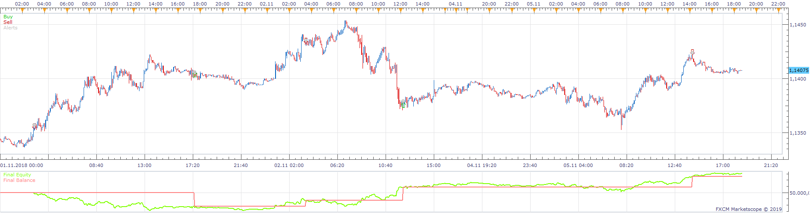
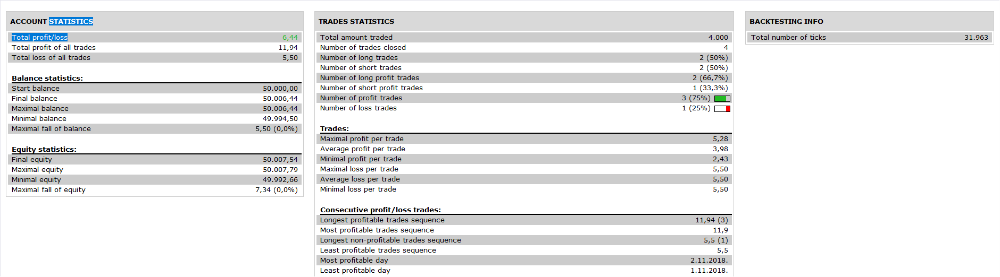
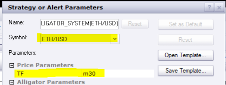
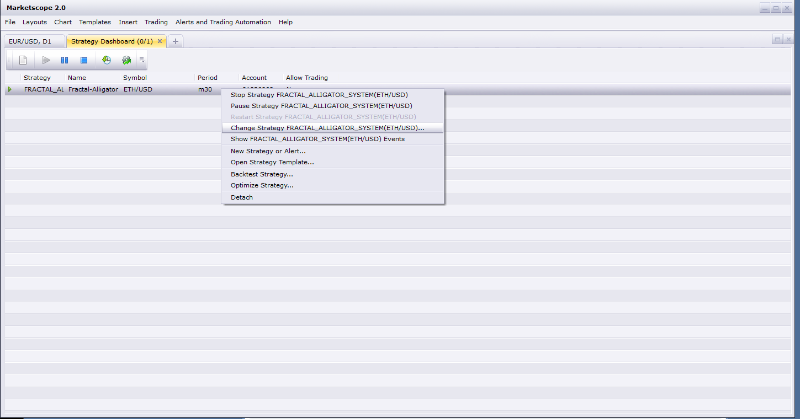

# Harmonic Pattern Strategy

> Source: https://fxcodebase.com/code/viewtopic.php?f=31&t=67393  
> Forum: 31 · Topic 67393 · 19 post(s)

---

## Harmonic Pattern Strategy

**Apprentice** · Wed Feb 27, 2019 6:31 am

 

Based on Harmonic Pattern_with Alert.lua
[viewtopic.php?f=17&t=4994](https://fxcodebase.com/code/viewtopic.php?f=17&t=4994)

 [Harmonic Pattern Strategy.lua](files/124134/Harmonic%20Pattern%20Strategy.lua)

MT4/MQ4 version.
[viewtopic.php?f=38&t=67445](https://fxcodebase.com/code/viewtopic.php?f=38&t=67445)

---

## Re: Harmonic Pattern Strategy

**SANTOSH** · Wed Feb 27, 2019 7:46 am

Hi Apprentice ,
I am getting this error :

C:/Program Files (x86)/Candleworks/FXTS2/Strategies/Custom/Harmonic Pattern Strategy.lua:109: attempt to index field 'SIGNAL' (a nil value)	02/27/2019 19:24:13

Regards,
santosh .

---

## Re: Harmonic Pattern Strategy

**Apprentice** · Wed Feb 27, 2019 9:35 am

Please re-download Harmonic Pattern_with Alert.lua
[viewtopic.php?f=17&t=4994](https://fxcodebase.com/code/viewtopic.php?f=17&t=4994)

---

## Re: Harmonic Pattern Strategy

**SANTOSH** · Wed Feb 27, 2019 11:14 am

Yeah , re-downloaded the code .
Its working now .

But when i put the indicator with the same correction factor as the strategy ,
they dont match .

The strategy is missing the indicator trade alerts .
Kindly check.

---

## Re: Harmonic Pattern Strategy

**MemphisRokudo** · Thu Feb 28, 2019 5:28 am

Can you please make a mt4 version with push notification?

Thank you

---

## Re: Harmonic Pattern Strategy

**Apprentice** · Thu Feb 28, 2019 5:42 am

Your request is added to the development list under Id Number 4502

---

## Re: Harmonic Pattern Strategy

**SANTOSH** · Thu Feb 28, 2019 11:38 pm

> **SANTOSH wrote:**
> Yeah , re-downloaded the code .
> Its working now .
>
> But when i put the indicator with the same correction factor as the strategy ,
> they dont match .
>
> The strategy is missing the indicator trade alerts .
> Kindly check.

Any recent update to fix the above issue ??

---

## Re: Harmonic Pattern Strategy

**Apprentice** · Tue Mar 05, 2019 5:51 am

SANTOSH try to re-download Harmonic Pattern_with Alert.lua

---

## Re: Harmonic Pattern Strategy

**SANTOSH** · Tue Mar 05, 2019 6:56 am

> **Apprentice wrote:**
> SANTOSH try to re-download Harmonic Pattern_with Alert.lua

Hello Mario,
I already re-downloaded the code .
Still the strategy alerts and indicator alerts are not the same .

Attached pics and bpj for your reference .
Regards ,
Santosh Sahu .

---

## Re: Harmonic Pattern Strategy

**SANTOSH** · Fri Mar 08, 2019 2:18 am

Hi ..
Any updates on the same ??
Awaiting past one month .

Regards ,
Santosh Sahu .

---

## Re: Harmonic Pattern Strategy

**Apprentice** · Thu Mar 14, 2019 6:56 am

MT4/MQ4 version.
[viewtopic.php?f=38&t=67445](https://fxcodebase.com/code/viewtopic.php?f=38&t=67445)

---

## Re: Harmonic Pattern Strategy

**SANTOSH** · Fri Mar 15, 2019 5:44 am

Hi Apprentice ,
I am not saying I need a mQ4 version .
Rather I strictly need a lua version only .
The issue with the lua strategy of harmonic strategy are as follows -

1. The strategy buy sell alerts are not at the same place where the harmonic lua indicator alert gives alert .
2. The strategy misses the buy sell trades as we see in when we put the Harmonic pattern with alert .lua indicator on the chart .
3. The strategy might be bugged .

---

## Re: Harmonic Pattern Strategy

**SANTOSH** · Sun Mar 17, 2019 10:15 am

Hello everyone ,
First thing I am trying my level best to code the Harmonic pattern strategy, but my coding abilities are not that profund... everytime the zig indexes a nil value

Can anyone in this forum run the backtest of the strategy made by Apprentice and confirm just the following-

The strategy trade alert match the indicator pattern alert.. THAT'S ALL ...

---

## Re: Harmonic Pattern Strategy

**Reymondpolanco** · Sun Mar 17, 2019 12:11 pm

Can you put the option to move the stop an X quantity of pips to the last HL or the LH, etc.

---

## Re: Harmonic Pattern Strategy

**Reymondpolanco** · Sun Mar 17, 2019 1:16 pm

I'm testing the strategy but i got this alert every time found a trade and until I dont click on OK the strategy dont open the trade

---

## Re: Harmonic Pattern Strategy

**SANTOSH** · Sun Mar 17, 2019 2:24 pm

> **Reymondpolanco wrote:**
> I'm testing the strategy but i got this alert every time found a trade and until I dont click on OK the strategy dont open the trade

Strange !!!
I didn't get this alert popped up while I was testing the strategy ..
Did u match the indicator alert with the strategy trade. ??
Do they match ??

Like a bear butterfly sell trade should be at the same place when you put the Harmonic pattern indicator with a bear butterfly pattern alert near that sell trade...

Can you confirm that the indicator alerts match the strategy trades !!

Regards,
Santosh

---

## Re: Harmonic Pattern Strategy

**Apprentice** · Thu Apr 11, 2019 2:33 pm

Try it now.

---

## Re: Harmonic Pattern Strategy

**SANTOSH** · Sat Jul 06, 2019 5:24 am

How can the data source be changed for a particular strategy ?

Example in the pic :
Like the same as we do in the indicator .

Regards ,
Santosh

---

## Re: Harmonic Pattern Strategy

**Apprentice** · Sun Jul 14, 2019 4:56 am

During the strategy addition process, you should select the instrument and Time frame.

 

Subsequently, You can do the same via "change strategy" option available in "Strategy Dashboard"
If your strategy is available on your chart you have the same option there.
