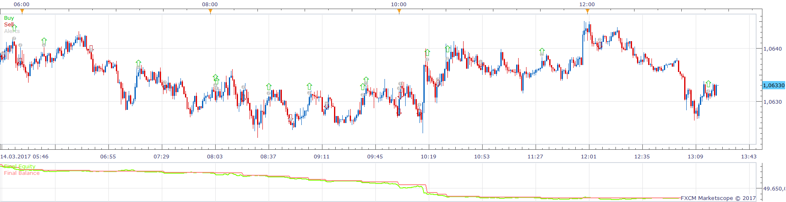
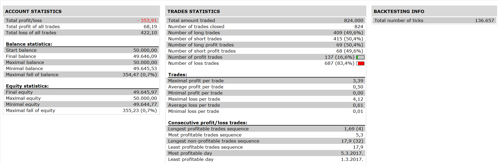

# Heiken Ashi Ma T3 indicator Strategy

> Source: https://fxcodebase.com/code/viewtopic.php?f=31&t=65489  
> Forum: 31 · Topic 65489 · 28 post(s)

---

## Heiken Ashi Ma T3 indicator Strategy

**Apprentice** · Fri Dec 29, 2017 9:07 am

 

Open Long on Up color.
Open Short on Down color.

 [Heiken Ashi Ma T3 indicator Strategy.lua](files/116668/Heiken%20Ashi%20Ma%20T3%20indicator%20Strategy.lua)

 [Heiken Ashi Ma T3 indicator Strategy with Breakeven.lua](files/116668/Heiken%20Ashi%20Ma%20T3%20indicator%20Strategy%20with%20Breakeven.lua)

Optionnal "Breakeven" after x pips of profit added.

Heiken Ashi Ma T3 indicators is available here.
[viewtopic.php?f=17&t=59572](https://fxcodebase.com/code/viewtopic.php?f=17&t=59572)

 20 in 1 Moving Average Indicator a.k.a. Averages is available here.
[viewtopic.php?f=17&t=2430](https://fxcodebase.com/code/viewtopic.php?f=17&t=2430)

T3_MA.lua is available here.
[viewtopic.php?f=17&t=60294](https://fxcodebase.com/code/viewtopic.php?f=17&t=60294)

---

## Re: Heiken Ashi Ma T3 indicator Strategy

**papynou34** · Wed Jan 03, 2018 7:29 pm

Thanks a lot Apprentice, it is working well.

---

## Re: Heiken Ashi Ma T3 indicator Strategy

**papynou34** · Fri Jan 05, 2018 11:43 am

Hello,
Is it possible to add to the strategy an optionnal "Breakeven" after x pips of profit?

Thans a lot in davance.

---

## Re: Heiken Ashi Ma T3 indicator Strategy

**Apprentice** · Sat Jan 06, 2018 8:18 am

Your request is added to the development list under Id Number 4000

---

## Re: Heiken Ashi Ma T3 indicator Strategy

**Apprentice** · Sun Jan 07, 2018 5:12 am

Heiken Ashi Ma T3 indicator Strategy with Breakeven.lua added.

---

## Re: Heiken Ashi Ma T3 indicator Strategy

**papynou34** · Mon Jan 08, 2018 9:24 am

Hello Apprentice,
First of all, I would like to thank you for the more than quick job.

I tested the new HA MA T3 indicator with breakeven, and it seems to me there is a problem with.

I did a backtes from the 04/01/2017 to 31/12/2017 datas, and it seems that all is stopped on the 12 of february.
A pictures is bette than an explanation, you will find hereafter =
-picture of Heiken Ashi Ma T3 indicator Strategy without Breakeven. (Bug2)
-picture of Heiken Ashi Ma T3 indicator Strategy with Breakeven. (Bug1)

Please let me know if you need further explanation.

---

## Re: Heiken Ashi Ma T3 indicator Strategy

**Apprentice** · Tue Jan 09, 2018 1:34 pm

I did figure out what it was. If you disables close on opposite. So the position can be closed by stop only. And as you can see (I draw the line where the "last" stop order is placed) it should never close. Position cap is one. So no other trades are opened as well. It looks like it works fine. Non-breakeven version likely opens trades on different signals and have not locked itself in such situation when the price goes only up.

---

## Re: Heiken Ashi Ma T3 indicator Strategy

**papynou34** · Tue Jan 09, 2018 7:19 pm

Thanks a lot for the explanation.
To "solve this issue" is it possible to continue to have a trailing stop after it goes to BE if it is precised at the first opened order?

---

## Re: Heiken Ashi Ma T3 indicator Strategy

**Apprentice** · Wed Jan 10, 2018 9:49 am

Try it now.

---

## Re: Heiken Ashi Ma T3 indicator Strategy

**papynou34** · Wed Jan 10, 2018 1:27 pm

Hello Apprentice,
Thanks
Seems to work better, I will test it in real mode to-morrow, and will let you know the result.

---

## Re: Heiken Ashi Ma T3 indicator Strategy

**papynou34** · Wed Jan 10, 2018 2:40 pm

Hello,
I got the following error.

---

## Re: Heiken Ashi Ma T3 indicator Strategy

**Apprentice** · Thu Jan 11, 2018 5:01 am

This should fix it.

---

## Re: Heiken Ashi Ma T3 indicator Strategy

**papynou34** · Thu Jan 11, 2018 12:22 pm

Hello Apprentice,
I tested the new version on an demo account and all is OK.
Thanks a lot for your great job.

---

## Re: Heiken Ashi Ma T3 indicator Strategy

**papynou34** · Fri Jan 12, 2018 6:37 am

Hello,
I tried to use the optimisation of strategy.
I have the following issues :

---

## Re: Heiken Ashi Ma T3 indicator Strategy

**papynou34** · Mon Jan 15, 2018 6:59 pm

Hello,
Can you tell me why it is asking for those 3 indicators as there are not in the indicators folder. Even more, there are nowhere!!.
If i am not at the right place, please tell me where i have to put this thread.
Thanks for your help.

---

## Re: Heiken Ashi Ma T3 indicator Strategy

**Apprentice** · Tue Jan 16, 2018 5:36 am

Heiken Ashi Ma T3 indicators is available here.
[viewtopic.php?f=17&t=59572](https://fxcodebase.com/code/viewtopic.php?f=17&t=59572)

 20 in 1 Moving Average Indicator a.k.a. Averages is available here.
[viewtopic.php?f=17&t=2430](https://fxcodebase.com/code/viewtopic.php?f=17&t=2430)

T3_MA.lua is available here.
[viewtopic.php?f=17&t=60294](https://fxcodebase.com/code/viewtopic.php?f=17&t=60294)

How to Download and Install Custom Indicator
[viewtopic.php?f=17&t=17](https://fxcodebase.com/code/viewtopic.php?f=17&t=17)

1.Some of these calculations are only possible in the indicator.
2.We use indicators to simplify the development process,
shortening the time needed for strategy development.

---

## Re: Heiken Ashi Ma T3 indicator Strategy

**papynou34** · Tue Jan 16, 2018 5:48 am

Hello Apprentice,
The strategy is working well. But when i use OPTIMIZER, the process asks for _shortcuts and _alerts. The errors give the folder indicator/custom. When i want to check theses indicator, they are not in this folder.
Let's me do a short status :
strategy online : OK
Backtesting : OK
Optimization = BAD.

I guess that the errors come from the process of optimizer using TS2 and marketscope.
What can I do ?

---

## Re: Heiken Ashi Ma T3 indicator Strategy

**papynou34** · Tue Jan 16, 2018 10:04 am

Hello,
Please don't take in account my previous note, I re installed the FSCM TS2 and now the optimization is working well.

---

## Re: Heiken Ashi Ma T3 indicator Strategy

**papynou34** · Wed Jan 24, 2018 6:16 am

Hello,
Is it possible to add an option : close x percent of an opened position after x pips ?
Thanks a lot in advance.

---

## Re: Heiken Ashi Ma T3 indicator Strategy

**Apprentice** · Wed Jan 24, 2018 7:14 am

Your request is added to the development list under Id Number 4022

---

## Re: Heiken Ashi Ma T3 indicator Strategy

**Apprentice** · Wed Jan 24, 2018 10:00 am

Try this version.

 [Heiken Ashi Ma T3 indicator Strategy.papynou34.lua](files/117248/Heiken%20Ashi%20Ma%20T3%20indicator%20Strategy.papynou34.lua)

---

## Re: Heiken Ashi Ma T3 indicator Strategy

**papynou34** · Wed Jan 24, 2018 12:28 pm

Hello Apprentice,
I would like to thank you for the quick and excellent job, you did.
The stragety is working well.
Would it be possible to also keep the breakeven after x pips with the partial close?
Thanks a lot again

---

## Re: Heiken Ashi Ma T3 indicator Strategy

**papynou34** · Wed Feb 07, 2018 9:21 am

Hello Apprentice,

May i have an answer, please?

Thanks in advance

---

## Re: Heiken Ashi Ma T3 indicator Strategy

**Apprentice** · Mon Feb 12, 2018 11:28 am

[Heiken Ashi Ma T3 indicator Strategy.papynou34.lua](files/117737/Heiken%20Ashi%20Ma%20T3%20indicator%20Strategy.papynou34.lua)

Try this version.

---

## Re: Heiken Ashi Ma T3 indicator Strategy

**papynou34** · Tue Feb 13, 2018 1:13 pm

Thanks you Apprentice. It works well.

---

## Re: Heiken Ashi Ma T3 indicator Strategy

**papynou34** · Wed May 16, 2018 9:45 am

Hello All
Is it possible to add to this stratégy, some filter from TREND CONFIRMATION?
[viewtopic.php?f=17&t=66107](https://fxcodebase.com/code/viewtopic.php?f=17&t=66107)

That is to say :
if Summary is Buy (from indicator), just allow buy order,.
If summary is sell (from indicator), just allow Sell order,
If Summary is Neutral, don't allow any order.

Thanks in advance.

---

## Re: Heiken Ashi Ma T3 indicator Strategy

**Apprentice** · Fri May 18, 2018 6:08 am

Will you use one or multiple checks as we have in Trend Confirmation indicator?

---

## Re: Heiken Ashi Ma T3 indicator Strategy

**papynou34** · Fri May 18, 2018 10:21 am

I don't know very well the Confirmation trend. I would say use all the checks that conclude to the summary state of the indicator.
Isn't it possible to check the summary fields of the indicator(Trend confirmation), from the HA_MA_T3 strategy ?
