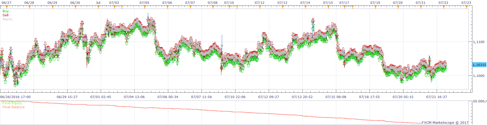
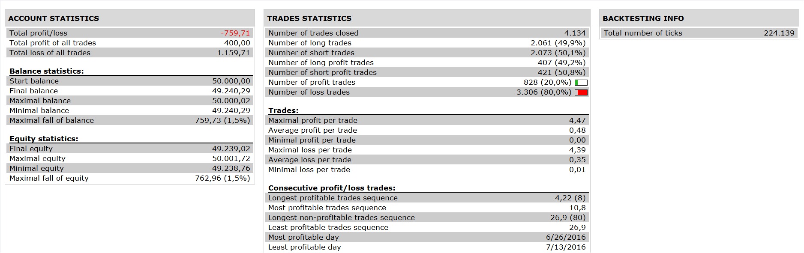

# HEIKEN ASHI SMOOTHED MA CROSS Strategy

> Source: https://fxcodebase.com/code/viewtopic.php?f=31&t=64267  
> Forum: 31 · Topic 64267 · 3 post(s)

---

## HEIKEN ASHI SMOOTHED MA CROSS Strategy

**Apprentice** · Fri Jan 06, 2017 9:30 am

 

Open Long - when the EMA closes above the Heiken Ashi Smoothed Candle
Open Short - when the EMA closes below the Heiken Ashi Smoothed Candle

 [HEIKEN ASHI SMOOTHED MA CROSS Strategy.lua](files/110362/HEIKEN%20ASHI%20SMOOTHED%20MA%20CROSS%20Strategy.lua)

HASM is available here.
[viewtopic.php?f=17&t=606&hilit=HASM](https://fxcodebase.com/code/viewtopic.php?f=17&t=606&hilit=HASM)

The Strategy was revised and updated on January 19, 2019.

---

## Re: HEIKEN ASHI SMOOTHED MA CROSS Strategy

**DAVIDR** · Fri Jan 06, 2017 6:30 pm

When there is an open long trade and the EMA closes below the HAS Candle, Will the new short trade also automatically close the open long trade?

Many thanks

---

## Re: HEIKEN ASHI SMOOTHED MA CROSS Strategy

**Apprentice** · Sun Jan 08, 2017 6:16 am

Yes
if "Close On Opposite" is on
