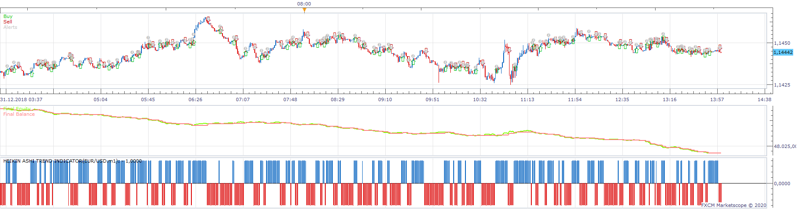
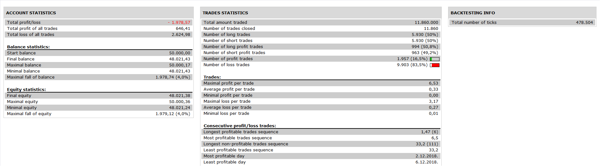

# Heikin Ashi Trend Indicator Strategy

> Source: https://fxcodebase.com/code/viewtopic.php?f=31&t=69699  
> Forum: 31 · Topic 69699 · 13 post(s)

---

## Heikin Ashi Trend Indicator Strategy

**Apprentice** · Mon Apr 20, 2020 10:28 am

 

Based on the Heikin Ashi Trend Indicator
[viewtopic.php?f=17&t=69639](https://fxcodebase.com/code/viewtopic.php?f=17&t=69639)

 [Heikin Ashi Trend Indicator Strategy.lua](files/132994/Heikin%20Ashi%20Trend%20Indicator%20Strategy.lua)

---

## Re: Heikin Ashi Trend Indicator Strategy

**shaloiulabcde** · Wed Mar 17, 2021 9:27 am

I've downloaded, installed and tried to backtest this but getting a download and install error. Any ideas?

---

## Re: Heikin Ashi Trend Indicator Strategy

**Apprentice** · Wed Mar 17, 2021 1:36 pm

You need to install Heikin Ashi Trend Indicator on your platform.
viewtopic.php?f=17&t=69639

---

## Re: Heikin Ashi Trend Indicator Strategy

**shaloiulabcde** · Wed Mar 17, 2021 5:51 pm

Great. It's working now. Thank you

Also is it possible to include in this strategy a condition to only buy or sell if ADX 14 is above 25?

---

## Re: Heikin Ashi Trend Indicator Strategy

**Apprentice** · Thu Mar 18, 2021 4:42 am

Your request is added to the development list.
Development reference 293.

---

## Re: Heikin Ashi Trend Indicator Strategy

**Apprentice** · Mon Mar 22, 2021 4:26 am

[Heikin Ashi Trend Indicator Strategy.lua](files/141290/Heikin%20Ashi%20Trend%20Indicator%20Strategy.lua)

Try this version.

---

## Re: Heikin Ashi Trend Indicator Strategy

**billkokobill** · Wed Apr 28, 2021 4:52 am

dear apprentice
it is a very good strategy.
could you please add a filter with candle?
for example when the candle changes from green to red , after one candle or 2 candle will give the sort signal not immediately..
thanks in advance

---

## Re: Heikin Ashi Trend Indicator Strategy

**Apprentice** · Wed Apr 28, 2021 1:02 pm

Open Long trades only if
we have green to red?

Vice versa for short.

---

## Re: Heikin Ashi Trend Indicator Strategy

**shaloiulabcde** · Thu May 06, 2021 4:42 pm

> **Apprentice wrote:**
>
>
> Heikin Ashi Trend Indicator Strategy.lua
>
>
> Try this version.

Hi

it seems like the ADX function isn't working as it should. Trades are still placed as usual even when ADX is below the adx level I've set up in the strategy. Can you please fix this so that the strategy doesn't open any new trades while the adx is below whatever adx level I set in the strategy. And only begins to trade again, when adx goes back above the adx level I set in the strategy.

Thanks

---

## Re: Heikin Ashi Trend Indicator Strategy

**Apprentice** · Fri May 07, 2021 4:00 am

> **shaloiulabcde wrote:**
>
>
> > **Apprentice wrote:**
> >
> >
> > Heikin Ashi Trend Indicator Strategy.lua
> >
> >
> > Try this version.
>
>
>
> Hi
>
> it seems like the ADX function isn't working as it should. Trades are still placed as usual even when ADX is below the adx level I've set up in the strategy. Can you please fix this so that the strategy doesn't open any new trades while the adx is below whatever adx level I set in the strategy. And only begins to trade again, when adx goes back above the adx level I set in the strategy.
>
> Thanks

Your request is added to the development list.
Development reference 445.

---

## Re: Heikin Ashi Trend Indicator Strategy

**Apprentice** · Tue May 11, 2021 3:57 am

[Heikin_Ashi_Trend_Indicator_Strategy.lua](files/142011/Heikin_Ashi_Trend_Indicator_Strategy.lua)

Try this version.

---

## Re: Heikin Ashi Trend Indicator Strategy

**shaloiulabcde** · Wed May 12, 2021 8:50 am

> **Apprentice wrote:**
>
>
> Heikin_Ashi_Trend_Indicator_Strategy.lua
>
>
> Try this version.

Hi

is this the updated version (reference 445) with the ADX fix?

cos it seems like it's no different from the prior version which needed fixing. or is there a setting that I'm missing

Thanks in advance

---

## Re: Heikin Ashi Trend Indicator Strategy

**Apprentice** · Sat May 15, 2021 8:06 am

Line 421
if Indicator.DATA[period] ~= 1 and Indicator.DATA[period - 1] == 1 and adx.DATA[period] > adx_level then
