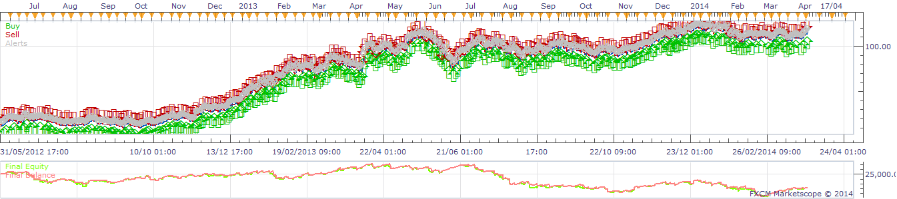

# High Low Breakout Strat

> Source: https://fxcodebase.com/code/viewtopic.php?f=31&t=60526  
> Forum: 31 · Topic 60526 · 28 post(s)

---

## High Low Breakout Strat

**moomoofx** · Fri Apr 11, 2014 5:16 am

Hi everyone,

As kind-of requested on: [viewtopic.php?f=17&t=20388](https://fxcodebase.com/code/viewtopic.php?f=17&t=20388)

Basically, the requested strategy was to use the hl1 indicator but that isn't really necessary. The point of the strategy is to create entry orders at the previous bar's highs and lows in expectation of a break, with the stop at the opposite extreme. So, that is what I have done - no indicators required.

I also enhanced it to support One-Cancels-Others orders so if one is executed, the other is automatically cancelled.

Orders are created at the start of each new bar, and previously pending orders are cancelled as well.

 

Cheers,
MooMooFX

The Strategy was revised and updated on January 19, 2019.

---

## Re: High Low Breakout Strat

**Taskryr** · Fri Apr 11, 2014 1:38 pm

Hi moomoo,

There is no option for setting the amount of pips for a trailing stop. I think this is throwing the strategy off. When I backtest I have losses 10xs bigger than my limit.

---

## Re: High Low Breakout Strat

**moomoofx** · Sat Apr 12, 2014 11:12 pm

The Stop is being set to the opposite high/low extreme for the previous period, as originally requested.

The trailing feature turns on dynamic trailing, i.e., 1 pip-trailing.

The fact that you have 10x losses > limit has nothing to do with trailing or not, it's just because your limit is 1/10th the size of what the stop might be set to. Keep in mind the stop would change from bar to bar.

Cheers,
MooMooFX

---

## Re: High Low Breakout Strat

**Taskryr** · Sun Apr 13, 2014 9:14 am

Thanks for the clarification. . . . that being said, Is it possible to add the option of a Stop in pips rather than the opposite Hi/lo?

---

## Re: High Low Breakout Strat

**moomoofx** · Mon Apr 14, 2014 9:57 pm

Hi,

Yes that is possible. Your request has been added to the to do list.

Cheers,
MooMooFX

---

## Re: High Low Breakout Strat

**kingolli** · Tue Apr 22, 2014 12:03 pm

Great strategy to enter a trend with low risk in smaller timeframes. Thank you.
Is it possible to add a function to enter only long or only short if a signal is given?

Thank you.
kingolli

---

## Re: High Low Breakout Strat

**moomoofx** · Sat Apr 26, 2014 11:31 pm

Hi,

Your request has been added to the list.

Cheers,
MooMooFX

---

## Re: High Low Breakout Strat

**moomoofx** · Thu May 15, 2014 5:11 am

The two requested enhancements have been added to the strategy.
- Ability to specify stop in pips instead of the strategy deciding
- Ability to filter the trade direction.

Source has been updated in the original post on this thread, please redownload from there.

Cheers,
MooMooFX

---

## Re: High Low Breakout Strat

**kankatrader** · Thu Jul 17, 2014 11:42 am

Hi,

is it possible to ad this function:

1. Excess (in Pips over high limit to open position).

2. Start and Stop Time for Trading.

Best Regards

kankatrader

---

## Re: High Low Breakout Strat

**coonzer** · Mon Nov 03, 2014 5:54 am

Would it be possible, to combine this strategy with fractals: placing entry oders not according to high and low of the last candle but to local extremes determined by the fractals indicator?

Best Regards!

---

## Re: High Low Breakout Strat

**Apprentice** · Wed Nov 05, 2014 3:47 am

Something like Advanced fractal strategy.
[viewtopic.php?f=31&t=4196&hilit=fractal](https://fxcodebase.com/code/viewtopic.php?f=31&t=4196&hilit=fractal)

---

## Re: High Low Breakout Strat

**virgilio** · Mon Nov 10, 2014 7:04 pm

Hello Sir, would it be feasible to make sure that once a trade is entered the strategy does not keep opening new positions with each new HIGH or LOW? For example, if the strategy with an H1 timeframe opens a new long trade when the previous high bar is broken, it should not keep opening new long trades each time a new high bar with an H1 timeframe. In other words, keep the trades to only one. This should apply for both Highs and Lows scenarios.

---

## Re: High Low Breakout Strat

**Apprentice** · Thu Nov 13, 2014 3:07 am

Your request is added to the development list.

---

## Re: High Low Breakout Strat

**explorerr** · Wed Apr 22, 2015 4:22 am

please is there a MQL4 version of High Low Breakout Strat ? thanks

---

## Re: High Low Breakout Strat

**Apprentice** · Thu Apr 23, 2015 6:15 am

Not that I know.

---

## Re: High Low Breakout Strat

**limitless** · Sat Apr 25, 2015 4:14 pm

1 ) Is it possible to make automatic stop and limit levels of each bar for Breakout strategy?
For example,
Limit : Bar lenght * 2
Stop : Bar bottom or Bar top
2 ) And is it possible to change amount of lots, if price doesn`t reach its limits and second order executes?
For example, price break out its high level and buy order executes with 1 lot but doesn`t reach to its limit and falls to stop level ( bottom of bar ) and break down the low level of bar. So sell order executes with 2 lots...
If buy trade goes to limits so delete the 2 lot sell order belonging to this bar?

P.S.
Orders are not OCO .

---

## Re: High Low Breakout Strat

**Apprentice** · Mon Apr 27, 2015 3:35 am

Your request is added to the development list.

---

## Re: High Low Breakout Strat

**IQFX36** · Tue Feb 23, 2016 6:12 pm

Hi,
Can you set Maximun Number of Open positions?
Thx in advance!

---

## Re: High Low Breakout Strat

**Apprentice** · Thu Feb 25, 2016 1:43 pm

Your request is added to the development list.

---

## Re: High Low Breakout Strat

**Atmotrader** · Tue Mar 01, 2016 9:31 am

Hello,

this is a great strategy. Please implement that the Limit is automatic set to the range of the bar.

Thanks!

---

## Re: High Low Breakout Strat

**Atmotrader** · Fri Mar 04, 2016 11:39 am

Hi, is it also possible to add trading time as a filter?

Thanks
Masoud

---

## Re: High Low Breakout Strat

**Atmotrader** · Tue Mar 08, 2016 2:33 pm

Hello,

no reaction to my request?

Regards
Masoud

---

## Re: High Low Breakout Strat

**IQFX36** · Wed Jul 20, 2016 1:22 pm

Hi!
Could you add a gap in the entry order?
Thx a lot!

---

## Re: High Low Breakout Strat

**Apprentice** · Mon Aug 08, 2016 6:37 am

Can you define " gap in the entry order" & "add trading time as a filter"

Your request is added to the development list, Under Id Number 3594
 If someone is interested to do this or any task other from list please contact me.

---

## Re: High Low Breakout Strat

**IQFX36** · Wed Oct 12, 2016 3:33 am

I mean,
you can set the entry order an amount of pips above or behind de previous high/low.
Thx a lot!

---

## Re: High Low Breakout Strat

**Apprentice** · Sun Dec 18, 2016 4:37 am

Strategy was revised and updated.

---

## Re: High Low Breakout Strat

**IQFX36** · Sat Jan 14, 2017 10:11 am

Hi!
Could you add an entry order instead a market order?
X pips above the high or under the low
Thx a lot!

---

## Re: High Low Breakout Strat

**Apprentice** · Sun Jan 15, 2017 5:16 am

Your request is added to the development list, Under Id Number 3718
 If someone is interested to do this task, please contact me.
