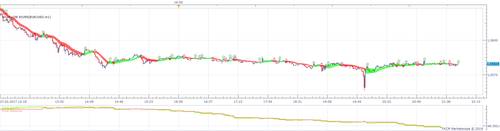
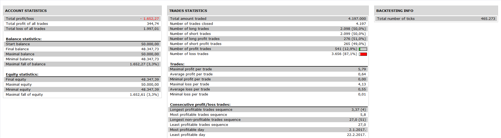

# High Low River Strategy

> Source: https://fxcodebase.com/code/viewtopic.php?f=31&t=68351  
> Forum: 31 · Topic 68351 · 1 post(s)

---

## High Low River Strategy

**Apprentice** · Wed Apr 17, 2019 5:44 am

 

Based on High Low River
[viewtopic.php?f=17&t=68344](https://fxcodebase.com/code/viewtopic.php?f=17&t=68344)

Support two types of signal.
A) Trend/Color change signal.
B) Pullback signal
During Up trend price retest Top line
Viceversa for short.

 [High Low River Strategy.lua](files/125799/High%20Low%20River%20Strategy.lua)
