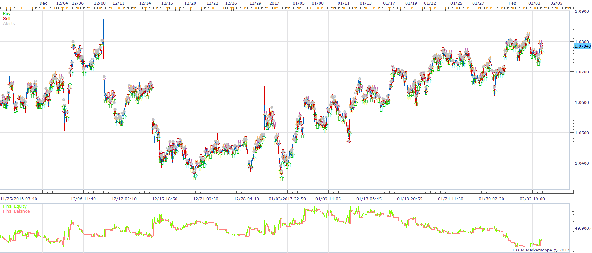
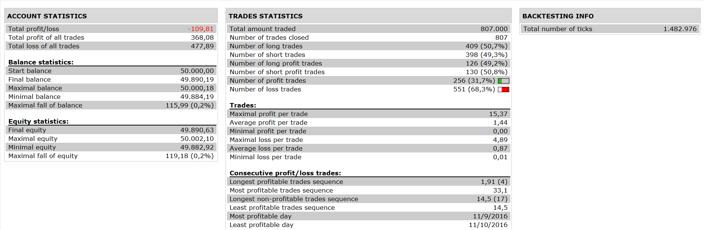

# Highly adaptable BB_ANALYSER

> Source: https://fxcodebase.com/code/viewtopic.php?f=31&t=64447  
> Forum: 31 · Topic 64447 · 13 post(s)

---

## Highly adaptable BB_ANALYSER

**Apprentice** · Sat Feb 11, 2017 5:22 am

 

 [Highly adaptable BB_ANALYSER.lua](files/111018/Highly%20adaptable%20BB_ANALYSER.lua)

 [Highly adaptable BB_ANALYSER with Trend Stop Filter.lua](files/111018/Highly%20adaptable%20BB_ANALYSER%20with%20Trend%20Stop%20Filter.lua)

BB_Analyser_2 is available here.
[viewtopic.php?f=17&t=23335](https://fxcodebase.com/code/viewtopic.php?f=17&t=23335)
Averages is available here.
[viewtopic.php?f=17&t=2430](https://fxcodebase.com/code/viewtopic.php?f=17&t=2430)
Trend Stop is available here.
[viewtopic.php?f=17&t=12728&hilit=trend+stop](https://fxcodebase.com/code/viewtopic.php?f=17&t=12728&hilit=trend+stop)

The Strategy was revised and updated on January 21, 2019.

---

## Re: Highly adaptable BB_ANALYSER

**albertparis** · Sun Feb 12, 2017 8:52 am

Thank you very much for this exceptional work

Would it be possible to add a filter TRENDSTOP with different periods

Example for filter TRENDSTOP

Time frame: H4

Period: 20

Thank you for your future work

Link of the indicator

[http://fxcodebase.com/code/viewtopic.ph ... trend+stop](https://fxcodebase.com/code/viewtopic.php?f=17&t=12728&hilit=trend+stop)

Thank you for your future work

---

## Re: Highly adaptable BB_ANALYSER

**Apprentice** · Mon Feb 27, 2017 4:46 pm

Highly adaptable BB_ANALYSER with Trend Stop Filter.lua added.

---

## Re: Highly adaptable BB_ANALYSER

**albertparis** · Tue Feb 28, 2017 7:05 am

> **Apprentice wrote:**
> Highly adaptable BB_ANALYSER with Trend Stop Filter.lua added.

Hello.

The filter does not work in the direction of my strategy
Example:

If Trendstop is green then take all entries

Thank you for your future work

---

## Re: Highly adaptable BB_ANALYSER

**Apprentice** · Fri Mar 17, 2017 6:00 am

Try it now.

---

## Re: Highly adaptable BB_ANALYSER

**albertparis** · Thu Mar 23, 2017 9:06 am

Thank you for your work.

I also have an MT4 account at FXCM

Would it be possible to have this strategy coded for MT4?

Merci pour votre futur travail

---

## Re: Highly adaptable BB_ANALYSER

**albertparis** · Fri Apr 07, 2017 5:48 am

> **Apprentice wrote:**
> Try it now.

Hello
Can an additional filter be added
Bb analyze with higher time unit
Example M15 and H1
If bb analyze H1 = squeeze then stop input in M15

Filter calculation
Confir m : yes/no
Time frame : example H1
Periode : example 20
Deviation : 2
Number of periods to smooth : example 1
Minimum slope to confirm bubble : example 0.18, 0.2 ….
Confirm en of saussage % : example 10, 20, 100

Selector

Squeeze : no trade and example M15 OR no action
And
Squeeze : close all position OR no action

Thank you for your future work

Strategies

BB_ANALYSER très adaptable avec Trend arrêt Filter.lua
[viewtopic.php?f=31&t=64447](https://fxcodebase.com/code/viewtopic.php?f=31&t=64447)

 Exemple graphique

---

## Re: Highly adaptable BB_ANALYSER

**albertparis** · Thu Aug 31, 2017 6:08 am

Hello
Can we integrate the BREAKEVEN_PRICE STRATEGY strategy with a time frame option.

Example opening in M30 "HIGHLY ADAPTABLE BB_ANALYSER" and closing strategy BREAKEVEN_PRICE STRATEGY in h4

Thank you for your future work

Source

 [viewtopic.php?f=31&t=2280&hilit=breakeven+price](https://fxcodebase.com/code/viewtopic.php?f=31&t=2280&hilit=breakeven+price)

and

Highly adaptable BB_ANALYSER with Trend Stop Filter :

[viewtopic.php?f=31&t=64447&p=111635&hilit=Highly+adaptable+BB_ANALYSER#p111635](https://fxcodebase.com/code/viewtopic.php?f=31&t=64447&p=111635&hilit=Highly+adaptable+BB_ANALYSER#p111635)

---

## Re: Highly adaptable BB_ANALYSER

**Apprentice** · Fri Sep 29, 2017 7:43 am

Your request is added to the development list under Id Number 3909

---

## Re: Highly adaptable BB_ANALYSER

**albertparis** · Sat Sep 30, 2017 9:32 am

> **Apprentice wrote:**
> Your request is added to the development list under Id Number 3909

Thank you for your future work

---

## Re: Highly adaptable BB_ANALYSER

**albertparis** · Sun Nov 05, 2017 7:54 am

> **Apprentice wrote:**
> Your request is added to the development list under Id Number 3909

Hello
Can we have 2 TS on this version?
[viewtopic.php?f=31&t=64447&p=115179&hilit=BB_ANALYSER#p115179](https://fxcodebase.com/code/viewtopic.php?f=31&t=64447&p=115179&hilit=BB_ANALYSER#p115179)
Tend stop selector
Confirm using trend stop 1: true / false
Time frame: H1
Period: 10
Triger: h / L
Confirm using trend stop 2: true / false
Time frame: H4
Period: 10
Triger: h / L

If the 2 TS sound in the same direction then allow the trade if not do not allow
Thank you for your future work

---

## Re: Highly adaptable BB_ANALYSER

**albertparis** · Tue Nov 07, 2017 5:37 am

> **albertparis wrote:**
>
>
> > **Apprentice wrote:**
> > Your request is added to the development list under Id Number 3909
>
>
> Hello
> Can we have 2 TS on this version?
> [viewtopic.php?f=31&t=64447&p=115179&hilit=BB_ANALYSER#p115179](https://fxcodebase.com/code/viewtopic.php?f=31&t=64447&p=115179&hilit=BB_ANALYSER#p115179)
> Tend stop selector
> Confirm using trend stop 1: true / false
> Time frame: H1
> Period: 10
> Triger: h / L
> Confirm using trend stop 2: true / false
> Time frame: H4
> Period: 10
> Triger: h / L
>
> If the 2 TS sound in the same direction then allow the trade if not do not allow
> Thank you for your future work

hello
Here is the picture I forgot to put

---

## Re: Highly adaptable BB_ANALYSER

**albertparis** · Sat Jul 20, 2024 8:32 am

Good morning
Can we replace trend stop with supertrend.lua or st.lua
Link : [https://fxcodebase.com/code/viewtopic.php?f=17&t=605](https://fxcodebase.com/code/viewtopic.php?f=17&t=605)
And if possible add a trend stop with:
supertrend.lua
Thank you for your future work
