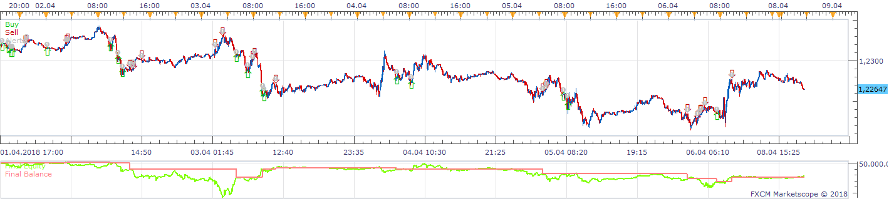
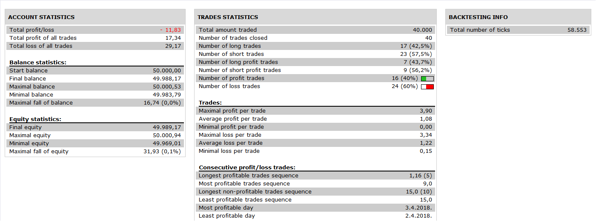

# Highly adaptable Belkhayates Center Of Gravity Strategy v2

> Source: https://fxcodebase.com/code/viewtopic.php?f=31&t=66914  
> Forum: 31 · Topic 66914 · 8 post(s)

---

## Highly adaptable Belkhayates Center Of Gravity Strategy v2

**Apprentice** · Mon Nov 12, 2018 8:09 am

 

Based on request.
[viewtopic.php?f=27&t=66907](https://fxcodebase.com/code/viewtopic.php?f=27&t=66907)

 [Highly adaptable Belkhayates Center Of Gravity Strategy v2.lua](files/122062/Highly%20adaptable%20Belkhayates%20Center%20Of%20Gravity%20Strategy%20v2.lua)

MBFX Timing.lua is available here.
[viewtopic.php?f=17&t=66902](https://fxcodebase.com/code/viewtopic.php?f=17&t=66902)
BELCOG.lua is available here.
[viewtopic.php?f=17&t=706](https://fxcodebase.com/code/viewtopic.php?f=17&t=706)

---

## Re: Highly adaptable Belkhayates Center Of Gravity Strategy

**MC. Trend Trader** · Mon Nov 12, 2018 9:15 am

Thank you very much for Strategy,

I have forget one thing.

Option : Close Position on L1 (blue Line)

Best regards

---

## Re: Highly adaptable Belkhayates Center Of Gravity Strategy

**Apprentice** · Thu Nov 15, 2018 12:22 pm

Try this version.

 [Highly adaptable Belkhayates Center Of Gravity Strategy v2.lua](files/122123/Highly%20adaptable%20Belkhayates%20Center%20Of%20Gravity%20Strategy%20v2.lua)

---

## Re: Highly adaptable Belkhayates Center Of Gravity Strategy

**MC. Trend Trader** · Thu Nov 15, 2018 5:51 pm

Closing positions on line 1 does not work

---

## Re: Highly adaptable Belkhayates Center Of Gravity Strategy

**Apprentice** · Sat Nov 17, 2018 9:37 am

Fixed.

---

## Re: Highly adaptable Belkhayates Center Of Gravity Strategy

**MC. Trend Trader** · Wed Jan 02, 2019 4:36 am

Can you add the ZZ_SEMAFOR indicator in addition to the MBFX indicator as a confirmation?

The price action candle has kissed or cut the red curved lines L3, L4 on the chart and Semafor displayed under the lines
Depth 34
Deviation 21
Backstep 12
Signal is given and Sell

or Price action candle has kissed or cut the green curved lines L6, L7 on the chart and Semafor displayed under the lines
Depth 34
Deviation 21
Backstep 12
Signal is given and Buy

Best regards

---

## Re: Highly adaptable Belkhayates Center Of Gravity Strategy

**Apprentice** · Fri Jan 04, 2019 7:12 am

Your request is added to the development list under Id Number 4405

---

## Re: Highly adaptable Belkhayates Center Of Gravity Strategy

**Apprentice** · Sat Jan 05, 2019 5:08 am

Try this version.

 [Highly adaptable Belkhayates Center Of Gravity Strategy v4.lua](files/123206/Highly%20adaptable%20Belkhayates%20Center%20Of%20Gravity%20Strategy%20v4.lua)
