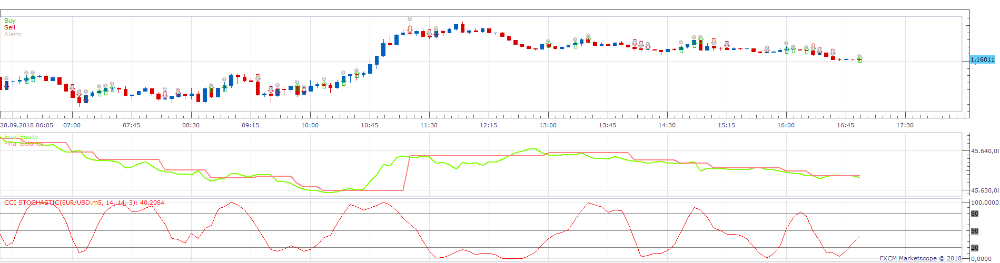
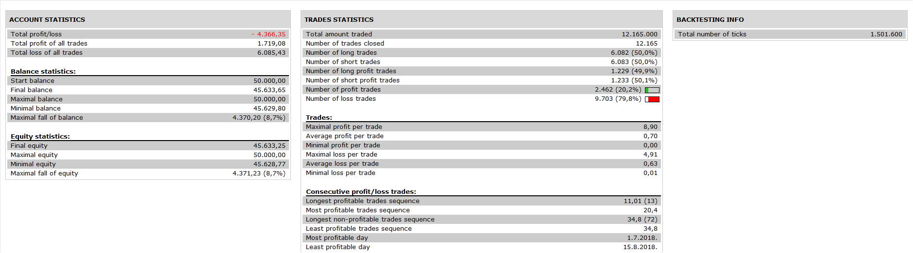

# Highly adaptable CCI Stochastic Strategy

> Source: https://fxcodebase.com/code/viewtopic.php?f=31&t=67043  
> Forum: 31 · Topic 67043 · 8 post(s)

---

## Highly adaptable CCI Stochastic Strategy

**Apprentice** · Mon Dec 03, 2018 7:45 am

 

Based on Simple CCI Stochastic.lua
[viewtopic.php?f=17&p=122468#p122468](https://fxcodebase.com/code/viewtopic.php?f=17&p=122468#p122468)

 [Highly adaptable CCI Stochastic Strategy.lua](files/122482/Highly%20adaptable%20CCI%20Stochastic%20Strategy.lua)

---

## Re: Highly adaptable CCI Stochastic Strategy

**Daveatt** · Tue Dec 04, 2018 3:38 am

Thanks a lot Mario

On my end, I have an issue line 277 (please see enclosed screenshot).The strategy finds the indicator installed as the assert line 243 doesn't triggers any error though

Would you have any idea what could cause this issue ?

Many thanks
David

---

## Re: Highly adaptable CCI Stochastic Strategy

**Apprentice** · Tue Dec 04, 2018 5:42 am

Fixed.
Please re-download.
Use Simple CCI Stochastic instead.

---

## Re: Highly adaptable CCI Stochastic Strategy

**Daveatt** · Tue Dec 04, 2018 12:48 pm

Thanks Apprentice

I downloaded the Simple CCI Sochastic too but I have the exact same issue

It's working for a friend who tried

Seems TS2 finds the indicator but can't instance it for some reason. Both createInstance and create didn't work for me

I assume it's working for you - I don't even understand the error message that I attached in this ticket

Best
Daveatt

---

## Re: Highly adaptable CCI Stochastic Strategy

**Daveatt** · Tue Dec 04, 2018 5:05 pm

Hi Apprentice

If that may helps
The strategy works in backtest mode, but I can't apply it on a chart as usual
My friend who tried confirms this behavior too

I would need your expertise to make it work so as to take trades with it

Thanks again in advance.

Best
Daveatt

---

## Re: Highly adaptable CCI Stochastic Strategy

**Apprentice** · Wed Dec 05, 2018 6:07 am

As you can see, everything is ok for me.
Please re-download both files.
Do not re-name the indicator.

---

## Re: Highly adaptable CCI Stochastic Strategy

**Daveatt** · Wed Dec 05, 2018 6:09 am

My bad, I managed to make the strategy with the Simple CCI to work fine

Is there any reason why the strategy with the (not Simple) CCI stochastic is not working ? I'm more interested by this strategy as it gives more entry points for my scalping strategy

Thanks so much
Daveatt

---

## Re: Highly adaptable CCI Stochastic Strategy

**Daveatt** · Wed Dec 05, 2018 6:26 am

Never mind, your solution works like a charm
The issue came from the arrows in the CCI stochastic indicator

You're awesome, thanks so much
Daveatt
