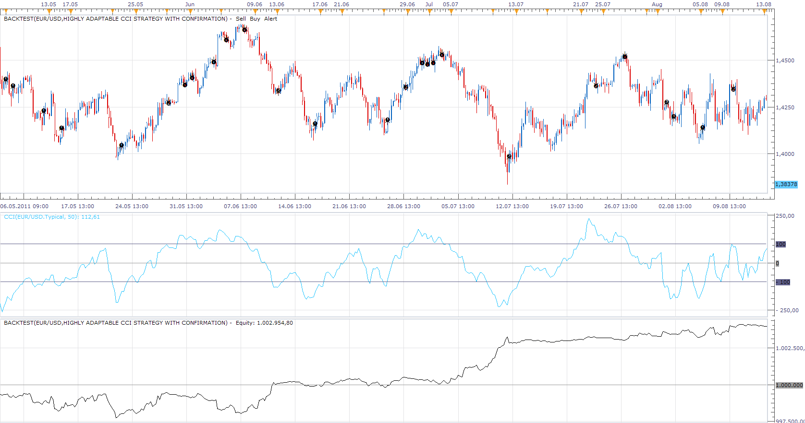

# Highly adaptable CCI Strategy

> Source: https://fxcodebase.com/code/viewtopic.php?f=31&t=4562  
> Forum: 31 · Topic 4562 · 71 post(s)

---

## Highly adaptable CCI Strategy

**Apprentice** · Wed Jun 01, 2011 6:53 am


You can decide which action strategy will take if you have Zero Line or Overbought / O versold Level Crossover.

Actions can be.
Close Position, Open Short or Long Position, take no action.

Trades can be in any direction.
The strategy provides CrossOver and CrossUnder the Line signals.

 [Highly adaptable CCI Strategy.lua](files/11243/Highly%20adaptable%20CCI%20Strategy.lua)

By default strategy does not take any Action.
You need to configure it.

---

## Re: Highly adaptable CCI Strategy

**bluepip** · Fri Jun 03, 2011 4:13 am

Hi Apprentice,
please check the Assignment. In my opinion is not correct.
**Zero Line CrossOver Action** (each both) and **Oversold Level CrossOver Action** are reversed.
**Oversold Level CrossOver Action** and **Overbought Level CrossOver Action** also are reversed.

Thanks bluepip

---

## Re: Highly adaptable CCI Strategy

**Apprentice** · Wed Jun 08, 2011 2:06 am

Updated.

---

## Re: Highly adaptable CCI Strategy

**chimpy** · Sat Sep 17, 2011 8:40 am

Apprentice,

Would it be possible to add the Overbought / Oversold Confirmation levels that apprear in the standard CCI Strategy? I find they work very well.

Thanks you

---

## Re: Highly adaptable CCI Strategy

**jagal833** · Sat Sep 17, 2011 3:34 pm

Hello apprentice
i like your strategies so much and i like your work...can i know what is the best T-F working good for this strategy
and thanks so MUCH !

---

## Re: Highly adaptable CCI Strategy

**chimpy** · Tue Sep 20, 2011 11:59 am

A couple of other things I noticed about this strategy is the Trading amount in lots field adds an extra "0" onto the end of any number you put in here. so 1 gets you 10 lots and 10 gets you 100 etc.
I can't use the minimum amount of 1 lot when testing in a live account.

Would it be possible to add the use decimal values in the Stop/Limit orders, which you can do with manual orders right on the platform? At the moment this strategy just rounds up to the next highest number.
Much appreciated,
Chimpy.

---

## Re: Highly adaptable CCI Strategy

**7510109079** · Tue Oct 11, 2011 10:38 am

Would it be possible to make a small change which I have seen on other strategies. Namely to have the ability to plot the CCI for one time period on another e.g. be able to shown a m5 CCI plot on a m1 interval chart?

---

## Re: Highly adaptable CCI Strategy

**vstrelnikov** · Wed Oct 12, 2011 5:54 pm

You probably need [Biger Time Frame CCI](https://fxcodebase.com/code/viewtopic.php?f=17&t=3322).

---

## Re: Highly adaptable CCI Strategy

**7510109079** · Thu Oct 13, 2011 7:17 am

thank you

---

## Re: Highly adaptable CCI Strategy

**Rpleandro** · Mon Oct 17, 2011 5:46 am

The stops and limits are not working for me could you please address this, thanks and best regards...

---

## Re: Highly adaptable CCI Strategy

**stevetan** · Thu Oct 20, 2011 9:41 pm

Hi Apprentice,

First thanks for all the hardworks you posted here. I am new to this forum and hope to get some help from you.

I am wondering is it possible to combine the concept of Two CCI strategy and Highly adaptable CCI strategy. For example, for long position, the setting of highly adaptable CCI strategy could be as follow:

CCI = 14
Overbought crossover – Buy
Overbought crossunder – No action
Zeroline crossover – Buy
Zeroline crossunder – No action
Oversold crossover – Buy
Oversold crossunder – No action

However we add another layer before the highly adaptable CCI strategy setting will be effective, which is we will establish long position only when

CCI = 50 (Modifiable parameter)
CCI value > 75 (Modifiable parameter)
Position Allow: Long (Modifiable parameter)

Similarly, for short consideration, the setting would be

CCI = 50 (Modifiable parameter)
CCI value > - 75 (Modifiable parameter)
Position Allow: Short (Modifiable parameter)

CCI = 14
Overbought crossover – No action
Overbought crossunder – Sell
Zeroline crossover – No action
Zeroline crossunder – Sell
Oversold crossover – No action
Oversold crossunder – Sell

Please share with me your view and whether it is doable, thanks in advance!

---

## Re: Highly adaptable CCI Strategy

**Apprentice** · Fri Oct 21, 2011 3:09 am

Your request is added to the developmental cue.

Regarding the previous complaints that stop and limit orders do not work,
I made a test and I could not reproduce this problem.

---

## Re: Highly adaptable CCI Strategy

**Apprentice** · Fri Oct 21, 2011 12:42 pm



To, Highly adaptable CCI Strategy, I added another filter.
The filter is based on independent CCI indicator.
The user is able to choose the direction of allowed trade,
When the indicator is in overbought / oversold territory.

Depending on this choice.
trades from primary strategy are filtered

 [Highly adaptable CCI Strategy with confirmation.lua](files/16620/Highly%20adaptable%20CCI%20Strategy%20with%20confirmation.lua)

---

## Re: Highly adaptable CCI Strategy

**jackneveu** · Mon Nov 28, 2011 6:50 pm

Hi,
I really like your CCI strategy and have been testing it and would like to confirm the following :
1.If I add the strategy twice on the same account with one configured to take short positions and the other only to take long positions on the same
currency. Can the two sets of parameters interfere with each other?

2. If I want the strategy to only trade short for example what setting do I put in the allowable trades for the opposite side e.g if I want to go short only if the confirming CCI is oversold this would be my input
Permissible trade on oversold : sell
Permissible trade on overbought:? (do I leave as both or put sell or buy?)

3.If the main CCI is for example on 1minute( 14 period) and confirming CCI is e.g on 60 min (1hr) (14 period) I would have to put confirming CCI period at (14 x 60= 840) is this correct?

I know these are basic questions but I do appreciate your time and thank you in advance for your reply.
Regards

---

## Re: Highly adaptable CCI Strategy

**Apprentice** · Thu Dec 01, 2011 9:54 am

Indicators and strategies are working independently.
Therefore, set the parameters for both,
without conversion to HIGHER time frame.

---

## Re: Highly adaptable CCI Strategy

**69TomD** · Sun Feb 12, 2012 7:36 pm

Hello Codebase team! Thanks very much for all your work you have done for us.
 I'd like to place a request for upgrading Highly adaptable CCI strategy or perhaps creating a new CCI strategy.

Basically, I'm looking for simple CCI strategy.
Buy [on a tick] when CCI crossover above 200, close position [on a tick] when CCI crossover bellow 200
Sell [on a tick] when CCI crosover bellow -200, close position [on a tick] when CCI crossover above -200

I wished I knew how to attach a pic that would explain everything

The overbought/oversold levels are adjustable, as well as there is a possibility to apply the strategy in multiple time frames [may be up to 4] and multiple currency pairs [ up to all of them].

A trade has an option to open in different CCI level than it closes. For example a long position would open at CCI 190, and will be closed at CCI 200 if previously above [Is it the confirmation?]. The trade that opened at CCI 190 and didn't reach level of 200 has the second chance close at CCI 190 crossover down. Same for oversold

I like the Highly adaptable CCI strat., but it should be supplemented with these parameters:

Open trade
-on a tick
-on a candle close
Close trade
-on a tick
-on a candle close
Overbought level adjustable-choose one
-min 100
-max 250
step 10
Oversold level adjustable - choose one
-min -100
-max -250
step 10
Currency pair
choose as many up to all of them
Time frame
choose up to 4 from: 1m - D1
If used stop and limit:
Limit order in pips
-min
-max
-step
Stop order in pips
-min
-max
-step

I don't know how to filter out possible multiple crossing of the set CCI level in a very short period of the time, when the indicator could be crossing up and down quickly. May be you have an idea. Waiting for candle close would ruin an idea of this strategy especially in short time frame.

Along with that, I'd like to have a CCI indicator that alerts chosen crossover level on tick. If there is one already on the website, pls let me know. I apologize

Thank you very much again

Tom

---

## Re: Highly adaptable CCI Strategy

**Apprentice** · Mon Feb 13, 2012 5:52 am

Your request is added to development list.

---

## Re: Highly adaptable CCI Strategy

**fxcatty** · Sun May 06, 2012 12:28 am

Hello.

Would be able to put a filter that only allows one new position for every 24 (x) hours?

I currently use the system that only takes Long only or Short only and allows multiple positions, but I want to limit it to opening only 1 position per day.

For a short term fix would I be able to turn the system to only take one open position at a time and just turn it on and off? Meaning I am taking Long only and one open position at a time. Guess what I am asking is if I 'reset' the system each day it start fresh and I can manage the open trades manually?

Thanks,
Matt

---

## Re: Highly adaptable CCI Strategy

**Apprentice** · Sun May 06, 2012 4:22 am

Your request is added to the development list.

---

## Re: Highly adaptable CCI Strategy

**fxcatty** · Thu May 10, 2012 9:36 am

Hello, I desperately need to add the code to this trading system that limits the MAXIMUM number of open positions. Since I allow multiple open positions I am receiving a margin call when the CCI indicator 'chops' around an entry level. For instance, I don't want more then 3 open positions. I could use the input no more then 3 signals.

Thanks,
Matt

---

## Re: Highly adaptable CCI Strategy

**Apprentice** · Fri May 11, 2012 3:03 am

Your request is added to the development list.

---

## Re: Highly adaptable CCI Strategy

**fxcatty** · Fri May 18, 2012 8:35 am

I really need standard code to add to this strategy for it to check the balance of an account. I was hit with a margin call because it kept opening positions! Please just share the code that would check the balance before opening a trade. If the code that would limit the number of open positions! Sorry for the repeat post but I've been hit again.

Thanks,
Matt

---

## Re: Highly adaptable CCI Strategy

**fxcatty** · Fri May 18, 2012 12:12 pm

> **fxcatty wrote:**
> I really need standard code to add to this strategy for it to check the balance of an account. I was hit with a margin call because it kept opening positions! Please just share the code that would check the balance before opening a trade. If the code that would limit the number of open positions! Sorry for the repeat post but I've been hit again.
>
> Thanks,
> Matt

Okay, So I have been trying this code that has an input of max number of positions per day. I got it from [http://fxcodebase.com/code/viewtopic.php?f=31&t=2639&hilit=max+trade&start=100#p25749](https://fxcodebase.com/code/viewtopic.php?f=31&t=2639&hilit=max+trade&start=100#p25749) ..

Code: [Select all](https://fxcodebase.com/code/)
`strategy.parameters:addInteger("MaxTrades", "Max open positions (0 == unlimited)", "", 0, 0, 100);`

Code: [Select all](https://fxcodebase.com/code/)
`local MaxTrades;`

```lua
function Prepare(nameOnly)
    -- check moving average parameters
   OB=instance.parameters.OB;
    OS= instance.parameters.OS;
   SIDE= instance.parameters.SIDE;   
    AllowMultiple= instance.parameters.AllowMultiple;
   MaxTrades = instance.parameters.MaxTrades;
```

Since I have added these parameters in it now allows me to select max number of trades, but the code isn't in the -- check whether the strategy is allowed to trade coding. Could someone who knows how to code finish this please?

Thanks,
Matt

---

## Re: Highly adaptable CCI Strategy

**fxcatty** · Fri May 18, 2012 12:25 pm

I realized that when a stop exit is placed in the strategy and max positions are allowed. The trades (all opened) will be liquidated if the initial trades stop loss is hit! I had stop loss set to -30 for the autotrade system.

Example today:

Bought @ 1.26797
Bought @ 1.26627
Bought @ 1.26606
Bought @ 1.26559
Liquidate all of the trades @ 1.26497 ..
Only one of these trades should have been stopped because the low was 1.26422 .

Why isn't each trade open independent of itself?
Like Open 1.26797 Stop 1.26497
Open - 1.26627 Stop - 1.26327
Open - 1.26606 Stop - 1.26306 etc.. ?

All I need for a complete system is to be able to set the MAX number of trades allowed and EACH trade honor the preset stop loss .

Thanks,
Matt

---

## Re: Highly adaptable CCI Strategy

**nathanalgren** · Thu Sep 13, 2012 2:18 pm

I am testing the zero cross over buy-sell strategy, but it is sometimes ignoring and not executing the trades. Please see the picture.

---

## Re: Highly adaptable CCI Strategy

**guangho** · Sat Sep 29, 2012 12:41 pm

HI Apprentice, I 'm a beginner，I want to ask a question。

in the "Highly adaptable CCI Strategy with confirmation"----"Confirmation CCI Parameter"---"Confirmation CCI Levels" --- "Overbought Level" and "Oversold Level".

If “Confirmation CCI Parameter” set “both”，
Whether or not said：
1、ONLY when “Confirmation CCI（50）” More than 75 or Less than -75,To perform the above "The main CCI Parameter（14）" strategy？
2、ONLY when “Confirmation CCI（50）” Between 75 to -75,To perform the above "The main CCI Parameter（14）" strategy？

1 or 2？

My native language is not English, you can understand my question?

Thank you very much！

---

## Re: Highly adaptable CCI Strategy

**Apprentice** · Mon Oct 01, 2012 1:54 am

If you use confirmation.
You will have Buy, Sell or Both if confirmation CCI Is within Overbought or Oversold Zone.
With the parameters you are specifying what is permitted in Overbought or Oversold Zone

---

## Re: Highly adaptable CCI Strategy

**bfleming** · Mon Oct 22, 2012 11:11 am

I've been demo-ing the original Highly Adaptable CCI Strategy (without confirmation). When the strategy is set to trade both direction it closes out open trades when it receives a signal for a trade in the opposite direction even though I don't have any of the actions set to "Close Position". I'm using the following settings:

 Overbought Level CrossOver Action: Buy
 Overbought Level CrossUnder Action: Sell
 Zero Line CrossOver Action: No Action
 Zero Line CrossUnder Action: No Action
 OversoldLevel CrossOver Action: Buy
 Oversold Level CrossUnder Action: Sell

 Allow Short/Long/Both Positions: Both
 Set Stop Loss: Yes

I'm not sure if the strategy is meant to be this way or if it's a bug, but could you fix/amend the strategy so that it will open opposing positions without closing positions it has already opened. (I tried to run two of the same strategy - one only going long, the other only going short - but the same thing happened.)

Also, does the strategy take signals based on the time period's closing price or on tick data? If tick data, could you amend it take signals on the cose?

Thanks!

---

## Re: Highly adaptable CCI Strategy

**Apprentice** · Wed Oct 24, 2012 2:55 am

This is done deliberately.
One of the reasons, if you are a U.S. account holder,
We have FIFO rule as well.

---

## Re: Highly adaptable CCI Strategy

**fxcatty** · Sun Nov 11, 2012 11:03 pm

Hello,

Is there any way you could convert this strategy into MetaTrader 4? It is very useful to me and has allowed me to have success trading, and now I have moved onto MetaTrader via FXCM.

Thanks,
Matt

---

## Re: Highly adaptable CCI Strategy

**Apprentice** · Mon Nov 12, 2012 11:53 am

Unfortunately, I'm not good enough in MQ4.
I will post the request, I hope that Alex will find the time.

---

## Re: Highly adaptable CCI Strategy

**fxcatty** · Mon Nov 12, 2012 6:02 pm

I really appreciate the help. I'll patiently wait and hope for a response. Currently I'm just still using your version here for Market Scope!

Thanks

---

## Re: Highly adaptable CCI Strategy

**rtsayers** · Wed Nov 28, 2012 9:23 pm

Hi

Is there anyway to add a smoothing feature to the CCI! This would be for Highly adaptable CCI Strategy? and the confirmation strategy too?

Thanks!

---

## Re: Highly adaptable CCI Strategy

**Apprentice** · Thu Nov 29, 2012 3:55 am

Your request is added to the development list.

---

## Re: Highly adaptable CCI Strategy

**fxcatty** · Sun Jul 21, 2013 7:20 pm

When I put in the e-mail alert information, no e-mail is sent. Are their other settings that I need to configure to have e-mail's sent on alerts?

Thanks,
Matt

---

## Re: Highly adaptable CCI Strategy

**Apprentice** · Mon Jul 22, 2013 3:59 am

Have you configured SendEmail options?
[viewtopic.php?f=25&t=2232](https://fxcodebase.com/code/viewtopic.php?f=25&t=2232)

---

## Re: Highly adaptable CCI Strategy

**7510109079** · Fri Aug 30, 2013 6:35 am

Hi Apprentice,

I hv been trying to use this strategy but keep getting no trades in the final log.i.e. the conditions i hv specified are never met. I am therefore not sure if I understand the confirmation parameters correctly or not.

What I would like to do with this strat is the following:

Open a long position when the oversold CCI rises above -140 after having previously been below -200.

I have been therefore trying to set the confirmation functionality so that it will only open a trade if the TWO above conditions are met.

i.e. CCI bottoms on overselling to -200 or more. On its way back up to the zero line a long trade should be opened once it crosses above -140. I hope i have been clear.

IS THE ABOVE POSSIBLE WITH THIS STRATEGY OR HAVE I MISUNDERSTOOD ITS FUNCTIONALITY AND USAGE???

I hv enclosed a screenshot of the parameters i hv tried to use so you can see where i am going wrong and correctly advise. Long Positions are set to stop-close only if price falls more than 500 pips.

many thx
L

---

## Re: Highly adaptable CCI Strategy

**spinemaligna** · Thu Jan 16, 2014 7:03 pm

Hi and a Happy and profitable New Year,

I have been attempting to backtest this strategy but I can't make it behave. It will open positions correctly and then goes against its rules and opens positions against the confirmation. Not sure where I am going wrong. Any suggestions?

 


My confirmation CCI is 50 period with O/B set to 1 and O/S set to -1.
Would appreciate some help on this as it seems it could be profitable with the correct money management in place.

Thanks in anticipation,
Ross

---

## Re: Highly adaptable CCI Strategy

**7510109079** · Fri Feb 07, 2014 10:03 am

good luck with that spinemaligna. I have been waiting 5 months for a reply. Not sure how these guys priortize requests/questions. No logic as far as i can see.

Shame because as you say it has potential

---

## Re: Highly adaptable CCI Strategy

**Apprentice** · Sat Feb 08, 2014 2:51 am

spinemaligna
Strategy uses a fairly simple algorithm.
All trading action is defined by User.
If you want modification can u specify it.

7510109079
I'm sorry that you have such an opinion.
Unfortunately most of the day, I have a feeling that I'm the only contributor.
I have an impossible schedule, at best with only two or three hours per day for FxCodeBase.

Development strategy being particularly ungrateful, requires a lot of time to develop with uncertain results, therefore I personally do not like/use strategys or indicators, do not like to develop strategys all together.

I have ask for help.
[viewtopic.php?f=28&t=33774](https://fxcodebase.com/code/viewtopic.php?f=28&t=33774)
Go figure, No Reply.

If you want the quality Services, Try our Premium Services.
[viewforum.php?f=32](https://fxcodebase.com/code/viewforum.php?f=32)
Or My own AddonsToGO.
[http://www.addons-to-go.com/](http://www.addons-to-go.com/)

The good news is, in the past month, I have some help, so things should get better in future,
This is Especially true in Strategy Development.

---

## Re: Highly adaptable CCI Strategy

**appress** · Mon Feb 10, 2014 3:12 pm

Hi Apprentice, thanks for the good work.

I'm having difficulty getting the H.A.CCI Strategy to indicate the time it has traded when backtesting. to highlight I show the standard MA Strategy included with the FXTS2 install. Each time a trade is executed in the backtest, there is a little "1" indicator on the price action when it's closed an arrow appears. I put my mouse over these and more details appear; price etc.

On H.A.CCI strategy I see trading happens because the log tells me and because the equity and balance changes. It would be nice to see the trades on the graph as per the MA strategy.

it's either
a) I'm using it wrong
b) code needs looking at.

please advise.

Thanks

Phil

---

## Re: Highly adaptable CCI Strategy

**spinemaligna** · Mon Feb 10, 2014 5:14 pm

spinemaligna
Strategy uses a fairly simple algorithm.
All trading action is defined by User.
If you want modification can u specify it.

Hi Apprentice,

I am not asking for any modification to the strategy, I would just like it to be consistent. My screenshot shows the strategy working correctly, then two examples of it misbehaving. I don't think it is anything I have done as the settings were obviously the same as it was in the same backtest run.
I understand you are under pressure but would appreciate some input. Maybe somebody else has ideas where this may be going wrong.

Ross

---

## Re: Highly adaptable CCI Strategy

**spinemaligna** · Tue Feb 11, 2014 11:03 am

Apprentice,

I have attached an XL file showing the logic steps I think the strategy should take. If this is different to the logic of the strategy is it possible to create a strategy that fulfills these aims.

Ross

---

## Re: Highly adaptable CCI Strategy

**Apprentice** · Wed Feb 12, 2014 3:37 am

As stated in your specification, I'm not sure whether the current implementation do requested.
As it only recognizes Level crosses, not the current level.

If u Set
Overbought Level CrossOver Action to Buy
Oversold Level CrossUnder Action to Sell
Trade will be opened on the OB / OS Cross.

---

## Re: Highly adaptable CCI Strategy

**spinemaligna** · Fri Feb 14, 2014 6:28 am

Hi Apprentice,

I accept the argument that the strategy only reacts to crosses of levels. Does this mean that the strategy will only trigger on occasions when both CCIs cross during the life of the same candle. If so then I think I will request a new strategy along the lines I am looking for.
Even so, this does not explain why the strategy triggers in the middle section of my screen shot when the signal CCI crosses into oversold whilst the confirmation CCI is firmly in overbought territory.

Looking forward to a prompt reply so we can get this system moving forward.

Ross

---

## Re: Highly adaptable CCI Strategy

**Apprentice** · Sat Feb 15, 2014 5:54 am

As it is. It is designed to make the trade at the end of the turn.
Ignore the situation during the candle elapse.

"Live" executions, immediately after Cross is possible,
However, this requires a Strategy redesign.

---

## Re: Highly adaptable CCI Strategy

**spinemaligna** · Wed Feb 19, 2014 2:23 am

[HACCI Flow.xlsx](files/92744/HACCI%20Flow.xlsx)

Thanks for the prompt reply,

I think we may be talking at cross purposes here so, as they say, a Picture paints a thousand words I enclose a flow chart of what I would like to achieve. If the current strategy is not capable of being modified to this aim, can I request a new strategy be developed to encompass the logic in my attachment.
I don't think we are a thousand miles away from achieving this. My aim is to optimize this strategy and maybe add a filter at a later date so if it could be written with this in mind it may save some work.

Thanks again, Ross

---

## Re: Highly adaptable CCI Strategy

**Apprentice** · Wed Feb 19, 2014 4:03 am

As it is, this version of strategy can not do described.
Will modify it.

---

## Re: Highly adaptable CCI Strategy

**spinemaligna** · Sun Feb 23, 2014 2:23 am

Excellent,

Thanks, Ross

---

## Re: Highly adaptable CCI Strategy

**spinemaligna** · Sat Aug 02, 2014 8:53 am

Six months on, any progress to report?

---

## Re: Highly adaptable CCI Strategy

**nathanalgren** · Wed Sep 10, 2014 5:00 am

To the original strategy in the first post,

I want to add MA slope. For example, if MA50 is sloping downwards, the strategy will execute only shorts, and if MA50 is sloping upwards, then only long.

Is that possible to do? If anyone other than the admin/mods can do it, please PM me.

---

## Re: Highly adaptable CCI Strategy

**Avignon** · Fri Apr 08, 2016 4:04 pm

> **nathanalgren wrote:**
> To the original strategy in the first post,
>
> I want to add MA slope. For example, if MA50 is sloping downwards, the strategy will execute only shorts, and if MA50 is sloping upwards, then only long.
>
> Is that possible to do? If anyone other than the admin/mods can do it, please PM me.

+1 for add a moving average.

Thanks.

---

## Re: Highly adaptable CCI Strategy

**10daiFX** · Mon May 09, 2016 7:27 am

Same here, l am looking for a filter with an EMA200.
 Introduce EMA filter logic such that:

Can only go long if price is above EMA (200). (EMA period values will be a modifiable input.)

Can only go short if price is below EMA (200).

l look forward to hearing from you

---

## Re: Highly adaptable CCI Strategy

**Apprentice** · Wed May 11, 2016 6:13 am

Major Update.
Your request is added to the development list.

---

## Re: Highly adaptable CCI Strategy

**Avignon** · Wed May 11, 2016 9:29 am

> **10daiFX wrote:**
> Same here, l am looking for a filter with an EMA200.
> Introduce EMA filter logic such that:
>
> Can only go long if price is above EMA (200). (EMA period values will be a modifiable input.)
>
> Can only go short if price is below EMA (200).
>
> l look forward to hearing from you

[https://www.dailyfx.com/forex/education ... lpers.html](https://www.dailyfx.com/forex/education/trading_tips/trend_of_the_day/2014/06/25/A-Simple-CCI-Strategy-for-Scalpers.html)

---

## Re: Highly adaptable CCI Strategy

**jaricarr** · Sat Jun 04, 2016 4:29 pm

Hi,

Can you please add the "End of turn" and "Live" parameters to this strategy please.

Many thanks,

Jari

---

## Re: Highly adaptable CCI Strategy

**Apprentice** · Fri Dec 16, 2016 7:09 am

Strategy was revised and updated.

---

## Re: Highly adaptable CCI Strategy

**10daiFX** · Tue Dec 27, 2016 11:44 am

> **Apprentice wrote:**
> Strategy was revised and updated.

Hi Apprentice,
when you mention "revised and updated", where can we download the latest version? Will the latest version include all the functions mentioned in the forum thread or just the last request?

Thank you in advance.

---

## Re: Highly adaptable CCI Strategy

**Apprentice** · Fri Dec 30, 2016 6:23 am

Files are updated where they are publish.
I have only fix, some bug, made some optimizations.

---

## Re: Highly adaptable CCI Strategy

**kokobill** · Wed Jan 11, 2017 8:54 am

dear apprentice
can you add the ''multiple'' at the strategy?
thanks in advance

---

## Re: Highly adaptable CCI Strategy

**Apprentice** · Thu Jan 12, 2017 4:51 am

Multiplier or CCI or position size.
You need to be specific.

---

## Re: Highly adaptable CCI Strategy

**kokobill** · Thu Jan 12, 2017 6:49 am

> **Apprentice wrote:**
> Multiplier or CCI or position size.
> You need to be specific.

dear apprentice
''allow multiple'' like the strategy ''higily adaptable rsi strategy''
i want every time the price crosses down , open a new sell position
every time the price crosses over , open a new buy position.

thanks a lot for your great work apprentice.

---

## Re: Highly adaptable CCI Strategy

**Apprentice** · Sun Jan 15, 2017 5:08 am

Your request is added to the development list, Under Id Number 3717
 If someone is interested to do this task, please contact me.

---

## Re: Highly adaptable CCI Strategy

**kokobill** · Tue Jan 17, 2017 8:26 am

Dear Apprentice
please can you specify what the below two lines in the strategy means?
'' MAX NUMBER OF OPEN POSITION IN ANY DIRECTION
'' MAX NUMBER OF POSITION IN ONE DIRECTION''

please clarify because i am very confused
thanks a lot

---

## Re: Highly adaptable CCI Strategy

**hany_khella** · Thu Feb 02, 2017 5:10 pm

Dear Apprentice
Hi,
Can you modify the Highly adaptable CCI Strategy to work based on RENKO Candles Chart and add the follwing options

Overbought level CrossOver Action Close Sell Position

Oversold Level CrossUnder action Close Buy Position

Thanks a Lot

---

## Re: Highly adaptable CCI Strategy

**Apprentice** · Fri Feb 03, 2017 12:26 pm

Your request is added to the development list, Under Id Number 3734
 If someone is interested to do this task, please contact me.

> please can you specify what the below two lines in the strategy means?
> MAX NUMBER OF OPEN POSITION IN ANY DIRECTION
> MAX NUMBER OF POSITION IN ONE DIRECTION''

If "Position Cap" is used
 MAX NUMBER OF OPEN POSITION IN ANY DIRECTION
 will define the total number of positions allowed for underlying strategy.
MAX NUMBER OF POSITION IN ONE DIRECTION
 will define the total number of positions allowed on Long or Short side of trade.

---

## Re: Highly adaptable CCI Strategy

**Alexander.Gettinger** · Fri Sep 29, 2017 4:34 pm

> **kokobill wrote:**
>
>
> > **Apprentice wrote:**
> > Multiplier or CCI or position size.
> > You need to be specific.
>
>
>
> dear apprentice
> ''allow multiple'' like the strategy ''higily adaptable rsi strategy''
> i want every time the price crosses down , open a new sell position
> every time the price crosses over , open a new buy position.
>
> thanks a lot for your great work apprentice.

The strategy is updated.

---

## Re: Highly adaptable CCI Strategy

**jaricarr** · Sat Sep 30, 2017 1:46 am

Hi Apprentice,

Can you please add 'Live' execution.

---

## Re: Highly adaptable CCI Strategy

**Alexander.Gettinger** · Tue Oct 03, 2017 12:21 pm

> **hany_khella wrote:**
> Dear Apprentice
> Hi,
> Can you modify the Highly adaptable CCI Strategy to work based on RENKO Candles Chart and add the follwing options
>
> Overbought level CrossOver Action Close Sell Position
>
> Oversold Level CrossUnder action Close Buy Position
>
>
> Thanks a Lot

Please, try this version of the strategy.
For this strategy you need to install Tick_CCI indicator also.

 [Tick_CCI.lua](files/115245/Tick_CCI.lua)

 [Tick_CCI.lua.rc](files/115245/Tick_CCI.lua.rc)

 [Highly adaptable Renko CCI Strategy.lua](files/115245/Highly%20adaptable%20Renko%20CCI%20Strategy.lua)

---

## Re: Highly adaptable CCI Strategy

**RuskyTraderBear** · Sun Jul 29, 2018 7:26 pm

Hi, I have read about a manual strategy that when the CCI (usually in the hour chart) that once the CCI hits or goes past the 250 and -250 levels then wait for the CCI to cross the 100 (sell) or -100 (buy). Looking over history It seems to be very reliable. Is there a way of implementing this into the strategy but not limiting but letting you to adjust the initial cci value hit. ie instead of limiting to 250 you are able to adjust this. I hope my explanation makes sense.
Cheers and thanks for all the great work.

---

## Re: Highly adaptable CCI Strategy

**Apprentice** · Mon Aug 06, 2018 5:08 am

Try this version.
[viewtopic.php?f=17&t=66425](https://fxcodebase.com/code/viewtopic.php?f=17&t=66425)
