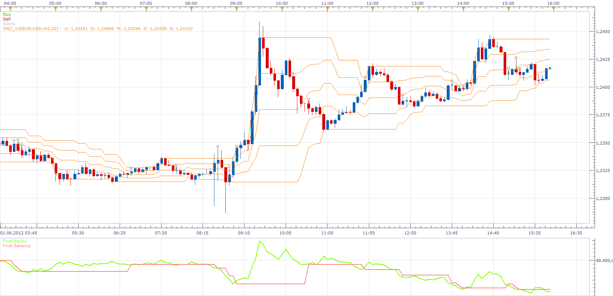
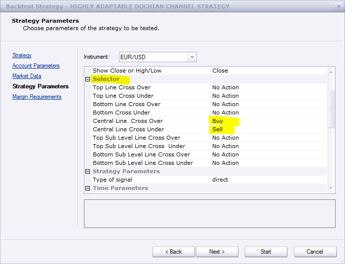
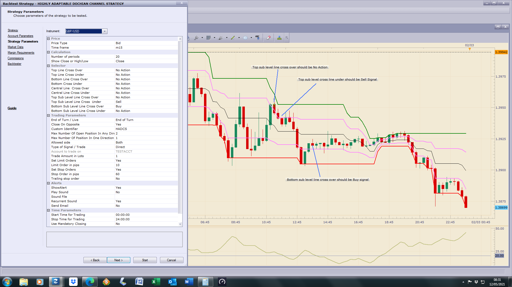

# Highly adaptable Dochian Channel Strategy

> Source: https://fxcodebase.com/code/viewtopic.php?f=31&t=19839  
> Forum: 31 · Topic 19839 · 29 post(s)

---

## Highly adaptable Dochian Channel Strategy

**Apprentice** · Mon Jun 04, 2012 2:11 pm

 [Highly adaptable Dochian Channel Strategy.lua](files/34983/Highly%20adaptable%20Dochian%20Channel%20Strategy.lua)

Make sure to downlaod, DNC_V3.lua indicator, You can find it here.
[viewtopic.php?f=17&t=20&hilit=Dochian+Channel+Indicator](https://fxcodebase.com/code/viewtopic.php?f=17&t=20&hilit=Dochian+Channel+Indicator)

The Strategy was revised and updated on December 18, 2018.

---

## Re: Highly adaptable Dochian Channel Strategy

**69TomD** · Fri Feb 08, 2013 1:10 pm

Hello everyone, can't make it working. Backtested USD CHF 4H, trading allowed, non FIFO with hedging, still have a balance and equity flat line, no signals, no nothing. Could be wrong account type? Anybody has an idea? Thanks for advice

---

## Re: Highly adaptable Dochian Channel Strategy

**Apprentice** · Sun Feb 10, 2013 6:07 am

By default, strategy do not do anything.
You have to choose desired action.

---

## Re: Highly adaptable Dochian Channel Strategy

**69TomD** · Tue Feb 12, 2013 2:41 am

Don't get any signals on top and bottom line crosses. only central line. I Don't use sub levels.

---

## Re: Highly adaptable Dochian Channel Strategy

**Apprentice** · Tue Feb 12, 2013 1:46 pm

Can you post your Strategy Parameters here, use screen capture.

---

## Re: Highly adaptable Dochian Channel Strategy

**69TomD** · Wed Feb 13, 2013 12:19 am

I don't know how to take print screen and insert a pic in Win7

Bid
H4
50
High/low
Buy [Top line cross over - is it the long breakout? ]
no action
no action
Sell [ Bottom line cross under - Short breakout? ]
6 x no action
direct
side Both
no multiple
1 lot
yes limit
30
yes stop order
30

---

## Re: Highly adaptable Dochian Channel Strategy

**Apprentice** · Wed Feb 13, 2013 5:23 am

Unfortunately this is normal.
Dochian Channel will give you a high / low value of past N periods, Including the last period.
So, for price, it is impossible, in this implementation, to cross, top / bottom line.

---

## Re: Highly adaptable Dochian Channel Strategy

**69TomD** · Wed Feb 20, 2013 2:05 am

What are those first four parameters for [top/bottom line cross over/under]? Could you possibly recode this strategy so that we can use it on tick breakout?

---

## Re: Highly adaptable Dochian Channel Strategy

**Apprentice** · Wed Feb 20, 2013 5:54 am

In theory yes.
If i do not use last (current) period in the calculation.

---

## Re: Highly adaptable Dochian Channel Strategy

**LearningForex** · Fri Mar 08, 2013 12:07 am

Hi Apprentice,

Thanks for all your hard work! I think a solution to the Upper & lower bands would be to use the value of the previous time frame of the DNC bands, not the current band, while using the current price. Therefore, the time frame for valuing if Price breaks the DNC upper or lower bands is always one time frame behind the current price. That way Price could "break" the bands. I hope I have explained the concept. I believe this idea will fix the problem of Price never "breaking" the DNC bands. I look forward to your reply.

---

## Re: Highly adaptable Dochian Channel Strategy

**davidnwatson** · Wed May 21, 2014 1:40 pm

Is it possible to add the following to this strategy..

1. Live/End of Turn
2. Allow to open a entry in so many pips away from price
3. the option to create an entry (#2) on each new candle

David

---

## Re: Highly adaptable Dochian Channel Strategy

**Apprentice** · Fri May 23, 2014 2:53 am

Your request is added to the development list.

---

## Re: Highly adaptable Dochian Channel Strategy

**Harris** · Sat Feb 07, 2015 12:44 am

Hi,
I have a question for this great strategy. Does it work with RENKO Chats?
If not, can it be altered so it does?

Regards

---

## Re: Highly adaptable Dochian Channel Strategy

**jaricarr** · Wed Jul 20, 2016 4:11 pm

Hi Apprentice,

Please add

End of turn / Live
Close on opposite: yes / no

Also, looks like the strategy is ignoring the "close position" parameters. It will only make trades if a "limit" is specified.

thanks
JC

---

## Re: Highly adaptable Dochian Channel Strategy

**Apprentice** · Mon Aug 08, 2016 8:03 am

Major update.

End of turn / Live & Close on opposite: yes / no added.

---

## Re: Highly adaptable Dochian Channel Strategy

**albertparis** · Fri Dec 16, 2016 3:32 pm

Hello, there is a beug

Error message
Extenson alert :

C:/Program Files (x86)/Candleworks/FXTS2/Strategies/Custom/Highly adaptable Dochian Channel Strategy.lua:401: The first parameter must be a number

Flag DNC_V3.lua, install

Thank you for your work

---

## Re: Highly adaptable Dochian Channel Strategy

**Apprentice** · Fri Dec 16, 2016 7:43 pm

I could not reproduce.
You're probably have wrong DNC_V3.lua indicator version.

 [DNC_V3.lua](files/110010/DNC_V3.lua)

---

## Re: Highly adaptable Dochian Channel Strategy

**albertparis** · Sat Dec 17, 2016 4:00 am

It's oki thank you very much

---

## Re: Highly adaptable Dochian Channel Strategy

**spinemaligna** · Wed May 12, 2021 3:09 am

Hi all,

I was excited to find this strategy as it fits perfectly with my trading plan. However on backtesting it seems to produce incorrect signals. What I want it to do is produce a sell signal when candle crosses and closes below the the top sub level line and a buy signal when candle crosses and closes above the bottom sub level line. I think the screen shot explains this and shows what is happening.
As an added bonus, if this can get sorted, is it possible to add a filter so that signals are only given if ADX is above a certain level.

 

On backtesting centre line crosses it seems to be OK it is just the sub level lines that are misbehaving.
I have downloaded and used the most up to date version of DNC_v3
Hope this explains my problem.

Ross

---

## Re: Highly adaptable Dochian Channel Strategy

**Apprentice** · Wed May 12, 2021 5:12 am

Your request is added to the development list.
Development reference 470.

---

## Re: Highly adaptable Dochian Channel Strategy

**Apprentice** · Wed May 12, 2021 10:01 am

[Highly_adaptable_Dochian_Channel_with_adx_Strategy.lua](files/142056/Highly_adaptable_Dochian_Channel_with_adx_Strategy.lua)

Try this version.

---

## Re: Highly adaptable Dochian Channel Strategy

**spinemaligna** · Thu May 13, 2021 10:29 am

Fantastic work. Now working correctly and ADX filter giving 70/30 winrate straight out of the box. Starting to optimise now.

Many thanks

Ross

---

## Re: Highly adaptable Dochian Channel Strategy

**spinemaligna** · Fri May 14, 2021 3:32 am

Bit premature with my accolades unfortunately.
As per the two screenshots attached the strategy works as expected on backtest but on live chart it is working the wrong way round. The filter appears to work OK. Can it be fixed so that the strategy works on live charts as it does on backtest.
Hope this can be fixed as it looks highly promising.

Ross

---

## Re: Highly adaptable Dochian Channel Strategy

**Apprentice** · Fri May 14, 2021 4:35 am

What is your chart time frame?

---

## Re: Highly adaptable Dochian Channel Strategy

**spinemaligna** · Fri May 14, 2021 4:47 am

Tested on 5 min just to get a signal. Not triggered on one hour yet. Backtest worked on all timeframes I tried.

Ross

---

## Re: Highly adaptable Dochian Channel Strategy

**Apprentice** · Mon May 17, 2021 8:45 am

I don't see anything wrong on the screenshot. It's hard to tell, but black line isn't the one you have selected as a trigger

---

## Re: Highly adaptable Dochian Channel Strategy

**spinemaligna** · Tue May 18, 2021 4:28 pm

So in top screen shot which is backtest, top sub level line cross from above is sell on close of candle. This works correctly.
In bottom screen shot which is actual trading screen it is opening buy position on close of candle above top sub level line. This is incorrect. Buy position should occur on close of candle crossing bottom sub level line from below.
So if price crosses and closes below top sub level line a sell signal should be given and if price crosses and closes above bottom sub level line a buy signal should be given.
I don't understand why it works perfectly on backtest but is completely wrong on trading chart.
Can this please be sorted.

Ross

---

## Re: Highly adaptable Dochian Channel Strategy

**Apprentice** · Fri May 21, 2021 8:51 am

Your request is added to the development list.
Development reference 503.

---

## Re: Highly adaptable Dochian Channel Strategy

**Apprentice** · Wed May 26, 2021 12:25 pm

If it works in backtest then the code is OK.

It's a matter of how it executes the trades. It opens a market order.
And a market order open price could be away from the current price (bid/ask + slippage).
