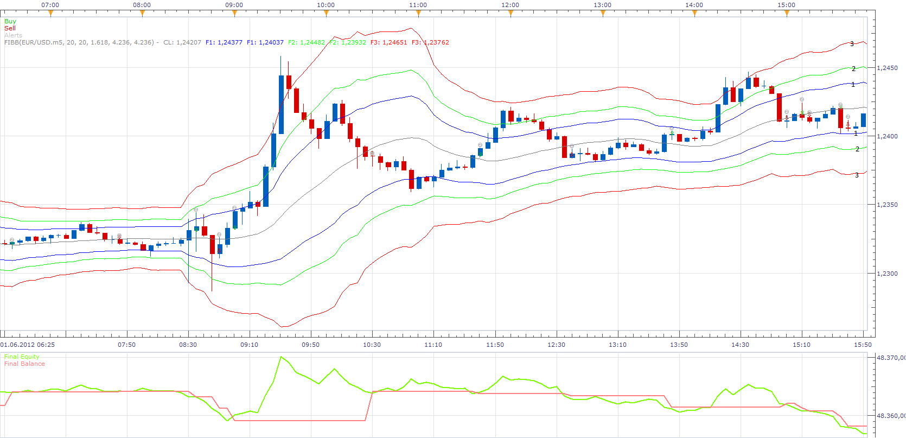

# Highly adaptable Fibonacci Bollinger Bands Strategy

> Source: https://fxcodebase.com/code/viewtopic.php?f=31&t=19904  
> Forum: 31 · Topic 19904 · 35 post(s)

---

## Highly adaptable Fibonacci Bollinger Bands Strategy

**Apprentice** · Tue Jun 05, 2012 5:20 am

The strategy provides a choice for definition up to 14 different signals,
all based on the Fibonacci Bollinger Bands.

 [Highly adaptable Fibonacci Bollinger Bands Strategy.lua](files/35067/Highly%20adaptable%20Fibonacci%20Bollinger%20Bands%20Strategy.lua)

**Fibonacci Bollinger Bands Strategy with Filters**
So the fibonacci and bollinger bands highly adaptable configuration would still be possible but would only be triggered if a specific or all checked trend filters would produce the same signal. If no trend filter is selected it works as now. The time period for the trend indicators should be configurable too.

1. MA
shorter MA crosses above longer MA > BUY Signal
shorter MA crosses below longer MA > SELL Signal

2. MA
shorter MA(12) crosses above longer MA(26) > BUY Signal
shorter MA(12) crosses below longer MA(26) > SELL Signal

ROC:
price is going up and ROC is going down > SELL Signal
price is going down and ROC is going up > BUY Signal

RSI:
overbought position above 70 > SELL Signal
obersold position below 30 > BUY Signal

 [Fibonacci Bollinger Bands Strategy with Filters.lua](files/35067/Fibonacci%20Bollinger%20Bands%20Strategy%20with%20Filters.lua)

Please install FIBB indicator, from here.
[viewtopic.php?f=17&t=2065](https://fxcodebase.com/code/viewtopic.php?f=17&t=2065)

The Strategy was revised and updated on December 18, 2018.

---

## Re: Highly adaptable Fibonacci Bollinger Bands Strategy

**4xtr8r** · Tue Jun 05, 2012 10:59 pm

Apprentice,

I see you have #1, #2, and #3... can you tell me what # corresponds with what line?

I tried "selling" on line #3 thinking it would short on the top most outer line, but it sold on the 2nd outer line (not the very top outer line).

I'm a bit confused on the numbers... can you tell what # corresponds with what line?

Thank you.

---

## Re: Highly adaptable Fibonacci Bollinger Bands Strategy

**Apprentice** · Wed Jun 06, 2012 12:29 am

Sorry for the inconvenience.
 I have mix up the indexes.
 Fixed now.

---

## Re: Highly adaptable Fibonacci Bollinger Bands Strategy

**4xtr8r** · Wed Jun 06, 2012 9:18 am

Hi,

Can you explain again the what the #'s mean? What corresponds to the fib line?

Again, I put sell on "1. Top Line cross over" and it shorted on the 2nd fib line, not the top outer most.

Also, I noticed the trade triggers when the bar closes. Can you put it when it simply touches or crosses?

One last question, what does "type of signal / direct or reverse" mean?

Thank you.

---

## Re: Highly adaptable Fibonacci Bollinger Bands Strategy

**Apprentice** · Thu Jun 07, 2012 3:06 am

I added the line indices.
 If you use a reverse, strategies open position in opposite direction,
 from the direction that is suggested by trading algorithm.

---

## Re: Highly adaptable Fibonacci Bollinger Bands Strategy

**4xtr8r** · Thu Jun 07, 2012 9:16 am

Excellent. Is there way for an order to be triggered if it touches or crosses over/under the line instead of waiting for the bar to close? thank you!

---

## Re: Highly adaptable Fibonacci Bollinger Bands Strategy

**Apprentice** · Tue Jun 12, 2012 2:49 am

If I find time, I will try to offer something.

---

## Re: Highly adaptable Fibonacci Bollinger Bands Strategy

**Japoni** · Tue Jul 10, 2012 1:40 am

I like the idea of this strategy.

I am having a couple issues with it, I have a bit of programming knowledge just not in this field.

1) I had to fix Action section 11, the pull down wasn't working.

2) this one I have no clue on the line that reads
 - I am getting an error "attempt to index global 'indicators' (a nil vale)"
 - I did get a previous error because I didn't have FIBB installed
 - there are two lines and it is failing on the second one

 Source = ExtSubscribe(1, nil, instance.parameters.TF, instance.parameters.Type == "Bid", "bar");
 indicators[1]= core.indicators:create("FIBB", Source, MF, AF, F[1], F[2], F[3]);

 the MF was MD, which I thought was the reason but no such luck.

 there is a nil in the setting of the Source, is that for datasource.

When you have a chance can you take alook at it for me

Thanking you in advance

---

## Re: Highly adaptable Fibonacci Bollinger Bands Strategy

**Apprentice** · Tue Jul 10, 2012 4:13 am

After review of code, I found and fix a bug with, 11.
As far i can see everything else is ok.

---

## Re: Highly adaptable Fibonacci Bollinger Bands Strategy

**Japoni** · Tue Jul 10, 2012 1:17 pm

Ok cool, it's okay that the FIBB is installed only as a custom indicator?

Or does it have to be installed as a standard indicator, if so how?
The reason I ask is because I can't see the whole path in the error message, the path is truncated?

---

## Re: Highly adaptable Fibonacci Bollinger Bands Strategy

**Apprentice** · Wed Jul 11, 2012 5:07 am

FIBB is can b custom indicator, is not standard one.

---

## Re: Highly adaptable Fibonacci Bollinger Bands Strategy

**rtsayers** · Thu Dec 27, 2012 4:50 pm

I wanted to request a BBand strategy.
Here's what is strategy itself:

1. Bbands 30, DEMA, 0.8 0.8
2. SMA 55
if (openPrice <bands[upper] AND bidPrice> bands [upper] AND bidPrice> sma55) ==> BUY
if (openPrice> bands [lower] && bidPrice <bands [lower] && bidPrice <sma55) ==> SELL

Thanks A TON!!

---

## Re: Highly adaptable Fibonacci Bollinger Bands Strategy

**Apprentice** · Fri Dec 28, 2012 3:18 am

Your request is added to the development list.

---

## Re: Highly adaptable Fibonacci Bollinger Bands Strategy

**mjf1288** · Wed Apr 03, 2013 11:25 pm

Hello,

This is a really great strategy and I have a request that could make it better. Could you please modify it so that it opens positions based on tick rather than have to wait for the bar to close? Thank you very much.

---

## Re: Highly adaptable Fibonacci Bollinger Bands Strategy

**Apprentice** · Thu Apr 04, 2013 5:01 am

Your request is added to the development list.

---

## Re: Highly adaptable Fibonacci Bollinger Bands Strategy

**mjf1288** · Thu Apr 04, 2013 6:03 pm

This strategy does not seem to be working correctly. It is opening positions when price does NOT cross over the levels. I would greatly appreciate it if someone could work on these requests to correct this strategy. I think it is a really great system, it just needs a little work. Thanks!

---

## Re: Highly adaptable Fibonacci Bollinger Bands Strategy

**4xtr8r** · Mon Nov 18, 2013 8:24 pm

Hi Apprentice,

Can you change it so that is does immediate execution when it hits desired fib band?

Also, can you clarify which bands correspond to which # in the strategy parameters?

Thanks!

---

## Re: Highly adaptable Fibonacci Bollinger Bands Strategy

**Apprentice** · Tue Nov 19, 2013 2:45 pm

Your request is added to the development list.

---

## Re: Highly adaptable Fibonacci Bollinger Bands Strategy

**toxxum** · Tue Nov 26, 2013 2:21 am

I have been running the strategy on a real-money account for a while now and am puzzled that the closed trades never even get close to either the stoploss or the target profit that was specified in the settings.

The TP and SL are both set at 18, yet the strategy closes trades at will at anything between -5.2 and +3.6 pips. Does anyone have a clue what the problem is?

Thanks!

---

## Re: Highly adaptable Fibonacci Bollinger Bands Strategy

**Valeria** · Tue Nov 26, 2013 11:32 pm

Hi toxxum,

The strategy can close the position itself if there are the relevant conditions.

---

## Re: Highly adaptable Fibonacci Bollinger Bands Strategy

**toxxum** · Wed Nov 27, 2013 2:49 am

Hi Valeria,

What are those relevant conditions? I cannot see any other options in the settings menu so how can I figure out what conditions were defined by the programmer?

---

## Re: Highly adaptable Fibonacci Bollinger Bands Strategy

**Valeria** · Tue Dec 03, 2013 5:49 am

Hi toxxum,

Sorry for the confusion. The strategy does exactly what you set in the parameters. You should note that the strategy will close the position in the opposite direction when it opens the new position. For example, you have an open buy position and there is the condition to open a sell position. In this case the buy position will be closed and only after that the sell position will be opened. You can see it in the log. To open log please go to Alerts and Trading Automation->Show Events.

---

## Re: Highly adaptable Fibonacci Bollinger Bands Strategy

**toxxum** · Wed Dec 04, 2013 6:39 am

Thanks Valeria,

I will give it another try.

Cheers!

---

## Re: Highly adaptable Fibonacci Bollinger Bands Strategy

**JOKER83** · Sun Feb 01, 2015 6:13 pm

PLEAS CAN YOU MAKE
Hochflexible Fibonacci Bollinger Bands Strategie
CONFIRM
ONE AVERAGE
METHOD EMA-MVA........
PERIOD
TIMEFRAME
ON/OFF

TWO AVERAGE
METHOD EMA-MVA........
PERIOD
TIMEFRAME
ON/OFF
AND A INDICATOR FOR SIGNALS

---

## Re: Highly adaptable Fibonacci Bollinger Bands Strategy

**Apprentice** · Tue Feb 03, 2015 9:37 am

Your request is added to the development list.

---

## Re: Highly adaptable Fibonacci Bollinger Bands Strategy

**PromQueen** · Tue Oct 20, 2015 1:46 pm

Hi,

Would it be possible to modify this strategy and include trend indicators like: sma, macd, roc, rsi?

best

---

## Re: Highly adaptable Fibonacci Bollinger Bands Strategy

**Apprentice** · Thu Oct 22, 2015 4:40 am

As filter.
Open position if confirmed by trend indicator.
Sure.
Can you specify your request.

Something like this.
Open Long
1) Confirmation.
if price > SMA
2) Confirmation.
if MACD > SIGNAL
...

---

## Re: Highly adaptable Fibonacci Bollinger Bands Strategy

**PromQueen** · Thu Oct 22, 2015 11:34 am

> **Apprentice wrote:**
> As filter.
> Open position if confirmed by trend indicator.
> Sure.
> Can you specify your request.
>
> Something like this.
> Open Long
> 1) Confirmation.
> if price > SMA
> 2) Confirmation.
> if MACD > SIGNAL
> ...

Yes sure. It this ok?

It should be possible to choose which trend indicator to apply. For example:

SMA,	x
MACD,
ROC,
RSI

So the fibonacci and bollinger bands highly adaptable configuration would still be possible but would only be triggered if a specific or all checked trend filters would produce the same signal. If no trend filter is selected it works as now. The time period for the trend indicators should be configurable too.

SMA:
shorter MA crosses above longer MA > BUY Signal
shorter MA crosses below longer MA > SELL Signal

MACD(12,26,9):
shorter EMA(12) crosses above longer EMA(26) > BUY Signal
shorter EMA(12) crosses below longer EMA(26) > SELL Signal

ROC:
price is going up and ROC is going down > SELL Signal
price is going down and ROC is going up > BUY Signal

RSI:
overbought position above 70 > SELL Signal
obersold position below 30 > BUY Signal

---

## Re: Highly adaptable Fibonacci Bollinger Bands Strategy

**Apprentice** · Fri Oct 23, 2015 6:00 am

Fibonacci Bollinger Bands Strategy with Filters Added.
See top/first post in this topic.

---

## Re: Highly adaptable Fibonacci Bollinger Bands Strategy

**PromQueen** · Fri Oct 23, 2015 10:59 am

> **Apprentice wrote:**
> Fibonacci Bollinger Bands Strategy with Filters Added.
> See top/first post in this topic.

Fantastic. Thank you.

---

## Re: Highly adaptable Fibonacci Bollinger Bands Strategy

**PromQueen** · Fri Oct 23, 2015 3:29 pm

> **Apprentice wrote:**
> Fibonacci Bollinger Bands Strategy with Filters Added.
> See top/first post in this topic.

Great. Thank you.

---

## Re: Highly adaptable Fibonacci Bollinger Bands Strategy

**dandee** · Wed Jan 13, 2016 6:15 pm

Does anyone know how this strategy is suppose to work, I'm more interested in the fibonacci section, is the strategy suppose to open a position at one of those levels and how does the atr play a part in this and if the lines are for bollinger band how do you change the deviation value. I'm assming the must be an indicator somewhere to go with this since there is a screen shot of one but I cant seems to find it.

---

## Re: Highly adaptable Fibonacci Bollinger Bands Strategy

**dandee** · Thu Jan 14, 2016 3:08 pm

I think this strategy must have been given the wrong name or I have the wrong impression of what fibonacci ratio is, I had a quick look at the code and it seems to be some form of moving average cross strategy, Is there anyone who have used it or know how it works or was it just been downloaded 1150 times for the fun of it?

---

## Re: Highly adaptable Fibonacci Bollinger Bands Strategy

**Apprentice** · Wed Jan 27, 2016 8:27 am

I'm just a developer.
I write them as requested.

Strategy is based on the Fibonacci Bollinger Bands indicator as described.
[viewtopic.php?f=17&t=2065](https://fxcodebase.com/code/viewtopic.php?f=17&t=2065)

---

## Re: Highly adaptable Fibonacci Bollinger Bands Strategy

**Apprentice** · Wed Dec 14, 2016 4:51 am

Strategy was revised and updated.
