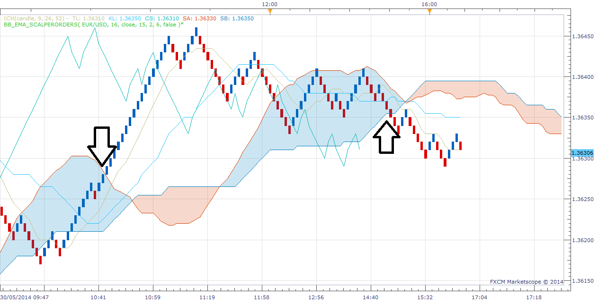
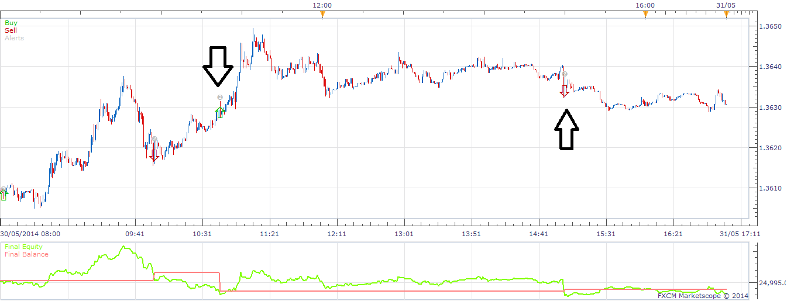

# Highly Adaptable Ichimoku Renko Strategy

> Source: https://fxcodebase.com/code/viewtopic.php?f=31&t=60749  
> Forum: 31 · Topic 60749 · 4 post(s)

---

## Highly Adaptable Ichimoku Renko Strategy

**moomoofx** · Sun Jun 01, 2014 12:50 am

Hi Everyone,

Introducing the Highly Adaptable Ichimoku Renko Strategy. Similar to the Highly Adaptable Ichimoku Strategy ([viewtopic.php?f=31&t=31550](https://fxcodebase.com/code/viewtopic.php?f=31&t=31550)) this works on the Renko Chart New view ([viewtopic.php?f=17&t=60748](https://fxcodebase.com/code/viewtopic.php?f=17&t=60748)).

Make sure you have the Renko Chart New view installed first.

This strategy was mostly created as an example strategy to show how to create strategies on top of the Renko Chart New view, and this also meets the strategy requested here ([viewtopic.php?f=27&t=60122](https://fxcodebase.com/code/viewtopic.php?f=27&t=60122)) which requests that trades made as the price crosses the cloud.

 [RenkoHAIchimoku.lua](files/94237/RenkoHAIchimoku.lua)

The following screenshot shows the Ichimoku on the View, and where the signals should be generated.

 

The following screenshot shows the equivalent trades in the backtester. Unfortunately as far as I know it isn't possible to load the view in the backtester.

 

Cheers,
MooMooFX

**FOR THE DEVELOPERS**
Just some tips when writing strategies on this view.
- There are no events triggered by views yet, so it is impossible for the strategy to know if there has been an update to the chart. The way to tackle this is to check as frequently as possible, which basically means we check on every tick.
- If we check on every tick, it is possible that the view has not been updated, so we do not want to generate multiple signals off the same renko bar - be careful.
- Oppositely, it is possible that the renko view will create multiple bricks in the same update (gaps, low brick size etc). Therefore, we need to remember the last brick we checked and make sure we check for signals on every new brick since then.
- As far as I know, it is not possible to create views on the strategy backtester, so testing is incredibly difficult. Your best bet is to manually create the view in another window beside the backtester and try to sync up the signals datetimestamps (as I have done in the two screenshots above)
- Lastly, as per all strategies, history is not loaded in advance on the backtester. If your brick size is sufficiently high, a large amount of data may be required before the strategy is ready to trade. For example, if your EMA indicator needs 200 bars of data, and your brick size is 100, do you care to guess how many weeks of price data you will need to get 200 renko bricks? Think about it and keep this in mind.

The Strategy was revised and updated on December 18, 2018.

---

## Re: Highly Adaptable Ichimoku Renko Strategy

**rose123** · Fri Jun 06, 2014 9:49 am

hi,
...eworks\FXTS2\Indicators\Custom\Renko_candles_New.lua:397: Command is not supported

this error developed when running back test this strategy

---

## Re: Highly Adaptable Ichimoku Renko Strategy

**panos59** · Mon Jan 04, 2016 8:43 am

is it possible to add the "price/tenkan crossover" and "price/tenkan crossunder" selectors ?
Thanks in advance!!

---

## Re: Highly Adaptable Ichimoku Renko Strategy

**Apprentice** · Wed Dec 14, 2016 4:26 am

Strategy was revised and updated.
