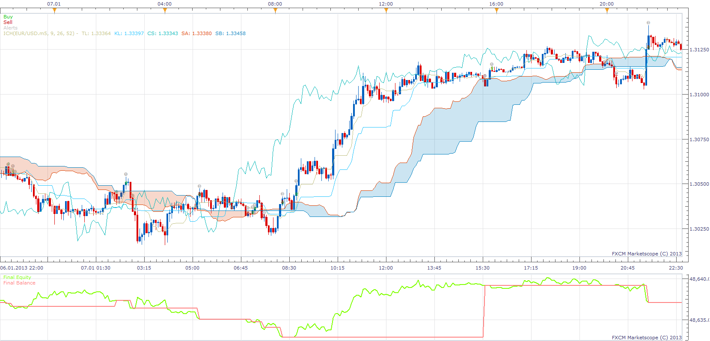

# Highly adaptable Ichimoku Stategy

> Source: https://fxcodebase.com/code/viewtopic.php?f=31&t=31550  
> Forum: 31 · Topic 31550 · 61 post(s)

---

## Highly adaptable Ichimoku Stategy

**Apprentice** · Wed Jan 30, 2013 6:08 am



Trading Events
SL / TL Cross
CS / Price Cross
Top Cloud / Cross Price
Bottom Cloud / Cross Price

Trading Actions.
Buy, Sell, Close, Alert

For any of Trading Events, You can define one Trading Actions from list.

In this example.
Top Cloud Line / Price Crossover
Open Long Position
Top Cloud Line / Price Crossunder
Close Long Position.
Bottom Cloud Line / Price Crossunder
Open Short Position
Bottom Cloud Line / Price Crossover
Close Short Position.

 [Highly adaptable Ichimoku Stategy.lua](files/53812/Highly%20adaptable%20Ichimoku%20Stategy.lua)

---

## Re: Highly adaptable Ichimoku Stategy

**Apprentice** · Fri Feb 01, 2013 2:06 pm

Chinkou / Cloud Crossover, CA / CB Crossover Added.

---

## Re: Highly adaptable Ichimoku Stategy

**allisonmagic** · Fri Feb 01, 2013 2:22 pm

wicked, thanks Apprentice ! you da man !

---

## Re: Highly adaptable Ichimoku Stategy

**allisonmagic** · Fri Feb 01, 2013 3:24 pm

still alerting when price crosses cloud... after disabling..

not alerting of chinkou span crossing down or up above or below the KUMO in some places

---

## Re: Highly adaptable Ichimoku Stategy

**benben99** · Sat Feb 02, 2013 12:39 pm

helllo bud
thanks for the work
i cant understand what is the option that allows it to trade if the price breaks the kejun?
can u please help?
and please if u can finish the kejun strategy u start for me , all u need is to add seperate stops and limits for each lot so i can backtest it the way it should
and again thanks alot
benben

---

## Re: Highly adaptable Ichimoku Stategy

**Apprentice** · Mon Feb 04, 2013 5:49 am

Use CS / Price Cross Over
As for the different Stop / Limits, I'm not sure how we can do this.
You'll have to do this work manually.
Please elaborate.

---

## Re: Highly adaptable Ichimoku Stategy

**sartas** · Fri Apr 05, 2013 11:55 am

hello , very good job

can u add condition for open long position (Tenkan>Kijun>Top Cloud)

and add condition for open short position (Tenkan<Kijun<Bottom cloud)

Thx a lot

---

## Re: Highly adaptable Ichimoku Stategy

**Apprentice** · Sat Apr 06, 2013 4:43 am

Your request is added to the development list.

---

## Re: Highly adaptable Ichimoku Stategy

**sartas** · Sat Apr 06, 2013 6:20 am

I find myself how to change this , I working on a developement of this strategie I develope condition for buy position the result is good some amelioration are possible cf screenshoot on long position during 2 years : +50% on long position only , I'am working for buy ans sell to optimise this.

Uploaded with [ImageShack.us](http://imageshack.us)

---

## Re: Highly adaptable Ichimoku Stategy

**sartas** · Fri Apr 12, 2013 5:22 am

So after , lot off backtesting I find the good condition for use this strategy.

but I don't find how to Buy and sell whith the same strategy because condition to open sell and close Buy it's not the same like open Buy don't have the same condition than to close Sell!

so I make 2 strategys one for Buy et and one for sell(actualy I use only SL/TL cross I am looking for the oser ligne cross)

look at this backtest during 3 years 2010-->2012 for BUY and SELL direction

**for optimise this strategy can u add an ATR trailing stop Loose
and a second indicator ichimoku iwhith another time frame
and an adaptable trade amount lot in function of the actual equity or balance??**

screen of basket attached:

---

## Re: Highly adaptable Ichimoku Stategy

**lucky66** · Wed May 08, 2013 3:15 pm

Hello,

Very good strategy and very good job.
Can you add the following condition : Price crossover Kijun and Price croosunder Kijun.

Thanks a lot.

---

## Re: Highly adaptable Ichimoku Stategy

**Apprentice** · Sat May 11, 2013 2:08 am

Your request is added to the development list.

---

## Re: Highly adaptable Ichimoku Stategy

**cheekiboi** · Sun Jun 30, 2013 5:01 am

Hey Apprentice, thanks for the strategy, looking forward to see if it will work!

what are the best conditions to use for this? cheers

---

## Re: Highly adaptable Ichimoku Stategy

**Zizzle** · Sun Sep 08, 2013 6:21 pm

Hello Apprentice,

Could you please add an alert for when the CS crosses the TL and SL?

Thanks in advance.

---

## Re: Highly adaptable Ichimoku Stategy

**Apprentice** · Mon Sep 09, 2013 2:10 am

SL stands for?

---

## Re: Highly adaptable Ichimoku Stategy

**rkardatzke** · Thu Nov 21, 2013 4:08 am

is there a way to allow this to use data from the renko chart view on marketscopes , so it would send alerts based on renko candles ?

---

## Re: Highly adaptable Ichimoku Stategy

**Apprentice** · Sat Nov 23, 2013 5:51 am

Unfortunately this is not possible at this time.

---

## Re: Highly adaptable Ichimoku Stategy

**arunaa** · Mon Dec 16, 2013 3:31 pm

Hello,

Very good strategy and very good job..
Can you add the following condition : Price crossover Kijun(buy) and Price crossunder Kijun(sell)

The terminology is as follows:

TL ==> Tinkun sen Line
KL ==> Kijun Sen line
CS==>> Chinkou Span
SA ==>> Cloud Span A
SB == >> CloudSpan B

Thanks,
Aaron

---

## Re: Highly adaptable Ichimoku Stategy

**arunaa** · Mon Dec 16, 2013 6:15 pm

> **Apprentice wrote:**
> Your request is added to the development list.

Hi Apprentice,
Were you able to code this strategy ?
Could you add the following entry option too ?

Use Ichimoku Kijun Sen line ...

when price crosses over KL go long
when price crosses under KL go short

No Stoploss.. Just the contrarian signal when price moves above or below the Kijun Sen ..

Could this be done ?

Thanks a lot for your help..

---

## Re: Highly adaptable Ichimoku Stategy

**Apprentice** · Sat Dec 21, 2013 7:59 am

Price / TL(KL) Cross Added.

---

## Re: Highly adaptable Ichimoku Stategy

**mazatov** · Mon Dec 23, 2013 12:33 am

Hello Apprentice,

Thanks for putting this up here. I was trying to run a backtest on the following condition.

To buy: when the Price>Kijun>Cloud. To close when price < Kijun
To sell: when the Price< Kijun<Cloud. To close when price price > Kijun.

Is it possible to set up these conditions on your strategy ? I couldn't figure out how.

Also what is SL in your settings ? You have SL/TL crossover there. You mention in the previous post that you have added Kijun Sen as KL to the strategy, but I couldn't see it. Is it possible that I'm still downloading the older version ?

I have just joined the FXCodeBase so it's quite possible that I'm just missing something
Thanks for your input,
Looking forward to hearing from you,
Happy Holidays!

---

## Re: Highly adaptable Ichimoku Stategy

**Apprentice** · Mon Dec 23, 2013 11:51 am

SL is in Fact TL
TL is in Fact KL
Do not ask why.
Someone who has written original ICH indicator have make this confusion.

```lua
SL = instance:addStream("SL", core.Line, name .. ".TL", "TL", instance.parameters.clrTS, firstPeriod + Tenkan - 1)

TL = instance:addStream("TL", core.Line, name .. ".KL", "KL", instance.parameters.clrKS, firstPeriod + Kijun - 1)
```

Unfortunately, complex conditions can not be achieved with this Strategy.
Just a simple HA component interactions are supported.

---

## Re: Highly adaptable Ichimoku Stategy

**panos59** · Mon Dec 23, 2013 12:24 pm

Is it possible to have the exact terminology which is used to this strategy ? I think the strategy works well but its still confusing with the used shortnames ..if somebody can go through the startegy and tell us what TL stands for KS stands for and so on . I'll be thankfull

---

## Re: Highly adaptable Ichimoku Stategy

**Jacques** · Wed Jan 29, 2014 8:02 am

Hi there. Thanks for such awesome strategy, Apprentice.

I'd like to request a Cross Over and Cross Under between CS (Chikou Span) / TL (Kijun-Sen Line) if possible. Seems like they have good timing to cross between each other. Thanks for your attention, Apprentice.

---

## Re: Highly adaptable Ichimoku Stategy

**Apprentice** · Thu Jan 30, 2014 3:58 am

Your request is added to the development list.

---

## Re: Highly adaptable Ichimoku Stategy

**moomoofx** · Fri May 30, 2014 3:16 am

Hi everyone,

I have tidied up code, fixed some descriptions and clarified the namings.

The history here is the Indicator was originally written incorrectly, then it was corrected but the descriptions were fixed but the line names were still wrong internally and this is where the confusion comes from (Apprentice pointed this out earlier).

In this new version, this is what the acronyms mean, and this is aligned with the official Ichimoku definition.

TL = Tenkan-sen (Conversion Line)
KL = Kijun-sen (Base Line)
CS = Chikou Span (Lagging Span)
SA = Senkou Span A (Leading Span A)
SB = Senkou Span B (Leading Span B)
Cloud = Area formed between SA and SB.

This means that....
- What was previously called SL is now TL.
- What was previously called TL is now KL.

Additionally I have
- Added a CloseOnOpposite parameter to control this behavior.
- Added actions for when the CS crosses KL or TL lines (requested twice above).

Because I have changed namings, to avoid confusion I will upload the new version here, maintaining the old version in the original post.

 [Highly adaptable Ichimoku Stategy.lua](files/94201/Highly%20adaptable%20Ichimoku%20Stategy.lua)

Cheers,
MooMooFX

---

## Re: Highly adaptable Ichimoku Stategy

**sqrrl99** · Wed Jul 16, 2014 1:20 pm

MooMooFX,

Thanks for cleaning this up. One area that I was hoping you could help me with. On the TL/KL crosses, when they are equal for a bar or more, and then complete the cross, no signal is generated. Is that fixable?

As always, appreciate any help you can give,

Jason

---

## Re: Highly adaptable Ichimoku Stategy

**sqrrl99** · Fri Jul 18, 2014 2:43 am

I am also seeing problems with this strategy on the SA/SB crosses. No signals (or close positions) are working when the two lines are equal for any period of time.

Once again, appreciate any help you can offer.

Jason

---

## Re: Highly adaptable Ichimoku Stategy

**sqrrl99** · Fri Jul 18, 2014 10:13 pm

Not sure if anyone has a chance to work on this yet, but I found the same problem with the SA/SB crosses. If SA equals SB for any period, then the strategy does not buy, sell, or close position when the cross finally happens.

If anyone could help this, it would be greatly appreciated.

Jason

---

## Re: Highly adaptable Ichimoku Stategy

**Apprentice** · Thu Aug 20, 2015 7:15 am

Major Update.
First/Topmost Post.

---

## Re: Highly adaptable Ichimoku Stategy

**lancelune** · Thu Aug 27, 2015 4:10 am

hello,

in backtest i have the same problem.
On the TL/KL crosses, when they are equal for a bar or more, and then complete the cross, no signal is generated. Is that fixable ?

thanks.

---

## Re: Highly adaptable Ichimoku Stategy

**lancelune** · Mon Aug 31, 2015 1:13 pm

hello

bug when close position is select. i think is when there are no position and a new close position is send.

Error Message:
...ategies\Custom\Highly adaptable Ichimoku Stategy.lua:422: attempt to call global 'exit' (a nil value)

good day
Thank

---

## Re: Highly adaptable Ichimoku Stategy

**JOKER83** · Wed Oct 21, 2015 6:10 am

can you make strategy
with ichimoku cloud to confirm
of other time

---

## Re: Highly adaptable Ichimoku Stategy

**Apprentice** · Thu Oct 22, 2015 4:46 am

Your request is added to the development list.

---

## Re: Highly adaptable Ichimoku Stategy

**JOKER83** · Wed Dec 02, 2015 7:51 pm

> **JOKER83 wrote:**
> can you make strategy
> with ichimoku cloud to confirm
> of other time

Please
can you make this

---

## Re: Highly adaptable Ichimoku Stategy

**cnikitopoulos94** · Fri Dec 04, 2015 12:22 am

Recieving same Error. For the Ichimoku i will try to fix it when i get the chance

---

## Re: Highly adaptable Ichimoku Stategy

**JOKER83** · Sat Dec 12, 2015 7:54 pm

can you make strategy
with ichimoku cloud to confirm
of other time

---

## Re: Highly adaptable Ichimoku Stategy

**JOKER83** · Sun Dec 13, 2015 4:50 pm

> **JOKER83 wrote:**
> can you make strategy
> with ichimoku cloud to confirm
> of other time

PLEASE make this
and
PRICE/TL CROSS OVER
PRICE/TL CROSS UNDER

---

## Re: Highly adaptable Ichimoku Stategy

**Apprentice** · Wed Dec 16, 2015 5:47 am

"Price / TL Cross Over" is already in the list of available methods.
Only invert it. CrossOver for CrossUnder.

---

## Re: Highly adaptable Ichimoku Stategy

**JOKER83** · Wed Dec 16, 2015 6:05 pm

> **moomoofx wrote:**
> Hi everyone,
>
> I have tidied up code, fixed some descriptions and clarified the namings.
>
> The history here is the Indicator was originally written incorrectly, then it was corrected but the descriptions were fixed but the line names were still wrong internally and this is where the confusion comes from (Apprentice pointed this out earlier).
>
> In this new version, this is what the acronyms mean, and this is aligned with the official Ichimoku definition.
>
> TL = Tenkan-sen (Conversion Line)
> KL = Kijun-sen (Base Line)
> CS = Chikou Span (Lagging Span)
> SA = Senkou Span A (Leading Span A)
> SB = Senkou Span B (Leading Span B)
> Cloud = Area formed between SA and SB.
>
> This means that....
> - What was previously called SL is now TL.
> - What was previously called TL is now KL.
>
> Additionally I have
> - Added a CloseOnOpposite parameter to control this behavior.
> - Added actions for when the CS crosses KL or TL lines (requested twice above).
>
> Because I have changed namings, to avoid confusion I will upload the new version here, maintaining the old version in the original post.
>
>
> Highly adaptable Ichimoku Stategy.lua
>
>
> Cheers,
> MooMooFX

SORRY THIS VERSION FROM moomoofx
IS ONLY
PRICE/KL CROSS OVER

---

## Re: Highly adaptable Ichimoku Stategy

**Apprentice** · Mon Dec 21, 2015 6:28 am

Try it now.

---

## Re: Highly adaptable Ichimoku Stategy

**JOKER83** · Mon Dec 21, 2015 10:59 am

BEAUTIFUL THANKS

can you make
 TWO
ichimoku cloud to confirm
of other time
with on off option

ICHIMOKU CLOUD TO CONFIRM
TIME
RIGHT WRONG

ICHIMOKU CLOUD TO CONFIRM
TIME
RIGHT WRONG

---

## Re: Highly adaptable Ichimoku Stategy

**JOKER83** · Sun Jan 10, 2016 7:25 pm

> **JOKER83 wrote:**
> BEAUTIFUL THANKS
>
> can you make
> TWO
> ichimoku cloud to confirm
> of other time
> with on off option
>
> ICHIMOKU CLOUD TO CONFIRM
> TIME
> RIGHT WRONG
>
> ICHIMOKU CLOUD TO CONFIRM
> TIME
> RIGHT WRONG

CAN You make this
I very happich

---

## Re: Highly adaptable Ichimoku Stategy

**ghendar** · Mon Feb 08, 2016 6:48 pm

Hi,

When I try to import this strategy in TS, error messages generated are the followings :
- attempt to index global 'strategy' (a nil value)
- the parameter with the specified id already exists

Could you give me a solution to solve these problems ?

Many thanks,
Ghendar

---

## Re: Highly adaptable Ichimoku Stategy

**Apprentice** · Wed Feb 10, 2016 5:35 am

Fixed.

---

## Re: Highly adaptable Ichimoku Stategy

**JOKER83** · Wed Feb 10, 2016 7:59 pm

> **moomoofx wrote:**
> Hi everyone,
>
> I have tidied up code, fixed some descriptions and clarified the namings.
>
> The history here is the Indicator was originally written incorrectly, then it was corrected but the descriptions were fixed but the line names were still wrong internally and this is where the confusion comes from (Apprentice pointed this out earlier).
>
> In this new version, this is what the acronyms mean, and this is aligned with the official Ichimoku definition.
>
> TL = Tenkan-sen (Conversion Line)
> KL = Kijun-sen (Base Line)
> CS = Chikou Span (Lagging Span)
> SA = Senkou Span A (Leading Span A)
> SB = Senkou Span B (Leading Span B)
> Cloud = Area formed between SA and SB.
>
> This means that....
> - What was previously called SL is now TL.
> - What was previously called TL is now KL.
>
> Additionally I have
> - Added a CloseOnOpposite parameter to control this behavior.
> - Added actions for when the CS crosses KL or TL lines (requested twice above).
>
> Because I have changed namings, to avoid confusion I will upload the new version here, maintaining the old version in the original post.
>
>
> Highly adaptable Ichimoku Stategy.lua
>
>
> Cheers,
> MooMooFX

CAN You make cloud to confirmation

---

## Re: Highly adaptable Ichimoku Stategy

**JOKER83** · Sun Mar 06, 2016 9:40 pm

cann you make a option

over the cloud only BUY
under the cloud SELL

AND a cloud to confirm other time

---

## Re: Highly adaptable Ichimoku Stategy

**albertparis** · Thu Nov 17, 2016 6:41 am

Hello, sorry for my English I am French.
Can we add: "custom identifier"
thanks in advance

---

## Re: Highly adaptable Ichimoku Stategy

**Apprentice** · Sat Nov 26, 2016 7:39 am

Your request is added to the development list, Under Id Number 3678
 If someone is interested to do this task, please contact me.

---

## Re: Highly adaptable Ichimoku Stategy

**oldporkchops2** · Fri Dec 09, 2016 11:58 am

Could someone please share settings that have been found to be profitable in forward testing? Thanks.

---

## Re: Highly adaptable Ichimoku Stategy

**MaximeM24** · Mon Apr 09, 2018 5:11 am

Hello,
Can you do an option when price crosses over or crosses under KijunSen?
Thank you very much.

---

## Re: Highly adaptable Ichimoku Stategy

**Apprentice** · Mon Apr 09, 2018 5:57 am

Your request is added to the development list under Id Number 4105

---

## Re: Highly adaptable Ichimoku Stategy

**Apprentice** · Thu Apr 12, 2018 4:15 am

[Highly adaptable Ichimoku Stategy.lua](files/118607/Highly%20adaptable%20Ichimoku%20Stategy.lua)

This logic is already present Action 15 and Action 16). I have tested it.
I added an additional description.

---

## Re: Highly adaptable Ichimoku Stategy

**Gilles** · Tue Jul 31, 2018 8:43 am

Hi excuse me for my English, I'm French. I'm going to do my best.
The ACTION function returns an error

412: attempt to call global 'exit' (a nil value)

Could you fix this so I can use the close function.

Thank you for the help. That would be really great.
Nice day.
Gilles

---

## Re: Highly adaptable Ichimoku Stategy

**Gilles** · Tue Jul 31, 2018 9:20 am

Hello
Can you expect your strategy Highly adaptable Ichimoku Stategy.lua to work Live?
Thank you very much, see you sonn.

---

## Re: Highly adaptable Ichimoku Stategy

**Apprentice** · Sat Aug 04, 2018 6:47 am

Fixed.

---

## Re: Highly adaptable Ichimoku Stategy

**Gilles** · Fri Aug 10, 2018 4:03 am

Thank you very much

> **Apprentice wrote:**
> Fixed.

 !

I'have another question, can we limit our objective of gain per day ?

I ask to you this question here because i don't know where we ask others.

kind regards
Gilles.

---

## Re: Highly adaptable Ichimoku Stategy

**Apprentice** · Sat Aug 11, 2018 5:20 am

Sure.
When and if, if the strategy achieves the default daily profit, close all positions for the strategy.
We can add above this logic to most of our strategies.

---

## Re: Highly adaptable Ichimoku Stategy

**Gilles** · Mon Oct 15, 2018 7:22 am

[quote="Apprentice"]Sure.
When and if, if the strategy achieves the default daily profit, close all positions for the strategy.
We can add above this logic to most of our strategies.[/quote]

Let's go !!

---

## Re: Highly adaptable Ichimoku Stategy

**Apprentice** · Fri Oct 26, 2018 5:18 am

Your request is added to the development list under Id Number 4283

---

## Re: Highly adaptable Ichimoku Stategy

**Apprentice** · Sat Oct 27, 2018 7:07 am

[Highly adaptable Ichimoku Stategy.lua](files/121791/Highly%20adaptable%20Ichimoku%20Stategy.lua)

Try this version.
