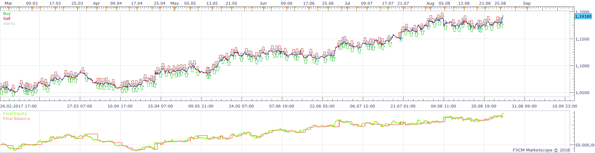
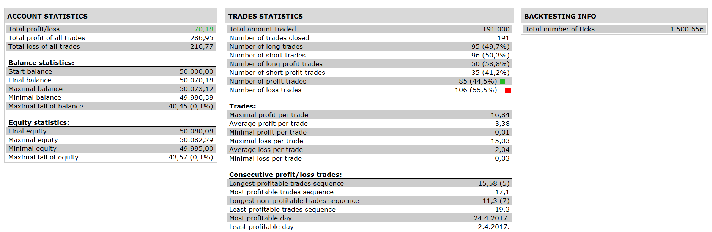

# Highly adaptable Multiple CCI Strategy with MACD Filter

> Source: https://fxcodebase.com/code/viewtopic.php?f=31&t=65500  
> Forum: 31 · Topic 65500 · 1 post(s)

---

## Highly adaptable Multiple CCI Strategy with MACD Filter

**Apprentice** · Tue Jan 02, 2018 10:54 am

 

Based on the request.
[viewtopic.php?f=27&t=65491](https://fxcodebase.com/code/viewtopic.php?f=27&t=65491)

Will allow you to choose between 5 available actions
For each indicator line Cross Over or Under will allow you to choose one of available actions.
Total of 40 actions.

Additionally, the MACD filter can be used.
If enabled.
Will allow Long Trades if MACD is greater than the signal line.
Will allow Short trades if MACD is lower than the signal line.

 [Highly adaptable Multiple CCI Strategy with MACD Filter.lua](files/116712/Highly%20adaptable%20Multiple%20CCI%20Strategy%20with%20MACD%20Filter.lua)

The Strategy was revised and updated on January 21, 2019.
