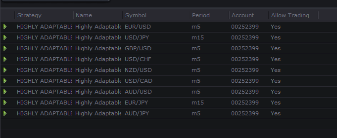

# Highly Adaptable Pivot Strategy with MA CrossPosition Filter

> Source: https://fxcodebase.com/code/viewtopic.php?f=31&t=64258  
> Forum: 31 · Topic 64258 · 13 post(s)

---

## Highly Adaptable Pivot Strategy with MA CrossPosition Filter

**Apprentice** · Fri Dec 30, 2016 6:08 am

Position Filter
Go Long if Price > MA
GoShort if Price < MA
Cross Filter
Trade on Price / MA cross

 [Highly Adaptable Pivot Strategy with MA CrossPosition Filter.lua](files/110318/Highly%20Adaptable%20Pivot%20Strategy%20with%20MA%20CrossPosition%20Filter.lua)

---

## Re: Highly Adaptable Pivot Strategy with MA CrossPosition Fi

**scandisk** · Mon Mar 27, 2017 12:17 pm

Hi Apprentice

I am using this strategy on my demo account and the trades are not being triggered for some weird reason?

I have set the strategies to allow trading and they are all triggered to trade? Is there something else I need to do? I have been running this on my computer for the last few days nothing gets triggered?

Just a question if I run my phone app fxcm same account that my strategies are running will it trigger my trades? Does fxcm offer a server for strategies so I don't need to keep my computer running?

Thanks

 

---

## Re: Highly Adaptable Pivot Strategy with MA CrossPosition Fi

**scandisk** · Thu Apr 06, 2017 11:34 pm

Hi Apprentice

Just wondering when u could take a look at this for me? It's not triggering or opening any trades?

Thanks

---

## Re: Highly Adaptable Pivot Strategy with MA CrossPosition Fi

**scandisk** · Fri Apr 28, 2017 8:46 pm

Still no fix? How long does it take??

---

## Re: Highly Adaptable Pivot Strategy with MA CrossPosition Fi

**MC. Trend Trader** · Sun Sep 30, 2018 4:32 pm

Can you fix this strategy.
Strategy don`t open any position

---

## Re: Highly Adaptable Pivot Strategy with MA CrossPosition Fi

**Apprentice** · Wed Oct 10, 2018 1:05 pm

Can you share the parameters used in your testing?
Work in a back tester mode.
Make sure Trade Action is defined for some of the lines.
If Action is NOT defined, no trade will be executed.

---

## Re: Highly Adaptable Pivot Strategy with MA CrossPosition Fi

**jonath1028** · Sat Nov 03, 2018 9:39 pm

Can you explain how work "ref" from line 369 to 415?

I need this part of your code for my own strategy, but I don't understand how it works because "ref" is never defined and it use only on this part of your code

By the way it's a really nice code !

---

## Re: Highly Adaptable Pivot Strategy with MA CrossPosition Fi

**Apprentice** · Mon Nov 05, 2018 6:41 am

PivotSource = ExtSubscribe(1, nil, instance.parameters.PivotTF, instance.parameters.Type == "Bid", "bar");

CalcLevels(PivotSource, period);

function CalcLevels(ref, period)
end

ref is nothing else then PivotSource, bar source data.
ref is PivotSource/source data passed to Calc Levels function.
CalcLevels function will calculate your pivot levels.

---

## Re: Highly Adaptable Pivot Strategy with MA CrossPosition Fi

**yolerap** · Tue Aug 20, 2019 2:35 am

Hi Apprentice

Could you please add an option in the strategy "Highly Adaptable Pivot Strategy with MA CrossPosition Filter.lua" please.

It could be better if you add :

If the price cross over the pivot -> Buy
If the price cross under the pivot -> Sell

For the moment, we just have the choice Buy or Sell if the price cross the pivot but it's not intuitive

Thank you very much for your work !

---

## Re: Highly Adaptable Pivot Strategy with MA CrossPosition Fi

**Apprentice** · Tue Aug 20, 2019 6:48 am

Your request is added to the development list under Id Number 4859

---

## Re: Highly Adaptable Pivot Strategy with MA CrossPosition Fi

**Apprentice** · Wed Aug 21, 2019 2:56 pm

Try this version.

 [Highly Adaptable Pivot Strategy with MA CrossPosition Filter.lua](files/128097/Highly%20Adaptable%20Pivot%20Strategy%20with%20MA%20CrossPosition%20Filter.lua)

---

## Re: Highly Adaptable Pivot Strategy with MA CrossPosition Fi

**yolerap** · Thu Aug 22, 2019 3:08 pm

Hi apprentice,

Thank you for your speed work !

There's a problem with the strategy ; the " under pivot action " doesn't work, I tried lot of different settings but without success.

Could you please repair this please ?

Furthermore, could you add this option ( I don't know if your previous modification add this option if the " under pivot action " work ) :
When the long position is open and the price goes under the pivot -> Close this position and open a new short position and inversely.

Thank you very much !

---

## Re: Highly Adaptable Pivot Strategy with MA CrossPosition Fi

**Apprentice** · Fri Aug 23, 2019 5:16 am

[Highly Adaptable Pivot Strategy with MA CrossPosition Filter.lua](files/128142/Highly%20Adaptable%20Pivot%20Strategy%20with%20MA%20CrossPosition%20Filter.lua)

Try this version.
