# Highly Adaptable Pivot Strategy

> Source: https://fxcodebase.com/code/viewtopic.php?f=31&t=60327  
> Forum: 31 · Topic 60327 · 63 post(s)

---

## Highly Adaptable Pivot Strategy

**moomoofx** · Thu Feb 20, 2014 9:00 pm

As requested on
 [viewtopic.php?f=27&t=29596](https://fxcodebase.com/code/viewtopic.php?f=27&t=29596)
and
 [viewtopic.php?f=27&t=60253](https://fxcodebase.com/code/viewtopic.php?f=27&t=60253)

A highly flexible Pivot strategy where at each pivot +/- pips you can define a particular action to take place.

 

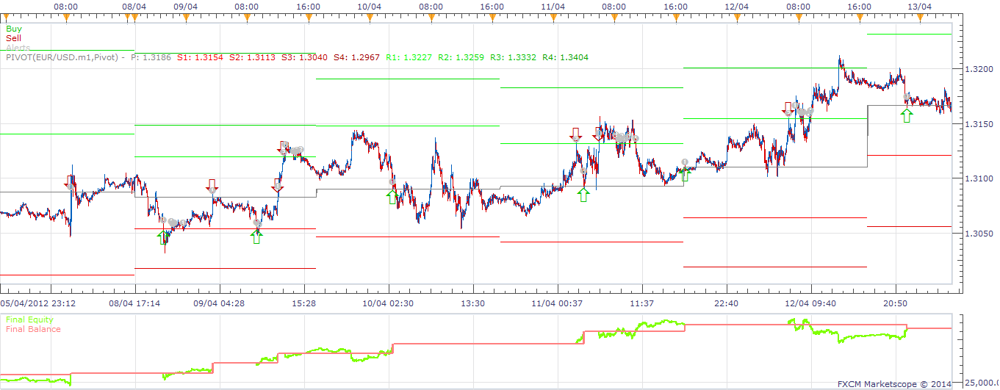

The example above shows a simple Sell at R1, Buy at S1, Close at P.

Also has been enhanced to
- Support tick timeframes for execution.
- Has configuration to restrict the number of open positions in each direction to prevent too many positions.

Enjoy.
MooMooFX

---

## Re: Highly Adaptable Pivot Strategy

**moomoofx** · Thu Feb 27, 2014 12:55 am

Please note that I have updated the source to address an issue to do with the open CustomID and Position Limit code.

The behavior between backtesting and demo/live accounts is different when it comes to the CustomID parameter which leads to the strategy opening more positions than the Position Limit/Multiple Limit allows.

This is discussed here: [viewtopic.php?f=31&t=31552&start=40#p92899](https://fxcodebase.com/code/viewtopic.php?f=31&t=31552&start=40#p92899)

If you do not wish to download the new code, a work-around is to ensure that there is a value in the CustomID parameter as a blank one does not work.

Cheers,
MooMooFX

---

## Re: Highly Adaptable Pivot Strategy

**Paulo C** · Tue Mar 04, 2014 6:50 pm

> **moomoofx wrote:**
> As requested on
> [viewtopic.php?f=27&t=29596](https://fxcodebase.com/code/viewtopic.php?f=27&t=29596)
> and
> [viewtopic.php?f=27&t=60253](https://fxcodebase.com/code/viewtopic.php?f=27&t=60253)
>
> A highly flexible Pivot strategy where at each pivot +/- pips you can define a particular action to take place.
>
>
>
> The attachment **HighlyAdaptablePivot.png** is no longer available
>
>
>
> The example above shows a simple Sell at R1, Buy at S1, Close at P.
>
> Also has been enhanced to
> - Support tick timeframes for execution.
> - Has configuration to restrict the number of open positions in each direction to prevent too many positions.
>
> Enjoy.
> MooMooFX

Moomoo Hello, I have been doing tests and the program is not working very well, for example, today did not open any position in AUD / JPY, but it is not the first time that really it happens, and not just this pair.
It is possible to ask to make changes to the program?
Paulo C

---

## Re: Highly Adaptable Pivot Strategy

**moomoofx** · Wed Mar 05, 2014 5:49 am

Hi,

It's hard to know what to change if I don't know what the problem is. Please send me the configuration you used and I'll try to reproduce on that AUDJPY chart.

Cheers,
MooMooFX

---

## Re: Highly Adaptable Pivot Strategy

**Paulo C** · Wed Mar 05, 2014 6:53 pm

> **moomoofx wrote:**
> Hi,
>
> It's hard to know what to change if I don't know what the problem is. Please send me the configuration you used and I'll try to reproduce on that AUDJPY chart.
>
> Cheers,
> MooMooFX

Hi moomoo,
Sorry, I know you are very good, but not divine thoughts . The parameters I am using are as follows: Price: bid; strategy time frame: m5 ; pivot time frame: D1 ; calculation mode: classic pivot; actions: s1buy r1 sell; allow strategy to trade:true; allowed side: both; allow multiple: true; open position limit: 5; trade amount: 10 ; set limit: true (70); set stop: true(70); trailing stop: falso.
Today,without doing anything, and the computer always on, happened to open more positions than it should according to the chart
cheers Paul C

---

## Re: Highly Adaptable Pivot Strategy

**moomoofx** · Thu Mar 06, 2014 4:06 am

Hi Paul C,

Thanks for posting the screenshot and your configuration. I'm kind of confused though, you first say it didn't trade, now you are saying it traded too much?

Anyway, I'll try to use my divine thoughts to address everything I think you are trying to say.

**"Traded too much"**
Please see my post above yours where I updated the code to fix a bug related to Multiple Positions. You need to basically specify a value into the CustomID parameter.

**"Open more positions than it should according to the chart"**
Assume this problem isn't caused by the "traded too much" issue above, then the only other thing I can imagine is you are disputing if the signal was generated correctly. So, the question is, was the pivot value crossed when the trade signal was generated?

If you switch on History mode for the Pivot indicator so it draws lines through that date, you'll see that the trades occur exactly at the R1 level, as per your configuration. Here's a screenshot you can match to your screenshot. So, please tell me if you still think there is an issue.

 

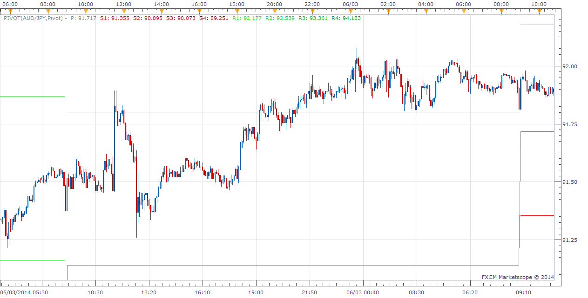

**"today did not open any position in AUD / JPY"**
I ran the configuration you sent me in your latest post through the backtester and it should have traded early in the day as per this screenshot.

 

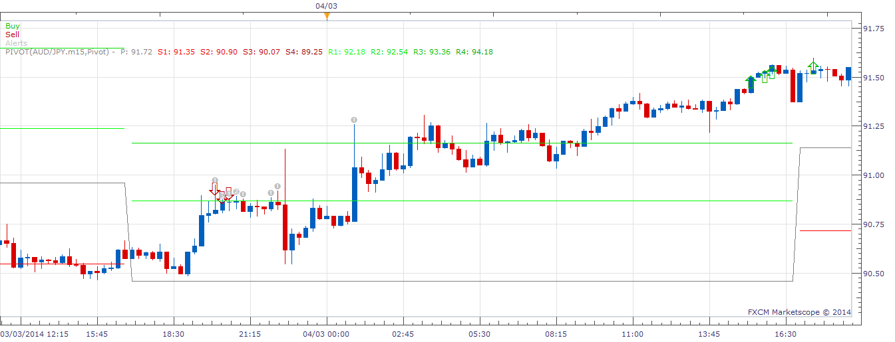

So, I'm guessing that since the strategy didn't trade at all, the Allow Trading was off perhaps? Otherwise, I noticed your screenshot is actually in m15 timeframe, not the m5 you sent me in the latest response, which leads me to believe perhaps the strategy was using a different config, so again, this is hard for me to debug. Obviously timing is a factor too, if you turned the strategy on AFTER the price has crossed the appropriate level...

Regardless, I'm not sure what the problem was, but I assume you fixed it since you it was trading in your next post.

Hope this helps.

Cheers,
MooMooFX

---

## Re: Highly Adaptable Pivot Strategy

**Paulo C** · Thu Mar 06, 2014 9:51 am

Thanks for posting the screenshot and your configuration. I'm kind of confused though, you first say it didn't trade, now you are saying it traded too much?

Anyway, I'll try to use my divine thoughts to address everything I think you are trying to say.

Hi moomoo,
First things first, 1st CustomID already changed the parameter field.
2nd I tried to test the program by changing the pivot frame field team to W1 and not open any position.
3rd'll attach 2 more gbp-jpy gbp-usd charts and where in the first case had 9 open positions and in the second case I have 9 open positions, when it should be at most 5. These situations occurred before changing the parameter customID field.
The time frame i use in the program is the m5, but what use in graphics is usually the m30, m15 or h1, depends, but I think it does not interfere with the program.
My computer is always on and the program too.
It's probably my fault, but I'm just trying to know what I did wrong, sorry.
Cheers Paulo C

---

## Re: Highly Adaptable Pivot Strategy

**moomoofx** · Thu Mar 06, 2014 11:11 am

Hey,

No sweat, I want to get to the bottom of this too. Perhaps we need to start from a clean slate.

As I mentioned, the position limit had a bug unless CustomID parameter is specified, so no point discussing this unless the problem happened after that.

Other than that, what is the problem again?

Cheers,
MooMooFX

---

## Re: Highly Adaptable Pivot Strategy

**Paulo C** · Mon Mar 17, 2014 6:42 pm

Hi MooMoo, I wonder if it's possible a change, like having a limit on daily positions, ie contain a field for a maximum number of open positions, as is already happening, but also have another that limits the maximum number that program opens daily. Example, I want to have a maximum of 20 open positions but I also want the program to only open two new positions daily maximum.
Thanks in advance
Paulo C

---

## Re: Highly Adaptable Pivot Strategy

**moomoofx** · Tue Mar 18, 2014 1:46 am

Hi Paulo,

That's possible.

Your request has been added to the development list.

Cheers,
MooMooFX

---

## Re: Highly Adaptable Pivot Strategy

**refresc0** · Thu Mar 27, 2014 10:18 pm

Fantastic work MooMooFX!

One question I have is how can I setup the getTradingDayOffset parameter, 5pm as the end and beginning of a trading day.

Thx

---

## Re: Highly Adaptable Pivot Strategy

**Apprentice** · Fri Mar 28, 2014 2:58 am

As implemented this is not possible at this time.
You can can only use chart data, provided by FXCM servers.

---

## Re: Highly Adaptable Pivot Strategy

**Paulo C** · Fri Mar 28, 2014 9:27 am

> **moomoofx wrote:**
> Hi Paulo,
>
> That's possible.
>
> Your request has been added to the development list.
>
> Cheers,
> MooMooFX

Thanks MooMooFX,
I await modification to eventually start applying in my real account.
Cheers,
Paul C

---

## Re: Highly Adaptable Pivot Strategy

**refresc0** · Fri Mar 28, 2014 10:55 am

Is this strategy written to work with today's pivot points or from the day before? I'm testing it without trading and the pivot points are always moving so it is not actually based on yesterday's pivot points. Can this be fixed?
Thx again!

---

## Re: Highly Adaptable Pivot Strategy

**moomoofx** · Sat Apr 05, 2014 7:20 pm

The strategy is based on the current values of the Pivot Points indicator. This is how most people use the Pivot Points indicator. This can be confirmed if you look at the screenshot in the original post.

Are you saying you would like to request an enhancement that it be able to use yesterday's pivot points?

---

## Re: Highly Adaptable Pivot Strategy

**Paulo C** · Sun Apr 06, 2014 3:27 am

Hi MooMooFX
I tried to test the strategy based on the weekly pivot points, but the program did not open any position. You can see what's going on?
thank you

---

## Re: Highly Adaptable Pivot Strategy

**moomoofx** · Mon Apr 07, 2014 8:45 pm

Hi Paulo C,

I looked into this briefly and identified an issue that impacted timeframes greater than D1 so I have quickly resolved this. Quick testing in the backtester looks good.

Please re-download the strategy from the first post and let me know if it is is not fixed for you.

Your other enhancement request is still on the to-do list unfortunately.

Cheers,
MooMooFX

---

## Re: Highly Adaptable Pivot Strategy

**fjasonfx** · Fri Apr 11, 2014 8:26 am

For some reason I can't install this or any other strategy. I try to click and drag it to my chart but when I do it shows the circle with a line through it. You know the stop sign, symbol. Just wondering if it is something I'm doing or something on fxcodebase's end. Is anybody else experiencing this same thing or have a solution? I have downloaded many things from here I just don't know why it's not working now.
Thanks,
FJFX

---

## Re: Highly Adaptable Pivot Strategy

**maggieq** · Fri Apr 18, 2014 11:47 am

Hi,

Please see my next post....thanks.

---

## Re: Highly Adaptable Pivot Strategy

**maggieq** · Fri Apr 18, 2014 12:20 pm

Hi,

I backtested this strategy today with different currency pairs and found there is a problem. Since I only sell at R and buy at S and only close with limit of 10 (I don't close at PP), I should only have increasing balance although my equity will drop from time to time. I noticed a few sudden drop in my balance and then I checked run history.

I found that wherever there is a sudden drop in balance, there is a 'USD/JPY order' showed up in the middle of the events and closed all my orders. I should note that this bug only happens after 2-3 runs.

Could you please explain and fix this? Thank you!

 

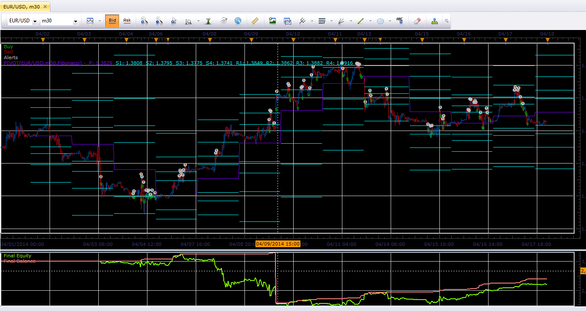

 

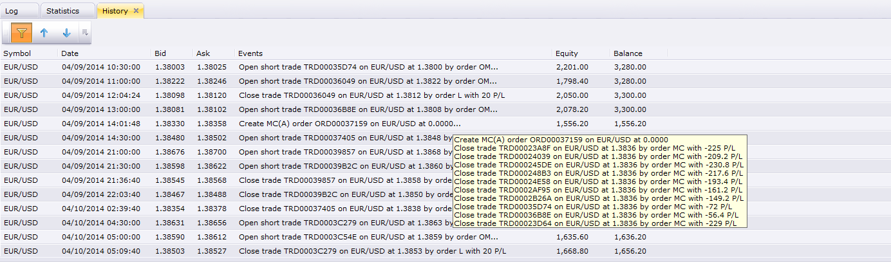

---

## Re: Highly Adaptable Pivot Strategy

**moomoofx** · Wed Apr 23, 2014 11:34 am

Hi,

Re: FJFX
Sorry, no ideas. Strategies are not dragged onto charts though but are configured through the Strategy Dashboard under Charts -> Alerts and Trading Automation ... Can you get any of the strategies that come with Trading Station to work?

Re: MaggieQ
This is not a bug maggie. In your screenshot of the history it says "Close trade .... by order MC" ... MC is Margin Called. This is somewhat expected given you never close trades out but keep entering into new positions and thus ran out of margin. If you look at the other screenshot you pasted you can see that the market kept moving in one direction and you kept on having your "R" conditions triggered.

Cheers,
MooMooFX

---

## Re: Highly Adaptable Pivot Strategy

**refresc0** · Mon Apr 28, 2014 12:42 am

i slightly modified the code to use yesterday's pivot points because using current ones can trigger false positions as the current points are constantly moving with price. thus previous' day points are easier to work with because they are fixed.

Cheers

---

## Re: Highly Adaptable Pivot Strategy

**moomoofx** · Mon Apr 28, 2014 5:34 am

Hi refresc0,

The pivot levels should only update when a new candle for the chosen Pivot timeframe is presented. So, if your Pivot Levels are setup to be D1, then the pivot levels are only updated once per day.

You can confirm this in the code as the CalcLevels function is only executed when the Pivot's source is updated.

Cheers,
MooMooFX

---

## Re: Highly Adaptable Pivot Strategy

**moomoofx** · Mon May 05, 2014 12:43 am

Hi all,

The previous implementation did not start trading until the Pivot timeframe had updated at least once. This means when running on a live or demo account you have to wait until the new day before it could start trading (assuming the pivot timeframe is D1). This is not ideal, and the strategy should calculate the pivot levels as soon as it has a chance (much like the indicator does). I have changed the implementation accordingly.

Additionally, I changed how the strategy's calculation of the pivot levels ignores non-trading periods. I'm not certain, but I believe the previous version may have miscalculated pivot levels for pivot timeframes shorter than daily.

The new version I will post here. The previous version can still be accessed from the original post.

Cheers,
MooMooFX

---

## Re: Highly Adaptable Pivot Strategy

**moomoofx** · Sun Jun 01, 2014 3:29 am

> **Paulo C wrote:**
> Hi MooMoo, I wonder if it's possible a change, like having a limit on daily positions, ie contain a field for a maximum number of open positions, as is already happening, but also have another that limits the maximum number that program opens daily. Example, I want to have a maximum of 20 open positions but I also want the program to only open two new positions daily maximum.
> Thanks in advance
> Paulo C

This has now been implemented. The latest version of the strategy posted above has been updated to include a "Position Throttle" parameter that controls how many new positions can be opened within the same day. Day is as defined using the server date.

Cheers,
MooMooFX

---

## Re: Highly Adaptable Pivot Strategy

**Robadub** · Tue Dec 08, 2015 2:06 pm

Hi!!,

Ive been study the “Center pivot" and was wondering if
In the strategy can have this rules...

A. In the Pivot Action Section:
1.If yesterday "daily price" close above the center pivot; then Buy
2.If yesterday "daily price" close Below center pivot; then Sell

B. And if is not to much ask...Can have a RSI for the last 2 rules?

1.To the BUY action: when RSI is Below 38
2.To the Sell action: when RSI is Above 62

Thanks so much in advanced.
The work that u all have here is amazing and artistic!!

---

## Re: Highly Adaptable Pivot Strategy

**pipsqueezer** · Tue Dec 08, 2015 3:35 pm

Fantasticly customizable strategy, great work. I use a strategy based on the London open pivots. Is there any chance that this strategy could be altered to include a way to change the time of the pivots, similar to what this indicator does?
[http://fxcodebase.com/code/viewtopic.php?f=17&t=4564&hilit=day+pivots](https://fxcodebase.com/code/viewtopic.php?f=17&t=4564&hilit=day+pivots)
Thanks

---

## Re: Highly Adaptable Pivot Strategy

**Apprentice** · Wed Dec 16, 2015 5:42 am

Your request is added to the development list.

---

## Re: Highly Adaptable Pivot Strategy

**MC. Trend Trader** · Wed Nov 30, 2016 4:46 am

Hi,
Can you please add following function
If long position is open and sell signal is given should be close long and open sell.

Thanks in advance

---

## Re: Highly Adaptable Pivot Strategy

**Apprentice** · Sun Dec 18, 2016 9:28 am

Strategy was revised and updated.

---

## Re: Highly Adaptable Pivot Strategy

**MC. Trend Trader** · Thu Dec 29, 2016 9:42 am

Hi,

Can we have a Filter function ?

Trade Signal should be triggered if Moving Avarage (MA) crossing the stream Line.

Best Regards
MC. Trend Trader

---

## Re: Highly Adaptable Pivot Strategy

**Apprentice** · Fri Dec 30, 2016 6:09 am

Try this version.
[viewtopic.php?f=31&t=64258](https://fxcodebase.com/code/viewtopic.php?f=31&t=64258)

---

## Re: Highly Adaptable Pivot Strategy

**Avignon** · Wed Aug 01, 2018 11:06 am

Hello,

Does the strategy work in demo ? I have no alerts.

Thanks.

---

## Re: Highly Adaptable Pivot Strategy

**Apprentice** · Sat Aug 04, 2018 6:26 am

It will work on any type of account.

---

## Re: Highly Adaptable Pivot Strategy

**Avignon** · Sat Aug 04, 2018 5:25 pm

OK, thank you.

---

## Re: Highly Adaptable Pivot Strategy

**Avignon** · Tue Aug 07, 2018 7:31 am

No sound and no pop-up.

 

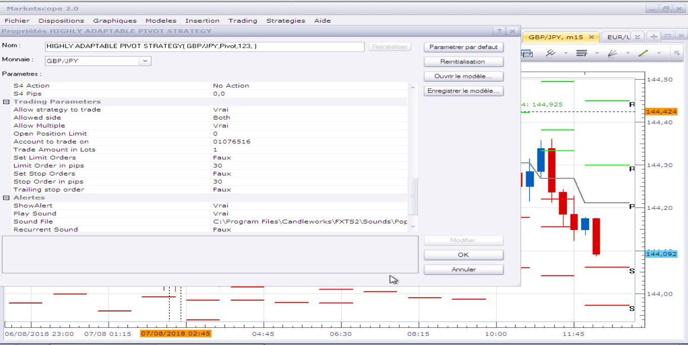

---

## Re: Highly Adaptable Pivot Strategy

**Apprentice** · Tue Aug 07, 2018 8:44 am

By default - No Action is selected.
You have to select the desired action.

---

## Re: Highly Adaptable Pivot Strategy

**Avignon** · Tue Aug 07, 2018 5:41 pm

I select Alert.

---

## Re: Highly Adaptable Pivot Strategy

**Apprentice** · Sat Aug 11, 2018 5:10 am

Try it now.

---

## Re: Highly Adaptable Pivot Strategy

**Avignon** · Tue Aug 14, 2018 5:51 pm

It works ! I have my alerts, but I had succeeded with the previous version: it was necessary to be in administrator mode and not invited under Windows.

Thanks.

---

## Re: Highly Adaptable Pivot Strategy

**Avignon** · Tue Mar 24, 2020 9:23 am

Hello,

In the current timeframe it works, but if the price starts directly below/above the pivot it doesn't work.

A very good example with the Sunday restart.

 

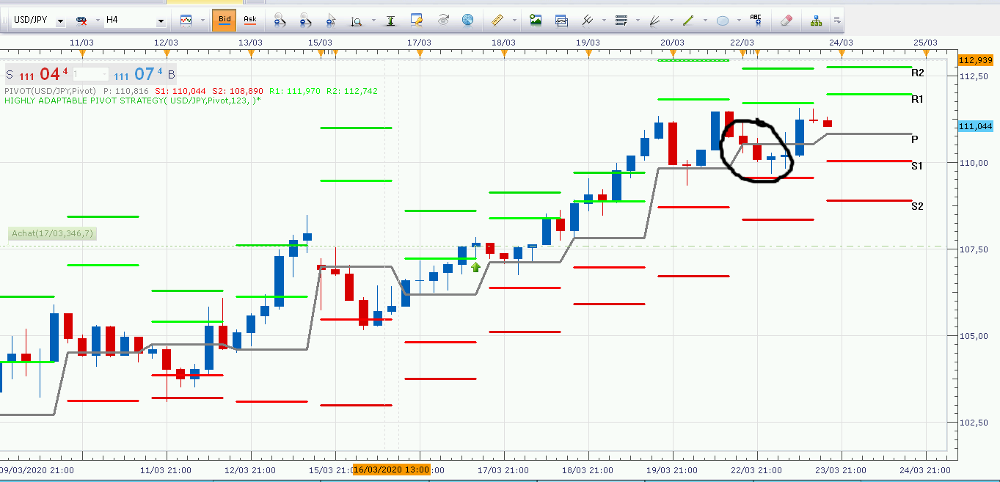

Thanks.

Edit: I forgot to mention, it should have closed the trade on the pivot.

---

## Re: Highly Adaptable Pivot Strategy

**Apprentice** · Wed Mar 25, 2020 6:10 am

Your request is added to the development list.
Development reference 943.

---

## Re: Highly Adaptable Pivot Strategy

**Avignon** · Thu Mar 26, 2020 4:57 am

Other example:

 

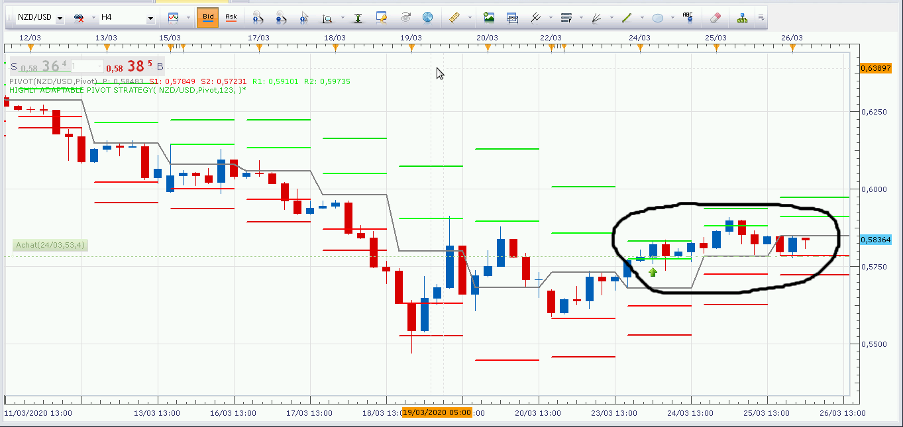

---

## Re: Highly Adaptable Pivot Strategy

**Apprentice** · Thu Mar 26, 2020 6:40 am

I can't repeat it. works 100% of the time.

---

## Re: Highly Adaptable Pivot Strategy

**Avignon** · Thu Mar 26, 2020 7:01 am

And don't you tell him every new timeframe to check that the current trade hasn't gone over/under the pivot?

---

## Re: Highly Adaptable Pivot Strategy

**Avignon** · Wed Apr 08, 2020 4:27 am

Hello,

A another bug.

Regards.

 

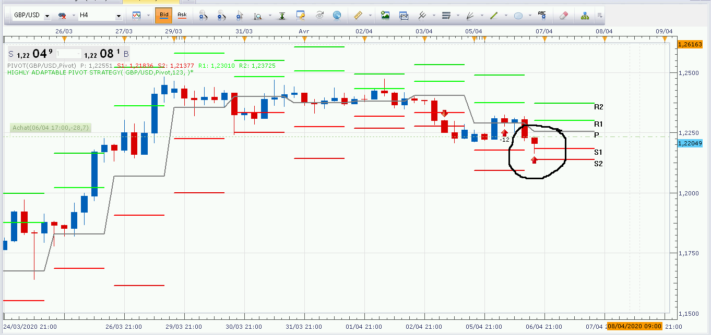

---

## Re: Highly Adaptable Pivot Strategy

**Apprentice** · Wed Apr 08, 2020 5:55 am

Can you share settings/parameters used, and what you have expected?

---

## Re: Highly Adaptable Pivot Strategy

**Avignon** · Wed Apr 08, 2020 7:38 pm

- Pivot daily, time frame H4
- Classic pivot
- Buy R1 / Sell S1, close pivot
- Server on New York

---

## Re: Highly Adaptable Pivot Strategy

**Apprentice** · Thu Apr 09, 2020 5:19 am

Your request is added to the development list.
Development reference 1036.

---

## Re: Highly Adaptable Pivot Strategy

**Apprentice** · Thu Apr 09, 2020 6:10 am

Can't repeat that one too. It works 100% of the time. The code looks fine as well

---

## Re: Highly Adaptable Pivot Strategy

**Avignon** · Thu Apr 09, 2020 7:11 am

Too bad! It's not the first time. I can make more screenshots if you want.

Thanks anyway.

---

## Re: Highly Adaptable Pivot Strategy

**Avignon** · Tue Apr 14, 2020 6:26 pm

It closed the trade on its own and I got a notification window even though it's not set up.

 

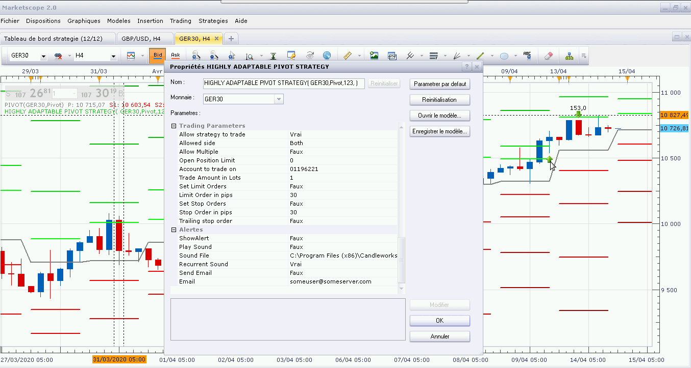

 

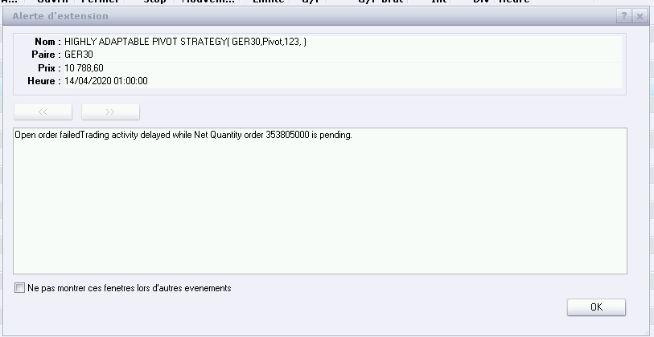

---

## Re: Highly Adaptable Pivot Strategy

**Apprentice** · Sat Apr 18, 2020 6:18 am

Your request is added to the development list.
Development reference 1090.

---

## Re: Highly Adaptable Pivot Strategy

**Apprentice** · Mon Apr 20, 2020 8:06 am

I can't repeat it. The code looks fine as well.
Make sure that you are not running several instances of that strategy.

---

## Re: Highly Adaptable Pivot Strategy

**Avignon** · Mon Apr 20, 2020 8:26 am

OK. Thanks.

---

## Re: Highly Adaptable Pivot Strategy

**Avignon** · Sun Apr 26, 2020 5:37 pm

Hello,

A bug:

In pivot D1 and below, no worries, on the other hand in W1 and M1 there are no signals and no order.

---

## Re: Highly Adaptable Pivot Strategy

**Apprentice** · Mon Apr 27, 2020 6:59 am

Pivots are D1 based.

---

## Re: Highly Adaptable Pivot Strategy

**Avignon** · Mon Apr 27, 2020 5:15 pm

Well,... Okay...

---

## Re: Highly Adaptable Pivot Strategy

**Avignon** · Wed May 13, 2020 11:58 am

WWHHHHYYY?

 

With the exception of usd/jpy which closed on condition (on the pivot), there are 5 positions that closed before my eyes while I was doing a routine check.

 

What happened at 5:00 New York time? Especially since other positions remained.

Then I have this, but it must be the same problem as [here](http://www.fxcodebase.com/code/viewtopic.php?f=31&t=60327&start=40#p132647).

 

---

## Re: Highly Adaptable Pivot Strategy

**Apprentice** · Sat May 16, 2020 4:06 pm

Your request is added to the development list.
Development reference 1307.

---

## Re: Highly Adaptable Pivot Strategy

**Apprentice** · Tue May 19, 2020 9:01 am

[Highly Adaptable Pivot Strategy.lua](files/134082/Highly%20Adaptable%20Pivot%20Strategy.lua)

Added Log file (csv) parameter for advanced diagnostics.

---

## Re: Highly Adaptable Pivot Strategy

**Avignon** · Sun May 24, 2020 11:02 am

As every sunday I have to restart TS2 and then the strategy has disappeared, I have to restart it on current trades.

Do you need the log file? How can I send it to you?

---

## Re: Highly Adaptable Pivot Strategy

**Apprentice** · Mon May 25, 2020 6:25 am

This is the TS issue.
I will send a request to the TS development team to try to find a workaround for this problem.
