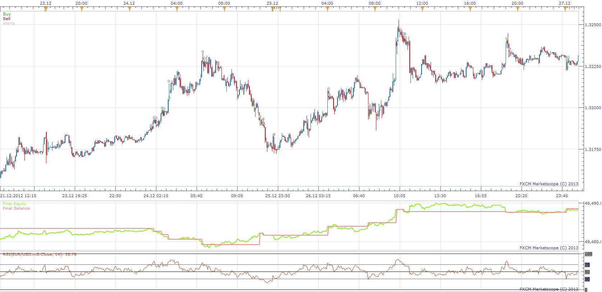
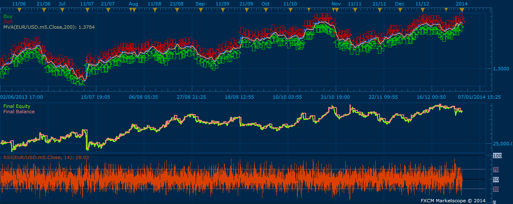
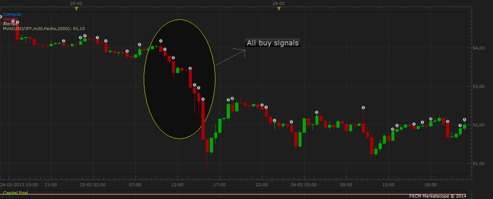

# Highly adaptable RSI Strategy

> Source: https://fxcodebase.com/code/viewtopic.php?f=31&t=31552  
> Forum: 31 · Topic 31552 · 93 post(s)

---

## Highly adaptable RSI Strategy

**Apprentice** · Wed Jan 30, 2013 7:23 am



Trading Events
1. Line Cross
2. Line Cross
3. Line Cross
4. Line Cross
5. Line Cross
6. Line Cross

Trading Actions.
Buy, Sell, Close, Alert

For any of Trading Events, You can define one Trading Actions from list.

In this example.
1. Line / Price Crossover
Close Trade
1. Line / Price Crossunder
Open Short Position
2. Line / Price Crossunder
Close Trade
2. Line / Price Crossover
Open Long Position

 [Highly adaptable RSI Strategy.lua](files/53816/Highly%20adaptable%20RSI%20Strategy.lua)

MT4 version.
[https://fxcodebase.com/code/viewtopic.php?f=38&t=71255](https://fxcodebase.com/code/viewtopic.php?f=38&t=71255)

---

## Re: Highly adaptable RSI Strategy

**automan** · Mon Feb 11, 2013 5:43 am

allow multiple

don't work?

---

## Re: Highly adaptable RSI Strategy

**automan** · Mon Feb 11, 2013 7:20 am

Just to clarify what i mean

if using 60 min and level 30 for buy

first buy when first 60 minute bar close and rsi under 30

second buy when second 60 min bar close and rsi under 30

third and so on

---

## Re: Highly adaptable RSI Strategy

**Apprentice** · Mon Feb 11, 2013 6:23 pm

Strategy only supports Line crossover trades.
Multiple positions would be open, for example, if you select two trades in same direction on two different lines.

---

## Re: Highly adaptable RSI Strategy

**bfleming** · Tue Feb 26, 2013 8:40 am

Could you add a "magic number" to this s it doesn't interfere with other strategies and open trades on the same pair. Thanks.

---

## Re: Highly adaptable RSI Strategy

**Apprentice** · Wed Feb 27, 2013 8:07 am

Your request is added to the developmental lists.

---

## Re: Highly adaptable RSI Strategy

**Nightmare21** · Tue Mar 12, 2013 12:02 pm

Hi! I want an EA of RSI with this sitting level 47 and level 53. Default Time prime 4h.
Rules:
Short
Sell when RSI cross line under level 47; close when it reach 50 level

Long
Buy when RSI cross line over level 53; close when it reach 50 level

I want to add also a trailing limit into three portion. The first limit is set to 50 pips, second is 100 pip and the last portion shall be determine by the RSI level 50. The percentage of each portions is 0.33
Note:
RSI level 50 should be the stop lose.

Thank you very much...

---

## Re: Highly adaptable RSI Strategy

**Apprentice** · Wed Mar 13, 2013 7:48 am

Your request is added to the developmental list.

---

## Re: Highly adaptable RSI Strategy

**Nightmare21** · Tue Apr 09, 2013 11:38 am

hello Apprentice,

 I want an EA with a version in android and .lua. Hope you can provide it. Thanks more power.

---

## Re: Highly adaptable RSI Strategy

**Apprentice** · Wed Apr 10, 2013 3:29 am

This is not possible at this moment
Mobile TS (Android) does not support indicators/strategies.

---

## Re: Highly adaptable RSI Strategy

**fxcatty** · Tue Jul 23, 2013 8:20 pm

To use QQE indicator instead of the RSI, do I just need to switch this line of code:

Code: [Select all](https://fxcodebase.com/code/)
`Indicators[1]= core.indicators:create("RSI", Source[Price], Period);`

Instead input QQE ? Or is it more complex than that.

Code: [Select all](https://fxcodebase.com/code/)
`Indicators[1]= core.indicators:create("QQE", Source[Price], Period);`
Would this work? If not can you give me a hand please.

---

## Re: Highly adaptable RSI Strategy

**Apprentice** · Sat Jul 27, 2013 2:59 am

It is a bit more complicated.
QQE uses different parameters.
Also we have several QQE version.
Specify which of them you are using.
Specify strategy trading rules.

---

## Re: Highly adaptable RSI Strategy

**fxcatty** · Mon Jul 29, 2013 8:43 am

> **Apprentice wrote:**
> It is a bit more complicated.
> QQE uses different parameters.
> Also we have several QQE version.
> Specify which of them you are using.
> Specify strategy trading rules.

> **fxcatty wrote:**
> Hello, I am searching and trying to make myself, a QQE Strategy that will give alerts when the Pbuff (Line) crosses over a level. I'd like Give an alert if QQE crosses over 60 line and also give an alert if it goes below the 30 line. I'd like to be able to input the number levels. I tried looking at this code from this strategy to use as a template, but it only has '1' level, that is the 50 confirmation level. I tried running the strategy to see if I can just switch it but I receive a QQE;63 error. Any helps would be appreciated, thanks,

I had posted that in a QQE Strategy thread, [viewtopic.php?f=31&t=9147&start=20#p84364](https://fxcodebase.com/code/viewtopic.php?f=31&t=9147&start=20#p84364)

---

## Re: Highly adaptable RSI Strategy

**amazon1a** · Wed Aug 21, 2013 2:35 pm

Hi Apprentice,

I really like this Strategy. Would it be possible to add a seventh pair of lines to the Selector block? This would be a bit more convenient style for me because with an odd number, I could set pair #4 at 50 and have an equal number(3) of choices above and below 50 for BUY or Sell orders respectively.

Also, I do not know if it would be possible, but could you modify Trading Parameters/Multiple to include an option to limit the number of multiple trades to take eg. 1,2,3,4,5....10 etc. or some variation of this?

Many thanks, AG

---

## Re: Highly adaptable RSI Strategy

**Apprentice** · Thu Aug 22, 2013 1:45 am

Your request is added to the development list.

---

## Re: Highly adaptable RSI Strategy

**pips_r_us** · Wed Sep 04, 2013 12:03 am

Hi Apprentice

This is a great strategy. Can we add couple of enhancements?

1.	Add a Moving Average filter (e.g 200 MVA). If the price is above this MVA then only BUY side of trades are executed. If the price is below this MVA then only SELL trades are executed.
2.	Add a field to limit the multiple trades?

Thank you so much.

---

## Re: Highly adaptable RSI Strategy

**Apprentice** · Thu Sep 05, 2013 1:55 am

Your request is added to the development list.

---

## Re: Highly adaptable RSI Strategy

**pips_r_us** · Fri Oct 25, 2013 10:16 am

Any update when this will be done?

Thanks

---

## Re: Highly adaptable RSI Strategy

**dstoltz** · Tue Oct 29, 2013 8:14 pm

Has there been any further consideration on working on this filtered strategy or Larry Connors RSI2 strategy and indicator? thanks

---

## Re: Highly adaptable RSI Strategy

**Paulo C** · Thu Jan 02, 2014 12:02 am

Hi Apprentice,

The strategy is good, but I wonder if it is possible, instead of giving a market order, give an entry order, such as for example:
EUR / USD RSI reaches 70 with price as $ 1.38, at that time the program gives an entry order to "X pips that amount" if you choose 20, the program gives an entry order to $ 1.3820
Already my thanks

---

## Re: Highly adaptable RSI Strategy

**Apprentice** · Fri Jan 03, 2014 3:28 pm

Your request is added to the development list.

---

## Re: Highly adaptable RSI Strategy

**Paulo C** · Fri Jan 03, 2014 7:14 pm

> **Apprentice wrote:**
> Your request is added to the development list.

Is very important to me, thank you

---

## Re: Highly adaptable RSI Strategy

**moomoofx** · Tue Jan 14, 2014 9:03 am

Hi everyone,

I have drastically refactored the code for this strategy and...
- Fixed a bug related to the handling of errors
- Fixed a bug such that Trade Alerts are provided even when Trading is disabled (Signal Only Mode)
- Added a parameter to control if trades should close on opposite signal. This functionality already existed but may not be desired so it is configurable. If this parameter is set to false then trades only close if there are levels configured with a CLOSE action.

Additionally, I met all your requests (hooray ). Specifically...

**Request by bleming: Tue Feb 26, 2013 10:40 pm**
> Could you add a "magic number" to this s it doesn't interfere with other strategies and open trades on the same pair.
There is now a "Custom Identifier" parameter that can be used. This ID comes up in the instance name as well.

**Request by Nightmare21: Wed Mar 13, 2013 2:02 am**
> I want to add also a trailing limit into three portion.
Your requirement can now be met by having multiple instances of the same strategy with different configurations and magic numbers. For example, three instances with...
- One with a Limit of 50, 33% of the Amount, and a unique CustomID.
- One with a Limit of 100, 33% of the Amount, and a unique CustomID.
- One with no Limit, 33% of the Amount, and a unique CustomID.
The rest of the configuration should be the same.

**Request by amazon1a: Thu Aug 22, 2013 4:35 am**
> Would it be possible to add a seventh pair of lines to the Selector block?
The 7th Level has been added.

> include an option to limit the number of multiple trades to take
There is now a new parameter "Open Position Limit" that can be used to control the number of open positions allowed PER DIRECTION. If this is set to 3, there can be a max of 3 LONG and 3 SHORT positions simultaneously. Set this to zero for unlimited.

**Request by pips_r_us: Wed Sep 04, 2013 2:03 pm**
> Add a Moving Average filter (e.g 200 MVA). If the price is above this MVA then only BUY side of trades are executed. If the price is below this MVA then only SELL trades are executed.
This has been implemented exactly as described, in addition the method used to calcuate the moving average has been exposed.

> Add a field to limit the multiple trades?
Already covered, as mentioned above.

**Request by Paulo C: Thu Jan 02, 2014 2:02 pm**
> The strategy is good, but I wonder if it is possible, instead of giving a market order, give an entry order to "X pips that amount"
There is a new parameter which allows you to configure entry orders or market orders. If you choose entry orders, you can specify the number of pips away to place the order and if the order should expire at the end of the day, or never.

.........

Ok that's it. I have done my best to test the functionality to make sure it still works but please let me know as soon as possible if there are any issues.

 



*Screenshot*

---

## Re: Highly adaptable RSI Strategy

**Paulo C** · Tue Jan 14, 2014 4:48 pm

Thank you, you are the greatest, the strategy seems to be perfect, I'll try it now

> **moomoofx wrote:**
> Hi everyone,
>
> I have drastically refactored the code for this strategy and...
> - Fixed a bug related to the handling of errors
> - Fixed a bug such that Trade Alerts are provided even when Trading is disabled (Signal Only Mode)
> - Added a parameter to control if trades should close on opposite signal. This functionality already existed but may not be desired so it is configurable. If this parameter is set to false then trades only close if there are levels configured with a CLOSE action.
>
> Additionally, I met all your requests (hooray ). Specifically...
>
> **Request by bleming: Tue Feb 26, 2013 10:40 pm**
> > Could you add a "magic number" to this s it doesn't interfere with other strategies and open trades on the same pair.
> There is now a "Custom Identifier" parameter that can be used. This ID comes up in the instance name as well.
>
> **Request by Nightmare21: Wed Mar 13, 2013 2:02 am**
> > I want to add also a trailing limit into three portion.
> Your requirement can now be met by having multiple instances of the same strategy with different configurations and magic numbers. For example, three instances with...
> - One with a Limit of 50, 33% of the Amount, and a unique CustomID.
> - One with a Limit of 100, 33% of the Amount, and a unique CustomID.
> - One with no Limit, 33% of the Amount, and a unique CustomID.
> The rest of the configuration should be the same.
>
> **Request by amazon1a: Thu Aug 22, 2013 4:35 am**
> > Would it be possible to add a seventh pair of lines to the Selector block?
> The 7th Level has been added.
>
> > include an option to limit the number of multiple trades to take
> There is now a new parameter "Open Position Limit" that can be used to control the number of open positions allowed PER DIRECTION. If this is set to 3, there can be a max of 3 LONG and 3 SHORT positions simultaneously. Set this to zero for unlimited.
>
> **Request by pips_r_us: Wed Sep 04, 2013 2:03 pm**
> > Add a Moving Average filter (e.g 200 MVA). If the price is above this MVA then only BUY side of trades are executed. If the price is below this MVA then only SELL trades are executed.
> This has been implemented exactly as described, in addition the method used to calcuate the moving average has been exposed.
>
> > Add a field to limit the multiple trades?
> Already covered, as mentioned above.
>
> **Request by Paulo C: Thu Jan 02, 2014 2:02 pm**
> > The strategy is good, but I wonder if it is possible, instead of giving a market order, give an entry order to "X pips that amount"
> There is a new parameter which allows you to configure entry orders or market orders. If you choose entry orders, you can specify the number of pips away to place the order and if the order should expire at the end of the day, or never.
>
> .........
>
> Ok that's it. I have done my best to test the functionality to make sure it still works but please let me know as soon as possible if there are any issues.
>
>
>
> HighlyAdaptableRSI.png

---

## Re: Highly adaptable RSI Strategy

**amazon1a** · Wed Jan 15, 2014 7:06 am

Many thanks for these updates. They come at the PERFECT time for me. I will try them out as soon as I return from my trip.

 Amazon1a

---

## Re: Highly adaptable RSI Strategy

**Paulo C** · Tue Jan 21, 2014 5:25 pm



Hello guys, I wonder if it is possible to further modification. One of the situations in which it is lost when the program gives an order to buy or sell through the signal, and the price continues to go up or down as shown. In this sense I wonder if it is possible a kind of "follow the order of entry" such as: USD-JPY price begins to fall at some point the progam gives an entry order (purchase) but the price continues to fall .. is so frustrating and you lose many pips. My idea is USD-JPY price falls and hits the 102, reaches the level of RSI for an entry order 20 pips to 102.20 of that amount. The price continues to drop reaches 101.80 at this point the order of entry is updated to 102.20 to 102, and so on until the order is executed.
I thank you and keep up the good work

> **moomoofx wrote:**
> Hi everyone,
>
> I have drastically refactored the code for this strategy and...
> - Fixed a bug related to the handling of errors
> - Fixed a bug such that Trade Alerts are provided even when Trading is disabled (Signal Only Mode)
> - Added a parameter to control if trades should close on opposite signal. This functionality already existed but may not be desired so it is configurable. If this parameter is set to false then trades only close if there are levels configured with a CLOSE action.
>
> Additionally, I met all your requests (hooray ). Specifically...
>
> **Request by bleming: Tue Feb 26, 2013 10:40 pm**
> > Could you add a "magic number" to this s it doesn't interfere with other strategies and open trades on the same pair.
> There is now a "Custom Identifier" parameter that can be used. This ID comes up in the instance name as well.
>
> **Request by Nightmare21: Wed Mar 13, 2013 2:02 am**
> > I want to add also a trailing limit into three portion.
> Your requirement can now be met by having multiple instances of the same strategy with different configurations and magic numbers. For example, three instances with...
> - One with a Limit of 50, 33% of the Amount, and a unique CustomID.
> - One with a Limit of 100, 33% of the Amount, and a unique CustomID.
> - One with no Limit, 33% of the Amount, and a unique CustomID.
> The rest of the configuration should be the same.
>
> **Request by amazon1a: Thu Aug 22, 2013 4:35 am**
> > Would it be possible to add a seventh pair of lines to the Selector block?
> The 7th Level has been added.
>
> > include an option to limit the number of multiple trades to take
> There is now a new parameter "Open Position Limit" that can be used to control the number of open positions allowed PER DIRECTION. If this is set to 3, there can be a max of 3 LONG and 3 SHORT positions simultaneously. Set this to zero for unlimited.
>
> **Request by pips_r_us: Wed Sep 04, 2013 2:03 pm**
> > Add a Moving Average filter (e.g 200 MVA). If the price is above this MVA then only BUY side of trades are executed. If the price is below this MVA then only SELL trades are executed.
> This has been implemented exactly as described, in addition the method used to calcuate the moving average has been exposed.
>
> > Add a field to limit the multiple trades?
> Already covered, as mentioned above.
>
> **Request by Paulo C: Thu Jan 02, 2014 2:02 pm**
> > The strategy is good, but I wonder if it is possible, instead of giving a market order, give an entry order to "X pips that amount"
> There is a new parameter which allows you to configure entry orders or market orders. If you choose entry orders, you can specify the number of pips away to place the order and if the order should expire at the end of the day, or never.
>
> .........
>
> Ok that's it. I have done my best to test the functionality to make sure it still works but please let me know as soon as possible if there are any issues.
>
>
>
> The attachment **USDJPY.png** is no longer available

---

## Re: Highly adaptable RSI Strategy

**moomoofx** · Wed Jan 22, 2014 11:15 pm

Hi,

So, basically I'm seeing a modification such that if it is going to create a new Entry Order strategy, and an existing Entry Order is pending in the same direction, it should
- Cancel that order and issue the new one.
- Or just update the order price of the existing one (if that is possible).

Please confirm that this will probably meet your expectation?

Cheers,
MooMooFX

---

## Re: Highly adaptable RSI Strategy

**Paulo C** · Thu Jan 23, 2014 12:37 pm

> **moomoofx wrote:**
> Hi,
>
> So, basically I'm seeing a modification such that if it is going to create a new Entry Order strategy, and an existing Entry Order is pending in the same direction, it should
> - Cancel that order and issue the new one.
> - Or just update the order price of the existing one (if that is possible).
>
> Please confirm that this will probably meet your expectation?
>
> Cheers,
> MooMooFX

Hi MooMooFX,
You got it, or cancel the order and create a new one, or update the entry order

Cheers,
Paulo C

---

## Re: Highly adaptable RSI Strategy

**moomoofx** · Tue Jan 28, 2014 4:11 am

It turns out this functionality is natively supported by the trading system so an Entry Orders entry price can be "Trailed" in the same way a Stop Order can be.

Therefore there is now a new parameter called "EntryOrdersTrail"

If this value is zero, there is no trailing of the entry order price.
Any other value, specified in pips, trails the entry price of the order when the market moves away from the entry price. If the value is one, then this is "dynamic".

This should meet your requirement as the pending entry orders are automatically updated.

Enjoy. Watch out though, if you set a small EntryOrderTrail value (like 1) they will all trail and sync up. If then the market retraces just enough for them to all enter at the same time then you might find yourself in a bit of trouble.

---

## Re: Highly adaptable RSI Strategy

**Paulo C** · Tue Jan 28, 2014 5:04 am

> **moomoofx wrote:**
> It turns out this functionality is natively supported by the trading system so an Entry Orders entry price can be "Trailed" in the same way a Stop Order can be.
>
> Therefore there is now a new parameter called "EntryOrdersTrail"
>
> If this value is zero, there is no trailing of the entry order price.
> Any other value, specified in pips, trails the entry price of the order when the market moves away from the entry price. If the value is one, then this is "dynamic".
>
> This should meet your requirement as the pending entry orders are automatically updated.
>
> Enjoy. Watch out though, if you set a small EntryOrderTrail value (like 1) they will all trail and sync up. If then the market retraces just enough for them to all enter at the same time then you might find yourself in a bit of trouble.

MooMooFX Thanks, I'll try it now

---

## Re: Highly adaptable RSI Strategy

**sqrrl99** · Thu Feb 13, 2014 2:02 pm

I am having a problem with backtesting this strategy. I keep getting a message that reads, "close order failed the order is disabled". I have not been able to figure out what is causing this. Any help would be appreciated.

---

## Re: Highly adaptable RSI Strategy

**moomoofx** · Thu Feb 13, 2014 6:57 pm

It sounds like it is trying to close a trade that is already closed. Do you have two actions to try to close at around the same level? There may be some kind of race condition going on.

If you can't figure it out, please let me know the parameter values are you using for the strategy, and the currencypair and date range you are testing on and I will try to reproduce it.

Cheers,
MooMooFX

---

## Re: Highly adaptable RSI Strategy

**sqrrl99** · Fri Feb 14, 2014 4:19 am

I was on the GBP/JPY 3 hour chart. RSI value was at 8. 1st line was 50. 2nd line 20. Stop loss at 250 pips. No multiple positions allowed. I had a buy when price crossed over the 1st line (50). Then I had "close position" when price crossed under 2nd line (20). The only time it would close the position was if the stop was hit. When price would drop under the 2nd line, that is when it would show the error. If I did not use a stop, then the first position would not close. I would just get errors each time price dropped under the 2nd line.

Thanks again for any help you may give,

Jason

---

## Re: Highly adaptable RSI Strategy

**moomoofx** · Fri Feb 14, 2014 4:58 am

Hi Jason,

Ah, hmm I don't think the exit trade logic handled FIFO account so I'm guessing that was your problem.

Please try this version and let me know if it fixes your issue.

Cheers,
MooMooFX

---

## Re: Highly adaptable RSI Strategy

**sqrrl99** · Fri Feb 14, 2014 12:31 pm

Looks like it is working.

Thanks MooMoo

---

## Re: Highly adaptable RSI Strategy

**moomoofx** · Sat Feb 15, 2014 3:10 am

Great. Thanks for confirming.

Cheers,
MooMooFX

---

## Re: Highly adaptable RSI Strategy

**sqrrl99** · Thu Feb 20, 2014 3:03 am

Hey Moomoo. I was hoping you could help me with one more problem. I have my trades setup to do multiple trades, but limited to 3. Yet, it is allowing more than that. Anything you can do to help would be appreciated.

Thanks,

Jason

---

## Re: Highly adaptable RSI Strategy

**moomoofx** · Thu Feb 20, 2014 4:25 am

A configuration of 3 would allow 3 per direction.

How many trades is it opening and how many in each direction?

---

## Re: Highly adaptable RSI Strategy

**sqrrl99** · Thu Feb 20, 2014 12:36 pm

I only allow it to trade it one direction, but 2 different pairs are currently showing 4 trades each. This did not happen when I backtested and optimized the strategy. It is only happening when I am trading it on my demo account.

Thanks,

Jason

---

## Re: Highly adaptable RSI Strategy

**sqrrl99** · Thu Feb 20, 2014 2:41 pm

I have 2 different pairs that are over 3 trades in one direction (EUR/USD currently has 7 open trades). This does not happen during optimization or backtesting, only on my demo account. Multiple trades also happened when I tried demo testing this strategy with "allow multiple" turned off.

Any help would be appreciated,

Jason

---

## Re: Highly adaptable RSI Strategy

**amazon1a** · Thu Feb 20, 2014 10:05 pm

Hi MooMoo,

I have the same problem - too many trades. I set the limit to 2 but had up to 9 trades on one pair and many more than 2 on several other pairs in each direction. Practice trading on 15 minute TF.

Thanks, AG

---

## Re: Highly adaptable RSI Strategy

**moomoofx** · Fri Feb 21, 2014 1:39 am

Ok thanks everyone for raising the issue. I'll do some testing on a demo account and try to reproduce. If someone could send me a screenshot of their strategy parameters that would be great.

---

## Re: Highly adaptable RSI Strategy

**sqrrl99** · Mon Feb 24, 2014 12:09 pm

I have tried to take a snapshot, but that does not want to work for me. I am working on a 5 minute timeframe with buys only. I buy when rsi crosses over the 70 line. I am setup with multiple positions allowed, but open position limit is set at 3. I use a trailing stop and no moving average filter.

I hope this helps you find the problem.

Thanks,

Jason

---

## Re: Highly adaptable RSI Strategy

**moomoofx** · Tue Feb 25, 2014 3:01 am

Thanks for the information.

I managed to put the strategy in a situation where it exceeds the position limit if there are multiple trade signals generated in the same bar.

For example: If your actions are buy at 30, buy at 50, and buy at 70 .... and the RSI moves from 20 to 80 in one bar, you'll find it will trigger all three actions at once ending up with 3 positions.

I was going to fix this by only allowing a single action of each type per bar. This does not sound like your problem however.

The only other things I can think of that might create the problem would be
- Entry orders are not included in the counts. So it is possible to create more entry orders than the configured max number of positions. I'm still debating whether to fix this or not.
- CustomID when blank (default is blank) may not work on some accounts. CustomID is the magic number used to link trades to the strategy. This prevents multiple instances of the strategy on the same instrument conflicting with each other. I need to test this.

So, therefore can I ask you
- Do you use Entry orders or Market Orders?
- If you enter a value into the CustomID parameter, does it fix the problem?

Cheers,
MooMooFX

---

## Re: Highly adaptable RSI Strategy

**sqrrl99** · Tue Feb 25, 2014 12:05 pm

I am using market orders, not entry orders

---

## Re: Highly adaptable RSI Strategy

**sqrrl99** · Wed Feb 26, 2014 2:22 am

I am gonna test the customerid parameter to see if that works...will let you know tomorrow

---

## Re: Highly adaptable RSI Strategy

**moomoofx** · Thu Feb 27, 2014 12:51 am

I have confirmed the blank default CustomID is the main issue.

The log below (reverse chronological) shows two identical strategy instances being loaded, one with an CustomID set to "ID" and the other the blank default.

The blank default entered into a second position while the one with the ID set did not.

I then started a TEST strategy to log the IDs of all open trades, and it looks like the trades placed by the strategy that had the blank CustomID gets set to FXCM's default of "FXTC" instead of a blank value.

This means that when the strategy checks to see if there are any trades with the blank CustomID, it fails to find them and that is why it issues new trades.

The fix for this is to simply specify a non-blank CustomID value. Additionally, I have updated the code so by default this is non-blank.

```
TEST(USD/JPY[t1], 10, 0)   2014/02/27 16:44:33  Found Trade: 20382885 Amount: 1000 QTXT: FXTC
TEST(USD/JPY[t1], 10, 0)   2014/02/27 16:44:33  Found Trade: 20382874 Amount: 2000 QTXT: ID
TEST(USD/JPY[t1], 10, 0)   2014/02/27 16:44:33  Found Trade: 20382873 Amount: 1000 QTXT: FXTC
TEST(USD/JPY[t1], 10, 0)   TEST(USD/JPY[t1], 10, 0) is started.
HIGHLY ADAPTABLE RSI STRATEGY( USD/JPY,, )   Market Order (102.351, USD/JPY, Sold 1K, 05276615). Successful.
HIGHLY ADAPTABLE RSI STRATEGY( USD/JPY,ID, )   Market Order (102.350, USD/JPY, Sold 2K, 05276615). Successful.
HIGHLY ADAPTABLE RSI STRATEGY( USD/JPY,, )   Market Order (102.350, USD/JPY, Sold 1K, 05276615). Successful.
HIGHLY ADAPTABLE RSI STRATEGY( USD/JPY,ID, )   HIGHLY ADAPTABLE RSI STRATEGY( USD/JPY,ID, ) is started.
HIGHLY ADAPTABLE RSI STRATEGY( USD/JPY,, )   HIGHLY ADAPTABLE RSI STRATEGY( USD/JPY,, ) is started.
```

The previously mentioned holes in the MultipleLimit functionality (Entry Orders, multiple signals in same bar) will not be fixed at this time as there is no standard way to decide which signals is the priority. I don't think this should be a problem for normal use of this strategy.

Cheers,
MooMooFX

---

## Re: Highly adaptable RSI Strategy

**sqrrl99** · Thu Feb 27, 2014 1:55 pm

I was just getting on to let you know that the problem was fixed by filling in the customer id number. Thanks for all your help MooMoo!

Jason

---

## Re: Highly adaptable RSI Strategy

**yeders** · Fri Feb 28, 2014 6:37 pm

Hi there,

Just trying to configure this strategy.
In the calculation section of the parameters, with the level 1 line cross over etc, what should they be set to? Cross over is sell and cross under is buy, for all 7 levels?

Thanks

---

## Re: Highly adaptable RSI Strategy

**moomoofx** · Sat Mar 01, 2014 3:27 am

Hi Yeders,

This strategy gives you the power to configure it however you like. This is an RSI strategy, the levels equate to values of the RSI indicator.

The question is, what do YOU want it to do?

For example, if YOU want a strategy to sell when the RSI value crosses OVER 70, you would want to make sure that you have one level set to 70 and then the corresponding Level X Line Cross Over action set to Sell.

And so on.

Cheers,
MooMooFX

---

## Re: Highly adaptable RSI Strategy

**yeders** · Sun Mar 02, 2014 5:27 am

hi MooMoofx,

Thank you for that explanation. So it gives you more customization, which may improve the strategy, or make it worse depending on the parameters

Cheers,
Yeders

---

## Re: Highly adaptable RSI Strategy

**Vantages** · Sun Jun 22, 2014 9:24 pm

Hello MooMooFx,

Thank you for your version of HA RSI strategy. The latest gives a smooth performance.

Here are some of my inquiries and suggestions:

-Will the strategy together with BREAKEVENALL or with any other strategy in one account/login works simultaneously with any multiple forex pairs, indices,commodities and CFD'S as long as multiple MAGICNUMBERS are in place?
-Will the strategy needs to RESTART or PAUSE-RESTART with every new trades or positions,every day-week-month?
-Works with any time frame with upto 10000 in PERIODS?
-Will the strategy interprets the exits or close position per level/line crosses or closes all regardless where level or crosses it was entered?
-Will MA Filter works with contrarian approach?(I believed it is not)But,what is TYPE of SIGNAL for?
-Entry Orders Only with GAP & Trailings works like the idea of price retracements before entering?

-What or how is "valid interval for operation in second" works? Is it the DELAYS of line crosses interpretation or the DELAYS of entering the new position after the line crosses?
>Is it possible to replace or add the seconds with minutes and hours ? This will minimise the multiples.

Thank you very much for your excellent works! Have a nice and safe day!

Vantages

---

## Re: Highly adaptable RSI Strategy

**Vantages** · Wed Jun 25, 2014 6:31 pm

Hi MooMooFx,

I recently looked into your HA Pivot, would it be possible to add "Position Throttle" in HA RSI ?
How about another "Period(2)" that will also interpret the same parameters as "Period(1) ?
Doing this would be ultimate with the strategy.

Thank you very much for your time! Hoping for your thoughts on it.

Vantages

---

## Re: Highly adaptable RSI Strategy

**Apprentice** · Fri Jun 27, 2014 3:59 am

Your request is added to the development list.

---

## Re: Highly adaptable RSI Strategy

**Daydreaminblue** · Mon Jul 07, 2014 10:19 am

Apprentice,

Would you be able to add "Tick" as part of the price source options so that it doesn't have to wait to take action by other means?

Thanks in advance.

---

## Re: Highly adaptable RSI Strategy

**palnico** · Thu Jul 24, 2014 5:50 am

Hi Moomoofx,

Sorry for my bad english.

I'm using your .lua Highly Adaptable Rsi, really a great job.
I use the 2 Period Rsi strategy and I've a question: is possible
to place an order just in the momet that the rsi is over or under the target level?
In the version I use it waits the candle's closing time (4h) and for my strategy, usually it's to late...

Thanks for your attention

---

## Re: Highly adaptable RSI Strategy

**stampede1a** · Mon Aug 04, 2014 9:40 pm

Hi... I'm new in this forum... Nice to meet you...
I have a question about the parameters of this strategy...
You'll see I wanna the strategy place trades in both directions (sell and buy) but I want the trade only will be closed if hit stop or limit order... However if I enable "allow both sides" the strategy closes the trade when the opposite signal is triggered and opens a new trade...
Did you understand?...
Sorry for my bad english... I did my best

---

## Re: Highly adaptable RSI Strategy

**Apprentice** · Tue Aug 05, 2014 4:03 am

I understand.
We have several versions in this topic.
Can you provide link to underlying version.

---

## Re: Highly adaptable RSI Strategy

**stampede1a** · Tue Aug 05, 2014 10:20 am

> **Apprentice wrote:**
> I understand.
> We have several versions in this topic.
> Can you provide link to underlying version.

Ummm... Don't know what version is... I just downloaded .lua file from first post of the topic just yesterday...

---

## Re: Highly adaptable RSI Strategy

**Apprentice** · Thu Aug 07, 2014 12:10 am

Please Re-Download.
I introduced the Close On Opposite parameter.
In your case U will use No.

---

## Re: Highly adaptable RSI Strategy

**stampede1a** · Fri Aug 08, 2014 2:43 pm

> **Apprentice wrote:**
> Please Re-Download.
> I introduced the Close On Opposite parameter.
> In your case U will use No.

Hello, good day Apprentice...
Thanks for your answer and your job, but new parameter Close On Opposite seems like not working beacuse the problem remains... I set it in False as you recommended...
Thanks for your time, wating your answer...
Cheers!

---

## Re: Highly adaptable RSI Strategy

**Apprentice** · Sat Aug 09, 2014 4:16 am

Do you use U.S. (zero heaging) account?

---

## Re: Highly adaptable RSI Strategy

**stampede1a** · Sat Aug 09, 2014 9:08 am

> **Apprentice wrote:**
> Do you use U.S. (zero heaging) account?

Hello Apprentice, thanks a lot for your answer...
My real account is from FXCM LTD (UK) Hedging enable account, Demo account where I'm testing this strategy is same kind.
I've set Non FIFO No Hedging account type parameter in Backtest strategy wizard beacuse on the contrary the strategy will open opposite trades at the same time (Hedging) although I had "Allow Multiple" parameter set in No. Even so, main problem reamins with new parameter set in No.

Thanks for your time, Waiting your answer.
Cheers!

---

## Re: Highly adaptable RSI Strategy

**Philippo** · Tue Oct 21, 2014 6:21 am

Hey Apprentice,

is it possible to add the function:

Buy, Sell, Close Position, Alert an a Function named: Set Stop to Open?

Greetings

---

## Re: Highly adaptable RSI Strategy

**Apprentice** · Thu Oct 23, 2014 3:42 am

Your request is added to the development list.

---

## Re: Highly adaptable RSI Strategy

**Philippo** · Thu Oct 23, 2014 6:42 am

Thanks for your fast answer!

Do you when this request will be done? 2 weeks? 4 weeks? 2 months? Just a rough date?

Greetings

---

## Re: Highly adaptable RSI Strategy

**Apprentice** · Fri Sep 30, 2016 7:44 am

First/Topmost post major update.

---

## Re: Highly adaptable RSI Strategy

**Apprentice** · Sun Dec 18, 2016 6:18 am

Strategy was revised and updated.

---

## Re: Highly adaptable RSI Strategy

**Apprentice** · Sun Dec 18, 2016 6:18 am

Strategy was revised and updated.

---

## Re: Highly adaptable RSI Strategy

**Desrow** · Wed Jan 25, 2017 3:42 pm

Could a "Live or End of Turn" option be added to MooMoo's version of this Strategy??

Thanks

---

## Re: Highly adaptable RSI Strategy

**Apprentice** · Sat Jan 28, 2017 9:32 am

Your request is added to the development list, Under Id Number 3727
 If someone is interested to do this task, please contact me.

---

## Re: Highly adaptable RSI Strategy

**Alexander.Gettinger** · Mon Oct 16, 2017 12:21 pm

> **Desrow wrote:**
> Could a "Live or End of Turn" option be added to MooMoo's version of this Strategy??
>
> Thanks

Please, try this version of the strategy.

 [Highly adaptable RSI Strategy.lua](files/115436/Highly%20adaptable%20RSI%20Strategy.lua)

---

## Re: Highly adaptable RSI Strategy

**Apprentice** · Mon Feb 05, 2018 2:24 pm

The strategy was revised and updated.

---

## Re: Highly adaptable RSI Strategy

**chai88888** · Mon Oct 14, 2019 7:46 pm

Hi Apprentice

 Can we add couple of enhancements?

1. Add a Moving Average filter (e.g 200 MVA). If the price is above this MVA then only BUY side of trades are executed. If the price is below this MVA then only SELL trades are executed.
2. Add a field to limit the multiple trades?

Thank you so much.

---

## Re: Highly adaptable RSI Strategy

**chai88888** · Tue Oct 15, 2019 5:13 am

Hi Apprentice

Can we add couple of enhancements?

1. Add a Moving Average filter (e.g 200 MVA). If the price is above this MVA then only BUY side of trades are executed. If the price is below this MVA then only SELL trades are executed.
2. Add a field to limit the multiple trades?

Thank you so much.

---

## Re: Highly adaptable RSI Strategy

**chai88888** · Wed Oct 23, 2019 8:05 pm

Hi Apprentice

Can we add couple of enhancements?

1. Add a Moving Average filter (e.g 200 MVA). If the price is above this MVA then only BUY side of trades are executed. If the price is below this MVA then only SELL trades are executed.
2. Add a field to limit the multiple trades?

Thank you so much.

---

## Re: Highly adaptable RSI Strategy

**Apprentice** · Sun Oct 27, 2019 4:40 am

Your request is added to the development list.
Development reference 248.

---

## Re: Highly adaptable RSI Strategy

**Apprentice** · Tue Oct 29, 2019 6:11 am

Strategy already have these parameters

---

## Re: Highly adaptable RSI Strategy

**zisan3006** · Wed Feb 12, 2020 1:14 pm

Hi,
From yesterday, I set up this strategy at my demo account. The time frame was 5 min and 1 hour. Action for 70 and 30 levels. But it is not working at all. Can you help me, please?

Thank you.
wahid

---

## Re: Highly adaptable RSI Strategy

**chai88888** · Wed May 27, 2020 4:28 am

hi there can you make a filter for the highly adaptable rsi.

when the price is above the daily pivot line you can choose whether to buy only or sell only trade for the rsi and vice versa when below the pivot.

thanks

---

## Re: Highly adaptable RSI Strategy

**Apprentice** · Tue Jun 02, 2020 6:31 am

Your request is added to the development list.
Development reference 1409.

---

## Re: Highly adaptable RSI Strategy

**Apprentice** · Tue Jun 02, 2020 8:52 am

[Highly adaptable RSI Strategy With Pivot Filter.lua](files/134541/Highly%20adaptable%20RSI%20Strategy%20With%20Pivot%20Filter.lua)

Try this version.

---

## Re: Highly adaptable RSI Strategy

**chai88888** · Tue Jun 02, 2020 11:24 am

thanks apprentice

but somehow it wont close on the opposite signal

---

## Re: Highly adaptable RSI Strategy

**Apprentice** · Wed Jun 03, 2020 6:00 am

Can you share the parameters used?

---

## Re: Highly adaptable RSI Strategy

**chai88888** · Wed Jun 03, 2020 6:07 am

here the parameters

---

## Re: Highly adaptable RSI Strategy

**Apprentice** · Sat Jun 06, 2020 3:42 pm

Your request is added to the development list.
Development reference 1427.

---

## Re: Highly adaptable RSI Strategy

**Apprentice** · Mon Jun 08, 2020 5:23 am

[Highly adaptable RSI Strategy With Pivot Filter.lua](files/134658/Highly%20adaptable%20RSI%20Strategy%20With%20Pivot%20Filter.lua)

Try this version.

---

## Re: Highly adaptable RSI Strategy

**Atmotrader** · Tue Jan 12, 2021 7:29 am

Dear Apprentice,

thank you so much for this great strategy. I can get quit positive results with it.

Can I kindly ask if you could build in an EMA Filter?

The Filter should have the options of:
-Peroid
-Timeframe
-Price above / below EMA as filter

Thank you!

---

## Re: Highly adaptable RSI Strategy

**Apprentice** · Tue Jan 19, 2021 4:23 am

Your request is added to the development list.
Development reference 105.

---

## Re: Highly adaptable RSI Strategy

**Apprentice** · Sat Jan 30, 2021 6:45 am

[Highly adaptable RSI Strategy With Pivot Filter.lua](files/140439/Highly%20adaptable%20RSI%20Strategy%20With%20Pivot%20Filter.lua)

Try this version.

---

## Re: Highly adaptable RSI Strategy

**bakkies1** · Mon May 31, 2021 3:32 pm

Could this strategy be made for MT4 ?

---

## Re: Highly adaptable RSI Strategy

**Apprentice** · Tue Jun 01, 2021 2:30 am

Your request is added to the development list.
Development reference 542.

---

## Re: Highly adaptable RSI Strategy

**Apprentice** · Thu Jun 03, 2021 2:08 pm

MT4 version.
[https://fxcodebase.com/code/viewtopic.php?f=38&t=71255](https://fxcodebase.com/code/viewtopic.php?f=38&t=71255)
