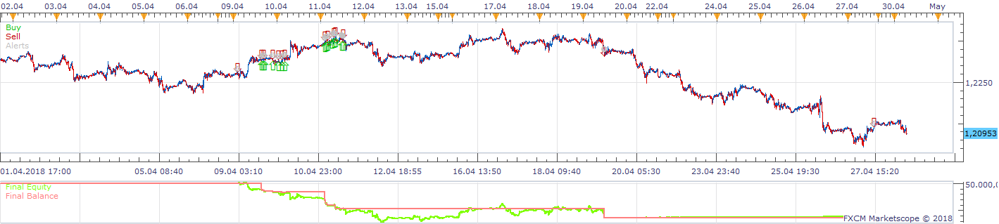
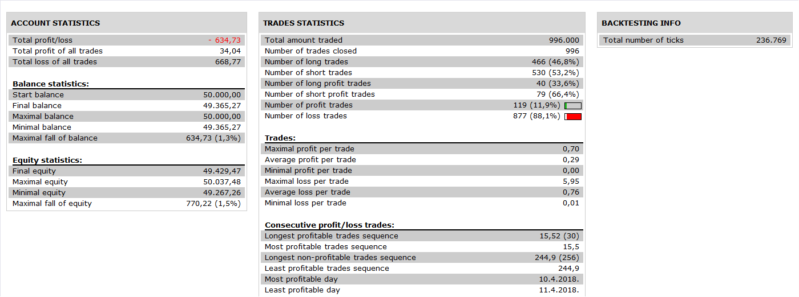

# Higly Adaptable Zig Zag Channel Strategy

> Source: https://fxcodebase.com/code/viewtopic.php?f=31&t=67032  
> Forum: 31 · Topic 67032 · 17 post(s)

---

## Higly Adaptable Zig Zag Channel Strategy

**Apprentice** · Sat Dec 01, 2018 5:08 am

 

Based on request.
[viewtopic.php?f=27&t=67022](https://fxcodebase.com/code/viewtopic.php?f=27&t=67022)
Tick ZigZag Channel with Output.lua
[viewtopic.php?f=17&t=60727](https://fxcodebase.com/code/viewtopic.php?f=17&t=60727)

 [Higly Adaptable Zig Zag Channel Strategy.lua](files/122437/Higly%20Adaptable%20Zig%20Zag%20Channel%20Strategy.lua)

---

## Re: Higly Adaptable Zig Zag Channel Strategy

**MC. Trend Trader** · Tue Dec 04, 2018 4:10 pm

Crossing and touching the up and botton lines does not open any positions. it does not happen
I have selected Cross over and Cross under on both Lines

Can you please fix it

---

## Re: Higly Adaptable Zig Zag Channel Strategy

**Apprentice** · Fri Dec 07, 2018 7:31 am

Try it now.
Make sure to re-download indicator and strategy.

---

## Re: Higly Adaptable Zig Zag Channel Strategy

**MC. Trend Trader** · Fri Dec 07, 2018 2:09 pm

Thank you for the strategy
it works fine.
could you please add the following?

Selection option ZZ_Channel Timeframe for the indicator and time frame for the trade signal.
I would like to use the lines in a higher timeframe and the trigger signal in a smaller timeframe

Best Regards

---

## Re: Higly Adaptable Zig Zag Channel Strategy

**Apprentice** · Wed Dec 19, 2018 5:54 am

Your request is added to the development list under Id Number 4380

---

## Re: Higly Adaptable Zig Zag Channel Strategy

**Apprentice** · Thu Dec 20, 2018 1:55 pm

Try it now.

---

## Re: Higly Adaptable Zig Zag Channel Strategy

**MC. Trend Trader** · Fri Dec 21, 2018 1:41 am

no trading signals are triggered now

---

## Re: Higly Adaptable Zig Zag Channel Strategy

**MC. Trend Trader** · Sun Dec 30, 2018 7:17 am

Hello,

When trying to test the strategy, the following error message is displayed

Nachricht	Zeit
C:/Program Files (x86)/Candleworks/FXTS2/Strategies/Custom/Higly Adaptable Zig Zag Channel Strategy (3).lua:65: attempt to perform arithmetic on global 'zz_timeframe' (a nil value)	30.12.2018 05:13:29

---

## Re: Higly Adaptable Zig Zag Channel Strategy

**Apprentice** · Thu Jan 03, 2019 10:01 am

I can't repeat that error
It looks like you have some kind of outdated version.
Can you please post it for reference?

---

## Re: Higly Adaptable Zig Zag Channel Strategy

**MC. Trend Trader** · Thu Jan 03, 2019 1:36 pm

Hello,

I reinstalled the strategy. I have no error in backtesting the strategy. but no trading signals for buying and selling are triggered at all

---

## Re: Higly Adaptable Zig Zag Channel Strategy

**Apprentice** · Sat Jan 05, 2019 5:06 am

Try it now.

---

## Re: Higly Adaptable Zig Zag Channel Strategy

**Blue Cape** · Tue Nov 19, 2019 8:05 pm

hi unable to find program to download

ignore - fixed

---

## Re: Higly Adaptable Zig Zag Channel Strategy

**Blue Cape** · Tue Nov 19, 2019 8:10 pm

I get this error message

C:/Program Files (x86)/Candleworks/FXTS2/Strategies/Custom/Higly Adaptable Zig Zag Channel Strategy.lua:393: attempt to compare number with nil

ignore - fixed

---

## Re: Higly Adaptable Zig Zag Channel Strategy

**Blue Cape** · Tue Nov 19, 2019 10:27 pm

Is there a Zig Zag Channel Strategy that combines with Renko Brick configuration?

---

## Re: Higly Adaptable Zig Zag Channel Strategy

**Blue Cape** · Tue Nov 19, 2019 10:42 pm

Is Highly Adaptable Zig Zag Channel Strategy program that can combine with Renko Brick configuration?

---

## Re: Higly Adaptable Zig Zag Channel Strategy

**Apprentice** · Wed Nov 27, 2019 6:12 am

Can you provide more information?

---

## Re: Higly Adaptable Zig Zag Channel Strategy

**MC. Trend Trader** · Thu May 21, 2020 5:19 pm

Hi,

I would like to have the option under parameters for the calculation to change the data source for upline and downline individually, for example close, high, deep.

Please also change the indicator.

Best Regards

MC. Trend Trader
